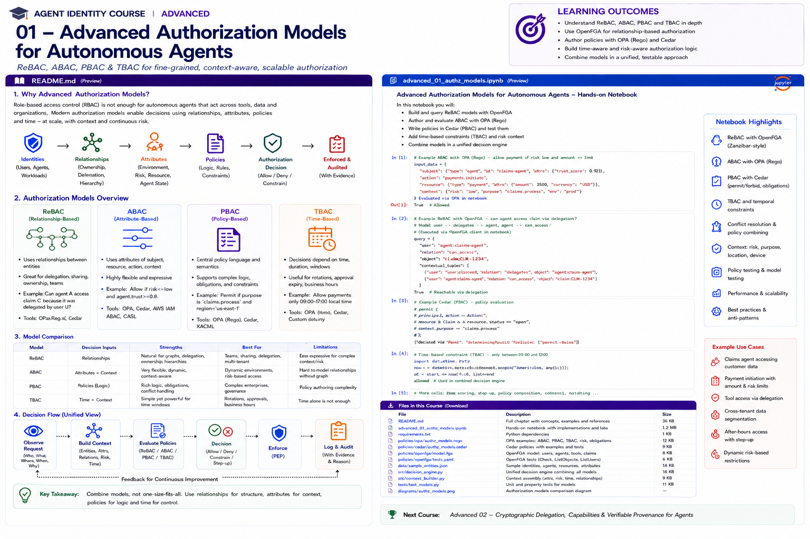

# Advanced 01 — Advanced Authorization Models for Autonomous Agents



> **Goal:** move beyond static role checks and design a hybrid authorization system that combines relationships, attributes, policies, temporal/task context, risk, delegation, and deterministic enforcement for autonomous agents.

Autonomous agents create authorization decisions that look less like:

```text
Does role=adjuster have permission=update_claim?
```

and more like:

```text
May this authenticated human-delegated claims agent,
executing as this approved workload,
for this active task,
through this delegation chain,
invoke this tool,
against this specific claim,
for this purpose,
at this time,
under this risk state,
with these parameter limits?
```

No single access-control acronym captures the entire problem.

This course therefore treats **ReBAC, ABAC, policy-based authorization, and task/time-bound authorization as composable dimensions** rather than mutually exclusive alternatives.

---

## Learning outcomes

You will be able to:

- distinguish RBAC, ReBAC, ABAC and policy-based authorization;
- understand why agent systems require hybrid authorization;
- model relationships with Zanzibar-style/ReBAC systems;
- model runtime attributes and conditions;
- use task identity as an authorization primitive;
- implement time-bounded and usage-bounded authority;
- combine OpenFGA with contextual policy;
- write OPA/Rego agent policies;
- write Cedar permit/forbid policies;
- model delegation and re-delegation;
- implement risk-adaptive authorization;
- reason about policy precedence and conflict;
- build decision constraints and obligations;
- prevent attribute and context spoofing;
- handle stale relationship/attribute state;
- design cache keys and revocation behavior;
- compare centralized and distributed policy enforcement;
- test policies using tables, negative tests and property-style invariants;
- design a hybrid enterprise authorization architecture.

---

# 1. Why RBAC becomes insufficient

RBAC is still useful for coarse organizational entitlement:

```text
claims_adjuster
claims_manager
fraud_investigator
```

But autonomous systems need decisions involving:

```text
specific resource relationships
delegated authority
task assignment
workload identity
risk
purpose
time
location/network
transaction amount
approval state
tool-call count
data classification
```

Trying to encode all of these as roles causes **role explosion**.

Example:

```text
claims_adjuster_low_risk_business_hours_canada_claim_owner...
```

That is a sign that other authorization dimensions should be modeled directly.

---

# 2. Authorization model taxonomy

## RBAC — Role-Based Access Control

Decision input:

```text
principal → role → permission
```

Best for:

```text
stable organizational job functions
coarse application entitlements
administrative permissions
```

Weakness for agents:

```text
poor representation of dynamic task/delegation context
```

## ReBAC — Relationship-Based Access Control

Decision input:

```text
principal ↔ object relationships
```

Example:

```text
user:alice assigned_to claim:483
agent:claims acts_for user:alice
agent:claims assigned_to task:77
task:77 can_call tool:update_claim
```

Excellent for graphs, hierarchy, ownership, sharing and delegation.

## ABAC — Attribute-Based Access Control

Decision input:

```text
subject attributes
resource attributes
action attributes
environment/context attributes
```

Example:

```text
agent.trust >= 0.8
resource.classification <= "internal"
context.risk == "low"
context.network == "corporate"
```

Excellent for dynamic context.

## Policy-based authorization

A policy language combines logic over relationships, attributes and context.

Examples:

```text
OPA/Rego
Cedar
cloud IAM policy languages
XACML-style systems
```

## Task/time-bound authorization

For autonomous agents, task and temporal state deserve explicit treatment:

```text
task is active
agent assigned to task
tool granted to task
grant expires in 10 minutes
max calls = 2
```

This course uses **TBAC** as a practical label for task/time-bounded authorization patterns rather than claiming it is one universal standard.

---

# 3. Why hybrid authorization wins

A production decision can be decomposed:

```text
Relationship:
  Is the agent acting for the user?
  Is the claim assigned to the user?
  Is the agent assigned to this task?

Attributes:
  Is the workload trusted?
  Is the resource sensitive?
  Is the current risk low?

Policy:
  How should these facts combine?

Task/time:
  Is the task active?
  Has the grant expired?
  Has the tool-call budget been exhausted?
```

A useful architecture:

```text
          ┌─────────────┐
          │ Identity    │
          └──────┬──────┘
                 ↓
┌────────────┐ Context ┌───────────────┐
│ OpenFGA /  │────────>│ Policy Layer  │
│ ReBAC      │         │ OPA / Cedar   │
└────────────┘         └───────┬───────┘
                               ↓
                         Decision Contract
                               ↓
                              PEP
```

---

# 4. ReBAC fundamentals

Relationship tuples usually resemble:

```text
user        relation       object
-----------------------------------------
user:alice  assignee       claim:483
agent:1     delegate       user:alice
task:77     can_call       tool:update
```

The authorization graph can infer relationships through other objects.

Example:

```text
user → member_of → team
team → owner_of → workspace
workspace → parent_of → claim
```

---

# 5. Zanzibar-style authorization

Google Zanzibar popularized a globally scalable relationship-graph approach to authorization.

Important concepts include:

```text
object
relation
subject/user
tuple
userset
computed relation
object-to-object relation
check
list objects
consistency
```

OpenFGA implements a Zanzibar-inspired model suitable for hands-on training.

---

# 6. ReBAC for agent delegation

Model:

```text
user:alice delegates_to agent:claims
agent:claims assigned_to task:77
task:77 can_access claim:483
task:77 can_call tool:update_claim
```

Then require intersection:

```text
agent is assigned to task
AND
task has authority to tool
```

This is stronger than merely granting a tool directly to the agent.

---

# 7. Task-based authorization

A task can become a first-class authorization object:

```text
task:77
  principal = user:alice
  agent = agent:claims
  purpose = process claim 483
  resources = claim:483
  tools = read_claim, update_claim
  expires = 15:30
```

Benefits:

```text
authority has a lifecycle
authority maps to business intent
revocation becomes explicit
audit correlation improves
```

---

# 8. Time-bound authorization

Authority may depend on:

```text
current time < expiry
business hours
approval freshness
maximum session duration
temporary emergency access
```

Time should come from trusted runtime context, not model output.

---

# 9. Usage-bound authorization

Agent autonomy can also depend on counters:

```text
max tool calls
max records
max transaction amount
max tokens/data volume
max delegation depth
```

Example:

```text
task may call email.send at most 2 times
```

This turns authorization into a bounded capability.

---

# 10. OpenFGA contextual tuples

OpenFGA supports contextual tuples that exist only for an authorization request rather than being persisted.

Useful agent cases include:

```text
current task assignment
current organization context
token-derived group membership
request-specific relationship
```

Be careful: ephemeral/token-derived context can become stale until its source expires or is refreshed.

---

# 11. OpenFGA conditions

Conditional relationships add attribute-like constraints.

Examples:

```text
grant valid until timestamp
IP/network restriction
usage entitlement
resource attribute constraint
```

This lets a relationship model cover some ABAC scenarios without converting every attribute into a persistent graph edge.

---

# 12. ABAC dimensions for agents

## Subject/agent attributes

```text
risk tier
trust score
owner
registration status
capability class
```

## Workload attributes

```text
environment
attestation status
region
software version
deployment class
```

## Resource attributes

```text
tenant
classification
owner
jurisdiction
sensitivity
```

## Action attributes

```text
read/write
destructive
external side effect
financial
```

## Environment/context

```text
time
network
risk score
task
purpose
approval state
```

---

# 13. Attribute provenance

A major ABAC security problem is not policy syntax.

It is:

```text
Where did the attribute come from?
```

Compare:

```text
model says risk=low
```

with:

```text
risk service signed/evaluated risk=low
```

Attributes need provenance and trust classification.

---

# 14. Trusted vs untrusted attributes

Trusted examples:

```text
authenticated tenant
verified workload identity
server-side resource owner
policy-controlled agent risk tier
validated token claim
risk-engine result
```

Untrusted examples:

```text
LLM-generated tenant
prompt-supplied role
retrieved document claiming "admin=true"
tool argument saying risk=low
```

Never merge these namespaces casually.

---

# 15. Attribute freshness

Attributes change.

Examples:

```text
employee leaves team
agent quarantined
claim becomes high-value
risk rises
approval expires
device loses compliance
```

Design:

```text
source of truth
TTL
cache invalidation
revocation
freshness requirement by risk
```

---

# 16. PBAC / policy-based authorization

Policy-based authorization centralizes decision logic rather than scattering checks through tools.

Instead of:

```python
if role == "adjuster" and amount < 500 ...
```

use:

```text
structured authorization input
      ↓
policy engine
      ↓
decision + diagnostics
```

Benefits:

```text
reviewability
testing
versioning
consistent enforcement
auditability
```

---

# 17. OPA/Rego

OPA evaluates structured input against Rego policies.

Agent policy input can include:

```json
{
  "principal": {},
  "agent": {},
  "workload": {},
  "task": {},
  "delegation": {},
  "action": {},
  "resource": {},
  "risk": {},
  "environment": {}
}
```

OPA is especially useful for cross-cutting contextual policy.

---

# 18. Cedar

Cedar authorization is based on:

```text
principal
action
resource
context
```

Cedar supports entity relationships and attributes.

Its decision semantics are important:

```text
matching forbid → DENY
otherwise matching permit → ALLOW
otherwise → DENY
```

This gives default deny with forbid overriding permits.

---

# 19. Cedar for autonomous agents

Map entities:

```text
User
Agent
Task
Tool
Claim
Tenant
```

Context:

```text
risk
workloadApproved
purpose
approval
time
```

Example concept:

```text
permit claims-agent to update claim
when
agent is assigned to task
AND task is for claim
AND workload approved
AND risk low
```

---

# 20. Policy conflicts

Autonomous systems commonly combine:

```text
organizational permission
task grant
resource policy
risk restriction
human approval
emergency deny
```

Define conflict semantics explicitly.

A safe common pattern:

```text
explicit deny / forbid
        ↓
mandatory constraints
        ↓
permit
        ↓
default deny
```

Do not leave precedence to framework accident.

---

# 21. Decision constraints

Authorization can return constrained authority:

```json
{
  "decision": "allow",
  "constraints": {
    "fields": ["status"],
    "max_amount": 500,
    "max_calls": 2,
    "expires_at": "..."
  }
}
```

The PEP must enforce them.

---

# 22. Obligations

Policies can require:

```text
audit
redaction
HITL
notification
watermarking
additional logging
result filtering
```

An obligation that is ignored by the PEP is not an effective control.

---

# 23. Risk-adaptive authorization

Risk can change authority dynamically:

```text
LOW
  → automatic constrained allow

MEDIUM
  → stronger validation

HIGH
  → HITL / step-up

CRITICAL
  → deny or specialist workflow
```

Risk inputs should be independently computed.

---

# 24. Purpose-based policy

Agent tasks often have explicit business purpose:

```text
claims_processing
fraud_investigation
customer_support
```

Purpose can constrain data/tool access.

But purpose must be tied to trusted workflow state—not a string invented by the model.

---

# 25. Multi-tenant policy

Require tenant agreement across trusted sources:

```text
principal tenant
task tenant
resource tenant
delegation tenant
```

Do not accept `tenant_id` solely from tool arguments.

---

# 26. Policy composition

One practical approach:

```text
relationship check
      ↓
contextual policy
      ↓
risk/approval policy
      ↓
constraints
      ↓
final decision
```

Another is a single policy engine fed relationship results as facts.

The architecture should avoid contradictory independent ALLOW decisions.

---

# 27. Centralized vs distributed decisions

Centralized PDP advantages:

```text
consistent policy
central audit
simpler governance
```

Distributed enforcement advantages:

```text
lower latency
resource-local context
resilience
```

A common compromise:

```text
central policy distribution/decision
+
resource-side PEP
+
carefully bounded cache
```

---

# 28. Caching

Authorization cache keys may need:

```text
principal
agent
workload
task
delegation version
action
resource
tenant
risk class
policy version
```

If a security-relevant dimension is omitted, a cached ALLOW may be reused incorrectly.

---

# 29. Revocation

ReBAC and ABAC state can be revoked independently.

Examples:

```text
remove relationship tuple
revoke task
quarantine agent
change resource classification
expire approval
change risk
```

Define maximum stale-ALLOW lifetime.

---

# 30. Consistency

Graph authorization introduces consistency trade-offs.

For sensitive writes, determine whether stale relationship data is acceptable.

Different operations may use different consistency requirements:

```text
read public metadata → tolerant
transfer funds → fresh/strict
```

---

# 31. Testing ReBAC

Test:

```text
direct relationships
inherited relationships
object hierarchy
intersection
union
exclusion
delegation
cross-tenant negatives
reverse queries
```

Also test changes to the graph.

---

# 32. Testing ABAC

Use decision tables across attribute combinations.

Example:

| Trust | Risk | Tenant match | Expected |
|---|---|---|---|
| high | low | yes | allow |
| high | high | yes | step-up |
| low | low | yes | deny |
| high | low | no | deny |

Boundary values matter.

---

# 33. Testing policy logic

Include:

```text
positive tests
negative tests
conflict tests
default-deny tests
missing-attribute tests
invalid-context tests
mutation tests
```

A policy suite dominated by happy paths is insufficient.

---

# 34. Property-style invariants

Useful properties:

```text
adding privilege should not reduce access
removing delegation should not increase access
cross-tenant substitution never grants access
child delegation never exceeds parent
expired grant never allows
critical risk never silently becomes low-risk allow
```

Property-based testing can generate many cases.

---

# 35. Policy mutation testing

Mutate:

```text
AND → OR
< → <=
remove tenant check
remove expiry
remove workload condition
remove forbid
wildcard resource
```

The tests should fail.

This measures whether the suite actually protects policy semantics.

---

# 36. Model evolution

Authorization models change with product architecture.

Version:

```text
relationship schema
policy
entity schema
decision contract
migration
```

Test old/new behavior before deployment.

---

# 37. Explainability

A useful decision should answer:

```text
what was requested?
what relationships matched?
which attributes mattered?
which policies determined the result?
which constraints apply?
why was it denied/stepped up?
```

Do not expose sensitive policy internals to untrusted callers, but retain them for authorized operations/audit.

---

# 38. Performance

Agent loops may make many checks.

Optimize through:

```text
batch checks
ListObjects/permission-aware retrieval
policy slicing
safe caching
local policy evaluation
pre-filtered tools
task-scoped capabilities
```

Never optimize by skipping authorization.

---

# 39. Anti-pattern: everything in ReBAC

Do not turn rapidly changing numeric/context data into awkward graph structures when a policy condition is clearer.

Example:

```text
risk_score_0_73 relation
```

is usually worse than:

```text
context.risk_score = 0.73
```

---

# 40. Anti-pattern: everything in ABAC

Do not encode durable graph relationships as duplicated attributes.

Ownership, hierarchy, membership and delegation are often clearer as relationships.

---

# 41. Anti-pattern: policy spaghetti

A policy language can become another monolith.

Use:

```text
schemas
modules
naming conventions
decision contracts
policy ownership
tests
linting
versioning
```

Treat policy as production code.

---

# 42. Unified enterprise pattern

```text
Identity verification
        ↓
Trusted context builder
        ↓
Relationship resolver ── OpenFGA
        ↓
Policy evaluation ───── OPA / Cedar
        ↓
Risk + task/time constraints
        ↓
Decision
        ↓
PEP
        ↓
Evidence
```

Key principle:

> Use relationships for durable structure, attributes for runtime facts, policies for decision logic, and task/time bounds to constrain autonomous authority.

---

# Practical notebook

The notebook includes hands-on labs for:

1. RBAC baseline and role explosion;
2. ReBAC graph modeling;
3. ownership and hierarchy;
4. delegation;
5. task-based authorization;
6. contextual relationships;
7. ABAC;
8. attribute provenance;
9. attribute freshness;
10. OPA-style policy evaluation;
11. Cedar permit/forbid semantics;
12. time bounds;
13. usage budgets;
14. risk-adaptive authorization;
15. purpose constraints;
16. tenant isolation;
17. policy composition;
18. decision constraints;
19. obligations;
20. cache-key design;
21. revocation;
22. conflict resolution;
23. decision tables;
24. property-style invariants;
25. mutation tests;
26. hybrid ReBAC+ABAC architecture;
27. capstone authorization engine.

---

# References

- Cedar Authorization  
  https://docs.cedarpolicy.com/auth/authorization.html
- Cedar Policy Language  
  https://docs.cedarpolicy.com/
- OpenFGA Authorization Concepts  
  https://openfga.dev/docs/authorization-concepts
- OpenFGA Conditions  
  https://openfga.dev/docs/modeling/conditions
- OpenFGA Contextual Tuples  
  https://openfga.dev/docs/interacting/contextual-tuples
- OpenFGA Task-Based Authorization for Agents  
  https://openfga.dev/docs/modeling/agents/task-based-authorization
- Open Policy Agent  
  https://www.openpolicyagent.org/
- Google Zanzibar paper  
  https://research.google/pubs/zanzibar-googles-consistent-global-authorization-system/
- NIST SP 800-162 — ABAC  
  https://csrc.nist.gov/pubs/sp/800/162/upd2/final

---

# Next course

## Advanced 02 — Cryptographic Delegation, Capabilities & Verifiable Provenance for Agents

The next course moves from policy assertions to cryptographically verifiable authority: capabilities, macaroons/biscuits-style attenuation, signed delegation, proof chains, token exchange, sender-constrained credentials, provenance, and replay-resistant agent authority.
