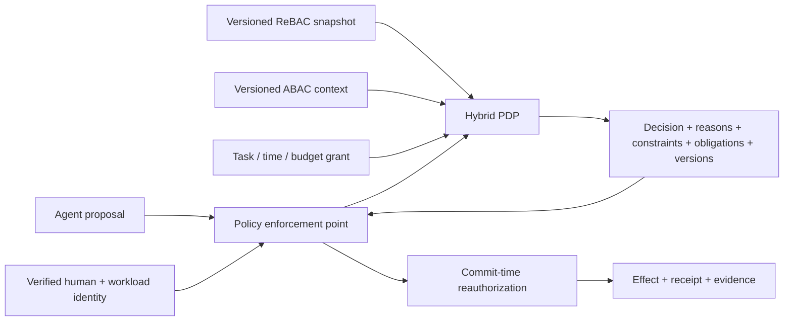

# Advanced 01 — Advanced Authorization Models for Autonomous Agents

**Level:** Advanced · **Time:** 5–7 hours · **Default mode:** credential-free
**Scenario:** Northstar Insurance claims operations · **Last technical review:** 2026-10-07

> **Goal:** design, implement, and evaluate a hybrid authorization control plane that composes roles, relationships, trusted attributes, task bounds, risk, approvals, versions, and deterministic enforcement for autonomous agents.

An autonomous agent rarely needs a single permission. It needs a bounded answer to a compound question:

> May this authenticated human-operated agent, running as this attested workload, for this active task, use this tool on this claim, for this purpose, with these fields and amount, under current risk, relationship, policy, and resource versions?

This course builds that answer as a **hybrid authorization control plane**. Role-based access control (RBAC) supplies coarse eligibility; relationship-based access control (ReBAC) proves task, resource, and tool relationships; attribute-based access control (ABAC) supplies current trusted facts; task/time bounds attenuate authority; a policy decision point (PDP) composes them; and a policy enforcement point (PEP) turns an allow into a constrained, auditable effect.

The course includes a deterministic reference implementation, an executed notebook, OPA/Rego and Cedar policies, an OpenFGA model, an adversarial corpus, property tests, and SDK-shaped integration examples.

## Learning outcomes

After completing the course, you can:

1. distinguish RBAC, ReBAC, ABAC, policy-based, purpose-based, and task/time-bound authorization;
2. assign each authorization fact to an authoritative source rather than trusting agent text;
3. model the intersection of human, agent, task, tenant, resource, and tool relationships;
4. compose current attributes, relationships, versions, and lifecycle state deterministically;
5. return `allow`, `deny`, `step_up`, and `retryable_error` without conflating them;
6. bind constraints, obligations, approvals, cache entries, and receipts to exact decisions;
7. attenuate sub-agent delegation without action, resource, tool, purpose, time, budget, or depth widening;
8. implement commit-time reauthorization, idempotency, and fail-closed dependency handling;
9. express the core model in OPA/Rego, Cedar, and OpenFGA while respecting their different roles;
10. evaluate policy behavior with labelled scenarios, negative tests, property tests, and explicit denominators; and
11. design a production rollout with policy distribution, versioning, consistency, telemetry, and recovery.

## Prerequisites

- Python dataclasses, tests, and basic JSON.
- Authentication versus authorization.
- Coarse RBAC and least privilege.
- Helpful earlier courses: [Beginner 04 — Authorization for Agents](../../beginner/04-authorization-for-agents/) and [Intermediate 04 — Fine-Grained Authorization](../../intermediate/04-fine-grained-authorization/).

Install the repository environment from the repository root, or this folder’s `requirements.txt`. No server, cloud account, API key, or paid model is required.

## Success criteria

You are done when you can explain the model and reproduce these results:

- the role-only baseline incorrectly allows 34 of 35 non-allow scenarios;
- the hybrid evaluator exactly matches all 38 labelled outcomes;
- cross-tenant requests never allow across generated risk values;
- increasing risk never improves an outcome;
- child delegation never exceeds its parent;
- cache keys change when any decision-relevant state or version changes;
- the PEP reauthorizes before commit and rejects revocation or version change;
- all required obligations and constraints are enforced before an effect;
- the 15 OPA tests, 7 OpenFGA test groups/10 checks, Cedar execution, and 95 Python tests pass.

These fixture results test this course’s policy contract. They are not throughput benchmarks or evidence that one engine is universally better.

## Non-goals and safety boundary

The lab is not an identity provider, fraud model, production policy service, distributed cache, approval workflow, or claims processor. It does not make a network call by default. Synthetic identifiers and records prevent sensitive-data exposure.

The most important boundary is:

```text
agent/model -> proposes an action
trusted application -> authenticates, resolves facts, authorizes,
                       enforces, commits, verifies, and records
```

A role name, typed object, model assertion, prompt instruction, tool argument, or self-reported “approval” is data—not authority.

## Scenario

Northstar’s claims agent may read claim `483`, update two safe fields, or settle the claim for at most $500. Alice operates the agent. A task binds the agent to the claim and tool. A verified workload identity, current relationship snapshot, current risk signal, tenant membership, task budget, and policy version must all agree.

Settlement additionally needs a single-use supervisor receipt bound to:

```text
tenant + subject + agent + task + exact proposal digest
+ policy version + resource version + approver role + expiry
```

The agent cannot choose or override any of those trusted facts.

## Mental model: four planes and one enforcement point


```mermaid
flowchart LR
    A[Agent proposal] --> PEP[Policy enforcement point]
    ID[Verified human + workload identity] --> PEP
    REL[Versioned ReBAC snapshot] --> PDP[Hybrid PDP]
    ATTR[Versioned ABAC context] --> PDP
    TASK[Task / time / budget grant] --> PDP
    PEP --> PDP
    PDP --> D[Decision + reasons + constraints + obligations + versions]
    D --> PEP
    PEP --> R[Commit-time reauthorization]
    R --> E[Effect + receipt + evidence]
```

1. **Identity plane:** who authenticated and which workload is running?
2. **Relationship plane:** how are human, agent, task, resource, tool, and tenant connected?
3. **Context plane:** what current attributes affect the decision?
4. **Policy plane:** how do those facts compose, and which version made the decision?
5. **Enforcement point:** can every constraint and obligation be honored immediately before the effect?

The PDP decides. The PEP enforces. A successful policy query is not a successful business effect.

## Foundations: what each model contributes

### RBAC: stable eligibility

RBAC maps principals to roles and roles to permissions:

```text
agent:claims -> claims-operator -> claim.read / claim.update
```

It is useful for coarse job function and administration. It becomes brittle when roles encode every region, task, resource, purpose, device, time, and risk combination. The lab deliberately measures how a role-only baseline overauthorizes dynamic cases.

### ReBAC: durable graph structure

ReBAC answers relationship questions:

```text
user:alice operates agent:claims
agent:claims assigned_to task:claim-483
task:claim-483 contains claim:483
task:claim-483 permits tool:claims-update
agent:claims member_of tenant:northstar
```

This fits ownership, hierarchy, collaboration, sharing, delegation, and task graphs. Zanzibar demonstrated a globally distributed relationship model; OpenFGA is a commonly used open-source implementation inspired by that design. ReBAC does not by itself prove workload identity, validate approvals, consume budgets, or execute obligations.

### ABAC: current trusted context

[NIST SP 800-162](https://csrc.nist.gov/pubs/sp/800/162/upd2/final) defines ABAC in terms of attributes of subjects, objects, requested operations, and sometimes environment conditions evaluated against policy. In this course:

| Attribute family | Examples | Trusted source |
|---|---|---|
| Subject | tenant, authenticated subject | token verifier / session |
| Workload | SPIFFE ID, attestation state | workload verifier |
| Resource | tenant, owner, status, version, classification | claims system of record |
| Action | operation, fields, amount | validated proposal |
| Environment | risk, managed device, network zone | risk/device services |
| Lifecycle | task active, expiry, remaining calls | workflow service |

Attributes need provenance, freshness, type, scope, and version. “Risk is low” from the agent’s prompt is not equivalent to a current signed or authenticated risk-service response.

### Policy-based authorization: composition logic

A policy language expresses how facts combine. It should not silently become the source of facts it cannot verify. OPA/Rego is strong for structured contextual policy; Cedar has explicit permit/forbid semantics and schema validation; OpenFGA is strong for graph relationships and list/check queries.

### Task/time/usage bounds: autonomous authority as a lease

The task is a first-class authorization object, not merely a trace label. It binds:

```text
subject + agent + tenant + resource + tool + actions + purposes
+ expiry + remaining calls + active state
```

This makes autonomous authority narrow, measurable, revocable, and easier to reconstruct.

## Internal mechanics

### 1. Build trusted state outside the model

The `ActionProposal` intentionally contains no identity, role, tenant, approval, or risk fields. The application joins the proposal with verified identity, relationship, task, resource, and attribute state.

### 2. Evaluate the intersection

The reference PDP requires all model dimensions:

```text
eligible role
AND authenticated, attested identity
AND operator relationship
AND task assignment
AND task-resource relationship
AND task-tool relationship
AND tenant/resource binding
AND active, unexpired, non-exhausted task
AND action and purpose delegation
AND fresh, trusted, versioned attributes
AND action-specific policy
```

An allow is the intersection, not the union, of these conditions.

### 3. Preserve outcome semantics

| Outcome | Meaning | PEP behavior |
|---|---|---|
| `allow` | Policy allows under returned contract | enforce constraints and obligations, then reauthorize |
| `deny` | Request violates policy | terminal; do not retry as an outage |
| `step_up` | Stronger assurance or review may change the decision | acquire assurance and submit a new request |
| `retryable_error` | Required policy data/service was unavailable | no effect; bounded retry/reconcile according to action risk |

Collapsing all non-allows into a Boolean destroys recovery semantics and can create unsafe retries.

### 4. Enforce constraints and obligations

A decision may narrow an action:

```json
{
  "constraints": {"allowed_fields": ["status", "notes"]},
  "obligations": ["audit", "optimistic_lock"]
}
```

The PEP fails closed if it cannot recognize or fulfill an obligation. It does not treat policy metadata as optional logging advice.

### 5. Reauthorize at commit

There is time between decision and effect. Task revocation, risk, resource version, relationship state, or policy version can change. The PEP refreshes trusted state, evaluates again, verifies proposal and versions, atomically consumes approval when required, and only then records the effect.

## Delegation and re-delegation

Delegation is set attenuation. For parent grant `P` and child grant `C`:

```text
C.actions   ⊆ P.actions
C.resources ⊆ P.resources
C.tools     ⊆ P.tools
C.purposes  ⊆ P.purposes
C.expiry    ≤ P.expiry
C.max_calls ≤ P.max_calls
C.depth     = P.depth + 1 ≤ configured maximum
C.tenant    = P.tenant
C.parent_digest = digest(P)
```

The included property tests generate action subsets and prove they remain non-widening. Targeted tests reject action, resource, tool, purpose, time, budget, tenant, depth, and parent-binding expansion.

## Policy precedence and error behavior

The reference composition applies these broad priorities:

1. missing or unavailable required state → `retryable_error`;
2. authentication, tenant, relationship, task, freshness, or version failure → `deny`;
3. critical risk → `deny`;
4. elevated risk → `step_up`;
5. action-specific rules → `allow` or `deny`;
6. the PEP may still refuse an allow if it cannot enforce the contract.

### Cedar’s important caveat

Cedar authorization is default-deny and a satisfied `forbid` overrides permits. Cedar also uses **skip-on-error**: a policy that errors is omitted from the combination, with diagnostics returned. The application must inspect diagnostics and decide its safety posture. This lab validates policies against a schema and treats runtime diagnostics as denial. See Cedar’s official [authorization algorithm](https://docs.cedarpolicy.com/auth/authorization.html) and [validation guidance](https://docs.cedarpolicy.com/policies/validation.html).

## Versioning, freshness, consistency, and caching

An authorization answer depends on more than subject/action/resource. The lab cache key includes the complete proposal and trusted state, including:

```text
policy version
relationship version + observed time
attribute version + observed time
resource version
task lifecycle and budget
approval digest and expiry
```

If a cache omits purpose, tool, amount, task, tenant, risk, resource version, or policy version, one request can inherit another request’s authority.

OpenFGA authorization models are immutable and checks can be pinned to a model ID; production clients should make migration and consistency choices explicit. Its [immutable model guidance](https://openfga.dev/docs/getting-started/immutable-models), [conditions](https://openfga.dev/docs/modeling/conditions), and [query consistency](https://openfga.dev/docs/interacting/consistency) document the relevant primitives.

## Architecture patterns

| Pattern | Strength | Cost / risk | Best fit |
|---|---|---|---|
| In-process reference policy | deterministic, simple, testable | custom lifecycle and tooling | executable specification, small bounded service |
| Central PDP | one policy surface, simple governance | network dependency and latency | moderate scale, uniform control |
| Sidecar/local PDP | low latency, resilient reads | bundle rollout and version drift | distributed services with strong policy delivery |
| Relationship service + contextual PDP | graph/list queries plus rich context | composition, consistency, evidence complexity | agent/task/resource authorization |
| Embedded Cedar evaluator | application-local typed policy | application owns policy distribution and diagnostics | low-latency application authorization |

[NIST SP 800-207](https://csrc.nist.gov/pubs/sp/800/207/final) frames policy decision and enforcement as distinct logical concerns, and [SP 800-207A](https://csrc.nist.gov/pubs/sp/800/207/a/final) extends identity-tier policy concepts to cloud-native multi-cloud applications.

## Technology landscape

| Technology | Model fit | Useful capabilities | Boundary learners must preserve |
|---|---|---|---|
| OPA/Rego | contextual and general policy | structured input, tests, bundles, Wasm/server/Go integration, decision logs | application remains PEP; input trust and obligations are external contracts |
| Cedar | principal/action/resource/context policy | permit/forbid semantics, schema validation, diagnostics | skip-on-error must be handled; entity/context sourcing remains external |
| OpenFGA | ReBAC/Zanzibar-style graphs | immutable model IDs, check/list APIs, conditions, contextual tuples | not identity proof, approval consumption, risk engine, or effect executor |
| Cloud IAM policy languages | provider resource authorization | deep platform integration | portability and agent/task modeling vary |
| XACML-style systems | attribute policy and obligations | established enterprise policy concepts | implementation complexity and ecosystem fit vary |

The included Python adapters construct real Cedar and OpenFGA SDK objects. The OPA artifact runs with the official CLI. A live server remains an explicit production exercise; the notebook does not mislabel a constructed request as a server decision.

## State of the art and open problems

### Established practice

- externalized PDP/PEP separation;
- default deny, least privilege, explicit tenant/resource binding;
- policy-as-code tests and versioned distribution;
- Zanzibar-inspired ReBAC for sharing and hierarchy;
- ABAC for trusted runtime context;
- decision evidence with privacy controls.

OPA documents distributed enforcement, signed/versioned bundles, status, and decision logs in its [management architecture](https://www.openpolicyagent.org/docs/management-introduction), [bundle](https://www.openpolicyagent.org/docs/management-bundles), and [decision log](https://www.openpolicyagent.org/docs/management-decision-logs) guides. Decision inputs can contain sensitive data, so log masking is a control—not an afterthought.

### Emerging practice

- task-scoped agent authorization and tool/resource intersection;
- standardized authorization request/response APIs;
- continuous authorization from workload, device, risk, and lifecycle events;
- richer policy provenance and decision-to-effect evidence;
- conditional relationships for time, entitlement, or resource attributes.

OpenFGA now publishes official [agent authorization](https://openfga.dev/docs/modeling/agents), [task-based authorization](https://openfga.dev/docs/modeling/agents/task-based-authorization), and [MCP authorization](https://openfga.dev/docs/modeling/agents/mcp-authorization) guidance. These patterns strengthen relationship modeling; they do not make agent-provided context trustworthy.

### Research frontier and open problems

- consistent decisions across rapidly changing relationship and attribute stores;
- explainability that helps operators without exposing policy internals;
- safe partial availability for reads without normalizing stale authority;
- formally checking delegation attenuation across heterogeneous engines;
- policy migration without inconsistent mixed-version fleets;
- reliable obligation execution across distributed side effects;
- measuring false denials, unsafe allows, and operational cost together;
- authorization for dynamically discovered tools and generated workflows.

## Failure modes and mitigations

| Failure | Why it fails | Course mitigation |
|---|---|---|
| Role-only authorization | ignores task, resource, tool, tenant, risk | measured unsafe baseline; hybrid intersection |
| Agent supplies tenant/risk/approval | model text is not authenticated authority | proposal schema omits trusted fields |
| Relationship-only design | dynamic risk, device, purpose, approval absent | ReBAC + trusted contextual PDP |
| Attribute-only design | graph ownership/delegation becomes duplicated logic | dedicated relationship plane |
| Stale allow cache | revocation/version changes hidden | complete key, short TTL, invalidation, commit check |
| Approval Boolean | replayable and not bound to proposal | exact, expiring, single-use receipt |
| Treat outage as deny | unsafe retry semantics and poor operations | distinct `retryable_error` |
| Treat step-up as allow | stronger assurance was never obtained | terminal non-effect until new trusted state |
| Ignore obligation | policy contract is bypassed | unknown obligations fail closed |
| Check then mutate | time-of-check/time-of-use race | refresh and reauthorize at commit |
| Log raw input | identity and claim data leakage | digests, versions, reason codes, redaction |
| Cedar policy error ignored | skip-on-error can alter combination | schema validation plus diagnostic handling |

## Evaluation

The labelled corpus contains valid, negative, boundary, and dependency-failure cases. For each architecture:

```text
outcome accuracy = exact expected-outcome matches / all labelled cases
invalid allows   = expected non-allow but actual allow
valid blocked    = expected allow but actual non-allow
```

`deny`, `step_up`, and `retryable_error` are intentionally separate labels. A system that blocks every request has zero invalid allows but fails useful-work and outcome-accuracy gates.

The release gate requires:

```text
at least 35 labelled cases
AND invalid_allows == 0
AND valid_work_blocked == 0
AND outcome_accuracy == 1.0
```

Production evaluation should also slice by action, tenant, policy version, risk band, dependency state, and resource type; track p50/p95/p99 decision and enforcement latency; and distinguish attempted violations, blocked attempts, actual forbidden effects, and false denials.

## Practical lab

| Artifact | Purpose | Proof |
|---|---|---|
| `lab.py` | reference PDP, cache, delegation, approval, PEP, evaluation, adapters | 95 Python tests |
| `advanced_authz_runtime.py` | collision-safe course import | repository-wide test isolation |
| `advanced_authorization_models.ipynb` | guided scenario, experiments, failures, evaluation | clean top-to-bottom execution |
| `policies/opa/` | Rego v1 policy and 15 cases | `opa test --fail-on-empty` |
| `policies/cedar/` | permit/forbid policy and schema | CedarPy validation and execution |
| `policies/openfga/` | tenant/task intersection plus an expiring conditional grant | 7 test groups and 10 checks |
| `tests/` | labelled, adversarial, property, integration, and enforcement tests | `pytest` |

From the repository root:

```bash
uv sync
uv run python curriculum/advanced/01-advanced-authorization-models/lab.py
uv run pytest curriculum/advanced/01-advanced-authorization-models/tests -q
opa test curriculum/advanced/01-advanced-authorization-models/policies/opa --fail-on-empty -v
fga model test --tests curriculum/advanced/01-advanced-authorization-models/policies/openfga/advanced_authz.fga.yaml
```

The notebook starts with the unsafe role baseline, builds the hybrid decision, inspects structured results, experiments with risk and cache state, proves delegation attenuation, injects stale state and revocation, executes Cedar and SDK mappings, evaluates the corpus, and ends with production upgrades and exercises.

## Production upgrade path

| Teaching component | Production upgrade |
|---|---|
| in-memory snapshots | authenticated, versioned identity/relationship/attribute clients |
| fixed clock | authoritative clock with tested skew policy |
| local policy constant | signed policy bundle/model distribution and staged rollout |
| in-memory cache | bounded shared/local cache with event invalidation and version telemetry |
| in-memory approval store | durable atomic consume with uniqueness and concurrency control |
| local effect ledger | transactional outbox/idempotency store and reconciliation |
| one process | regional PDP/PEP topology with explicit consistency and outage policy |
| synthetic evidence | privacy-classified telemetry, retention, access control, export controls |
| exact fixture corpus | production-derived sanitized cases, mutation tests, shadow evaluation |

Deployment should pin expected policy/model versions, reject malformed responses, bound timeouts and retries, monitor bundle/model activation, record decision and enforcement IDs, reconcile unknown side-effect outcomes, and provide rollback that does not resurrect revoked authority.

## Exercises

1. **Implementation:** add a `claim.export` action. Require a legal-hold purpose, a dedicated tool, redaction, a row limit, and a single-use approval. Add it to all four policy representations.
2. **Diagnosis:** remove `purpose` from `cache_key()`. Write a test that demonstrates cross-purpose cache reuse, then restore the binding.
3. **Delegation:** allow one sub-agent hop but forbid further delegation. Prove the rule with example and property tests.
4. **Cedar:** deliberately reference a missing context attribute. Inspect diagnostics and explain why application handling matters under skip-on-error.
5. **OPA:** add a data-driven test table and run coverage. Identify policy paths not exercised by the current 15 cases.
6. **OpenFGA:** model a conditional relationship with expiry. Decide which time context is persisted and which is request context, then explain the trust boundary.
7. **Architecture:** design a two-region deployment. Specify relationship consistency, policy rollout, cache invalidation, outage behavior by action, and rollback evidence.
8. **Evaluation:** add 20 cases from a new tenant and compute per-action/per-tenant invalid-allow and false-denial slices without changing the release denominator.

## Review questions

1. Why is a role useful but insufficient for agent authorization?
2. Which facts belong in ReBAC, ABAC, task state, and the resource service of record?
3. Why must an application distinguish denial, step-up, and dependency failure?
4. What makes an approval receipt exact and replay resistant?
5. Why can a PDP allow still fail safely at the PEP?
6. Which values must a safe authorization cache bind?
7. How do immutable relationship-model IDs help migration and evidence?
8. What is Cedar skip-on-error, and how should a safety-sensitive application respond?
9. Why is a blocked attack not an actual forbidden effect?
10. Which metric prevents “deny everything” from passing the safety gate?

## Authoritative references

### Standards and foundational work

- NIST, [SP 800-162 — Guide to Attribute Based Access Control](https://csrc.nist.gov/pubs/sp/800/162/upd2/final).
- NIST, [SP 800-207 — Zero Trust Architecture](https://csrc.nist.gov/pubs/sp/800/207/final).
- NIST, [SP 800-207A — Cloud-Native Multi-Cloud Access Control](https://csrc.nist.gov/pubs/sp/800/207/a/final).
- Google Research, [Zanzibar: Google’s Consistent, Global Authorization System](https://research.google/pubs/zanzibar-googles-consistent-global-authorization-system/).

### Open Policy Agent

- OPA, [Policy Language](https://www.openpolicyagent.org/docs/policy-language).
- OPA, [Policy Testing](https://www.openpolicyagent.org/docs/policy-testing).
- OPA, [Integration](https://www.openpolicyagent.org/docs/integration).
- OPA, [Deployment](https://www.openpolicyagent.org/docs/deploy).
- OPA, [Bundles](https://www.openpolicyagent.org/docs/management-bundles) and [Decision Logs](https://www.openpolicyagent.org/docs/management-decision-logs).

### Cedar

- Cedar, [Authorization algorithm](https://docs.cedarpolicy.com/auth/authorization.html).
- Cedar, [Policy validation](https://docs.cedarpolicy.com/policies/validation.html).
- Cedar, [Security guidance](https://docs.cedarpolicy.com/other/security.html).

### OpenFGA

- OpenFGA, [Authorization concepts](https://openfga.dev/docs/authorization-concepts).
- OpenFGA, [Immutable authorization models](https://openfga.dev/docs/getting-started/immutable-models).
- OpenFGA, [Conditions](https://openfga.dev/docs/modeling/conditions).
- OpenFGA, [Contextual tuples](https://openfga.dev/docs/interacting/contextual-tuples).
- OpenFGA, [Testing models](https://openfga.dev/docs/modeling/testing).
- OpenFGA, [Authorization for agents](https://openfga.dev/docs/modeling/agents).
- OpenFGA, [Task-based authorization](https://openfga.dev/docs/modeling/agents/task-based-authorization).

## Next course

Continue to [Advanced 02 — Cryptographic Delegation, Capabilities & Verifiable Provenance](../02-cryptographic-delegation-capabilities/) to move from policy assertions to cryptographically bound and attenuated authority.
