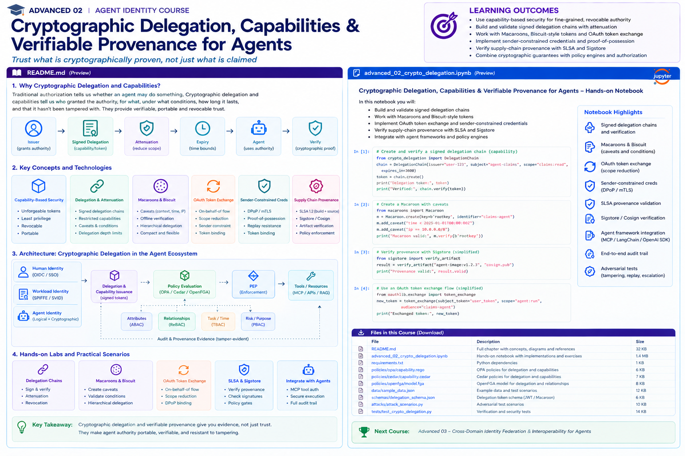

# Advanced 02 — Cryptographic Delegation, Capabilities & Verifiable Provenance for Agents



> **Goal:** make delegated agent authority cryptographically verifiable, attenuable, audience-bound, replay-resistant, short-lived, and auditable.

Policy engines answer:

```text
Should this operation be allowed?
```

Cryptographic delegation adds another question:

```text
Can the caller prove the authority it claims to possess?
```

For autonomous systems, this distinction matters because authority crosses:

```text
human → orchestrator → specialist agent → MCP server → API → worker
```

At every hop we want to preserve **who delegated authority, to whom, for what, for which resource, under which limits, and until when**.

---

# Learning outcomes

You will be able to:

- distinguish identity tokens, bearer access tokens, capabilities, and proof-of-possession credentials;
- explain capability-based security and the object-capability mental model;
- build signed delegation envelopes;
- verify delegation chains;
- enforce scope, resource, audience, expiry, purpose, task and depth bounds;
- implement authority attenuation;
- compare Macaroons and Biscuit-style authorization tokens;
- understand Biscuit authority blocks, attenuation blocks, Datalog checks and sealing;
- model third-party caveats/authorization concepts;
- use OAuth 2.0 Token Exchange for delegation;
- understand `subject_token`, `actor_token`, `act`, and `may_act`;
- distinguish delegation from impersonation;
- use DPoP and mTLS sender-constrained tokens;
- reason about replay resistance and nonce/JTI handling;
- bind credentials to target resources;
- prevent token passthrough across MCP/API boundaries;
- design token rotation, revocation and freshness strategies;
- capture verifiable delegation provenance;
- integrate cryptographic evidence with OPA/Cedar/OpenFGA;
- test tampering, replay, escalation, substitution and confused-deputy attacks.

---

# 1. Identity is not authority

An authenticated agent identity such as:

```text
agent:claims
```

does not tell us whether that agent may:

```text
read claim 483
update claim 483
approve a payment
delegate research
call an MCP server
```

Authentication establishes a principal. Authorization establishes permitted action.

A capability goes further by packaging a **specific authority grant** into a credential.

---

# 2. Capability-based security

Conceptually:

```text
capability = unforgeable reference/credential + authority
```

Instead of asking only:

```text
Who are you?
```

a capability system asks:

```text
What authority can you present?
```

For an agent:

```json
{
  "subject": "agent:claims",
  "actions": ["claim.read"],
  "resources": ["claim:483"],
  "audience": "claims-api",
  "expires_at": "...",
  "task": "task:77"
}
```

The credential must be integrity protected.

---

# 3. Why capabilities fit agents

Agents naturally delegate work.

Example:

```text
Claims Agent
  has:
    claim.read
    claim.update
    knowledge.search

        │ delegates research
        ▼

Research Agent
  receives:
    claim.read
    knowledge.search
```

The child should not receive the parent's full ambient credential.

This is **authority attenuation**.

---

# 4. Attenuation invariant

A derived capability must never increase authority.

For parent `P` and child `C`:

```text
actions(C)   ⊆ actions(P)
resources(C) ⊆ resources(P)
lifetime(C)  ≤ lifetime(P)
depth(C)     < depth(P)
audience(C)  constrained appropriately
```

Additional caveats can make a credential weaker, never stronger.

---

# 5. Signed delegation envelope

A simple enterprise design can use a canonical signed envelope:

```json
{
  "issuer": "user:alice",
  "subject": "agent:claims",
  "audience": "claims-api",
  "actions": ["claim.read"],
  "resources": ["claim:483"],
  "task": "task:77",
  "issued_at": "...",
  "expires_at": "...",
  "parent": "capability-id",
  "delegation_depth": 1,
  "nonce": "..."
}
```

The issuer signs a canonical representation.

Verification requires:

```text
signature
issuer trust
audience
expiry/not-before
resource/action bounds
parent relationship
revocation state
replay policy
```

---

# 6. Delegation chain

Example:

```text
Enterprise Authority
       │ signs
       ▼
User / Manager Grant
       │ attenuates
       ▼
Claims Agent
       │ attenuates
       ▼
Research Agent
       │ presents
       ▼
Knowledge Service
```

Every child grant should be traceable to a valid root and each transition must preserve attenuation.

---

# 7. Provenance vs authorization

Provenance answers:

```text
Where did this authority come from?
Which principals/agents touched it?
Which credential produced this child credential?
Which policy/version approved issuance?
```

Authorization answers:

```text
May this request execute now?
```

Both are needed.

A valid provenance chain can still be denied because:

```text
grant expired
agent revoked
resource changed
risk increased
approval missing
```

---

# 8. Macaroons

Macaroons are bearer authorization credentials designed for decentralized delegation.

They use chained MACs and **caveats**.

A broad credential can be attenuated:

```text
original:
  user may access claims

attenuated:
  only claim:483

attenuated again:
  only claim.read

attenuated again:
  before 15:30
```

The holder can add caveats without the original issuer.

---

# 9. First-party caveats

A first-party caveat can restrict:

```text
operation = claim.read
resource = claim:483
time < expiry
network = corporate
task = task:77
```

The target service verifies the caveats using trusted request context.

---

# 10. Third-party caveats

Macaroons can also require discharge from another authority.

Conceptually:

```text
payment capability
      +
"requires manager approval"
      ↓
manager/approval service
      ↓
discharge credential
```

This is powerful for step-up authorization, but implementation must handle binding, replay, expiry and trust carefully.

---

# 11. Macaroon security characteristics

Strengths:

```text
simple attenuation
decentralized delegation
contextual caveats
efficient symmetric cryptography
```

Trade-offs:

```text
bearer credential risk
root-key management
revocation still requires strategy
caveat design can become complex
```

---

# 12. Biscuit tokens

Biscuit is a capability-oriented authorization token using public-key cryptography and Datalog-style authorization logic.

Important structure:

```text
authority block
      ↓
attenuation block
      ↓
attenuation block
      ↓
...
```

The authority block defines initial rights.

Subsequent blocks can add checks that restrict usage.

---

# 13. Biscuit offline attenuation

A token holder can derive a more restricted token **without contacting the original issuer**.

Example:

```text
right("/claims/483", "read")
```

then add:

```text
check if operation("read")
```

then:

```text
check if resource("/claims/483")
```

then:

```text
check if time($t), $t < 2026-08-20T00:00:00Z
```

This is attractive for multi-hop agent workflows.

---

# 14. Why Biscuit attenuation is monotonic

Biscuit's block-scoping model is designed so additional attenuation blocks cannot simply manufacture new trusted authority.

The verifier trusts the root authority block and authorizer facts; attenuation blocks primarily add restrictions/checks.

This is exactly the property we want for delegated agents:

> downstream actors can reduce authority but cannot mint new upstream authority.

---

# 15. Sealing

A Biscuit can be sealed so it cannot be attenuated further.

This is useful when:

```text
final recipient should use but not re-delegate
```

Think of it as:

```text
delegation chain stops here
```

---

# 16. Biscuit is not authentication

Biscuit's own documentation explicitly distinguishes authorization-token functionality from authentication.

An enterprise architecture still needs trusted identity/workload authentication.

Use:

```text
OIDC / enterprise identity
SPIFFE / workload identity
+
Biscuit capability
```

rather than treating a capability as the complete identity system.

---

# 17. Revocation

Offline-verifiable credentials create a classic trade-off.

If every verifier can validate without contacting a central authority, immediate revocation becomes harder.

Common techniques:

```text
short lifetime
revocation identifiers/lists
key rotation
online introspection for high-risk actions
epoch/version checks
task cancellation
```

Risk should determine freshness requirements.

---

# 18. OAuth Token Exchange — RFC 8693

OAuth Token Exchange provides a standardized mechanism to exchange one security token for another.

Typical agent pattern:

```text
User Token
   +
Agent Actor Token
      ↓
Authorization Server
      ↓
Scoped Token for Target API
```

Important inputs include:

```text
subject_token
actor_token
resource / audience
scope
requested_token_type
```

---

# 19. Delegation vs impersonation

These are not the same.

## Impersonation

The actor acts *as* the subject.

## Delegation

The actor acts *on behalf of* the subject.

For auditability, agent systems should preserve the distinction.

You often want evidence of:

```text
subject = user:alice
actor = agent:claims
```

rather than producing a token that makes the agent indistinguishable from Alice.

---

# 20. The `act` claim

RFC 8693 defines the JWT `act` claim to identify the current actor.

Conceptually:

```json
{
  "sub": "user:alice",
  "aud": "claims-api",
  "act": {
    "sub": "agent:claims"
  }
}
```

Nested `act` claims can record prior actors.

Important nuance: prior nested actors are historical information; authorization decisions should use the current actor semantics defined by the RFC rather than blindly treating every historical actor as active authority.

---

# 21. `may_act`

RFC 8693 also defines `may_act` to express that a party is authorized to become an actor for the subject.

This can help an authorization server decide whether delegation is permitted during token exchange.

---

# 22. Token exchange for multi-agent systems

Example:

```text
Alice token
    ↓ exchange
Claims Agent token
    ↓ exchange + attenuation
Research Agent token
    ↓
Knowledge API
```

At each exchange:

```text
target audience changes
scope should shrink
actor changes
subject lineage remains
expiry should not expand arbitrarily
```

Do not pass the same broad bearer token through the entire chain.

---

# 23. Audience/resource binding

A credential for:

```text
https://mcp.claims.example
```

should not automatically work at:

```text
https://payments.internal
```

Resource-specific tokens reduce confused-deputy and token-redirection risk.

---

# 24. MCP relevance

The current MCP authorization specification requires HTTP clients to use OAuth Resource Indicators and requires MCP servers to validate that access tokens are intended for them.

It explicitly prohibits token passthrough to downstream APIs.

Agent architectures should therefore use:

```text
client → MCP-specific token
MCP server → separate downstream token
```

not:

```text
client token → MCP → blindly forwarded downstream
```

---

# 25. Bearer-token weakness

Bearer semantics mean:

```text
whoever possesses token can use token
```

If the token leaks through:

```text
logs
trace
prompt
memory
tool arguments
crash dump
```

the attacker may replay it.

This motivates sender-constrained credentials.

---

# 26. DPoP — RFC 9449

DPoP binds OAuth tokens to a public key.

The client proves possession of the corresponding private key on requests.

A DPoP proof contains request-specific information such as:

```text
HTTP method
target URI
issued-at
unique identifier
access-token hash
optional server nonce
```

This makes stolen access tokens harder to replay from another party.

---

# 27. DPoP is not authorization

A valid DPoP proof means:

```text
caller possesses the expected key
```

It does not mean:

```text
caller is authorized for claim:483
```

The resource server must still perform normal token validation and authorization.

---

# 28. mTLS-bound tokens — RFC 8705

OAuth mTLS can bind an access token to a client certificate.

The resource server checks that the certificate used on the TLS connection matches the certificate binding associated with the token.

This is another sender-constraining approach.

---

# 29. DPoP vs mTLS

DPoP:

```text
application-layer proof
works well where client-managed keys are practical
proof per request
```

mTLS:

```text
transport/TLS certificate binding
strong fit for managed service-to-service environments
PKI/TLS operational requirements
```

Both address bearer-token replay risk but have different deployment trade-offs.

---

# 30. Replay resistance

For high-risk agent actions consider:

```text
short-lived credential
audience binding
sender constraint
JTI/nonce
request binding
one-time transaction identifier
server nonce
idempotency key
approval digest
```

No single mechanism solves every replay problem.

---

# 31. Key management

Cryptographic delegation shifts trust toward keys.

You must manage:

```text
key generation
storage
rotation
revocation
HSM/KMS use
workload binding
algorithm policy
key IDs
trust anchors
```

Never place private keys in prompts or model-visible context.

---

# 32. Agent key vs workload key

A logical agent identity may persist across many deployments.

A workload key belongs to a specific runtime instance/environment.

Avoid a single long-lived private key shared by every copy of an agent.

Prefer:

```text
logical agent registration
+
short-lived workload credential/key
+
policy binding
```

---

# 33. Capability theft

If a capability is bearer-style, theft may be enough for use.

Mitigate with:

```text
narrow scope
short expiry
audience binding
sender constraint
revocation
secure storage
redacted telemetry
```

---

# 34. Capability laundering

Attack:

```text
privileged agent receives authority
      ↓
creates overly broad child grant
      ↓
less-trusted agent uses it
```

Defense:

```text
attenuation validation
delegation-depth limits
issuer policy
resource/audience constraints
issuance audit
```

---

# 35. Confused deputy

A service with its own broad authority may accidentally act for an unauthorized caller.

Use explicit caller/delegation context and target-bound credentials.

Avoid:

```text
ambient service credential + caller-controlled resource
```

Prefer:

```text
caller authority
∩ delegated capability
∩ service policy
∩ resource policy
```

---

# 36. Verifiable provenance

For each delegation event record:

```text
credential ID
parent credential ID
issuer
subject/actor
audience
actions
resources
task
issued/expiry
key ID
signature/proof
policy version
approval reference
```

Then build a DAG/chain.

---

# 37. Tamper-evident evidence

Evidence itself can be chained:

```text
event_1_hash
      ↓
event_2 includes previous_hash
      ↓
event_3 includes previous_hash
```

or signed.

This does not automatically create a complete transparency system, but it makes silent modification detectable.

---

# 38. Supply-chain provenance analogy

Software supply-chain systems such as SLSA/in-toto demonstrate useful provenance ideas:

```text
who produced an artifact?
from which inputs?
under which process?
with what signed evidence?
```

Agent authority provenance asks analogous questions:

```text
who produced this delegation?
from which parent authority?
under which policy?
for which agent/task?
```

Do not confuse software artifact provenance with runtime authorization, but the evidence patterns are transferable.

---

# 39. Policy + cryptography

Cryptography proves facts such as:

```text
this issuer signed this grant
this token is unmodified
this holder possesses this key
```

Policy decides:

```text
do we trust issuer?
is delegation permitted?
is resource allowed?
is risk acceptable?
is approval required?
```

Therefore:

```text
cryptographic verification
          ↓
trusted facts
          ↓
OPA / Cedar / OpenFGA
          ↓
authorization decision
```

---

# 40. Capability + ReBAC

ReBAC can answer:

```text
May Alice delegate claim:483 to claims-agent?
```

Then a capability issuer creates the constrained credential.

At execution:

```text
verify capability
+
evaluate current relationship/resource policy
```

This combines portable authority with current enterprise state.

---

# 41. Capability + ABAC

A capability can carry immutable or issuer-asserted constraints:

```text
resource
action
expiry
task
```

The PEP can combine them with current attributes:

```text
risk
network
resource sensitivity
workload assurance
```

---

# 42. Capability + HITL

A human approval can result in a narrowly scoped short-lived capability:

```text
payment.create
amount <= 750 CAD
claim = 483
expires in 5 min
one use
audience = payments-api
```

This is safer than setting a global:

```text
approved = true
```

flag.

---

# 43. Failure modes

Design behavior for:

```text
signature verification failure
unknown issuer/key
expired capability
revoked capability
wrong audience
missing parent
broken chain
attenuation violation
DPoP mismatch
replayed JTI
clock skew
revocation service unavailable
```

Sensitive operations should fail closed.

---

# 44. Testing

Test:

```text
tampered payload
tampered signature
expired token
future nbf
wrong audience
scope escalation
resource escalation
lifetime expansion
delegation-depth expansion
unknown issuer
revoked parent
revoked child
replay
wrong DPoP key
wrong HTTP target
token substitution
broken provenance link
```

---

# 45. Enterprise reference architecture

```text
Human / IdP
    │
    ▼
Authorization / Delegation Service
    │ signs or exchanges
    ▼
Task Capability
    │
    ▼
Agent Workload ───── proof-of-possession
    │
    ├── attenuate → Sub-agent
    │
    └── exchange  → MCP/API-specific token
                         │
                         ▼
                  Cryptographic verifier
                         │
                         ▼
                   Policy evaluation
                OPA / Cedar / ReBAC
                         │
                         ▼
                        PEP
                         │
                         ▼
                    Resource
                         │
                         ▼
              Provenance + Audit
```

---

# 46. Key design principle

> **Trust what is cryptographically proven, but authorize only what current policy permits.**

Cryptographic delegation does not replace authorization policy.

Policy does not replace cryptographic proof.

Together they give agent systems portable, constrained and verifiable authority.

---

# Practical notebook

The notebook contains labs for:

1. canonical credential payloads;
2. Ed25519 signing;
3. signature verification;
4. tampering detection;
5. capability validation;
6. audience binding;
7. expiry;
8. action/resource scoping;
9. parent-child attenuation;
10. delegation depth;
11. chain verification;
12. revocation;
13. replay/JTI detection;
14. Macaroon-style caveats;
15. third-party approval concepts;
16. Biscuit-style attenuation;
17. sealing concepts;
18. OAuth token-exchange requests;
19. `act` delegation chains;
20. delegation vs impersonation;
21. DPoP key generation;
22. DPoP proof creation;
23. DPoP verification;
24. access-token hash binding;
25. MCP resource binding;
26. token-passthrough prevention;
27. provenance DAGs;
28. tamper-evident audit chains;
29. policy integration;
30. adversarial tests;
31. end-to-end payment approval capability.

---

# References

- NIST NCCoE — Software and AI Agent Identity and Authorization  
  https://csrc.nist.gov/pubs/other/2026/02/05/accelerating-the-adoption-of-software-and-ai-agent/ipd
- RFC 8693 — OAuth 2.0 Token Exchange  
  https://www.rfc-editor.org/rfc/rfc8693
- RFC 9449 — OAuth 2.0 DPoP  
  https://www.rfc-editor.org/rfc/rfc9449
- RFC 8705 — OAuth 2.0 Mutual TLS  
  https://www.rfc-editor.org/rfc/rfc8705
- RFC 8707 — Resource Indicators for OAuth 2.0  
  https://www.rfc-editor.org/rfc/rfc8707
- MCP Authorization Specification  
  https://modelcontextprotocol.io/specification/2025-11-25/basic/authorization
- Biscuit documentation  
  https://doc.biscuitsec.org/
- Biscuit cryptography  
  https://doc.biscuitsec.org/reference/cryptography
- Biscuit specifications  
  https://doc.biscuitsec.org/reference/specifications
- Google — Macaroons: Cookies with Contextual Caveats  
  https://research.google/pubs/macaroons-cookies-with-contextual-caveats-for-decentralized-authorization-in-the-cloud/

---

# Next course

## Advanced 03 — Cross-Domain Identity Federation & Interoperability for Agents

The next module will cover enterprise-to-enterprise agent trust, federation, issuer/trust discovery, cross-domain OAuth/OIDC, SPIFFE federation, identity translation, policy interoperability, MCP trust boundaries, external/third-party agents, trust registries, and federation failure modes.
