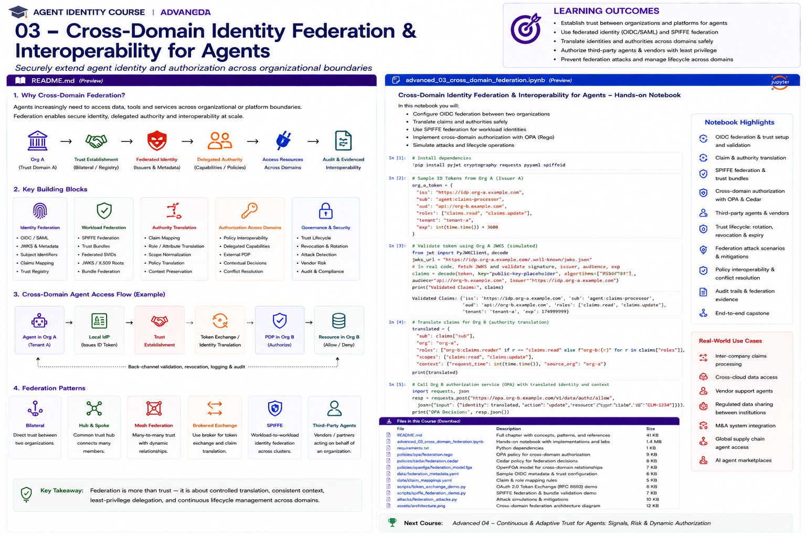

# Advanced 03 — Cross-Domain Identity Federation & Interoperability for Agents

> **Goal:** design agent identity that works safely across organizations, clouds, platforms, trust domains, and third-party agent ecosystems without collapsing all parties into one identity namespace.



## Why this matters

Enterprise agents increasingly cross boundaries:

```text
Enterprise A user
    ↓
Enterprise A agent
    ↓
Partner / SaaS agent
    ↓
External MCP server
    ↓
Enterprise B API
```

The hard question is not merely whether a credential has a valid signature. It is:

> **Why should this domain trust the issuer, metadata, workload identity, delegation, policy semantics, and resource binding represented by that credential?**

Federation is therefore **trust establishment + trust discovery + identity verification + local authorization**.

## Learning outcomes

You will learn to:

- distinguish identity federation from authorization federation;
- model trust domains and federation relationships;
- use OpenID Federation concepts: trust anchors, entity statements, subordinate statements, trust chains, metadata policies and trust marks;
- understand why OpenID Federation became a Final Specification in 2026;
- federate SPIFFE workload identities across trust domains;
- preserve the `<trust-domain, bundle>` binding;
- reason about one-way versus mutual SPIFFE federation;
- model cross-domain OAuth/OIDC trust;
- use issuer/audience/resource validation correctly;
- integrate MCP Protected Resource Metadata and authorization-server discovery;
- design third-party agent onboarding;
- map foreign identities into local policy subjects without unsafe string rewriting;
- separate authentication interoperability from authorization semantics;
- build trust registries and partner policy;
- constrain cross-domain delegation;
- handle key rotation, metadata refresh, revocation and federation termination;
- defend against malicious issuers, trust-chain substitution, metadata poisoning, redirect attacks and namespace collisions;
- create auditable federation evidence.

---

# 1. Federation is not "trust everybody"

Federation should mean:

```text
Domain A chooses to accept a bounded set of assertions
from Domain B
under explicit trust and policy conditions.
```

It should not mean:

```text
any token from Domain B gets local privileges
```

Local policy remains authoritative.

---

# 2. Four separate federation questions

For every external agent, ask:

```text
1. Who issued this identity?
2. Why do we trust that issuer?
3. What exactly does the credential prove?
4. What may this foreign identity do here?
```

The first three are authentication/trust-establishment questions.

The fourth is local authorization.

---

# 3. Trust-domain model

Represent domains explicitly:

```text
corp.example
partner.example
vendor.example
prod.corp.example
pci.corp.example
```

A domain is an administrative/security boundary with its own authority and lifecycle.

Do not infer trust solely from DNS similarity.

---

# 4. Federation relationship

A federation relationship should carry policy:

```json
{
  "foreign_domain": "partner.example",
  "status": "active",
  "accepted_identity_types": ["workload", "agent"],
  "allowed_agent_classes": ["research"],
  "allowed_resources": ["knowledge"],
  "max_delegation_depth": 1,
  "max_credential_ttl_seconds": 600,
  "require_sender_constraint": true
}
```

---

# 5. Trust anchors

A trust anchor is a locally configured root of trust.

Examples:

```text
OpenID Federation trust anchor
SPIFFE trust-domain bundle/bootstrap
enterprise CA
approved issuer registry
```

Trust anchors should be governed, versioned and auditable.

---

# 6. OpenID Federation 1.0

OpenID Federation 1.0 became an OpenID Final Specification in February 2026.

It supports multilateral federation where trust can be mediated through federation entities rather than requiring every participant to configure every other participant directly.

Core concepts:

```text
Entity Configuration
Entity Statement
Trust Anchor
Trust Chain
Subordinate Statement
Metadata Policy
Trust Mark
```

---

# 7. Entity Configuration

An entity publishes a signed Entity Configuration describing itself and its federation metadata.

Conceptually:

```text
https://agent.partner.example/.well-known/openid-federation
```

The document is signed and contains entity metadata plus federation relationships.

Do not treat discovery as trust by itself.

---

# 8. Entity Statements

An Entity Statement is a signed JWT in which one federation entity makes statements about another entity.

This lets a relying party build a cryptographically verifiable chain toward a configured trust anchor.

---

# 9. Trust chains

Conceptually:

```text
Local Trust Anchor
       ↓
Federation Authority
       ↓
Partner Organization
       ↓
Partner Agent Service
```

A chain is accepted only if:

```text
signatures validate
issuer/subject relationships are coherent
metadata policies resolve
time validity holds
chain terminates at an accepted trust anchor
```

---

# 10. Metadata policy

Federation is not only about keys.

A superior authority can constrain subordinate metadata.

Examples:

```text
permitted signing algorithms
required grant types
allowed redirect patterns
required authentication methods
```

This helps enforce federation-wide security baselines.

---

# 11. Trust marks

Trust marks can represent externally attested properties such as conformance or membership.

A trust mark is evidence, not blanket authorization.

Local policy must decide:

```text
which trust-mark issuers are trusted?
which marks matter?
how fresh must they be?
what permissions do they influence?
```

---

# 12. Cross-domain OIDC/OAuth

For an external identity token or access token, validate at least:

```text
issuer
signature/key
audience/resource
expiry/not-before
token type
required claims
authorization-server relationship
```

Then map verified claims into local policy context.

---

# 13. Do not authorize on email/domain strings

Bad:

```python
if user.email.endswith("@partner.example"):
    allow()
```

Better:

```text
verified issuer
+
verified subject
+
approved federation relationship
+
local relationship/policy
```

Human-readable identifiers are not trust anchors.

---

# 14. Foreign identity mapping

Avoid destructive translation such as:

```text
partner:agent:123 → local:agent:123
```

because namespaces may collide.

Preserve issuer/domain:

```text
federated principal =
  (issuer = partner.example,
   subject = agent:123)
```

This is a compound identity.

---

# 15. SPIFFE trust domains

SPIFFE IDs are URI identities:

```text
spiffe://trust-domain/path
```

The trust domain qualifies the identity namespace.

Example:

```text
spiffe://corp.example/prod/claims-agent
spiffe://partner.example/prod/research-agent
```

These are different identities even if their paths match.

---

# 16. SPIFFE bundles

A SPIFFE bundle contains the public key material authoritative for a trust domain.

Critical invariant:

```text
trust-domain name ↔ correct bundle
```

If an attacker can replace that association, they can undermine federation.

---

# 17. SPIFFE federation

SPIFFE federation lets workloads authenticate SVIDs from foreign trust domains by obtaining the foreign domain's bundle.

Conceptually:

```text
corp.example SPIRE
      ↕ bundle exchange
partner.example SPIRE
```

Federation does not merge namespaces.

---

# 18. Federation is directional

SPIFFE federation relationships are one-way.

If:

```text
corp trusts partner
```

that does not imply:

```text
partner trusts corp
```

Mutual authentication requires relationships in both directions.

This is an important enterprise design property.

---

# 19. Bundle endpoints

SPIFFE federation defines bundle endpoints and profiles for securely retrieving foreign bundles.

Operational concerns include:

```text
bootstrap
endpoint authentication
bundle refresh
key rotation
redirect handling
relationship termination
```

Federation configuration itself is security-sensitive.

---

# 20. Key rotation across domains

Foreign keys will change.

Your system must support:

```text
overlapping old/new keys
bundle/JWKS refresh
cache expiry
rollback handling
unknown key ID behavior
```

Do not hard-code a single forever-key.

---

# 21. Federation termination

Offboarding a partner must remove trust, not just disable a UI integration.

Consider:

```text
remove federation relationship
remove foreign trust bundle/anchor
revoke local mappings
invalidate cached ALLOW decisions
terminate delegated capabilities
disable MCP/API clients
preserve audit evidence
```

---

# 22. Authentication federation ≠ authorization federation

SPIFFE federation may prove:

```text
this workload is
spiffe://partner.example/agent/research
```

It does not prove:

```text
this workload may read claim:483
```

That remains a local authorization decision.

---

# 23. Policy interoperability

Different domains may use:

```text
RBAC
ReBAC
ABAC
Cedar
OPA
cloud IAM
proprietary policy
```

Do not assume foreign role names have local meaning.

Bad:

```text
foreign role = "admin"
→ local admin
```

Instead exchange stable, intentionally defined claims/capabilities and map them through local policy.

---

# 24. Cross-domain delegation

Suppose:

```text
Alice
  → corp claims agent
  → partner research agent
```

The foreign delegation should constrain:

```text
target domain
agent identity
actions
resources
purpose/task
expiry
redelegation
audience
```

The partner should independently validate the delegation and apply its own policy.

---

# 25. Authority intersection

A useful model is:

```text
effective foreign authority =
verified foreign identity
∩ valid delegation
∩ federation agreement
∩ local policy
∩ resource policy
∩ current risk
```

No single foreign assertion should dominate the result.

---

# 26. Third-party agents

Treat an external agent as a non-human third-party principal.

Registration should capture:

```text
provider
issuer/trust domain
agent identifier
owner/contact
business purpose
risk tier
approved tools/resources
delegation policy
credential types
assurance requirements
review date
```

---

# 27. Trust registry

A local trust registry can record approved external identity authorities and constraints.

Example:

```json
{
  "issuer": "https://id.partner.example",
  "status": "active",
  "accepted_audiences": ["claims-mcp"],
  "max_ttl": 600,
  "required_algorithms": ["ES256"],
  "allowed_agent_types": ["research"]
}
```

This is policy data, not model context.

---

# 28. Discovery vs trust

Discovery tells you:

```text
where metadata or keys are
```

It does not automatically tell you:

```text
whether to trust them
```

This distinction is crucial in OpenID/OAuth/MCP federation.

---

# 29. MCP authorization discovery

Current MCP authorization uses OAuth Protected Resource Metadata.

An MCP server advertises its associated authorization server(s), and clients discover authorization-server metadata through OAuth AS Metadata or OIDC Discovery.

This supports interoperable authorization setup.

---

# 30. MCP cross-domain trust

A remote MCP server creates several trust boundaries:

```text
agent client
MCP server
authorization server
downstream APIs
tool provider
```

Verify each relationship.

Do not assume:

```text
trusted MCP server = trusted downstream API
```

or:

```text
valid OAuth server = locally approved issuer
```

---

# 31. Multiple authorization servers

Protected Resource Metadata can identify multiple authorization servers.

Client/server policy must define which are acceptable.

Never choose an authorization server solely because metadata names it.

---

# 32. Resource indicators

Use resource/audience binding so a credential intended for:

```text
https://partner.example/mcp
```

cannot be replayed at:

```text
https://corp.example/payments
```

Cross-domain systems magnify token-redirection risk.

---

# 33. Token passthrough

An MCP server must not take a client token and blindly pass it to downstream services.

Across organizational boundaries this is especially dangerous.

Use:

```text
client → MCP-specific credential
MCP → downstream-specific credential
```

---

# 34. Identity translation gateways

Sometimes legacy systems cannot consume federated identities directly.

An identity gateway may translate:

```text
external verified identity
        ↓
local short-lived credential
```

Requirements:

```text
preserve original issuer/subject in evidence
narrow scope
short lifetime
target audience
no privilege expansion
policy-controlled mapping
```

---

# 35. Trust transitivity

Avoid accidental logic:

```text
A trusts B
B trusts C
therefore A trusts C
```

Trust is not automatically transitive.

OpenID Federation supports explicit trust-chain construction under configured trust anchors and policies; that is very different from arbitrary social transitivity.

---

# 36. Federation graph

Model trust as a directed graph.

Nodes:

```text
organizations
issuers
trust anchors
workload trust domains
agents
authorization servers
MCP servers
```

Edges:

```text
trusts
federates_with
issues_for
authorizes
delegates_to
```

Graph analysis can expose unintended paths.

---

# 37. Namespace collision

Two domains can both issue:

```text
agent:research
```

Never collapse them.

Use:

```text
partnerA::agent:research
partnerB::agent:research
```

or an equivalent structured identity.

---

# 38. Malicious issuer

A technically valid token from an unapproved issuer must fail.

Test:

```text
signature valid
claims plausible
issuer unknown
```

Expected:

```text
DENY
```

---

# 39. Trust-chain substitution

Attackers may try to substitute:

```text
different trust anchor
different federation authority
different bundle endpoint
different issuer metadata
```

Pin policy to explicitly accepted anchors and verify the complete chain.

---

# 40. Metadata poisoning

Treat federation metadata as security-critical input.

Validate:

```text
signatures
issuer relationships
allowed algorithms
URLs
policy constraints
expiry
```

Avoid unsafe automatic adoption of newly advertised endpoints or capabilities.

---

# 41. Redirect attacks

Federation and bundle discovery can involve HTTP redirects.

Apply the relevant specification's validation rules after redirects and preserve expected endpoint identity.

Do not downgrade authentication requirements because a URL changed.

---

# 42. Algorithm confusion/downgrade

Federation policy should constrain acceptable cryptographic algorithms.

Do not allow an external party to weaken local algorithm requirements via metadata.

---

# 43. Stale federation state

Cached:

```text
JWKS
SPIFFE bundles
entity statements
trust chains
authorization-server metadata
trust marks
```

can become stale.

Define TTL, refresh, stale-on-error behavior and high-risk freshness requirements.

---

# 44. Revocation latency

Cross-domain revocation is harder because state propagates through caches and organizational boundaries.

Define measurable targets:

```text
partner removal → no new authentication within X minutes
agent quarantine → no sensitive authorization within Y seconds
key compromise → emergency refresh immediately
```

---

# 45. Fail-open risk

If foreign metadata cannot refresh:

```text
should we continue using cached trust?
```

Answer by risk tier.

For sensitive writes, fail closed or require a bounded, explicitly approved stale window.

---

# 46. Federation evidence

Record:

```text
foreign issuer
foreign subject
trust domain
trust anchor
trust-chain ID
metadata version/hash
credential key ID
audience/resource
delegation chain
local mapped principal
local policy decision
federation-policy version
MCP server/auth server
trace/task IDs
```

This lets investigators reconstruct *why* a foreign agent was trusted.

---

# 47. Enterprise architecture

```text
                ┌──────────────────────────┐
                │ Local Trust Registry     │
                │ anchors / issuers/policy │
                └────────────┬─────────────┘
                             │
External Identity ──► Federation Verifier
 OIDC / SPIFFE         │   │   │
 OpenID Federation     │   │   └─ metadata/trust chain
                       │   └───── keys/bundles
                       └───────── credential
                             │
                             ▼
                    Federated Principal
                             │
              ┌──────────────┼──────────────┐
              ▼              ▼              ▼
          Delegation       ReBAC        Runtime ABAC
              └──────────────┼──────────────┘
                             ▼
                       Local PDP
                    OPA / Cedar / etc.
                             ▼
                            PEP
                             ▼
                     MCP / API / Tool
                             ▼
                     Evidence / Audit
```

---

# 48. Design principle

> **Federate authentication carefully; keep authorization local, explicit, scoped, and revocable.**

A foreign domain can prove who its agent is.

It should not get to decide what that agent may do inside your domain.

---

# Practical notebook

The notebook builds:

1. domain-qualified identities;
2. trust registries;
3. issuer allowlists;
4. compound foreign principals;
5. directed federation graphs;
6. trust-chain validation;
7. metadata-policy application;
8. trust-mark policy;
9. SPIFFE trust-domain/bundle binding;
10. directional federation;
11. key rotation;
12. foreign workload validation;
13. local authorization after federation;
14. cross-domain delegation;
15. authority intersection;
16. third-party agent onboarding;
17. MCP Protected Resource Metadata;
18. authorization-server selection policy;
19. resource/audience validation;
20. identity translation;
21. namespace-collision attacks;
22. malicious issuer attacks;
23. trust-chain substitution;
24. stale metadata;
25. federation termination;
26. evidence;
27. end-to-end partner-agent scenario.

# References

- OpenID Federation 1.0 Final  
  https://openid.net/specs/openid-federation-1_0.html
- OpenID Federation 1.0 Final approval  
  https://openid.net/openid-federation-1-0-final-specification-approved/
- SPIFFE Trust Domain and Bundle  
  https://spiffe.io/docs/latest/spiffe-specs/spiffe_trust_domain_and_bundle/
- SPIFFE Federation  
  https://spiffe.io/docs/latest/spiffe-specs/spiffe_federation/
- SPIFFE ID  
  https://spiffe.io/docs/latest/spiffe-specs/spiffe-id/
- MCP Authorization  
  https://modelcontextprotocol.io/specification/2025-11-25/basic/authorization
- RFC 8414 — OAuth Authorization Server Metadata  
  https://www.rfc-editor.org/rfc/rfc8414
- RFC 9728 — OAuth Protected Resource Metadata  
  https://www.rfc-editor.org/rfc/rfc9728
- RFC 8707 — OAuth Resource Indicators  
  https://www.rfc-editor.org/rfc/rfc8707

# Next course

## Advanced 04 — Agent Attestations, Verifiable Credentials & Trust Evidence

Next we move from federation to portable evidence about agents: verifiable credentials, attestations, workload/software claims, agent cards/system cards, trust marks, selective disclosure, issuer/verifier models, provenance, and policy use of assurance evidence.
