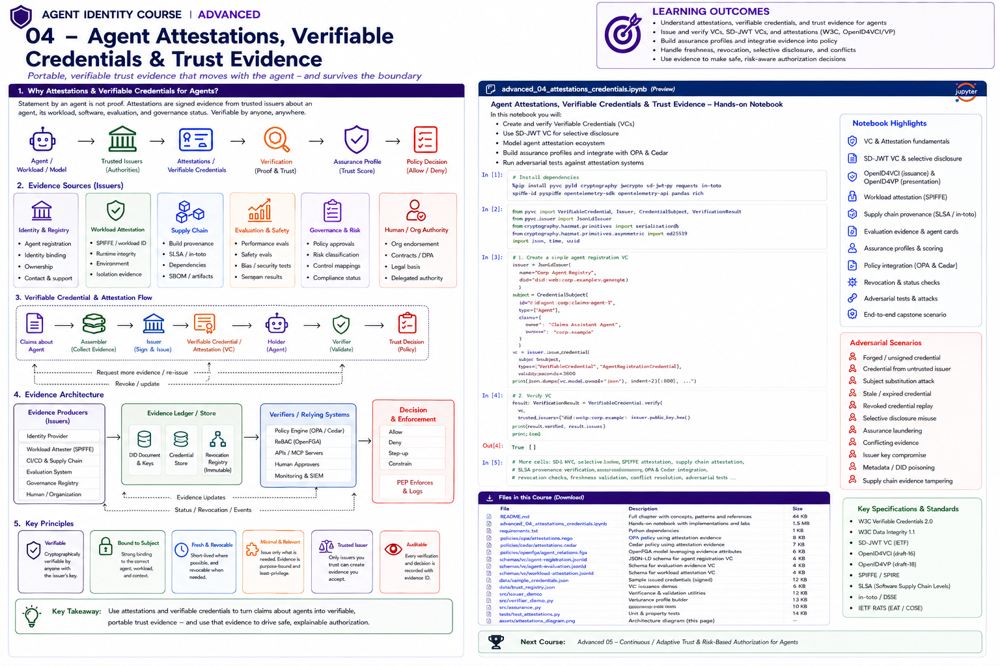

# Advanced 04 — Agent Attestations, Verifiable Credentials & Trust Evidence



> **Goal:** turn claims *about* an agent into independently verifiable, freshness-aware, revocable evidence that can safely influence enterprise authorization.

An agent can say:

```text
"I am approved."
"I passed the security evaluation."
"I am running the production release."
"I am a low-risk agent."
```

None of those statements should become trusted policy input merely because the model emitted them.

A production trust pipeline looks more like:

```text
Agent / Workload / Release
          ↓
Evidence Producers
├── Identity / Agent Registry
├── Workload Attester
├── CI/CD + Supply Chain
├── Evaluation Platform
├── Governance System
└── Human / Organization
          ↓
Signed Attestations / Credentials
          ↓
Verification
├── issuer trust
├── proof/signature
├── subject binding
├── schema/semantics
├── freshness
├── status/revocation
└── provenance
          ↓
Assurance Profile
          ↓
Current Policy
          ↓
ALLOW / DENY / STEP-UP / CONSTRAIN
```

The core principle is:

> **Self-description is not attestation. Verification proves evidence integrity and provenance; policy decides whether that evidence is sufficient for the requested action.**

---

# Learning outcomes

You will be able to:

- distinguish claims, attestations, credentials, verifiable credentials, presentations and provenance;
- model issuer-holder-verifier relationships;
- understand W3C Verifiable Credentials Data Model 2.0;
- create signed agent assurance credentials;
- verify issuer, signature, subject, audience/domain, time and status;
- understand W3C Data Integrity and JOSE/COSE approaches;
- use selective disclosure concepts and SD-JWT-style disclosures;
- understand OpenID4VCI and OpenID4VP protocol roles;
- model workload/runtime attestations;
- connect SPIFFE/workload identity to agent assurance;
- use SLSA/in-toto supply-chain provenance as agent evidence;
- model evaluation and governance attestations;
- distinguish agent cards/system cards from cryptographic evidence;
- build composite assurance profiles;
- handle evidence conflicts and stale evidence;
- implement revocation/status checks;
- prevent assurance laundering;
- integrate evidence with OPA/Cedar authorization;
- design evidence stores and audit trails;
- test forged, substituted, stale and conflicting evidence;
- build an end-to-end enterprise agent trust gate.

---

# 1. Claim vs evidence

A **claim** is a statement:

```text
agent:claims passed security evaluation
```

Evidence gives a verifier a reason to rely on that statement:

```text
issuer = approved-evaluation-service
subject = agent:claims
evaluation_suite = enterprise-agent-security-v4
result = passed
evaluated_release = sha256:...
issued = ...
expires = ...
proof = ...
```

A signature proves integrity and issuer control of a key. It does **not** prove that the issuer is trustworthy or that the underlying claim is true.

---

# 2. Attestation

In this course, an attestation is a signed or otherwise verifiable statement by an evidence producer about a subject.

Subjects can include:

```text
logical agent
workload instance
software release
model/configuration
tool server
evaluation run
deployment
organization
```

Examples:

```text
workload attestation
build provenance
security evaluation result
agent registration
governance approval
human approval
```

---

# 3. Credential

A credential packages claims made by an issuer about a subject.

Example:

```json
{
  "issuer": "did:web:registry.example",
  "credentialSubject": {
    "id": "agent:claims",
    "agentClass": "ClaimsAssistant",
    "owner": "claims-platform"
  }
}
```

A verifiable credential adds cryptographic protection so tampering can be detected and issuer authenticity can be checked.

---

# 4. W3C Verifiable Credentials Data Model 2.0

W3C VC Data Model 2.0 provides a general data model for machine-verifiable credentials.

Core ecosystem roles:

```text
Issuer
  ↓ issues
Holder
  ↓ presents
Verifier
```

The **credential subject** is the entity about which claims are made.

For agents, holder and subject may be different concepts. A runtime can hold evidence about a logical agent, release, or workload.

---

# 5. Agent VC example

```json
{
  "@context": ["https://www.w3.org/ns/credentials/v2"],
  "type": ["VerifiableCredential", "AgentRegistrationCredential"],
  "issuer": "did:web:registry.example",
  "validFrom": "2026-08-01T00:00:00Z",
  "credentialSubject": {
    "id": "urn:agent:claims",
    "owner": "claims-platform",
    "riskTier": "medium",
    "approvedTools": ["knowledge-search"]
  }
}
```

The exact production proof mechanism and schema must be intentionally selected.

---

# 6. Verification is not authorization

Successful VC verification means roughly:

```text
credential structure is acceptable
proof verifies
issuer is resolved/trusted
credential is temporally valid
status is acceptable
subject binding is acceptable
```

It does **not** mean:

```text
ALLOW payment.create
```

Authorization remains a separate policy decision.

---

# 7. Issuer trust

A valid credential from an untrusted issuer should not influence sensitive authorization.

Maintain issuer policy:

```text
issuer
credential types allowed
schemas/profiles
assurance level
trust domain
status
key policy
maximum lifetime
permitted claims
```

---

# 8. Subject binding

A common attack is to present valid evidence for another subject.

Example:

```text
credential subject = agent:safe
caller = agent:evil
```

The verifier must bind evidence to the authenticated logical agent/workload/release.

---

# 9. Evidence binding layers

Useful bindings include:

```text
credential → logical agent ID
credential → workload identity
credential → release digest
credential → model/config hash
credential → task
credential → environment
```

Higher-risk actions usually need stronger and more specific binding.

---

# 10. Data Integrity vs JOSE/COSE

VC Data Model 2.0 is a data model, not one mandatory proof format.

Relevant W3C work includes:

```text
Verifiable Credential Data Integrity
Data Integrity EdDSA/ECDSA cryptosuites
Securing VCs using JOSE and COSE
```

Choose a proof format based on ecosystem interoperability, key infrastructure, privacy requirements and implementation maturity.

---

# 11. Credential lifecycle

Treat credentials as lifecycle objects:

```text
issue
activate
present
verify
refresh
suspend
revoke
expire
archive evidence
```

Long-lived "approved forever" agent credentials are dangerous.

---

# 12. Freshness

Evidence has different useful lifetimes.

Examples:

```text
agent registration        → months
governance certification  → weeks/months
security evaluation       → release-bound
workload attestation      → minutes/hours
runtime risk              → seconds/minutes
human approval            → minutes / one transaction
```

Freshness should be claim- and action-specific.

---

# 13. Status and revocation

Evidence can become invalid before expiration:

```text
agent quarantined
issuer compromised
release withdrawn
evaluation superseded
governance approval revoked
employee/owner relationship changed
```

The verifier needs a status strategy.

W3C VC 2.0 includes credential status mechanisms in its ecosystem; production designs should balance privacy, latency and freshness.

---

# 14. Selective disclosure

A verifier should request only evidence needed for a decision.

Instead of disclosing:

```json
{
  "owner": "...",
  "internalRiskScore": 0.73,
  "allTools": [...],
  "evaluationDetails": {...},
  "approved": true
}
```

the holder might disclose only:

```text
agent is currently approved
security baseline >= required level
```

Selective disclosure reduces unnecessary exposure and correlation.

---

# 15. SD-JWT concepts

Selective Disclosure JWT (SD-JWT) separates signed claims from selectively revealable disclosures.

Conceptually:

```text
Issuer signs digests
      ↓
Holder retains disclosures
      ↓
Verifier requests needed claims
      ↓
Holder reveals subset
      ↓
Verifier recomputes digests
```

Do not implement a home-grown SD-JWT format for production; use a standards-compliant library/profile.

---

# 16. Disclosure minimization for agents

Agent evidence can expose sensitive enterprise metadata:

```text
internal risk scores
security findings
model versions
supplier names
environment
approval identities
```

Design presentations to disclose the minimum required evidence.

---

# 17. OpenID4VCI

OpenID for Verifiable Credential Issuance 1.0 standardizes protocol flows for credential issuance.

Agent use case:

```text
Agent Registry / Evaluation Service
          ↓
Credential Issuer
          ↓ OpenID4VCI
Agent Evidence Wallet / Runtime
```

OpenID4VCI 1.0 became an OpenID Final Specification in 2025.

---

# 18. OpenID4VP

OpenID for Verifiable Presentations 1.0 standardizes how a verifier requests and receives digital credential presentations.

Agent use case:

```text
Sensitive Tool / PDP
      ↓ presentation request
Agent Evidence Holder
      ↓ presentation
Verifier
      ↓
Policy
```

OpenID4VP 1.0 became an OpenID Final Specification in 2025.

---

# 19. Holder architecture for agents

Do not place private credentials or secrets into the LLM prompt.

Use an evidence subsystem:

```text
LLM / Planner
      ↓ asks for operation
Agent Runtime
      ↓
Evidence Wallet / Credential Manager
      ↓
Verifier / Tool
```

The model can request an action; trusted runtime chooses and presents evidence.

---

# 20. Workload attestation

Logical agent registration alone does not prove which code is executing.

Workload evidence can establish:

```text
runtime identity
environment
node/workload properties
deployment identity
attested platform state
```

SPIFFE/SPIRE provides a practical workload-identity foundation.

---

# 21. Workload identity + agent evidence

A useful chain:

```text
Agent Registration VC
       binds
logical agent
       ↓
approved release digest
       ↓
workload identity / attestation
       ↓
current runtime
```

The policy can require all bindings to agree.

---

# 22. Supply-chain provenance

An agent is software.

Its trust depends partly on:

```text
source
build
dependencies
builder
artifact digest
deployment
```

SLSA provenance describes verifiable information about how software artifacts were produced.

SLSA v1.2 uses an in-toto attestation predicate for build provenance.

---

# 23. in-toto attestations

The in-toto Attestation Framework provides a general envelope for supply-chain claims.

A useful agent evidence pattern:

```text
subject:
  agent artifact digest

predicate:
  builder
  source
  build inputs
  build process
  timestamps
```

This evidence can be verified before deployment or sensitive execution.

---

# 24. Release-bound evaluation

A security evaluation should usually bind to the artifact/configuration it evaluated.

Bad:

```text
agent:claims passed evaluation
```

Better:

```text
agent:claims
release = sha256:abc...
policy = security-suite-v7
evaluation = pass
```

A new release should not inherit old evidence automatically.

---

# 25. Model/configuration evidence

For GenAI agents, relevant evaluated state may include:

```text
model family/version
system prompt/config hash
tool manifest
policy bundle
guardrail configuration
retrieval configuration
code release
```

Decide which changes invalidate prior evidence.

---

# 26. Evaluation attestations

An evaluation system can issue evidence such as:

```json
{
  "subject": "release:sha256:abc",
  "suite": "agent-security-v7",
  "result": "pass",
  "metrics": {
    "toolEscalation": 0,
    "crossTenantLeakage": 0
  }
}
```

The verifier should trust the evaluator and understand the suite semantics.

---

# 27. Agent cards and system cards

Agent/system cards are valuable governance artifacts:

```text
purpose
owner
model
tools
limitations
risk classification
evaluation summary
human oversight
data use
```

But a Markdown/PDF card is usually **documentation**, not cryptographic proof.

Use cards for transparency and governance; bind machine-verifiable claims to signed evidence where enforcement depends on them.

---

# 28. Trust marks

A trust mark or certification can express that an agent/provider satisfied a defined program.

Do not interpret:

```text
has trust mark
```

as:

```text
may perform every operation
```

Policy must know the mark issuer, scheme, scope, freshness and meaning.

---

# 29. Assurance profile

Rather than one opaque trust score, build an explainable profile:

```json
{
  "identity": "high",
  "workload": "high",
  "supplyChain": "high",
  "evaluation": "medium",
  "governance": "high",
  "runtimeRisk": "low"
}
```

This preserves the dimensions behind the decision.

---

# 30. Avoid blind trust scores

A single:

```text
trust_score = 0.82
```

can hide why trust exists.

Prefer explicit evidence dimensions and policy thresholds.

A score can be useful operationally, but should not erase provenance.

---

# 31. Evidence composition

A high-risk action might require:

```text
registered agent
AND approved workload
AND approved release
AND fresh security evaluation
AND governance approval
AND low current risk
```

No individual credential is sufficient.

---

# 32. Evidence conflict

Examples:

```text
governance credential = approved
security service = quarantined

evaluation A = pass
evaluation B = fail

release credential = v8
workload attestation = v7
```

Define conflict semantics.

Safe defaults often prioritize:

```text
revocation
quarantine
newer authoritative evidence
explicit negative evidence
```

---

# 33. Negative evidence

Trust systems often focus only on positive credentials.

You also need:

```text
revoked
quarantined
compromised
failed evaluation
policy violation
incident active
```

Negative evidence may need precedence.

---

# 34. Evidence provenance

Record:

```text
issuer
subject
credential/evidence ID
schema/type
proof/key ID
issued/expiry
status
artifact digest
evaluation suite
policy version
verification result
```

The authorization decision should point to the evidence it used.

---

# 35. Evidence graph

Evidence is naturally a graph:

```text
agent
 ├─ registered-by → registry
 ├─ owns-release → artifact
 │     ├─ built-by → CI builder
 │     └─ evaluated-by → evaluator
 ├─ running-as → workload
 └─ approved-by → governance
```

Graph consistency checks can detect mismatches.

---

# 36. Evidence store

A production evidence store should support:

```text
immutable raw evidence
normalized verified claims
issuer metadata
status
freshness
subject/artifact indexes
policy decision references
retention controls
```

Do not let the LLM write trusted evidence directly.

---

# 37. Verification pipeline

Recommended order:

```text
parse safely
→ validate expected type/schema/profile
→ resolve trusted issuer/key
→ verify proof
→ validate temporal constraints
→ check status
→ bind subject
→ validate artifact/workload binding
→ normalize claims
→ attach provenance
→ pass verified facts to policy
```

---

# 38. Schema validation

Cryptographic validity is not semantic validity.

A signed credential can contain unexpected:

```text
claim names
types
units
versions
enumerations
nested structures
```

Validate schemas/profiles before using claims in policy.

---

# 39. Issuer compromise

If an issuer key is compromised, all credentials from that key may become suspect.

Prepare:

```text
key rotation
key status
credential status
emergency issuer disablement
re-evaluation/reissuance
decision-cache invalidation
incident evidence
```

---

# 40. Assurance laundering

Attack:

```text
Agent A has strong evidence
      ↓
Agent B presents/reuses it
      ↓
policy treats B as trusted
```

Defense:

```text
subject binding
holder/key binding where applicable
workload binding
artifact binding
audience/domain binding
freshness
```

---

# 41. Evidence replay

A previously valid presentation may be replayed.

Mitigations can include:

```text
nonce/challenge
audience binding
short lifetime
holder/key binding
transaction binding
one-time approval
```

Use protocol-supported replay defenses.

---

# 42. Selective-disclosure misuse

Privacy mechanisms can create authorization mistakes if policy assumes an undisclosed claim is false or true.

Model three states:

```text
verified true
verified false
not disclosed / unknown
```

Never silently collapse unknown into a privileged value.

---

# 43. Metadata / identifier poisoning

If issuer/key/schema resolution depends on remote identifiers, attackers may try to redirect or replace metadata.

Apply:

```text
trusted issuer registry
HTTPS/TLS validation
identifier-method rules
cache policy
schema allowlists
algorithm policy
safe redirect behavior
```

---

# 44. Continuous evidence

Agent trust changes during execution.

Potential signals:

```text
workload restarted
agent quarantined
risk changed
credential revoked
evaluation superseded
owner disabled
release withdrawn
```

For long-running agents, re-evaluate evidence at meaningful authorization boundaries.

---

# 45. Shared security signals

Continuous Access Evaluation / Shared Signals patterns are relevant when trust state changes after initial credential issuance.

They complement credentials:

```text
credential = portable assertion
event signal = trust-state change
```

Do not rely only on long-lived static evidence for dynamic risk.

---

# 46. Policy integration

Verified evidence becomes policy input:

```json
{
  "agent": {"registered": true},
  "workload": {"attested": true},
  "release": {"provenanceVerified": true},
  "evaluation": {"suite": "v7", "passed": true},
  "governance": {"approved": true},
  "risk": {"level": "low"}
}
```

The model should not be able to set these fields.

---

# 47. OPA example

```rego
allow if {
  input.evidence.agent.registered
  input.evidence.workload.attested
  input.evidence.release.provenance_verified
  input.evidence.evaluation.passed
  input.evidence.governance.approved
  input.risk.level == "low"
}
```

High-risk actions can require stronger evidence or step-up.

---

# 48. Cedar example

Cedar can use verified assurance as context/entity attributes while retaining its normal:

```text
principal
action
resource
context
```

model.

Use `forbid` for quarantine/revocation states that must override positive evidence.

---

# 49. Evidence-driven authorization tiers

Example:

```text
Tier 0
  unknown/unverified
  → no sensitive tools

Tier 1
  registered agent
  → read public/internal low-risk data

Tier 2
  + workload + provenance
  → normal enterprise tools

Tier 3
  + fresh evaluation + governance
  → sensitive writes

Tier 4
  + transaction-specific human approval
  → high-impact action
```

---

# 50. Enterprise reference architecture

```text
Evidence Producers
├─ Agent Registry
├─ SPIFFE / Workload Attester
├─ CI/CD + SLSA/in-toto
├─ Evaluation Service
├─ Governance Registry
└─ Human Approval
        │
        ▼
Credential / Attestation Issuers
        │
        ▼
Evidence Wallet + Evidence Store
        │
        ▼
Verification Service
├─ issuer/key trust
├─ proof verification
├─ status/revocation
├─ freshness
├─ subject/workload/release binding
└─ schema/profile validation
        │
        ▼
Normalized Assurance Profile
        │
        ▼
OPA / Cedar / ReBAC
        │
        ▼
ALLOW / DENY / STEP-UP / CONSTRAIN
        │
        ▼
PEP → Tool / MCP / API
        │
        ▼
Decision + Evidence Audit
```

---

# 51. Production checklist

Before evidence influences a sensitive action, answer:

```text
Who issued it?
Why do we trust that issuer?
What exactly is asserted?
What subject is it about?
Is that the current caller/workload/release?
What proof protects it?
Is it fresh?
Is it revoked/suspended?
What schema/profile defines its meaning?
Was selective disclosure handled correctly?
Is there conflicting negative evidence?
Which policy consumes it?
Can we reconstruct the decision later?
```

---

# Practical notebook

The notebook contains labs for:

1. claims vs evidence;
2. Ed25519 issuer keys;
3. signed agent registration credentials;
4. proof verification;
5. forged credential detection;
6. issuer trust;
7. subject substitution;
8. expiry/freshness;
9. status/revocation;
10. schema/profile validation;
11. selective-disclosure concepts;
12. SD-JWT-style digest disclosures;
13. unknown-vs-false semantics;
14. OpenID4VCI flow modeling;
15. OpenID4VP presentation requests;
16. evidence-wallet separation from the LLM;
17. workload attestation;
18. release/workload binding;
19. SLSA-style provenance;
20. in-toto statement modeling;
21. release-bound evaluation;
22. model/config fingerprints;
23. governance credentials;
24. agent/system cards vs evidence;
25. trust marks;
26. assurance profiles;
27. evidence composition;
28. conflict resolution;
29. negative evidence;
30. evidence graphs;
31. OPA-style policy integration;
32. Cedar-style forbid precedence;
33. replay challenges;
34. assurance laundering attack;
35. issuer compromise;
36. stale evidence;
37. adversarial test matrix;
38. end-to-end sensitive-tool trust gate.

---

# References

- W3C Verifiable Credentials Data Model 2.0  
  https://www.w3.org/TR/vc-data-model-2.0/
- W3C Verifiable Credential Data Integrity 1.0  
  https://www.w3.org/TR/vc-data-integrity/
- W3C Securing Verifiable Credentials using JOSE and COSE  
  https://www.w3.org/TR/vc-jose-cose/
- W3C Bitstring Status List 1.0  
  https://www.w3.org/TR/vc-bitstring-status-list/
- OpenID for Verifiable Credential Issuance 1.0 Final  
  https://openid.net/specs/openid-4-verifiable-credential-issuance-1_0-final.html
- OpenID for Verifiable Presentations 1.0 Final  
  https://openid.net/specs/openid-4-verifiable-presentations-1_0-final.html
- OpenID Digital Credentials Protocols  
  https://openid.net/wg/digital-credentials-protocols/specifications/
- SLSA v1.2  
  https://slsa.dev/spec/v1.2/
- SLSA Build Provenance  
  https://slsa.dev/spec/v1.2/build-provenance
- in-toto Attestation Framework  
  https://in-toto.io/docs/specs/
- SPIFFE  
  https://spiffe.io/
- OpenID Shared Signals / CAEP  
  https://openid.net/specs/openid-caep-1_0-final.html

---

# Next course

## Advanced 05 — Continuous & Adaptive Trust for Autonomous Agents

The next module moves from point-in-time evidence to continuously changing trust: risk signals, continuous access evaluation, behavioral signals, agent quarantine, trust decay, runtime posture, dynamic privilege reduction, event-driven revocation, step-up, and adaptive authorization.
