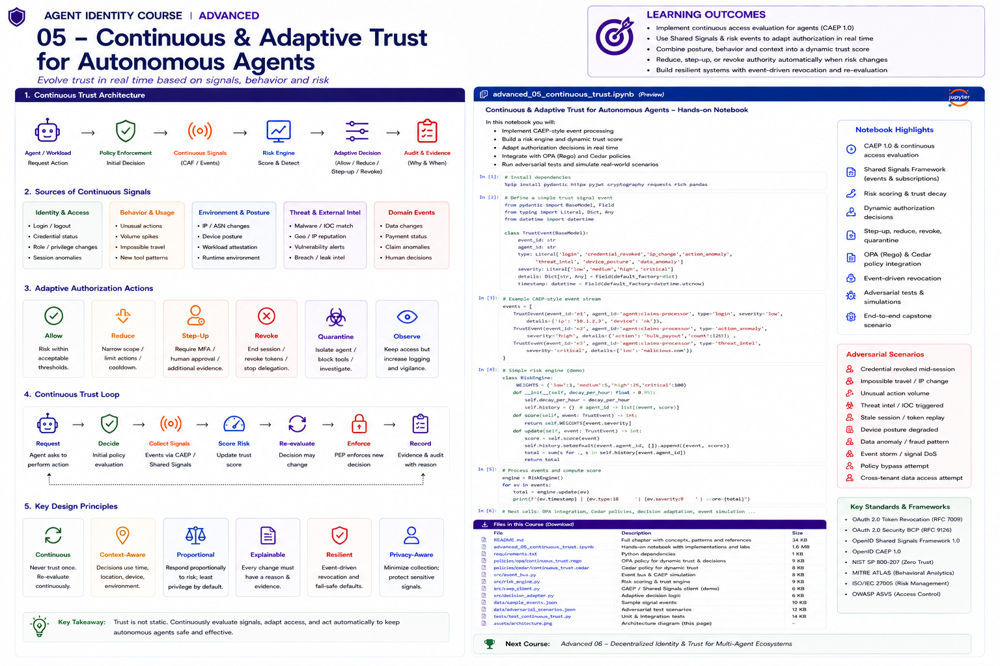

# Advanced 05 — Continuous & Adaptive Trust for Autonomous Agents



> **Goal:** move agent authorization from a one-time decision to a continuously re-evaluated control loop that can reduce, step up, revoke, or quarantine authority when identity, workload, behavior, environment, or business risk changes.

A credential can be valid while the world around it has changed.

```text
09:00  agent authenticates
09:02  authorization succeeds
09:17  workload becomes non-compliant
09:19  unusual tool sequence detected
09:20  security service raises risk
09:21  agent still has an unexpired token
```

If the architecture trusts only the original token, the system has a blind spot.

The desired model is:

```text
Request
   ↓
Initial Policy Decision
   ↓
Execution
   ↓
Continuous Signals
   ↓
Risk / Trust State
   ↓
Re-evaluate
   ↓
ALLOW | REDUCE | STEP-UP | REVOKE | QUARANTINE
   ↓
Enforce + Record
   ↺
```

The central principle is:

> **Trust is a changing state, not a login-time fact.**

---

# Learning outcomes

You will learn to:

- distinguish continuous authentication, continuous access evaluation, continuous authorization, and runtime monitoring;
- apply Zero Trust principles to autonomous agents;
- understand OpenID Shared Signals Framework (SSF) 1.0;
- understand CAEP 1.0 and Security Event Tokens;
- model transmitters, receivers, streams, subjects, events, and delivery;
- process session-revoked, token-claims-change, credential-change, assurance-level-change, device-compliance-change, session-established, session-presented, and risk-level-change events;
- translate human/device-oriented CAEP concepts into agent/workload controls carefully;
- model agent-specific runtime signals without pretending they are standardized CAEP events;
- build an explainable risk engine;
- implement trust decay and signal freshness;
- distinguish event time, receipt time, and decision time;
- handle duplicates, replay, reordering, and stale events;
- use hysteresis to prevent authorization flapping;
- reduce privileges dynamically;
- trigger step-up and human approval;
- revoke sessions/capabilities;
- quarantine agents;
- integrate adaptive state with OPA and Cedar;
- invalidate authorization caches;
- handle long-running workflows and queued actions;
- preserve privacy and data minimization;
- test fail-open/fail-closed behavior;
- design event-driven evidence and audit trails.

---

# 1. Why point-in-time trust fails

Traditional access often looks like:

```text
authenticate
→ issue token
→ trust until expiry
```

Autonomous agents create longer and more dynamic execution windows:

```text
plan
→ call tool
→ retrieve data
→ delegate
→ wait
→ resume
→ call another tool
→ perform write
```

Risk can change between any two steps.

---

# 2. Zero Trust for agents

NIST SP 800-207 frames Zero Trust around protecting resources rather than assuming trust because of network location.

For agents, translate this into:

```text
no implicit trust from deployment location
no permanent trust from prior success
verify identity and authority
evaluate resource/action context
continuously incorporate relevant state
enforce least privilege
```

Zero Trust is not "calculate one trust score."

---

# 3. Continuous authentication vs authorization

These are related but distinct.

**Continuous authentication**

```text
Is this still the same authenticated principal/workload?
```

**Continuous access evaluation**

```text
Has security state changed such that existing access should change?
```

**Continuous authorization**

```text
Given the current identity, delegation, resource, environment, evidence, and risk:
should this action be allowed now?
```

---

# 4. Shared Signals Framework

OpenID Shared Signals Framework 1.0 standardizes how cooperating systems exchange security events.

Roles:

```text
Transmitter
   ↓ Security Event Tokens
Event Stream
   ↓
Receiver
   ↓
Security action
```

SSF became an OpenID Final Specification in September 2025.

---

# 5. Security Event Tokens

SSF builds on the IETF Security Event Token (SET), RFC 8417.

A SET is a JWT-like structure describing a security event from the issuer's perspective.

Typical fields include:

```text
iss
aud
iat
jti
events
subject identifier
```

A SET is not an OAuth access token.

---

# 6. CAEP

OpenID Continuous Access Evaluation Profile 1.0 defines event types for communicating changes that may require access attenuation.

The Final Specification was approved in 2025.

CAEP explicitly applies to shared:

```text
human users
robotic users
devices
sessions
applications
```

This makes it highly relevant to non-human/agent identities, while agent-specific semantics still require careful local modeling.

---

# 7. CAEP event types

CAEP 1.0 defines:

```text
session-revoked
token-claims-change
credential-change
assurance-level-change
device-compliance-change
session-established
session-presented
risk-level-change
```

Do not invent custom events under the CAEP namespace.

Agent-specific events can use enterprise/private event types under your own namespace.

---

# 8. Agent event taxonomy

Useful non-standard agent signals might include:

```text
agent-quarantined
tool-anomaly
delegation-anomaly
release-withdrawn
evaluation-failed
policy-violation
cross-tenant-attempt
budget-anomaly
human-override
```

Clearly label these as private/domain events.

---

# 9. Signal sources

A mature agent control plane combines several classes of signal.

```text
Identity
├─ credential status
├─ token/session state
└─ role/relationship changes

Workload
├─ SPIFFE/SPIRE state
├─ runtime posture
├─ deployment/release
└─ node/environment

Behavior
├─ tool sequences
├─ action rate
├─ data access patterns
└─ delegation patterns

Security
├─ EDR/SIEM
├─ threat intelligence
├─ compromised key
└─ incident state

Business
├─ transaction amount
├─ claim/payment state
├─ tenant sensitivity
└─ human decision
```

---

# 10. Signals are evidence, not commands

Bad design:

```text
anomaly detector says HIGH
→ automatically trust detector's desired action
```

Better:

```text
verified signal
→ normalized risk fact
→ policy
→ proportional action
```

The signal producer should not silently become the authorization authority.

---

# 11. Signal trust

Every signal has provenance:

```text
producer
subject
type
timestamp
confidence
integrity/proof
scope
freshness
```

A forged risk signal can be a denial-of-service weapon.

Authenticate transmitters and validate event integrity.

---

# 12. Subject correlation

The receiver must know which agent/session/workload an event affects.

Agent identity may involve:

```text
logical agent ID
workload SPIFFE ID
session ID
token ID
deployment ID
tenant
task ID
delegation ID
```

Correlation mistakes can revoke the wrong agent—or fail to revoke the right one.

---

# 13. Event time vs receipt time

Keep separate:

```text
event occurred at
transmitter emitted at
receiver received at
policy evaluated at
```

This matters for delays, reordering, investigations, and stale events.

---

# 14. Event freshness

Example:

```text
risk = HIGH
event timestamp = 40 minutes ago
current state = LOW
```

Should the old HIGH event override current state?

Not necessarily.

Define per-signal freshness and ordering semantics.

---

# 15. Replay and duplicates

Event delivery can be at-least-once.

Use identifiers such as `jti` and idempotent processing.

```text
same event twice
≠
double punishment
```

Maintain bounded replay/deduplication state.

---

# 16. Out-of-order events

Suppose:

```text
10:01 risk = HIGH
10:02 risk = LOW
```

but LOW arrives first.

Blind arrival-order processing can restore HIGH incorrectly.

Track authoritative event timestamps/versioning where available.

---

# 17. Signal normalization

Different producers use different scales:

```text
LOW/MEDIUM/HIGH
0..100
0..1 probability
PASS/FAIL
NORMAL/ANOMALOUS
```

Normalize before policy.

Keep original raw evidence for audit.

---

# 18. Risk dimensions

Avoid one unexplained number.

Useful dimensions:

```text
identity_risk
workload_risk
behavior_risk
data_risk
transaction_risk
delegation_risk
threat_risk
```

Policy can respond differently to each.

---

# 19. Risk aggregation

A simple teaching model:

```text
overall =
max(
 identity,
 workload,
 threat,
 weighted behavior,
 transaction
)
```

Production aggregation should reflect business impact, confidence, correlation, and false-positive cost.

---

# 20. Trust decay

Old positive evidence should not remain maximally influential forever.

Example:

```text
fresh workload attestation → strong
2 hours later              → weaker
after restart              → invalid
```

Decay can be:

```text
time-based
event-based
action-count-based
transaction-bound
```

---

# 21. Negative evidence precedence

A valid registration credential should not override:

```text
agent quarantined
credential revoked
workload compromised
release withdrawn
active incident
```

Critical negative evidence often needs explicit deny precedence.

---

# 22. Adaptive decisions

Instead of only ALLOW/DENY:

```text
ALLOW
REDUCE
STEP-UP
REVOKE
QUARANTINE
OBSERVE
```

This produces safer and more usable systems.

---

# 23. REDUCE

Reduce can mean:

```text
remove write actions
restrict datasets
disable delegation
lower transaction limit
restrict tool set
force read-only mode
shorten credential lifetime
```

This is often preferable to total shutdown.

---

# 24. STEP-UP

Step-up can require:

```text
fresh workload attestation
new credential
stronger assurance
human approval
manager approval
transaction confirmation
additional policy evidence
```

For autonomous agents, "MFA" is not always the right abstraction. Step-up should match the principal and action.

---

# 25. REVOKE

Revocation can target:

```text
session
access token
capability
delegation
credential
task authorization
```

Revocation scope matters.

Do not revoke an entire agent fleet when one task/session is compromised unless policy requires it.

---

# 26. QUARANTINE

Quarantine isolates the agent while preserving investigation evidence.

Possible effects:

```text
block sensitive tools
disable delegation
allow health/status endpoints
retain telemetry
freeze queued writes
require human release
```

---

# 27. OBSERVE

Sometimes risk is insufficient to change access but sufficient to increase telemetry.

```text
ALLOW + enhanced logging
ALLOW + shorter re-evaluation interval
ALLOW + shadow policy
```

This helps tune detection without over-blocking.

---

# 28. Hysteresis

Without hysteresis:

```text
49 → allow
51 → reduce
49 → allow
51 → reduce
```

The system flaps.

Use separate thresholds:

```text
enter REDUCE at >= 60
return to ALLOW at < 40
```

---

# 29. Cooldown and recovery

After quarantine, do not automatically restore full privileges because one low-risk signal arrives.

Require recovery conditions:

```text
minimum cooldown
fresh attestation
incident cleared
human release
clean evaluation
new credential
```

---

# 30. Long-running workflows

An agent may have planned an action before risk changed.

Before execution of a sensitive queued action:

```text
re-check authorization
re-check delegation
re-check risk
re-check evidence freshness
```

Do not assume plan-time authorization remains valid.

---

# 31. Authorization cache invalidation

Continuous signals are useless if cached ALLOW decisions remain valid.

Risk events should invalidate:

```text
decision cache
session cache
capability cache
delegation cache
tool authorization cache
```

as appropriate.

---

# 32. Policy versioning

Record which policy evaluated each event-driven decision.

```text
decision_id
policy_version
risk_model_version
signal IDs
previous decision
new decision
reason
```

This is essential for audit.

---

# 33. Explainability

A decision should say:

```text
REDUCE
because:
  workload compliance changed to non-compliant
  signal = evt-812
  received = ...
  policy = adaptive-authz-v12
effects:
  remove claim.update
  disable delegation
```

Avoid opaque "AI risk score says no."

---

# 34. OPA integration

OPA can consume normalized state:

```json
{
  "principal": "agent:claims",
  "action": "claim.update",
  "risk": {
    "level": "high",
    "workload": "high"
  },
  "state": {
    "quarantined": false
  }
}
```

Policy remains deterministic and reviewable.

---

# 35. Cedar integration

Cedar can use dynamic risk/context alongside principal-action-resource relationships.

Use `forbid` for high-priority negative state:

```text
quarantined
credential revoked
release withdrawn
```

Remember that changing context must actually trigger re-evaluation.

---

# 36. ReBAC integration

Relationships can change continuously:

```text
owner removed
task delegation revoked
agent removed from project
tenant relationship ended
```

Continuous authorization should incorporate relationship changes, not only telemetry.

---

# 37. Shared Signals receiver architecture

```text
SSF Receiver
   ↓
SET verification
   ↓
subject correlation
   ↓
dedupe/order/freshness
   ↓
normalization
   ↓
risk state store
   ↓
policy re-evaluation
   ↓
PEP / revocation / quarantine
```

---

# 38. Push vs poll

**Push**

```text
fast reaction
event-driven
requires reliable delivery/security
```

**Poll**

```text
simpler for some sources
higher latency
wasted requests
```

Use both where appropriate.

---

# 39. Stream failure

What happens when the signal stream is unavailable?

Choose by risk:

```text
low-risk reads → bounded stale state may be acceptable
sensitive writes → step-up or fail closed
high-impact actions → require fresh state
```

Do not silently fail open forever.

---

# 40. Backpressure

A flood of events can overwhelm the receiver.

Protect with:

```text
queues
rate limits
priority
deduplication
bounded storage
circuit breakers
per-transmitter quotas
```

Critical revocation events should not be buried behind low-value telemetry.

---

# 41. Signal poisoning

Attack:

```text
attacker emits fake HIGH risk
→ agent quarantined
```

or:

```text
attacker emits fake LOW risk
→ privileges restored
```

Defend with authenticated transmitters, integrity verification, issuer policy, event authorization, and precedence rules.

---

# 42. Risk-score manipulation

An autonomous agent may discover that certain actions lower or avoid a risk score.

Do not expose unnecessary detector internals to the model.

Use independent enforcement and adversarially test gaming behavior.

---

# 43. Alert fatigue and overreaction

If every anomaly causes quarantine, operators will bypass the system.

Map confidence + impact to proportional actions:

```text
weak anomaly → observe
moderate risk → reduce
high risk → step-up
critical compromise → quarantine/revoke
```

---

# 44. Privacy

Continuous evaluation can become surveillance.

Collect only signals necessary for security and business decisions.

Define:

```text
purpose
retention
access
sharing
minimization
aggregation
redaction
```

Do not feed all telemetry into model prompts.

---

# 45. Data separation

Keep:

```text
raw security telemetry
normalized risk state
model context
audit evidence
```

as separate security domains.

The LLM usually needs the **decision/effect**, not raw sensitive telemetry.

---

# 46. Event-driven revocation latency

Measure:

```text
event occurrence
→ event emitted
→ event received
→ policy recomputed
→ PEP enforced
```

This is the real continuous-access response time.

---

# 47. SLOs

Example operational objectives:

```text
critical revocation p95 enforcement < 10 s
quarantine propagation p95 < 15 s
risk-state freshness < 60 s
event loss = 0 for critical classes
duplicate processing safe = 100%
```

Choose numbers based on system risk and architecture.

---

# 48. Shadow mode

Before activating adaptive controls:

```text
compute decision
do not enforce
compare against operator outcome
measure false positives
tune thresholds/policy
```

Shadow mode is valuable for rollout.

---

# 49. Simulation

Build deterministic event simulations:

```text
normal operation
credential revoked
workload non-compliant
risk spike
risk recovery
event duplication
event delay
event reordering
stream outage
signal poisoning
```

Adaptive authorization needs state-machine tests, not only unit tests.

---

# 50. Enterprise reference architecture

```text
Identity / IdP ───────┐
Workload / SPIRE ─────┤
SIEM / EDR ───────────┤
Evaluation ───────────┤
Governance ───────────┤
Business Systems ─────┤
Behavior Analytics ───┘
          │
          ▼
 Shared Signals / Event Bus
          │
          ▼
 Signal Verification Gateway
          │
          ▼
 State + Risk Engine
          │
          ├────────► Evidence Store
          │
          ▼
 Adaptive PDP
 OPA / Cedar / ReBAC
          │
          ▼
 PEP / Agent Gateway
 ├─ allow
 ├─ reduce
 ├─ step-up
 ├─ revoke
 └─ quarantine
          │
          ▼
 Agent / MCP / API / Tool
          │
          └────────────── telemetry/events ↺
```

---

# 51. Production checklist

Before calling a system "continuous trust," verify:

```text
Are signals authenticated?
Are event subjects correlated correctly?
Are events deduplicated?
Can events arrive out of order safely?
Is freshness modeled?
Can negative evidence override positive evidence?
Are decisions proportional?
Can privileges be reduced without full shutdown?
Can sessions/capabilities/delegations be revoked?
Can agents be quarantined?
Are queued sensitive actions re-authorized?
Are cached ALLOWs invalidated?
Is stream failure handled explicitly?
Can attackers poison signals?
Can the model manipulate the risk engine?
Are recovery rules defined?
Are privacy/retention controls defined?
Can every transition be explained?
Is enforcement latency measured?
```

---

# Practical notebook

The notebook implements:

1. continuous-trust state;
2. event model;
3. SET-like security events;
4. CAEP event taxonomy;
5. private agent event taxonomy;
6. transmitter trust;
7. event integrity;
8. subject correlation;
9. duplicate detection;
10. replay handling;
11. out-of-order events;
12. freshness;
13. signal normalization;
14. multidimensional risk;
15. aggregation;
16. trust decay;
17. negative evidence precedence;
18. ALLOW/REDUCE/STEP-UP/REVOKE/QUARANTINE;
19. hysteresis;
20. recovery/cooldown;
21. dynamic tool reduction;
22. delegation disablement;
23. transaction limits;
24. long-running action re-authorization;
25. decision-cache invalidation;
26. OPA-style policy;
27. Cedar-style forbid precedence;
28. ReBAC relationship changes;
29. stream failure;
30. signal poisoning;
31. risk gaming;
32. privacy/minimization;
33. event-driven audit evidence;
34. enforcement latency;
35. shadow mode;
36. deterministic simulation;
37. adversarial matrix;
38. end-to-end autonomous-agent incident.

---

# References

- OpenID Shared Signals Framework 1.0 Final  
  https://openid.net/specs/openid-sharedsignals-framework-1_0-final.html
- OpenID Continuous Access Evaluation Profile 1.0 Final  
  https://openid.net/specs/openid-caep-1_0-final.html
- OpenID RISC Profile 1.0 Final  
  https://openid.net/specs/openid-risc-1_0-final.html
- OpenID Shared Signals Working Group  
  https://openid.net/wg/sharedsignals/
- RFC 8417 — Security Event Token  
  https://www.rfc-editor.org/rfc/rfc8417
- NIST SP 800-207 — Zero Trust Architecture  
  https://csrc.nist.gov/pubs/sp/800/207/final
- SPIFFE  
  https://spiffe.io/
- Open Policy Agent  
  https://www.openpolicyagent.org/
- Cedar  
  https://www.cedarpolicy.com/

---

# Next course

## Advanced 06 — Decentralized Identity & Trust for Multi-Agent Ecosystems

The next module explores identity and trust when there is no single enterprise identity authority: decentralized identifiers, DID resolution, trust registries, peer-to-peer agent identity, portable credentials, key rotation/recovery, trust establishment, Sybil resistance, reputation limitations, and multi-agent ecosystem governance.
