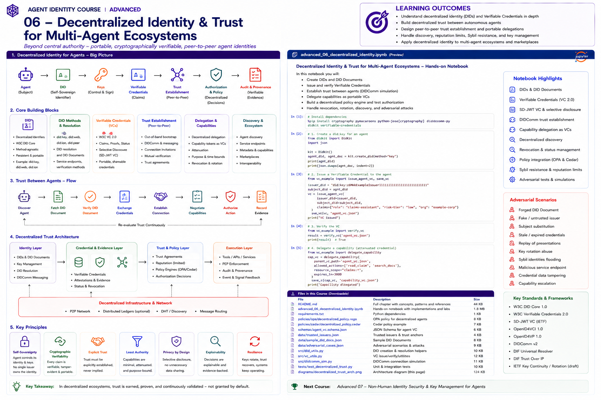

# Advanced 06 — Decentralized Identity & Trust for Multi-Agent Ecosystems



> **Goal:** understand where decentralized identifiers and portable credentials genuinely help agent identity—and where they do not—and build a trust architecture for agents that do not share one identity provider.

In a single enterprise, identity can often begin with:

```text
Enterprise IdP / Workload CA
        ↓
known agent/workload
        ↓
enterprise policy
```

A multi-organization ecosystem is harder:

```text
Agent A @ Organization A
        ↕
Agent B @ Organization B
        ↕
Tool C @ Organization C
```

There may be:

```text
no shared IdP
no shared directory
no common account namespace
no bilateral configuration
no assumption that a discovered key is trusted
```

Decentralized identity separates several questions:

```text
What identifier names this entity?
How do I resolve its verification material?
Who controls the relevant keys?
Which credentials/evidence does it present?
Who issued those credentials?
Why do I trust those issuers?
What authority is being delegated?
What local policy permits this action?
```

The central principle is:

> **Decentralized identifiers decentralize identifier/key control; they do not decentralize away the need for trust policy.**

---

# Learning outcomes

By the end you should be able to:

- explain W3C DID Core and the DID URI model;
- distinguish DID syntax, DID methods, DID documents, resolution and trust;
- evaluate `did:web`, `did:key`-style approaches, and other DID methods by properties rather than hype;
- understand verification methods and verification relationships;
- design key rotation and recovery;
- bind Verifiable Credentials to agent identities;
- distinguish authentication, credential verification and authorization;
- build peer-to-peer challenge/response;
- model DIDComm conceptually without confusing it with DID Core;
- design decentralized agent discovery;
- use trust registries and trust anchors;
- compare decentralized trust with federation;
- model portable delegation/capabilities;
- understand selective disclosure and privacy risks;
- reason about correlation and pairwise identifiers;
- analyze Sybil attacks and why DIDs alone do not solve them;
- reason about reputation limits;
- defend against DID document substitution and malicious service endpoints;
- handle method governance and resolver trust;
- integrate decentralized evidence with OPA/Cedar;
- build a multi-agent trust handshake.

---

# 1. What "decentralized identity" actually means

It does **not** mean:

```text
no governance
no trust anchors
no policy
no issuers
no infrastructure
no operators
```

It usually means that identifier/control and trust establishment need not depend on one centralized account directory.

For agents, this can be useful across:

```text
companies
clouds
agent marketplaces
supplier ecosystems
open protocols
cross-domain collaborations
```

---

# 2. W3C Decentralized Identifiers

DID Core defines identifiers shaped like:

```text
did:<method>:<method-specific-id>
```

Examples:

```text
did:web:agents.example.com:claims
did:example:123456789
```

The method determines how the identifier is created, read, updated, and deactivated.

---

# 3. DID Core is method-agnostic

DID Core defines the common data model.

A DID method defines method-specific operations.

This distinction matters:

```text
DID Core
  ≠ blockchain
  ≠ one registry
  ≠ one resolver
  ≠ one trust model
```

---

# 4. DID documents

Resolution can yield a DID document containing information such as:

```text
id
verificationMethod
authentication
assertionMethod
keyAgreement
capabilityInvocation
capabilityDelegation
service
```

A DID document is security-sensitive metadata.

---

# 5. Verification methods

A verification method identifies cryptographic material associated with a controller.

Example conceptually:

```json
{
  "id": "did:example:agent#key-1",
  "controller": "did:example:agent",
  "type": "...",
  "publicKeyJwk": {}
}
```

Do not assume every key can be used for every purpose.

---

# 6. Verification relationships

DID Core defines relationships including:

```text
authentication
assertionMethod
keyAgreement
capabilityInvocation
capabilityDelegation
```

A verifier must check the relationship appropriate to the operation.

---

# 7. Authentication

For an agent challenge:

```text
Verifier → random nonce
Agent    → signature
Verifier → resolve DID
Verifier → choose authentication verification method
Verifier → verify signature
```

This can prove control of an authorized authentication key.

It does not prove that the agent should receive access.

---

# 8. Assertion method

`assertionMethod` is relevant when the controller expresses claims such as credentials.

Do not treat an authentication key as automatically authorized for assertions.

---

# 9. Capability invocation and delegation

DID Core includes relationships named:

```text
capabilityInvocation
capabilityDelegation
```

These identify verification methods appropriate to those purposes.

They do not by themselves define your entire authorization/capability protocol.

---

# 10. DID methods

A method should be evaluated on properties such as:

```text
control
resolution
update
deactivation
key rotation
recovery
availability
privacy
cost
governance
interoperability
security assumptions
```

There is no universally best DID method.

---

# 11. did:web

`did:web` uses Web infrastructure to publish DID documents.

Conceptually:

```text
did:web:agents.example.com
        ↓
HTTPS
        ↓
agents.example.com/.well-known/did.json
```

Nested paths map into method-specific Web paths.

Advantages can include operational familiarity and domain control.

Its trust/security assumptions include DNS, TLS, hosting, and Web operations.

---

# 12. did:key-style identifiers

Key-derived identifiers can be useful for:

```text
ephemeral identities
local testing
self-contained public-key identifiers
```

But key rotation/recovery and lifecycle properties differ from mutable DID methods.

Do not choose them merely because they are easy to create.

---

# 13. Method governance

Every DID method has governance.

Ask:

```text
Who maintains the method?
Who can change it?
What infrastructure does it depend on?
How are security issues handled?
What is the update/deactivation model?
What happens if infrastructure disappears?
```

"Decentralized" does not eliminate governance.

---

# 14. DID resolution

Resolution transforms:

```text
DID
 ↓
DID document + resolution metadata
```

A resolver is part of your trusted computing path.

Validate:

```text
method support
response integrity
document syntax
document ID
cache/freshness
resolution errors
redirect/network behavior
```

---

# 15. Universal resolvers

A multi-method resolver can improve interoperability but expands the trust and attack surface.

Treat a resolver as infrastructure—not as an oracle.

Use:

```text
method allowlists
network egress controls
timeouts
response limits
cache policy
SSRF defenses
```

---

# 16. DID resolution and SSRF

A malicious identifier/method could cause unsafe network access if a resolver is poorly designed.

Defenses include:

```text
method-specific safe resolution
URL validation
DNS/IP policy
redirect limits
private-address blocking
timeouts
size limits
```

---

# 17. DID document substitution

Attack:

```text
request DID A
resolver returns attacker-controlled document B
```

Verify that returned metadata/document corresponds to the requested DID according to method rules.

---

# 18. Malicious service endpoints

DID documents can contain service endpoints.

Do not automatically connect to arbitrary endpoints merely because they appear in a resolved DID document.

Apply:

```text
endpoint policy
scheme allowlist
network controls
tenant policy
trust policy
```

---

# 19. Key rotation

Agents can live longer than keys.

A lifecycle should support:

```text
key-1 active
→ key-2 introduced
→ transition
→ key-1 removed/revoked
```

Consumers must not cache old key state forever.

---

# 20. Recovery

If a controlling key is lost or compromised, how is control recovered?

Recovery depends on the DID method and governance model.

Possible approaches:

```text
separate recovery key
organizational controller
threshold control
method-specific recovery
re-registration
```

Recovery is a major design criterion.

---

# 21. Key continuity

A new key does not automatically mean the same trustworthy entity.

Continuity can depend on:

```text
method-authorized update
old-key transition proof
organizational evidence
credential reissuance
trust-registry state
```

---

# 22. Deactivation

A DID may need to be deactivated when:

```text
agent retired
organization exits ecosystem
controller compromised
identity superseded
```

Consumers need a policy for deactivated identities and cached state.

---

# 23. DIDs + Verifiable Credentials

A DID can identify:

```text
issuer
holder
credential subject
```

Example:

```text
did:web:corp.example:agents:claims
        ↓
presents VC
        ↓
issued by trusted governance/evaluation issuer
```

The DID identifies; the credential asserts evidence.

---

# 24. Portable agent evidence

Portable credentials can carry:

```text
organization membership
agent registration
risk classification
certification
evaluation result
approved capability class
supplier status
```

The verifier still decides which issuers and schemas it trusts.

---

# 25. Self-issued claims

A DID controller can sign a statement about itself.

That proves:

```text
the controller said this
```

It does not automatically prove:

```text
the statement is externally trustworthy
```

Self-attestation and third-party attestation are different assurance classes.

---

# 26. Peer-to-peer trust handshake

A basic cross-agent handshake:

```text
discover identifier
→ resolve DID
→ challenge authentication key
→ verify control
→ exchange credentials
→ verify issuer/status/subject
→ establish trust context
→ negotiate/request authority
→ local authorization
→ record evidence
```

---

# 27. DIDComm

DIDComm is an ecosystem/protocol family for secure messaging associated with decentralized identity.

It is not part of DID Core.

Conceptually it can provide:

```text
message protection
routing
peer interaction
connection protocols
```

Teach DIDComm separately from identifier resolution.

---

# 28. Mutual authentication

For peer agents:

```text
Agent A proves control of A
Agent B proves control of B
```

Then each side evaluates credentials and local policy.

Mutual key proof still does not establish organizational trust.

---

# 29. Trust establishment

Trust can come from:

```text
known issuer
trust registry
federation trust anchor
contractual relationship
credential chain
governance certification
manual onboarding
```

A DID alone is not a trust anchor.

---

# 30. Trust registries

A registry can answer questions like:

```text
Is issuer X approved?
Which credential types may X issue?
Is organization Y suspended?
Which agent marketplace is recognized?
```

This reintroduces governance intentionally.

Decentralized identity and registries are not contradictory.

---

# 31. Federation vs decentralized identity

They solve overlapping but different problems.

**Federation**

```text
structured trust framework
trust anchors
entity metadata
membership/policy
```

**DID/VC**

```text
portable identifiers
controller-managed keys
portable evidence
method-based resolution
```

A production ecosystem can combine them.

---

# 32. OpenID Federation 1.1

As of 2026, OpenID Federation 1.1 is a Final Specification.

It provides protocol-independent federation trust infrastructure, with a companion specification for OpenID Connect/OAuth.

This can complement DID/VC ecosystems when participants need explicit multilateral trust governance.

---

# 33. Decentralized discovery

Discovery can use:

```text
registries
marketplaces
directories
DID services
federation metadata
DNS/Web
out-of-band exchange
```

Discovery answers:

```text
who/what is available?
```

not:

```text
who is trusted?
```

---

# 34. Agent marketplaces

An agent marketplace may publish:

```text
agent DID
provider
service endpoint
capabilities
credential requirements
pricing
assurance claims
```

Never treat marketplace listing as authorization.

---

# 35. Capability delegation

Portable delegation can express:

```text
delegator
delegate
resource
actions
constraints
expiry
audience
delegation depth
```

The verifier should intersect delegated authority with local policy.

---

# 36. Attenuation

Delegated authority should normally become narrower:

```text
A → B: read + update claims
B → C: read claims
```

not:

```text
B → C: administer tenant
```

Delegation chains require monotonic attenuation rules.

---

# 37. Capability evidence as credentials

A credential-like object can carry delegated authority.

But:

```text
valid signature
≠
valid delegation
```

You must validate:

```text
delegator authority
subject
audience
scope
resource
time
chain
revocation
attenuation
```

---

# 38. Revocation

Portable identities and credentials need revocation strategies.

Consider separately:

```text
DID/key deactivation
credential revocation
delegation revocation
session revocation
trust-registry suspension
```

These operate at different layers.

---

# 39. Privacy and correlation

A globally stable DID can become a correlation identifier.

Across ecosystems, consider:

```text
pairwise identifiers
purpose-specific identifiers
selective disclosure
minimal credential presentation
short-lived relationships
```

Privacy matters for agents too because identities can expose organizations, workflows, suppliers, customers, and internal architecture.

---

# 40. Pairwise identifiers

Instead of:

```text
agent uses same DID everywhere
```

consider:

```text
Agent ↔ Partner A: identifier A
Agent ↔ Partner B: identifier B
```

where the architecture permits it.

This reduces cross-context correlation.

---

# 41. Sybil attacks

Creating many identifiers may be cheap.

An attacker can create:

```text
did:attacker:1
did:attacker:2
...
did:attacker:100000
```

DIDs do not solve Sybil resistance.

Trust must depend on scarce or governed evidence such as:

```text
organization verification
credentials
economic constraints
reputation with provenance
federation membership
attestation
```

---

# 42. Reputation

Reputation can help but is dangerous.

Problems include:

```text
Sybil amplification
collusion
cold start
context mismatch
gaming
retaliation
bias
stale history
identity reset
```

Never make reputation the sole basis for high-impact authorization.

---

# 43. Reputation portability

A score from one ecosystem may not mean the same thing elsewhere.

Prefer:

```text
signed evidence
explicit dimensions
source provenance
context
time
```

over a mysterious portable scalar.

---

# 44. Trust transitivity

If:

```text
A trusts B
B trusts C
```

it does not follow that:

```text
A trusts C
```

Trust transitivity must be explicitly defined by the trust framework.

---

# 45. Namespace and identity collision

Do not map external identities into local short names carelessly.

Bad:

```text
partner-A agent "admin" → local "admin"
```

Use compound identifiers:

```text
method
DID
trust domain
issuer
organization
tenant
```

---

# 46. Key compromise

If an agent key is compromised:

```text
attacker can authenticate as controller
```

until the ecosystem observes rotation/deactivation/revocation.

Prepare:

```text
rapid update
resolver cache invalidation
credential reissuance
delegation revocation
event notification
incident evidence
```

---

# 47. Resolver compromise

A compromised resolver can substitute keys or endpoints.

High-assurance systems may use:

```text
independent resolution
method-native verification
signed metadata
cache pinning with rotation awareness
multiple evidence sources
```

depending on method capabilities.

---

# 48. Method downgrade

An attacker may try to move a transaction from a stronger identity method/profile to a weaker one.

Policy should specify:

```text
allowed methods
allowed key types
minimum assurance
allowed credential profiles
```

Never negotiate down silently.

---

# 49. Policy integration

Normalize verified decentralized identity into policy facts:

```json
{
  "principal": {
    "did": "did:web:corp.example:agents:claims",
    "authenticated": true,
    "method": "web"
  },
  "credentials": {
    "organization_verified": true,
    "agent_registered": true
  },
  "delegation": {
    "actions": ["claim.read"],
    "valid": true
  }
}
```

The LLM must not be able to fabricate these fields.

---

# 50. Enterprise multi-agent architecture

```text
Agent A                         Agent B
  │                               │
  ├── DID/key control             ├── DID/key control
  │                               │
  └──────── secure handshake ─────┘
                  │
                  ▼
          DID Resolution Layer
          ├─ method adapters
          ├─ safe resolver
          └─ cache/freshness
                  │
                  ▼
       Credential / Evidence Layer
          ├─ VC verification
          ├─ status/revocation
          ├─ issuer trust
          └─ selective disclosure
                  │
                  ▼
           Trust Framework
          ├─ trust registry
          ├─ federation
          ├─ contracts
          └─ assurance policy
                  │
                  ▼
          Authorization Layer
          ├─ delegation
          ├─ OPA/Cedar/ReBAC
          └─ local constraints
                  │
                  ▼
            Tool / Service
                  │
                  ▼
          Evidence + Audit
```

---

# 51. When to use decentralized identity for agents

Strong candidates:

```text
cross-company ecosystems
portable agent credentials
multi-provider marketplaces
agents spanning clouds/domains
peer-to-peer interactions
long-lived identities independent of one account system
```

Less compelling:

```text
single internal application
one IdP
short-lived workload identities
no portability requirement
```

Do not introduce DIDs simply because "agents are autonomous."

---

# 52. Production checklist

Before accepting an external agent DID:

```text
Which DID methods are allowed?
How is resolution secured?
What resolver is trusted?
How are keys rotated?
How is recovery performed?
How is deactivation observed?
Which verification relationship is required?
Which issuers are trusted?
Which credential profiles are allowed?
How is status checked?
How is subject binding performed?
How is delegation validated?
Are scopes attenuated?
How are service endpoints constrained?
How is correlation minimized?
What provides Sybil resistance?
How is reputation constrained?
Can trust be revoked quickly?
How is local authorization enforced?
Can the full trust decision be reconstructed?
```

---

# Practical notebook

The notebook covers:

1. DID parsing;
2. DID method allowlists;
3. DID document construction;
4. Ed25519 verification methods;
5. authentication relationships;
6. assertion relationships;
7. challenge-response;
8. wrong-key-purpose rejection;
9. DID resolution;
10. resolver validation;
11. DID document substitution;
12. malicious service endpoints;
13. key rotation;
14. stale resolver cache;
15. deactivation;
16. VC binding to agent DID;
17. trusted issuers;
18. self-attestation vs third-party evidence;
19. peer-to-peer trust handshake;
20. mutual authentication;
21. DIDComm conceptual messaging;
22. trust registries;
23. decentralized discovery;
24. portable capability delegation;
25. attenuation;
26. delegation chain verification;
27. credential/delegation revocation;
28. pairwise identifiers;
29. selective disclosure;
30. Sybil simulation;
31. reputation gaming;
32. trust transitivity;
33. namespace collisions;
34. key compromise;
35. resolver compromise;
36. method downgrade;
37. OPA/Cedar-style local policy;
38. end-to-end multi-agent marketplace capstone.

---

# References

- W3C DID Core 1.0  
  https://www.w3.org/TR/did-core/
- W3C DID Specification Registries  
  https://www.w3.org/TR/did-spec-registries/
- W3C Verifiable Credentials Data Model 2.0  
  https://www.w3.org/TR/vc-data-model-2.0/
- did:web Method  
  https://w3c-ccg.github.io/did-method-web/
- DID Resolution  
  https://w3c-ccg.github.io/did-resolution/
- DIF Universal Resolver  
  https://github.com/decentralized-identity/universal-resolver
- DIDComm Messaging  
  https://identity.foundation/didcomm-messaging/spec/
- OpenID Federation 1.1 Final  
  https://openid.net/specs/openid-federation-1_1-final.html
- OpenID Federation for OpenID Connect 1.1 Final  
  https://openid.net/specs/openid-federation-connect-1_1-final.html
- OpenID4VCI 1.0 Final  
  https://openid.net/specs/openid-4-verifiable-credential-issuance-1_0-final.html
- OpenID4VP 1.0 Final  
  https://openid.net/specs/openid-4-verifiable-presentations-1_0-final.html

---

# Next course

## Advanced 07 — Non-Human Identity Security & Key Management for Agents

The next module focuses on the operational security underneath agent identity: machine credentials, secrets, private keys, workload credentials, HSM/KMS-backed signing, key rotation, secretless identity, short-lived credentials, workload attestation, credential theft, token replay, signing services, key isolation, incident response, and large-scale non-human identity lifecycle management.
