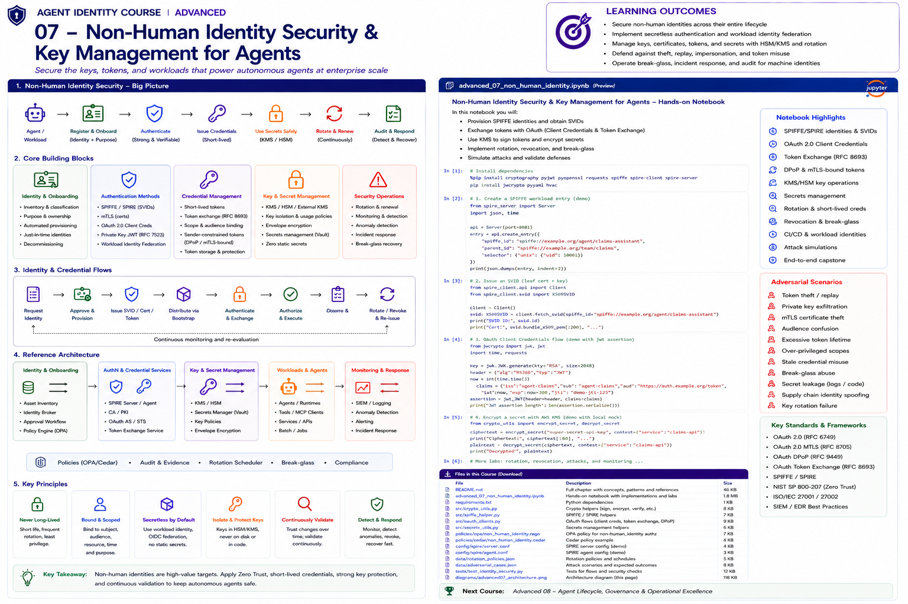

# Advanced 07 — Non-Human Identity Security & Key Management for Agents



> **Goal:** secure the operational identity substrate underneath autonomous agents: workload identity, machine credentials, keys, certificates, tokens, secretless federation, rotation, isolation, monitoring, and incident response.

Agent identity is not secure because an agent has a unique ID.

The actual attack surface includes:

```text
agent identity record
      ↓
runtime / workload
      ↓
bootstrap identity
      ↓
private key / certificate
      ↓
OAuth client / token
      ↓
cloud credential
      ↓
tool credential
      ↓
delegated credential
      ↓
CI/CD identity
```

A stolen credential can let an attacker bypass the semantic sophistication of the agent entirely.

The core principle is:

> **For non-human identities, credential lifecycle and key custody are part of identity—not implementation details.**

---

# Learning outcomes

You will learn to:

- distinguish logical agent identity from workload, service, application, and credential identities;
- inventory and classify non-human identities;
- design secure onboarding and decommissioning;
- apply Zero Trust to machine identities;
- prefer short-lived credentials and federation over static secrets;
- use SPIFFE IDs and X.509/JWT SVIDs;
- understand SPIRE workload attestation and registration;
- design mTLS workload authentication;
- use OAuth 2.0 client credentials safely;
- use private-key JWT client authentication;
- understand mTLS- and DPoP-bound tokens;
- use OAuth Token Exchange;
- bind credentials to audience, purpose and resource;
- use KMS/HSM-backed signing;
- implement envelope encryption;
- separate keys by purpose;
- rotate certificates, keys, secrets and tokens;
- protect credentials from logs, prompts and source code;
- design CI/CD workload identity federation;
- reason about AWS IAM roles and IAM Roles Anywhere;
- build break-glass controls;
- detect credential theft and replay;
- respond to compromise;
- manage identity at fleet scale.

---

# 1. Non-human identity is broader than "service accounts"

A modern agent environment contains:

```text
agent identities
service accounts
workload identities
OAuth clients
cloud roles
API clients
CI/CD identities
MCP servers
tools
bots
jobs
containers
VMs
serverless functions
```

Treating all of these as generic service accounts hides important lifecycle and trust differences.

---

# 2. Logical agent vs runtime identity

Separate:

```text
Logical agent
"Claims Assistant"

Deployment
"claims-agent-v18"

Workload
pod/VM/process currently executing v18

Session
one execution context

Credential
certificate/token used right now
```

These identifiers should be related, not collapsed.

---

# 3. Identity inventory

You cannot secure identities you do not know exist.

Inventory fields should include:

```text
identity ID
type
owner
business purpose
environment
runtime
credential types
privileges
resources
creation time
last used
rotation policy
expiry
risk tier
dependencies
```

---

# 4. Ownership

Every NHI needs accountable ownership.

Bad:

```text
owner = "AI team"
```

Better:

```text
business owner
technical owner
security owner
service/application
repository
cost center
on-call
```

Orphaned identities are a major operational risk.

---

# 5. Lifecycle

Model:

```text
request
→ approve
→ provision
→ activate
→ use
→ monitor
→ rotate/change
→ suspend
→ revoke
→ decommission
```

Agent identity security is a lifecycle discipline.

---

# 6. Zero Trust for NHIs

NIST SP 800-207 emphasizes protecting resources rather than relying on network location.

For agents:

```text
authenticate workload
verify current credential
evaluate authorization
limit scope
continuously monitor
assume credentials can be stolen
```

Being "inside the cluster" is not identity.

---

# 7. Long-lived static secrets

Examples:

```text
API keys
cloud access keys
client secrets
database passwords
private keys copied into files
```

Risks:

```text
hard to rotate
easy to copy
often overprivileged
poor provenance
leak through code/logs
remain valid after theft
```

Prefer federation and short-lived credentials where possible.

---

# 8. Secretless does not mean keyless

"Secretless" usually means the application does not manage a long-lived shared secret.

It may still depend on:

```text
workload key
platform attestation
certificate
hardware key
federated assertion
```

The goal is to remove static bearer secrets from application custody.

---

# 9. Short-lived credentials

Short lifetime reduces the useful theft window.

But:

```text
short-lived + automatically renewable by attacker
```

may still be dangerous.

Secure the renewal/bootstrap mechanism too.

---

# 10. Bootstrap problem

Before a workload can obtain a short-lived credential:

```text
How does the identity system know which workload it is?
```

Bootstrap can use:

```text
cloud instance identity
Kubernetes service account
node attestation
TPM
X.509 certificate
OIDC workload token
platform metadata
```

Bootstrap is often the real root of trust.

---

# 11. SPIFFE

SPIFFE provides a standard for workload identity.

A SPIFFE ID looks like:

```text
spiffe://prod.example.com/agents/claims
```

The trust domain is:

```text
prod.example.com
```

The path identifies the workload according to local policy.

---

# 12. SVIDs

SPIFFE Verifiable Identity Documents bind a SPIFFE ID to cryptographic identity.

Common forms:

```text
X509-SVID
JWT-SVID
```

The SPIFFE Workload API can provide SVIDs and trust bundles to workloads.

---

# 13. X509-SVID

An X509-SVID supports:

```text
mTLS
workload authentication
short-lived certificate identity
```

The private key should not be exported or persisted unnecessarily.

---

# 14. JWT-SVID

JWT-SVIDs can be useful when X.509/mTLS is not suitable.

Important controls include:

```text
audience
expiry
issuer/trust domain
subject/SPIFFE ID
signature
```

A JWT-SVID is a bearer credential, so replay considerations matter.

---

# 15. SPIRE

SPIRE is a production implementation of SPIFFE.

Major concepts:

```text
SPIRE Server
SPIRE Agent
node attestation
workload attestation
registration entries
Workload API
federation
```

---

# 16. Workload attestation

SPIRE can identify workloads based on selectors tied to runtime properties.

Examples can include:

```text
Kubernetes namespace/service account
Unix UID
container metadata
cloud metadata
node identity
```

Policy maps selectors to SPIFFE IDs.

---

# 17. Registration

Conceptually:

```text
selectors
    ↓
registration entry
    ↓
SPIFFE ID
```

Avoid selectors that are easy for neighboring workloads to impersonate.

---

# 18. mTLS

Mutual TLS authenticates both peers at the transport layer.

For workloads:

```text
Agent A certificate → B verifies
Agent B certificate → A verifies
encrypted channel
```

Authorization still happens after authentication.

---

# 19. Certificate validation

Validate:

```text
trust chain
SAN / SPIFFE ID
validity
key usage
algorithm
trust domain
revocation/status where applicable
```

Do not authenticate workloads from certificate Common Name alone.

---

# 20. OAuth 2.0 Client Credentials

Client Credentials is used when a client acts on its own behalf.

Flow:

```text
client
  ↓ authenticate
authorization server
  ↓ access token
resource server
```

Avoid shared clients across unrelated agents.

---

# 21. Client secret authentication

A client secret is simple but creates a long-lived shared-secret problem.

If used:

```text
store in secret manager
never hard-code
rotate
scope client
monitor use
```

Prefer stronger alternatives where supported.

---

# 22. private_key_jwt

RFC 7523 allows JWT assertions for OAuth client authentication.

The client proves possession of a private key rather than sending a shared secret.

Protect:

```text
private key
jti/replay controls
audience
assertion lifetime
key rotation
```

---

# 23. mTLS client authentication

RFC 8705 defines OAuth mutual-TLS client authentication and certificate-bound access tokens.

This can reduce bearer-token theft value because the token is bound to certificate possession.

---

# 24. DPoP

RFC 9449 defines Demonstrating Proof of Possession.

DPoP binds a token to an asymmetric key and requires per-request proofs.

It can reduce token replay, but implementations must validate:

```text
signature
htu
htm
iat
jti
nonce where used
key binding
```

---

# 25. Sender-constrained tokens

Compare:

```text
Bearer token
stolen token → attacker may use it

Sender-constrained token
stolen token → attacker also needs bound key
```

Examples:

```text
mTLS certificate-bound tokens
DPoP-bound tokens
```

---

# 26. OAuth Token Exchange

RFC 8693 defines token exchange.

Useful agent scenario:

```text
agent workload credential
        ↓
token exchange
        ↓
short-lived token for claims API
```

This supports credential translation and delegation patterns, but exchange policy must prevent privilege escalation.

---

# 27. Audience restriction

A token for:

```text
claims-api
```

must not automatically work at:

```text
payments-api
```

Always validate audience.

---

# 28. Resource and scope restriction

Credential authority should be bounded:

```text
audience
resource
scope/action
tenant
purpose
time
```

Avoid "one token for every tool."

---

# 29. Credential fan-out

A dangerous agent pattern:

```text
one broad cloud credential
      ↓
every tool
```

Prefer:

```text
agent identity
  ↓ exchange
tool-specific credential A
tool-specific credential B
tool-specific credential C
```

---

# 30. Key purpose separation

Do not reuse one key for:

```text
TLS
token signing
document signing
encryption
delegation
```

Separate keys by purpose and lifecycle.

---

# 31. KMS

Cloud KMS services allow applications to perform cryptographic operations without exporting raw key material.

Typical pattern:

```text
agent/service
   ↓ authorized Sign request
KMS
   ↓ signature
```

Authorization to use the key becomes critical.

---

# 32. HSM

Hardware Security Modules provide stronger key isolation and specialized security properties.

Use cases can include:

```text
high-value signing
root/intermediate CA keys
regulated workloads
high-assurance cryptographic boundaries
```

HSM does not fix weak IAM around key use.

---

# 33. Envelope encryption

Pattern:

```text
KMS key
  ↓ wraps
data encryption key
  ↓ encrypts
secret/data
```

This avoids using a remote master key directly for every byte of data.

---

# 34. Secret managers

Secret managers help with:

```text
storage
access policy
versioning
rotation
audit
```

But storing a secret safely does not make a long-lived secret ideal.

Prefer eliminating secrets where possible.

---

# 35. Zero static secrets

Target architecture:

```text
runtime attestation
      ↓
workload identity
      ↓
federation / exchange
      ↓
short-lived scoped credential
```

rather than:

```text
.env
  ↓
permanent API key
```

---

# 36. Cloud workload identity federation

Cloud platforms can accept trusted external workload assertions and issue temporary cloud credentials.

This is powerful for:

```text
CI/CD
multicloud
on-prem
Kubernetes
external agents
```

Configure trust narrowly.

---

# 37. AWS IAM roles

AWS IAM roles provide temporary credentials rather than standard long-term credentials.

For workloads running in AWS, prefer roles/service identities appropriate to the compute platform rather than embedded access keys.

---

# 38. AWS IAM Roles Anywhere

IAM Roles Anywhere allows workloads outside AWS to use X.509 certificates from a trusted CA to obtain temporary IAM credentials.

Key concepts:

```text
trust anchor
profile
IAM role
X.509 workload certificate
temporary credentials
```

Trust policies and certificate issuance are security boundaries.

---

# 39. CI/CD identity

Build and deployment systems are powerful NHIs.

Prefer:

```text
GitHub/GitLab/etc. OIDC workload assertion
      ↓
cloud federation
      ↓
short-lived deployment credential
```

over repository-stored cloud keys.

---

# 40. Build identity vs runtime identity

Do not let:

```text
CI pipeline identity
```

silently become:

```text
production agent runtime identity
```

Separate deployment authority from runtime authority.

---

# 41. Credential storage

Never put credentials in:

```text
source code
Git history
container images
notebooks
prompt templates
LLM context
telemetry
exception messages
```

Use dedicated credential providers.

---

# 42. Agent prompts and secrets

An LLM should usually receive:

```text
tool name
allowed operation
result
```

not:

```text
API token
private key
database password
cloud secret
```

The tool execution layer should hold credentials outside model context.

---

# 43. Token logging

Redact:

```text
Authorization headers
cookies
JWTs
API keys
private-key material
signed assertions
refresh tokens
```

Be careful: observability pipelines often replicate logs into many systems.

---

# 44. Rotation

Rotate:

```text
keys
certificates
client secrets
API keys
trust bundles
credentials
```

Rotation must be automated and tested.

---

# 45. Rotation overlap

Safe rotation often requires:

```text
new credential valid
old credential temporarily valid
clients transition
old credential revoked
```

Too little overlap causes outages; too much overlap increases exposure.

---

# 46. Rotation failure

Test:

```text
new key unavailable
certificate not propagated
trust bundle stale
old credential revoked too early
clock skew
dependent service offline
```

Rotation is an availability event as well as security event.

---

# 47. Revocation

Revocation can target:

```text
key
certificate
token
client
workload registration
cloud role session
delegation
agent identity
```

Choose the smallest effective blast radius.

---

# 48. Token theft

Defenses:

```text
short lifetime
sender constraint
audience restriction
scope restriction
secure storage
TLS
replay detection
behavior monitoring
```

Assume tokens can leak.

---

# 49. Replay

A captured signed request or proof may be replayed.

Use:

```text
nonce
jti
timestamp
narrow validity
request binding
replay cache
```

where the protocol supports them.

---

# 50. Private key exfiltration

If raw private keys exist in application memory/files, compromise can become identity compromise.

Prefer:

```text
non-exportable keys
KMS/HSM
Workload API
sidecar signing
hardware-backed key
```

where appropriate.

---

# 51. Signing service

Pattern:

```text
agent requests "sign this approved payload"
        ↓
signing policy
        ↓
KMS/HSM-backed signer
        ↓
signature
```

Do not expose a generic "sign arbitrary bytes" capability to an LLM.

---

# 52. Key-use authorization

A KMS key needs authorization just like an API.

Policy should constrain:

```text
who may sign
which key
which environment
which purpose
which service
which context
```

---

# 53. Confused deputy

An agent may trick a privileged signing/tool service into acting for the wrong subject.

Bind:

```text
caller identity
requested operation
resource
tenant
delegation
audience
```

at the privileged service.

---

# 54. Credential substitution

Attack:

```text
agent expected credential A
attacker supplies valid credential B
```

Verify subject and context binding, not only cryptographic validity.

---

# 55. Break-glass

Emergency access should be:

```text
rare
time-limited
strongly approved
narrow
fully logged
automatically expired
reviewed afterward
```

Never create a permanent "emergency agent key."

---

# 56. Incident response

For NHI compromise:

```text
identify credential
contain
revoke
rotate
invalidate sessions
remove delegated authority
inspect use
restore workload identity
reissue
monitor
postmortem
```

Automation matters at fleet scale.

---

# 57. Blast radius

Ask:

```text
If this credential is stolen, what can it do?
For how long?
From where?
Against which resources?
Can it mint other credentials?
Can it delegate?
```

Design to minimize all answers.

---

# 58. Identity graph

At enterprise scale, model relationships:

```text
agent
→ workload
→ credential
→ role
→ permission
→ resource
→ secret
→ key
→ owner
→ repository
→ deployment
```

This enables impact analysis.

---

# 59. Dormant identities

Detect:

```text
unused service accounts
unused OAuth clients
stale API keys
expired workloads
abandoned agent registrations
```

Disable and remove them through controlled processes.

---

# 60. Overprivileged identities

Use actual usage evidence to find:

```text
permissions granted
-
permissions used
=
candidate reduction
```

Do not automatically remove privileges without accounting for rare legitimate operations.

---

# 61. Monitoring

Monitor:

```text
credential issuance
token exchange
key use
unusual source
unexpected audience
high token rate
failed authentication
cross-tenant attempts
new delegation
break-glass
rotation failure
```

---

# 62. Detection examples

Signals:

```text
same token from distant environments
DPoP replay
certificate from unexpected workload
KMS signing spike
agent requesting unrelated tool credentials
old key used after rotation
CI identity accessing runtime secrets
```

---

# 63. Fleet-scale management

Thousands of agents require automation for:

```text
inventory
ownership
issuance
rotation
expiry
revocation
policy
attestation
monitoring
recertification
```

Manual credential spreadsheets do not scale.

---

# 64. Production reference architecture

```text
                Identity Governance
         ┌─────────────────────────────┐
         │ inventory / owner / purpose │
         │ approval / risk / lifecycle │
         └──────────────┬──────────────┘
                        │
                        ▼
              Workload Identity Plane
        ┌──────────────────────────────┐
        │ SPIFFE / SPIRE / Cloud OIDC  │
        │ node + workload attestation  │
        └──────────────┬───────────────┘
                       │
              short-lived identity
                       │
                       ▼
              Credential Broker / STS
        ┌──────────────────────────────┐
        │ OAuth AS / Token Exchange    │
        │ AWS STS / Roles Anywhere     │
        │ tool-specific credentials    │
        └──────────────┬───────────────┘
                       │
                       ▼
              Key & Secret Boundary
        ┌──────────────────────────────┐
        │ KMS / HSM / Secret Manager   │
        │ signing / encryption         │
        └──────────────┬───────────────┘
                       │
                       ▼
                 Agent Runtime
        ┌──────────────────────────────┐
        │ model has NO raw credentials │
        │ tool gateway / PEP           │
        └──────────────┬───────────────┘
                       │
                       ▼
              APIs / MCP / Cloud / Data

All layers → audit / detection / incident response
```

---

# 65. Production checklist

Before deploying an agent identity:

```text
Is the identity inventoried?
Does it have named owners?
Is purpose explicit?
Can static credentials be eliminated?
Is bootstrap trustworthy?
Are credentials short-lived?
Are audiences/resources/scopes narrow?
Are sender-constrained tokens appropriate?
Are keys separated by purpose?
Can keys be non-exportable?
Are KMS/HSM permissions narrow?
Are credentials excluded from model context?
Are logs redacted?
Is rotation automated?
Has rotation failure been tested?
Can credentials be revoked quickly?
Is break-glass controlled?
Can token/key theft be detected?
Can compromise blast radius be calculated?
Is decommissioning automated?
```

---

# Practical notebook

The notebook covers:

1. NHI inventory;
2. logical agent/workload/credential separation;
3. ownership;
4. risk classification;
5. static-secret anti-pattern;
6. short-lived credential model;
7. bootstrap trust;
8. SPIFFE IDs;
9. X509-SVID concepts;
10. JWT-SVID audience;
11. workload selectors;
12. mTLS identity;
13. OAuth Client Credentials;
14. private-key JWT;
15. bearer-token theft;
16. sender-constrained token concepts;
17. DPoP proof validation;
18. token exchange;
19. audience/resource/scope restriction;
20. tool-specific credential fan-out;
21. key-purpose separation;
22. KMS-style signing;
23. envelope encryption;
24. secret manager boundary;
25. AWS role/STS model;
26. IAM Roles Anywhere model;
27. CI/CD OIDC federation;
28. build/runtime separation;
29. prompt secret isolation;
30. log redaction;
31. rotation;
32. rotation failure;
33. revocation;
34. replay detection;
35. private-key exfiltration;
36. signing-service policy;
37. break-glass;
38. incident response;
39. identity graph;
40. dormant identities;
41. overprivilege analysis;
42. detection rules;
43. adversarial matrix;
44. end-to-end compromised-agent capstone.

---

# References

- NIST — Accelerating Adoption of Software and AI Agent Identity and Authorization (2026 concept paper)  
  https://csrc.nist.gov/pubs/other/2026/02/05/accelerating-the-adoption-of-software-and-ai-agent/ipd
- NIST SP 800-207 — Zero Trust Architecture  
  https://csrc.nist.gov/pubs/sp/800/207/final
- SPIFFE  
  https://spiffe.io/
- SPIRE  
  https://spiffe.io/docs/latest/spire-about/
- SPIFFE Workload API / SVIDs  
  https://spiffe.io/docs/latest/deploying/svids/
- OAuth 2.0 — RFC 6749  
  https://www.rfc-editor.org/rfc/rfc6749
- JWT Profile for OAuth Client Authentication — RFC 7523  
  https://www.rfc-editor.org/rfc/rfc7523
- OAuth Mutual TLS — RFC 8705  
  https://www.rfc-editor.org/rfc/rfc8705
- OAuth Token Exchange — RFC 8693  
  https://www.rfc-editor.org/rfc/rfc8693
- DPoP — RFC 9449  
  https://www.rfc-editor.org/rfc/rfc9449
- AWS IAM Roles Anywhere  
  https://docs.aws.amazon.com/rolesanywhere/latest/userguide/introduction.html
- AWS IAM Roles  
  https://docs.aws.amazon.com/IAM/latest/UserGuide/id_roles.html

---

# Next course

## Advanced 08 — Agent Identity Lifecycle, Governance & Operational Excellence

The next module ties the identity stack together operationally: agent onboarding, identity inventory, ownership, approval, segregation of duties, risk tiering, recertification, lifecycle events, policy governance, identity observability, evidence, incident response, metrics, identity posture management, third-party agents, supply-chain identity, exceptions, and enterprise-scale operating models.
