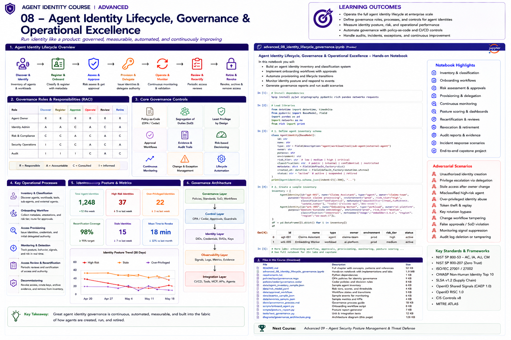

# Advanced 08 — Agent Identity Lifecycle, Governance & Operational Excellence



> **Goal:** operate agent identity as an enterprise product: inventoried, owned, risk-tiered, approved, continuously monitored, periodically recertified, rapidly revocable, auditable, measurable, and automated.

The earlier courses established how agents can be identified, authenticated, authorized, delegated authority, federated, continuously re-evaluated, and protected cryptographically.

Production organizations now face a different problem:

```text
Who is allowed to create an agent identity?
Who owns it?
Why does it exist?
What may it access?
Who approved that authority?
How does authority change?
How do we detect drift?
Who recertifies it?
What happens when its owner leaves?
How quickly can it be revoked?
Can an auditor reconstruct the lifecycle?
```

Agent identity governance is the control system around the identity technology.

The central principle is:

> **An identity that cannot be inventoried, owned, reviewed, changed, revoked, and evidenced is not enterprise-ready.**

---

# Learning outcomes

By the end you should be able to:

- design an enterprise agent identity inventory;
- classify agents, workloads, tools, sub-agents, and external agents;
- establish accountable ownership;
- risk-tier identities and authority;
- design registration and onboarding;
- implement approval workflows;
- enforce segregation of duties;
- provision identity and authority through policy;
- govern delegation;
- detect privilege and identity drift;
- measure identity security posture;
- recertify access and authority;
- manage change and exceptions;
- automate retirement and revocation;
- govern third-party agents;
- reason about agent identity supply chains;
- build audit evidence;
- define identity KPIs/KRIs;
- connect identity governance to CI/CD;
- implement policy-as-code;
- run identity incident response;
- design an enterprise operating model.

---

# 1. Why lifecycle governance matters

Agents are dynamic software principals.

They can be:

```text
created quickly
copied
redeployed
upgraded
given new tools
delegated authority
connected to new data
run unattended
retired without cleanup
```

This makes identity lifecycle governance as important as authentication technology.

---

# 2. Identity lifecycle

A useful enterprise lifecycle:

```text
DISCOVER
   ↓
REGISTER
   ↓
CLASSIFY
   ↓
ASSESS
   ↓
APPROVE
   ↓
PROVISION
   ↓
OPERATE
   ↓
MONITOR
   ↓
REVIEW
   ↓
CHANGE
   ↓
RECERTIFY
   ↓
RETIRE
   ↓
REVOKE
   ↓
ARCHIVE EVIDENCE
```

The lifecycle should be automated wherever possible.

---

# 3. Discovery

Find identities before formal registration.

Sources:

```text
cloud IAM
Kubernetes
SPIFFE/SPIRE
OAuth clients
API gateways
MCP registries
agent platforms
CI/CD
source repositories
service catalogs
secret managers
KMS
runtime telemetry
```

Discovery identifies unmanaged identities.

---

# 4. Agent identity inventory

An inventory should not be a flat list of names.

Minimum metadata:

```text
identity_id
identity_type
agent_name
business purpose
business owner
technical owner
environment
risk tier
autonomy level
data classification
tools
resources
credentials
delegations
deployment
repository
model/provider
created_at
last_seen
last_reviewed
status
```

---

# 5. Identity taxonomy

Classify separately:

```text
logical agent
agent deployment
workload
sub-agent
tool/service
MCP server
OAuth client
cloud role
external agent
CI/CD principal
human sponsor
```

A single business agent may map to several technical identities.

---

# 6. Agent card / system card

Identity governance should connect identity to system context.

An agent card can include:

```text
purpose
owner
autonomy
allowed actions
prohibited actions
data access
tools
delegation rules
identity mechanisms
risk tier
evaluation evidence
approval status
```

The identity inventory can link to—not duplicate—the system card.

---

# 7. Ownership

Every production agent needs accountable ownership.

Recommended roles:

```text
business owner
technical owner
identity owner/admin
risk/compliance reviewer
security operations
audit
```

Avoid generic ownership such as:

```text
AI Team
Platform
Engineering
```

unless there is a named accountable role behind it.

---

# 8. RACI

Example:

| Activity | Agent Owner | Identity Admin | Risk | SecOps | Audit |
|---|---|---|---|---|---|
| Register | R | A | C | I | I |
| Risk classify | R | C | A | C | I |
| Approve high risk | C | C | A | C | I |
| Provision | I | A/R | C | I | I |
| Monitor | C | C | C | A/R | I |
| Recertify | R | C | A | C | I |
| Revoke | C | A/R | C | A/R | I |
| Audit | I | I | C | C | A/R |

Exact roles vary by organization.

---

# 9. Risk tiering

Risk should depend on more than model capability.

Consider:

```text
autonomy
financial impact
data sensitivity
external connectivity
write authority
delegation ability
tool criticality
human oversight
identity assurance
credential exposure
blast radius
regulatory context
```

---

# 10. Example risk tiers

```text
LOW
read-only internal assistant

MEDIUM
agent calls internal APIs

HIGH
agent performs writes or handles restricted data

CRITICAL
agent moves money, deploys production code,
changes identity policy, or can create/delegate authority
```

Risk tier drives governance intensity.

---

# 11. Registration

Registration creates the governed identity record before authority is issued.

Require:

```text
purpose
owner
environment
risk tier
expected runtime
identity mechanism
requested resources
requested actions
delegation requirements
expiry/review date
```

No production authority before registration.

---

# 12. Onboarding workflow

```text
Developer / Agent Owner
        ↓
Registration request
        ↓
Schema validation
        ↓
Ownership verification
        ↓
Risk assessment
        ↓
Policy checks
        ↓
Security/evaluation evidence
        ↓
Approvals
        ↓
Identity provisioning
        ↓
Credential/bootstrap setup
        ↓
Authority provisioning
        ↓
Monitoring enrollment
        ↓
ACTIVE
```

---

# 13. Approval policy

Approval should be proportional.

Example:

```text
LOW      → owner + automated checks
MEDIUM   → owner + platform
HIGH     → owner + security/risk
CRITICAL → owner + security + risk + business authority
```

Do not create a committee for every low-risk identity.

---

# 14. Segregation of duties

Prevent one actor from:

```text
requesting
approving
provisioning
and auditing
```

the same high-risk identity.

SoD is especially important for:

```text
identity administration
policy changes
delegation
production access
break-glass
credential issuance
```

---

# 15. Policy-as-code

Governance rules should be executable.

Example:

```text
IF risk = critical
THEN
  require security approval
  require business approval
  prohibit self-approval
  require evaluation evidence
  require short-lived credentials
  require recertification <= 30 days
```

Policy-as-code makes controls testable.

---

# 16. CI/CD governance

Identity policy can become a deployment gate.

```text
pull request
    ↓
agent manifest
    ↓
schema validation
    ↓
policy tests
    ↓
risk checks
    ↓
approval evidence
    ↓
deployment
```

Do not let CI/CD bypass identity onboarding.

---

# 17. Identity manifest

Treat agent identity requirements as version-controlled configuration.

Example:

```yaml
agent:
  id: claims-assistant
  owner: claims-ai
  risk: high
  environment: prod

identity:
  workload: spiffe
  static_secrets: false

authority:
  resources:
    - claims
  actions:
    - read
    - update
  delegation: false

review:
  interval_days: 60
```

---

# 18. Provisioning

Provision:

```text
logical identity
workload identity
OAuth client if needed
cloud role
policy relationships
tool permissions
credential broker mapping
monitoring rules
```

Provision from approved metadata—not ad hoc tickets.

---

# 19. Least privilege by design

Start from:

```text
purpose
→ required tasks
→ required actions
→ required resources
→ required credentials
```

not:

```text
copy permissions from another agent
```

---

# 20. Delegation governance

Delegation requires governance because an agent may create effective authority dynamically.

Control:

```text
who may delegate
to whom
which resources
which actions
maximum depth
maximum duration
whether re-delegation is allowed
approval thresholds
audit requirements
```

---

# 21. Sub-agent creation

If an agent creates a sub-agent:

```text
parent identity
      ↓
sub-agent registration
      ↓
derived ownership
      ↓
attenuated authority
      ↓
bounded lifetime
      ↓
monitoring
```

Never treat generated sub-agents as invisible implementation details.

---

# 22. Runtime identity binding

Governance records must connect to runtime evidence.

```text
agent record
   ↓
deployment
   ↓
workload identity
   ↓
credential
   ↓
session
```

Otherwise an inventory can claim one thing while production runs another.

---

# 23. Continuous monitoring

Monitor changes to:

```text
owner
deployment
credential
tool set
permissions
delegations
risk tier
model
data access
trust relationships
runtime behavior
```

Identity governance is not a quarterly spreadsheet exercise.

---

# 24. Identity drift

Drift occurs when production identity differs from approved state.

Examples:

```text
new tool added
new cloud role attached
scope widened
static secret introduced
new delegation allowed
owner missing
review overdue
external endpoint added
```

Detect approved-vs-observed differences.

---

# 25. Privilege drift

Compare:

```text
approved permissions
vs
provisioned permissions
vs
observed permissions used
```

All three views matter.

---

# 26. Identity posture

A posture score can summarize operational risk but should remain decomposable.

Dimensions:

```text
ownership
credential hygiene
least privilege
review freshness
policy compliance
runtime binding
monitoring coverage
delegation risk
incident history
external dependencies
```

Never hide critical failures behind a high average score.

---

# 27. Example posture controls

```text
Owner assigned?                 PASS
Static credentials?             FAIL
Review current?                 PASS
Least privilege?                WARN
Monitoring enrolled?            PASS
Delegation bounded?             PASS
Runtime binding verified?       PASS
Critical policy violation?      FAIL
```

A critical failure can override the aggregate score.

---

# 28. Recertification

Recertification asks:

```text
Should this identity still exist?
Does the owner still own it?
Is the purpose still valid?
Are permissions still needed?
Are delegations still justified?
Is the risk tier still correct?
Is the credential mechanism still acceptable?
```

It is not merely clicking "approve all."

---

# 29. Risk-based review cadence

Example:

```text
LOW       180 days
MEDIUM     90 days
HIGH       60 days
CRITICAL   30 days
```

Actual intervals should reflect organizational/regulatory requirements.

---

# 30. Event-driven review

Do not wait for the next scheduled review after:

```text
owner leaves
agent changes purpose
new critical tool added
risk tier increases
identity mechanism changes
credential compromise
new third-party dependency
major model/runtime change
```

Trigger review immediately.

---

# 31. Change management

Identity-affecting changes should produce:

```text
change request
impact analysis
policy evaluation
approval if required
controlled rollout
post-change validation
updated evidence
```

---

# 32. Material change

Define which changes require reapproval.

Examples:

```text
new write permission
new external organization
new delegation capability
new sensitive dataset
new production environment
new identity provider
new trust domain
new credential type
```

---

# 33. Exceptions

Sometimes policy cannot be met immediately.

An exception should include:

```text
control violated
business justification
risk
compensating controls
owner
approver
start date
expiry
remediation plan
```

Never allow permanent undocumented exceptions.

---

# 34. Exception expiry

Every exception needs:

```text
expires_at
```

and automated escalation before expiry.

Expired exception:

```text
remediate
renew through approval
or disable affected authority
```

---

# 35. Decommissioning

When an agent retires:

```text
disable agent identity
revoke workload registrations
revoke OAuth clients
remove cloud roles
revoke delegations
remove tool permissions
revoke credentials
remove trust relationships
archive evidence
mark inventory retired
```

Deleting the application is not enough.

---

# 36. Owner departure

An owner leaving should trigger:

```text
ownership transfer
access review
agent review
delegation review
credential review
```

Orphaned high-risk agents should not remain active indefinitely.

---

# 37. Third-party agents

For external agents record:

```text
provider
contract owner
external identifier
trust framework
authentication method
credentials/attestations
approved capabilities
data boundaries
incident contact
termination mechanism
```

---

# 38. Agent identity supply chain

Identity depends on upstream components:

```text
agent code
model/provider
agent SDK
container
CI/CD
cloud workload
identity provider
certificate authority
credential broker
MCP server
tool
external agent
```

A compromise upstream can change identity assurance downstream.

---

# 39. Software supply-chain identity

Connect agent deployment to provenance:

```text
source commit
build identity
artifact digest
signature
attestation
deployment identity
runtime workload
```

This helps answer:

> Is the workload presenting this identity actually the approved software?

---

# 40. SLSA

SLSA provides a framework for software supply-chain integrity.

For agent identity governance, provenance can complement runtime identity:

```text
approved source
      ↓
trusted build
      ↓
signed artifact
      ↓
verified deployment
      ↓
attested workload identity
```

---

# 41. Trust-domain governance

SPIFFE federation enables identities across trust domains to authenticate when bundles are exchanged.

But federation relationships themselves have lifecycle:

```text
establish
maintain
rotate trust material
review
terminate
```

SPIFFE explicitly describes federation relationship lifecycle.

---

# 42. External trust review

Periodically review:

```text
foreign trust domains
federation bundles
trusted issuers
trusted CAs
OIDC providers
credential issuers
partner organizations
```

Trust should not become permanent by accident.

---

# 43. Continuous security signals

Identity events can trigger governance actions.

Examples:

```text
credential compromised
assurance reduced
session revoked
device/workload posture changed
risk increased
```

OpenID Shared Signals Framework and CAEP provide standardized foundations for event sharing in identity ecosystems.

---

# 44. Identity observability

Capture:

```text
identity
authentication
authorization
delegation
credential issuance
token exchange
policy decision
tool invocation
risk signal
revocation
administrative change
```

Correlate through stable trace/event identifiers.

---

# 45. Evidence

Governance evidence includes:

```text
registration
risk assessment
approvals
policy version
test results
provisioning result
runtime identity
access reviews
recertification
exceptions
incidents
revocation
retirement
```

Evidence should be machine-queryable where practical.

---

# 46. Non-repudiation and accountability

NIST's 2026 agent identity concept paper explicitly calls attention to identification, authorization, auditing and non-repudiation for agents.

For enterprise accountability, preserve:

```text
who/what acted
under which identity
using which authority
for which principal
under which policy
with which evidence
at what time
```

---

# 47. Audit reconstruction

An auditor should be able to reconstruct:

```text
Why did agent X exist?
Who approved it?
What identity did runtime Y present?
What authority existed at time T?
Which policy version applied?
Who changed authority?
What delegation chain existed?
Was the action allowed?
What happened afterward?
```

---

# 48. Tamper-resistant evidence

Protect audit evidence using controls such as:

```text
append-only storage
restricted writers
retention policy
hashing/signatures
separate security account
immutable object storage
time synchronization
```

Do not let the agent freely edit its own audit trail.

---

# 49. Identity incident response

Incident categories:

```text
credential theft
key compromise
unauthorized identity creation
privilege escalation
delegation abuse
federation compromise
owner compromise
policy tampering
audit suppression
```

Each needs a playbook.

---

# 50. Quarantine

Quarantine may:

```text
block new sessions
revoke credentials
disable delegation
remove write tools
preserve forensic state
continue read-only diagnostics
```

Quarantine should be a defined lifecycle state.

---

# 51. Identity states

Useful states:

```text
DRAFT
PENDING_APPROVAL
APPROVED
ACTIVE
SUSPENDED
QUARANTINED
EXPIRED
RETIRED
REVOKED
```

Transitions should be controlled.

---

# 52. State-machine enforcement

Do not allow:

```text
DRAFT → ACTIVE
```

without approval/provisioning.

Do not allow:

```text
REVOKED → ACTIVE
```

without a defined recovery/re-onboarding process.

---

# 53. KPIs and KRIs

Useful metrics:

```text
total agent identities
unowned identities
high-risk identities
static credentials
overprivileged identities
stale identities
review coverage
overdue reviews
mean time to revoke
credential lifetime
policy violations
exception count
mean exception age
unmanaged external identities
```

---

# 54. Coverage metrics

Examples:

```text
% with named owner
% using short-lived credentials
% under policy-as-code
% with runtime identity binding
% with monitoring
% reviewed on time
% with tested revocation
```

Coverage is often more actionable than a single posture score.

---

# 55. Mean Time to Revoke

Measure:

```text
compromise detection
        ↓
effective inability to act
```

not merely:

```text
ticket closed
```

For autonomous agents, revocation speed matters.

---

# 56. Identity debt

Identity debt includes:

```text
legacy static keys
shared clients
manual provisioning
unknown owners
missing reviews
overbroad roles
unmanaged delegations
stale federation
```

Track and burn down identity debt deliberately.

---

# 57. Governance dashboards

A useful dashboard answers:

```text
What is risky now?
What changed?
What is overdue?
What is unmanaged?
Which controls are failing?
Which teams own the problems?
Is posture improving?
```

Avoid vanity dashboards with only total identity counts.

---

# 58. Control plane architecture

```text
                   Governance Layer
        ┌──────────────────────────────┐
        │ standards / policy / RACI    │
        │ risk / approval / exceptions │
        └──────────────┬───────────────┘
                       │
                       ▼
                  Control Layer
        ┌──────────────────────────────┐
        │ OPA / Cedar / workflow       │
        │ provisioning / recertification│
        └──────────────┬───────────────┘
                       │
                       ▼
                  Identity Layer
        ┌──────────────────────────────┐
        │ IdP / SPIFFE / OAuth / PKI   │
        │ credentials / delegation     │
        └──────────────┬───────────────┘
                       │
                       ▼
                Agent Runtime Layer
        ┌──────────────────────────────┐
        │ agents / sub-agents / tools  │
        │ MCP / APIs / cloud services  │
        └──────────────┬───────────────┘
                       │
                       ▼
               Observability Layer
        ┌──────────────────────────────┐
        │ events / traces / evidence   │
        │ posture / detection / audit  │
        └──────────────┬───────────────┘
                       │
                       └──── feedback ────► Governance
```

---

# 59. Operating model

Governance should define:

```text
standards
roles
decision rights
processes
control owners
technology owners
exceptions
metrics
escalation
audit
continuous improvement
```

Technology alone is not an operating model.

---

# 60. Centralized vs federated governance

Large enterprises may use:

```text
central standards
+
federated execution
```

Example:

```text
central identity governance team
  defines minimum controls

business/platform teams
  own agent lifecycle

security
  monitors and responds

risk/compliance
  define high-risk approvals

audit
  independently tests evidence
```

---

# 61. Governance automation

Automate:

```text
discovery
schema validation
risk calculation
approval routing
provisioning
policy checks
review reminders
exception expiry
revocation
posture calculation
evidence collection
reporting
```

Humans should focus on judgment, not copying metadata between systems.

---

# 62. Governance-as-code

Store:

```text
identity manifests
policies
risk rules
approval requirements
review cadence
exceptions
control tests
```

in version-controlled, testable forms where appropriate.

---

# 63. Testing governance

Test controls like software.

Examples:

```text
critical agent cannot self-approve
unknown owner rejected
static prod secret rejected
expired exception rejected
delegation cannot exceed parent
revoked identity cannot execute
review overdue creates finding
```

---

# 64. Continuous improvement

Use incidents, audit findings, and posture metrics to update:

```text
policies
controls
training
tooling
risk models
approval thresholds
monitoring
```

Governance is a feedback system.

---

# 65. Enterprise checklist

Before declaring an agent identity production-ready:

```text
Discovered/inventoried?
Identity taxonomy correct?
Named business + technical owners?
Purpose documented?
Risk tier approved?
Agent/system card linked?
Identity manifest versioned?
No forbidden static credentials?
Least privilege verified?
Delegation bounded?
SoD satisfied?
Required evaluations complete?
Policy checks passing?
Runtime identity bound?
Monitoring enrolled?
Audit evidence enabled?
Review cadence assigned?
Exception expiry defined?
Revocation tested?
Incident playbook exists?
Decommission process defined?
Third-party trust reviewed?
Supply-chain provenance available?
Metrics/reporting enabled?
```

---

# Practical notebook

The notebook implements:

1. inventory schema;
2. identity taxonomy;
3. ownership checks;
4. risk tiering;
5. lifecycle states;
6. state transitions;
7. registration;
8. onboarding;
9. approval routing;
10. segregation of duties;
11. identity manifests;
12. policy-as-code;
13. CI/CD gates;
14. provisioning;
15. least-privilege analysis;
16. delegation governance;
17. sub-agent registration;
18. runtime binding;
19. drift detection;
20. privilege drift;
21. posture scoring;
22. critical-control overrides;
23. scheduled recertification;
24. event-driven review;
25. change management;
26. material-change detection;
27. exceptions;
28. exception expiry;
29. owner departure;
30. decommissioning;
31. third-party agents;
32. supply-chain identity;
33. federation review;
34. identity events;
35. evidence generation;
36. audit reconstruction;
37. quarantine;
38. incident response;
39. identity KPIs/KRIs;
40. Mean Time to Revoke;
41. identity debt;
42. governance dashboard dataset;
43. governance control tests;
44. enterprise lifecycle capstone.

---

# State of the art and standards

## NIST software and AI agent identity

In February 2026, NIST NCCoE published the concept paper **Accelerating the Adoption of Software and Artificial Intelligence Agent Identity and Authorization**.

It focuses on applying identity standards and best practices to agentic architectures and explicitly highlights:

```text
identification
authentication
authorization
auditing
non-repudiation
prompt-injection-related controls
```

This is an important signal that agent identity is becoming a distinct enterprise security architecture concern.

## NIST SP 800-207

Zero Trust provides the architectural principle that trust should not be granted because an agent happens to run inside an enterprise network.

https://csrc.nist.gov/pubs/sp/800/207/final

## SPIFFE / SPIRE

SPIFFE provides workload identity standards across heterogeneous infrastructure.

SPIFFE Federation defines how trust bundles can be exchanged between independent trust domains and explicitly defines establishment, maintenance, and termination of federation relationships.

https://spiffe.io/

## OpenID Shared Signals / CAEP / RISC

The OpenID Foundation finalized Shared Signals Framework 1.0, CAEP 1.0 and RISC 1.0 in 2025.

These standards provide foundations for exchanging security events and continuously updating security state across identity systems.

https://openid.net/three-shared-signals-final-specifications-approved/

## SLSA

SLSA provides software supply-chain integrity guidance that can complement runtime agent identity.

https://slsa.dev/

## OWASP Non-Human Identities

OWASP's Non-Human Identities work is useful for understanding operational risks affecting service accounts, machine identities, API identities, workloads, and other non-human principals.

https://owasp.org/www-project-non-human-identities-top-10/

---

# References

- NIST NCCoE — Software and AI Agent Identity and Authorization  
  https://www.nccoe.nist.gov/projects/software-and-ai-agent-identity-and-authorization
- NIST — 2026 Agent Identity Concept Paper  
  https://csrc.nist.gov/pubs/other/2026/02/05/accelerating-the-adoption-of-software-and-ai-agent/ipd
- NIST SP 800-207 — Zero Trust Architecture  
  https://csrc.nist.gov/pubs/sp/800/207/final
- SPIFFE Standard  
  https://spiffe.io/docs/latest/spiffe-specs/
- SPIFFE Federation  
  https://spiffe.io/docs/latest/spiffe-specs/spiffe_federation/
- SPIFFE Workload API  
  https://spiffe.io/docs/latest/spiffe-specs/spiffe_workload_api/
- OpenID Shared Signals Final Specifications  
  https://openid.net/three-shared-signals-final-specifications-approved/
- SLSA  
  https://slsa.dev/
- OWASP Non-Human Identities Top 10  
  https://owasp.org/www-project-non-human-identities-top-10/

---

# Next course

## Advanced 09 — Agent Identity Security Posture Management & Threat Defense

The next module turns governance telemetry into an active security discipline: identity attack paths, entitlement graphs, posture management, privilege-risk analytics, identity threat detection and response, credential exposure discovery, anomalous delegation, attack-path simulation, graph-based blast-radius analysis, posture remediation, identity red teaming, detection engineering, and continuous identity threat defense for autonomous agents.
