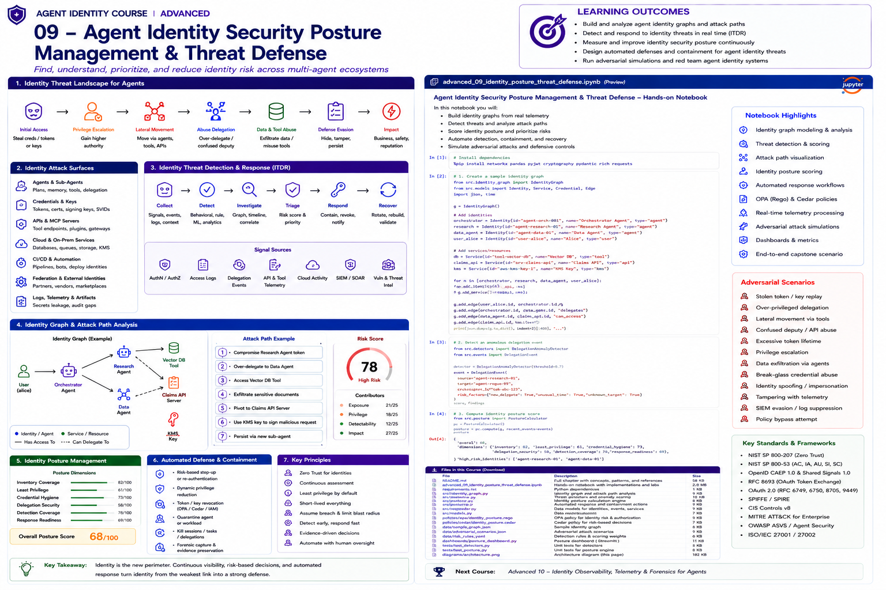

# Advanced 09 — Agent Identity Security Posture Management & Threat Defense



> **Goal:** turn agent identity from a static access-control configuration into a continuously observed, graph-analyzed, attack-tested and rapidly defensible security system.

Agent ecosystems create a new security graph:

```text
Human / Agent / Workload
        ↓
Credential / Delegation
        ↓
Agent / Sub-agent / Tool
        ↓
API / MCP / Cloud Role
        ↓
Data / KMS / Business Action
```

The key question is no longer only **"is this identity authenticated?"** It is also:

> **If this identity is compromised, where can the attacker go next—and how quickly can we detect and stop it?**

## Learning outcomes

You will learn to build identity graphs; discover attack paths and toxic privilege combinations; quantify blast radius; detect stolen credentials, anomalous delegation and lateral movement; design Identity Threat Detection and Response (ITDR); continuously score posture; map OWASP NHI risks into detections; use workload and federation telemetry; automate containment; run identity red-team exercises; and measure detection/response effectiveness.


# 1. From IAM to identity threat defense

Traditional IAM asks whether an identity may access a resource. Identity threat defense also asks whether the identity, credential, delegation path, runtime, and observed behavior still make sense **now**.

For agents this matters because identity is connected to tools, delegated authority, credentials, sub-agents, APIs, data stores, cloud roles, and external trust. A valid credential can therefore be part of an invalid attack path.


# 2. Threat model

Model the attacker across stages:

```text
initial access → credential theft → privilege escalation → delegation abuse
→ lateral movement → sensitive resource access → persistence → evasion → impact
```

The defender needs controls at every transition, not only at login.


# 3. Agent-specific identity attack surface

Inventory agents, sub-agents, workload identities, OAuth clients, API keys, certificates, SVIDs, cloud roles, tool gateways, MCP servers, CI/CD principals, federation relationships, external agents, policy engines, audit systems, and emergency identities.


# 4. Identity graph

Represent identity relationships as a graph. Nodes can be principals, credentials, services, tools, resources, policies, sessions and trust domains. Edges can represent `AUTHENTICATES_AS`, `HAS_ROLE`, `CAN_ACCESS`, `CAN_DELEGATE`, `CAN_MINT`, `TRUSTS`, `RUNS_AS`, and `OWNS`.

Graph analysis exposes risk hidden by flat IAM tables.


# 5. Attack paths

An attack path is a sequence of relationships that turns one compromise into a valuable outcome.

```text
stolen research-agent token
→ research agent
→ delegated data-agent
→ vector store
→ sensitive documents
```

The shortest path is not always the most likely path; weight edges by exploitability, privilege, detectability, and business impact.


# 6. Choke points

A choke point is a node or edge whose removal blocks many high-impact attack paths. Examples include a credential broker, broad cloud role, delegation gateway, shared OAuth client, signing key, or trust relationship. Prioritize remediation by **risk reduction per change**, not by finding count.


# 7. Blast radius

Blast radius asks what a compromised identity can ultimately influence. Include direct permissions, delegated permissions, credential-minting capability, transitive trust, tool calls, writable policy/configuration, and identities it can create.


# 8. Toxic combinations

Individually reasonable privileges may become dangerous in combination. Examples: `read secrets + deploy workload`, `create agent + delegate authority`, `write policy + approve policy`, or `invoke signer + control signed payload`. Detect combinations, not only single permissions.


# 9. Credential exposure

Search for credentials in repositories, build artifacts, environment variables, logs, traces, notebooks, prompts, ticket systems, container layers and secret stores with excessive readers. Detection should create a lifecycle response: validate → revoke → rotate → investigate use.


# 10. Secret leakage and OWASP NHI

OWASP's 2025 Non-Human Identities Top 10 explicitly includes secret leakage, long-lived secrets, overprivileged NHIs, insecure authentication, NHI reuse, environment isolation, third-party NHI risk and improper offboarding. Agent identity programs should map these risks into controls and detections.


# 11. Long-lived credential risk

Risk rises with credential lifetime because theft remains useful longer. Measure credential age, maximum lifetime, last rotation, ability to renew, audience, scope, sender constraint, and whether the credential can mint another credential.


# 12. Credential replay

Detect use of the same credential or proof from impossible or unusual contexts. For sender-constrained protocols, verify proof binding. For replay-sensitive assertions, track `jti`, nonce, time window, HTTP method/resource binding, or protocol-specific replay controls.


# 13. Credential stuffing does not map cleanly

Machine identity attacks differ from password attacks. The analogous problems are leaked API keys, copied client secrets, stolen tokens, cloned certificates, compromised signing keys, and abuse of federation/bootstrap trust. Detection engineering must reflect machine credential semantics.


# 14. Identity impersonation

A technically valid credential may represent the wrong expected principal. Validate issuer, subject, audience, trust domain, workload binding, deployment binding, tenant and intended use—not just signature validity.


# 15. Workload identity compromise

With SPIFFE/SPIRE or cloud workload identity, investigate the workload attestation boundary: which process/node obtained the identity, whether selectors changed, whether the workload endpoint was exposed, and whether a compromised workload can continuously renew credentials.


# 16. Federation risk

Federation expands authentication across administrative boundaries. Treat foreign trust domains, OIDC issuers, certificate authorities and partner identity systems as attack-surface nodes. Review trust establishment, bundle/key changes and termination.


# 17. Third-party NHI risk

External agents and SaaS integrations can bring their own credentials, lifecycle and incident-response constraints. Record provider, owner, trust mechanism, permissions, evidence, termination mechanism, and breach notification path.


# 18. Delegation abuse

Agent systems make delegation a first-class threat. Detect authority that becomes broader, longer-lived, deeper, re-delegatable, cross-tenant, cross-environment or unrelated to the parent task.


# 19. Delegation graph

Model delegation edges separately from static entitlement edges. Store parent, child, actions, resources, validity window, depth, redelegation flag, approver, purpose and trace ID. This enables both policy validation and forensic reconstruction.


# 20. Privilege escalation

Escalation can happen through IAM changes, token exchange, tool capabilities, sub-agent creation, policy modification, role assumption, signing services, CI/CD, or confused-deputy behavior. Detect **effective authority** changes, not only IAM role changes.


# 21. Lateral movement through tools

An agent can pivot without network-shell behavior: compromised agent → permitted tool → service identity → data store. Tool invocation therefore belongs in identity telemetry and attack-path analysis.


# 22. MCP and tool identity risk

For MCP/tool ecosystems, track which agent identity invoked which server/tool, under which user/delegated authority, which credential was used by the execution layer, and which resource was affected. Tool discovery should not imply tool authorization.


# 23. Confused deputy

A privileged tool or broker may perform an operation for an attacker-controlled agent. Bind caller identity, represented user/principal, delegation, target resource, action and policy decision at the privileged service.


# 24. Identity reuse

Shared service accounts, OAuth clients, API keys and generic agent identities destroy attribution and enlarge blast radius. Prefer per-workload/per-agent identities and narrowly scoped runtime credentials.


# 25. Human use of NHI

Humans impersonating production machine identities for debugging can defeat attribution and behavior baselines. Separate human emergency access from workload identity and make impersonation explicit, temporary and audited.


# 26. Environment isolation

Do not let development identities authenticate to production merely because naming looks similar. Use separate trust domains/accounts/projects, audiences, issuers, roles and policies where appropriate.


# 27. Persistence

Attackers may persist through new OAuth clients, API keys, certificates, sub-agents, federation relationships, policy changes, delegated grants, CI/CD secrets or modified workload registration. Hunt for identity creation after compromise.


# 28. Defense evasion

Identity attackers may suppress logs, disable monitoring, use trusted tools, rotate to another credential, reduce noisy activity or exploit shared identities. Treat telemetry health and audit configuration as security controls.


# 29. Identity telemetry model

Normalize events around: timestamp, principal, workload, credential fingerprint, represented subject, action, resource, decision, policy version, delegation chain, session/trace, source context, risk signals and result.


# 30. Signal sources

Useful sources include IdP/OAuth logs, SPIFFE/SPIRE telemetry, cloud IAM/STS, KMS, secret managers, API gateways, MCP/tool gateways, application authorization, Kubernetes audit, CI/CD, EDR, SIEM, policy engines and governance inventory.


# 31. ITDR loop

A practical identity threat detection and response loop is:

```text
collect → normalize → correlate → detect → investigate → prioritize
→ contain → revoke/rotate → recover → validate → learn
```

Automate deterministic containment but preserve human oversight for high-impact actions.


# 32. Behavioral detection

Baseline expected audiences, resources, tools, hours, environments, delegation patterns, token exchange rates, KMS use and action frequencies. Behavioral anomalies are signals—not proof—so combine them with entitlement and context.


# 33. Rule-based detection

Rules remain valuable for high-confidence invariants: revoked identity used, forbidden audience, stale key after rotation, self-approved privilege, delegation beyond parent, static prod credential, human use of workload identity, or monitoring disabled.


# 34. Graph-based detection

Graph queries can identify paths such as `external agent → can delegate → privileged agent → can access → restricted data` or principals that can both modify and approve identity policy. Recompute when entitlements or trust change.


# 35. Risk scoring

Score risk using exposure, privilege, credential weakness, delegation, external trust, exploitability, detectability and business impact. Keep component scores visible; do not let a single average hide a critical condition.


# 36. Posture management

Posture is the continuously evaluated security state of identities and their relationships. Dimensions can include inventory coverage, ownership, credential hygiene, least privilege, delegation security, trust hygiene, detection coverage, runtime binding, response readiness and audit integrity.


# 37. Critical overrides

Some conditions should override aggregate posture: known leaked active credential, revoked-but-active identity, unrestricted signing oracle, unaudited critical identity, compromised trust root, or active cross-tenant delegation violation.


# 38. Continuous exposure management

Prioritize exposures that create exploitable paths to high-value resources. The unit of work is not 'fix every finding'; it is 'remove the paths that matter most while preserving required business capability.'


# 39. Detection coverage

Map threat scenarios to telemetry and detections. A control is not operationally complete if the organization cannot tell whether it is being bypassed. Track scenarios with no signal source, no rule, no owner or no response playbook.


# 40. Shared Signals, CAEP and RISC

OpenID Shared Signals Framework, CAEP and RISC became Final Specifications in 2025. They provide standardized ways to exchange security events and changes in state. They are useful building blocks for continuous identity response, though agent-specific semantics may require additional event profiles.


# 41. Automated containment

Possible actions: deny token exchange, revoke token/client, quarantine workload, remove delegation, disable tool, block signing, force re-attestation, reduce to read-only, suspend federation or require human approval. Choose the smallest action that safely breaks the attack path.


# 42. Kill switches

A kill switch should be scoped, authenticated, tested and observable. Prefer multiple levels: revoke one credential, suspend one agent, remove one capability, quarantine a workload, or stop a trust relationship—rather than only an enterprise-wide off switch.


# 43. Recovery

Recovery requires more than issuing a new token. Re-establish trustworthy runtime state, rotate affected keys, remove persistence, re-attest workloads, re-evaluate delegation, validate policy, restore monitoring, and then selectively restore authority.


# 44. Forensics

Preserve identity timelines, policy decisions, credential issuance, token exchanges, delegation chains, tool calls, KMS operations, administrative changes, workload evidence and audit integrity. Stable correlation IDs make cross-system reconstruction feasible.


# 45. Red teaming agent identity

Test identity boundaries deliberately: steal a simulated token, replay it, request a broader exchanged token, create an excessive delegation, pivot through a tool, abuse a signer, impersonate a workload, alter trust, suppress telemetry, and attempt persistence.


# 46. Purple-team loop

For every attack simulation record: preconditions, technique, expected signal, actual signal, prevention result, detection latency, response latency, residual path and remediation. Feed findings back into policy and course exercises.


# 47. Detection-as-code

Version rules, graph queries, thresholds and test fixtures. Unit-test both positive and negative cases so a detection does not silently disappear during schema or telemetry changes.


# 48. Response-as-code

Encode safe response workflows with approvals and guardrails. Example: `high-confidence leaked token → revoke automatically`; `suspected production workload compromise → quarantine + page owner`; `critical trust-domain compromise → security approval for federation suspension`.


# 49. Metrics

Track exposed credentials, long-lived credentials, attack paths to crown jewels, toxic combinations, high-risk delegations, detection coverage, mean time to detect, mean time to contain, mean time to revoke, stale identities, critical posture failures and recurrence.


# 50. Reference architecture

```text
Identity / Credential / Tool / Cloud / Policy Telemetry
                       ↓
               Normalize + Correlate
                       ↓
                  Identity Graph
                 ↙             ↘
          Posture Engine      Detection Engine
                 ↘             ↙
                 Risk Prioritizer
                       ↓
             Response Orchestrator
        revoke | quarantine | reduce | rotate
                       ↓
                 Evidence Store
                       ↓
          Governance + Continuous Improvement
```


# 51. Production principles

1. Identity is the new perimeter only if identity relationships are visible.  
2. Assume credentials can be stolen.  
3. Minimize privilege and credential lifetime.  
4. Model delegation explicitly.  
5. Detect attack paths, not only bad events.  
6. Correlate identity with runtime and tool activity.  
7. Make response fast and scoped.  
8. Preserve evidence.  
9. Continuously test defenses.  
10. Automate with human oversight.


# 52. Enterprise checklist

Before production, confirm identity graph coverage, crown-jewel tagging, credential inventory, delegation visibility, external trust inventory, high-confidence detections, replay controls, posture thresholds, response playbooks, revocation tests, telemetry-health alerts, forensic retention, red-team scenarios, owners and measurable SLAs.

# State of the art and standards

## NIST: software and AI agent identity

NIST NCCoE's February 2026 concept paper on software and AI agent identity focuses on applying identity standards and best practices to agentic AI, with explicit attention to identification, authorization, auditing, non-repudiation and prompt-injection-related controls.

https://csrc.nist.gov/pubs/other/2026/02/05/accelerating-the-adoption-of-software-and-ai-agent/ipd

## OWASP Non-Human Identities Top 10 — 2025

The OWASP NHI Top 10 provides a useful threat taxonomy for machine identities: improper offboarding, secret leakage, vulnerable third-party NHI, insecure authentication, overprivilege, insecure cloud deployment, long-lived secrets, environment isolation, NHI reuse and human use of NHI.

https://owasp.org/www-project-non-human-identities-top-10/2025/top-10-2025/

## SPIFFE

SPIFFE provides workload identity standards for heterogeneous infrastructure. Its current standard family includes SPIFFE IDs, X.509-SVID, JWT-SVID, WIT-SVID, Workload API, Broker API and Federation.

https://spiffe.io/docs/latest/spiffe-specs/

## OpenID Shared Signals

Shared Signals Framework 1.0, CAEP 1.0 and RISC 1.0 were approved as OpenID Final Specifications in September 2025. They are relevant to continuous security-event exchange and near-real-time identity response.

https://openid.net/three-shared-signals-final-specifications-approved/

## Additional frameworks to map into the program

- NIST SP 800-207 — Zero Trust Architecture
- MITRE ATT&CK — enterprise adversary behaviors and detection thinking
- MITRE ATLAS — AI-system threat knowledge base
- CIS Controls — operational defensive controls
- SLSA — software supply-chain provenance
- OAuth 2.0 / Token Exchange / mTLS / DPoP — credential and sender-constraint foundations
- OPA and Cedar — policy-as-code examples used throughout the curriculum

# Practical notebook

The accompanying notebook implements identity-graph modeling, graph queries, attack-path enumeration, blast-radius analysis, toxic combinations, credential-risk scoring, delegation analysis, anomalous events, posture scoring, critical overrides, detection-as-code, automated containment, telemetry-health checks, forensic timelines, red-team simulations, coverage matrices, metrics and an end-to-end attack/defense capstone.

# Next course

## Advanced 10 — Identity Observability, Telemetry & Forensics for Agents

The next module will go deeper into OpenTelemetry-style identity correlation, authorization decision telemetry, agent/tool traces, credential and delegation events, security event schemas, CAEP/SSF integration patterns, evidence pipelines, tamper resistance, forensic reconstruction, SIEM integration, detection engineering and audit-ready identity observability.
