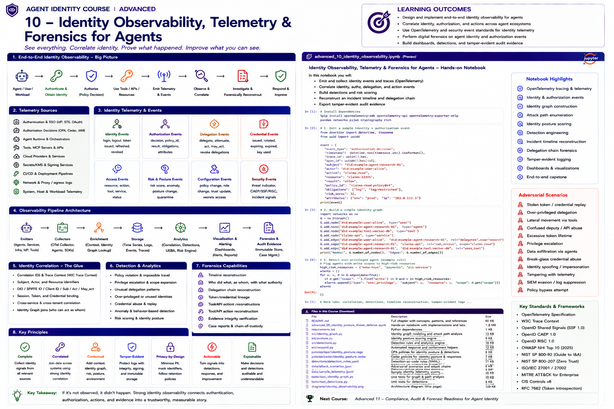

# Advanced 10 — Identity Observability, Telemetry & Forensics for Agents



> **Goal:** make an agent's identity, authority, delegation, credentials, tool use, policy decisions and runtime actions reconstructable from trustworthy telemetry.

An agent incident often crosses many systems:

```text
Human
  ↓
Agent Session
  ↓
Workload Identity
  ↓
OAuth / SVID / Cloud Credential
  ↓
Delegation
  ↓
Authorization Decision
  ↓
Tool / MCP Server
  ↓
Downstream API
  ↓
Business Resource
```

Each component may emit logs, traces and events independently.

The observability problem is therefore not:

> "Do we have logs?"

It is:

> **Can we prove which identity acted, for whom, with which authority, under which policy, through which agent/tool chain, and what happened as a result?**

---

# Learning outcomes

You will learn to:

- design an identity observability architecture for agents;
- distinguish logs, metrics, traces, events and evidence;
- use OpenTelemetry concepts for agent/tool traces;
- correlate human, agent, workload and service identities;
- model authentication, authorization, delegation and credential events;
- instrument policy decisions;
- propagate trace and identity context safely;
- integrate tool/MCP activity with identity telemetry;
- use SSF/CAEP/RISC-style security signals;
- build detection-ready normalized schemas;
- preserve privacy while retaining security value;
- create tamper-evident evidence;
- reconstruct incidents and delegation chains;
- verify evidence integrity;
- measure observability coverage;
- build SIEM/SOC integration patterns;
- create forensic timelines and case bundles.

---

# 1. Observability is not logging

Logging records messages.

Identity observability builds a connected model from:

```text
traces
logs
metrics
security events
policy decisions
credential lifecycle
delegation events
runtime identity
tool calls
business actions
```

The goal is correlation and explanation.

---

# 2. Why agents make observability harder

Agents introduce:

```text
dynamic tool selection
multi-step execution
sub-agents
delegated authority
token exchange
long-running tasks
asynchronous execution
multiple identity layers
external services
non-deterministic paths
```

A single business request can therefore cross many identities.

---

# 3. The identities that must be correlated

At minimum distinguish:

```text
human/user identity
represented principal
logical agent identity
agent instance
workload identity
sub-agent identity
OAuth client
cloud role/service account
tool identity
external agent
CI/CD identity
```

Do not collapse all of them into one `user_id`.

---

# 4. Identity chain

Example:

```text
alice@example
     ↓ sponsors
claims-agent
     ↓ deployed as
spiffe://prod/claims/agent
     ↓ exchanges identity
OAuth access token
     ↓ delegates
research-agent
     ↓ invokes
policy-search MCP tool
     ↓ calls
document-api
```

The telemetry system should preserve this chain.

---

# 5. Five telemetry classes

## Logs

Discrete diagnostic/security records.

## Metrics

Aggregated numeric measurements.

## Traces

Causal operation trees across services.

## Events

Structured state transitions/security signals.

## Evidence

Records retained with sufficient integrity/context for governance, audit or investigation.

Not every log is evidence.

---

# 6. OpenTelemetry

OpenTelemetry provides vendor-neutral APIs, SDKs and protocols for traces, metrics and logs.

For agent systems, traces are particularly useful because an agent interaction naturally forms a hierarchy:

```text
invoke_agent
   ├── model_call
   ├── authorization
   ├── execute_tool
   │      └── downstream_api
   ├── delegate
   │      └── invoke_subagent
   └── final_response
```

---

# 7. GenAI semantic conventions

OpenTelemetry's Generative AI semantic conventions standardize telemetry for GenAI operations and agent/tool activity.

In 2026, OpenTelemetry examples show an `invoke_agent` span with child model and `execute_tool` spans.

Useful concepts include:

```text
gen_ai operation
model
agent
tool
token usage
duration
finish reason
conversation/session context
```

The conventions remain actively developed, so production schemas should be versioned.

---

# 8. Do not blindly capture prompts

Prompts, completions and tool arguments may contain:

```text
PII
secrets
credentials
customer records
proprietary data
regulated information
```

OpenTelemetry's GenAI guidance intentionally treats content capture separately from ordinary metadata.

Prefer:

```text
metadata by default
+
explicit controlled content capture
```

---

# 9. Trace context

Use trace context to correlate operations across services.

Typical identifiers:

```text
trace_id
span_id
parent_span_id
```

Do not use trace IDs as authorization credentials.

They correlate activity; they do not grant authority.

---

# 10. W3C Trace Context

W3C Trace Context standardizes distributed trace propagation through headers such as:

```text
traceparent
tracestate
```

Agent/tool infrastructure can use the same propagation model across HTTP boundaries.

---

# 11. Identity context != trace context

A trace tells you:

```text
which operations belong together
```

Identity context tells you:

```text
who/what acted
for whom
with which authority
```

Keep both.

---

# 12. Recommended identity fields

A normalized identity event might include:

```text
actor.id
actor.type
agent.id
agent.instance_id
workload.id
subject.id
client.id
credential.id_hash
credential.type
issuer
audience
session.id
delegation.id
delegation.parent
```

Never log raw bearer tokens.

---

# 13. Authorization telemetry

Every high-value authorization decision should be explainable.

Capture:

```text
decision
principal
represented subject
action
resource
policy id
policy version
reason
obligations
risk/context
decision point
enforcement point
```

---

# 14. PDP and PEP correlation

For externalized authorization:

```text
Agent
  ↓
PEP
  ↓ authorization request
PDP
  ↓ decision
PEP
  ↓ enforce
Tool/API
```

Correlate:

```text
request
decision
enforcement
resource action
```

A PDP `permit` without proof of enforcement is incomplete evidence.

---

# 15. AuthZEN

OpenID AuthZEN's Authorization API 1.0 became a Final Specification in January 2026.

It standardizes an API pattern for requesting authorization decisions from a Policy Decision Point.

This creates a useful standard boundary for authorization telemetry:

```text
authorization request
→ PDP decision
→ enforcement
```

---

# 16. Credential events

Record lifecycle events:

```text
issued
refreshed
exchanged
rotated
revoked
expired
validation_failed
sender_binding_failed
```

Store a non-secret credential identifier/fingerprint where appropriate.

---

# 17. Token exchange telemetry

For RFC 8693-style token exchange, capture:

```text
requesting client
subject token identity
actor token identity
requested audience/resource
requested scope
issued token identifier hash
effective subject
effective actor
policy decision
```

This is critical for delegation forensics.

---

# 18. Delegation events

Delegation should be observable as its own security event.

Capture:

```text
delegator
delegate
represented principal
actions
resources
purpose
depth
redelegation
issued_at
expires_at
approval
trace_id
```

---

# 19. Delegation lineage

A forensic system should reconstruct:

```text
Human
  ↓
Orchestrator
  ↓
Research Agent
  ↓
Data Agent
```

with the authority attenuation at every edge.

---

# 20. Tool telemetry

Tool calls should include:

```text
agent identity
tool identity
tool name
action
target resource
authorization decision
delegation context
input classification
result classification
latency
outcome
```

Avoid storing sensitive arguments unless required.

---

# 21. MCP telemetry

For MCP-style systems distinguish:

```text
agent/client
MCP client/runtime
MCP server
tool
downstream service
```

The agent choosing a tool is not the same as the downstream API authorizing the operation.

---

# 22. Cloud identity telemetry

Integrate:

```text
AWS STS / CloudTrail
Azure workload identity / Entra logs
Google Cloud IAM / audit logs
Kubernetes audit
KMS
secret managers
```

Cloud role assumption may be an important link in the identity chain.

---

# 23. SPIFFE telemetry

For workload identity record:

```text
SPIFFE ID
trust domain
SVID type
issuance/rotation
attestation context
workload selectors where safe
federation relationship
validation failure
```

Do not expose private keys or full bearer credentials.

---

# 24. Federation telemetry

Track:

```text
foreign issuer/trust domain
trust relationship
key/bundle version
validation result
policy applied
subject
audience
termination/suspension events
```

Federated trust should be visible in incident timelines.

---

# 25. Shared Signals Framework

OpenID Shared Signals Framework 1.0 became Final in 2025.

SSF provides a framework for exchanging security events between cooperating systems.

It is useful when a security-state change in one identity component must affect another.

---

# 26. CAEP

Continuous Access Evaluation Profile communicates changes such as security state that may require access to be re-evaluated.

For agents this supports patterns such as:

```text
credential risk changes
       ↓
security event
       ↓
agent/tool gateway
       ↓
session/authority re-evaluation
```

---

# 27. RISC

RISC focuses on sharing signals about account/security compromise and related security events.

SSF, CAEP and RISC provide useful foundations but do not remove the need for agent-specific event semantics.

---

# 28. Event schema

A practical normalized event:

```json
{
  "event_type": "authorization.decision",
  "timestamp": "...",
  "trace_id": "...",
  "actor": {"id": "agent:research", "type": "agent"},
  "subject": {"id": "user:alice"},
  "workload": {"id": "spiffe://prod/agent/research"},
  "action": "claims.read",
  "resource": "claim:12345",
  "decision": "permit",
  "policy": {"id": "claims-policy", "version": "17"},
  "delegation_id": "dlg-882",
  "risk": 21
}
```

---

# 29. Schema versioning

Telemetry evolves.

Include:

```text
schema.name
schema.version
producer.name
producer.version
```

Otherwise old events become ambiguous.

---

# 30. Correlation identifiers

Useful correlation keys:

```text
trace_id
session_id
task_id
agent_instance_id
delegation_id
authorization_request_id
credential_fingerprint
tool_call_id
business_transaction_id
```

No single ID will solve every investigation.

---

# 31. Cross-system joins

Example investigation:

```text
agent trace
JOIN authorization decision
JOIN token exchange
JOIN delegation event
JOIN tool call
JOIN CloudTrail/KMS
JOIN business transaction
```

Design fields so these joins are possible.

---

# 32. Time

Reliable timelines require:

```text
UTC timestamps
clock synchronization
event ingestion timestamp
event occurrence timestamp
```

Store both occurrence and receipt times when delay matters.

---

# 33. Causality

Timestamp order alone does not prove causality.

Use:

```text
trace parentage
request IDs
delegation lineage
credential lineage
business transaction IDs
```

to establish causal relationships.

---

# 34. Collector architecture

A production pipeline:

```text
Agents / IdP / PDP / Tools / Cloud / SPIFFE
                  ↓
           OTel Collectors
                  ↓
      validation / redaction / enrichment
                  ↓
        telemetry routing pipeline
          ↙        ↓         ↘
       traces     SIEM     evidence
```

Collectors are useful control points for filtering and enrichment.

---

# 35. OpenTelemetry Collector

The Collector can receive, process and export telemetry independently of application code.

Typical pipeline concepts:

```text
receivers
processors
exporters
connectors
extensions
```

For identity telemetry, processors can redact, batch, enrich and route data.

---

# 36. Enrichment

Enrich events with:

```text
identity owner
risk tier
environment
agent purpose
data classification
tool criticality
trust domain
identity posture
```

Avoid making every detector query five governance systems in real time.

---

# 37. Privacy by design

Observability can itself become a data leak.

Use:

```text
data minimization
field allowlists
redaction
tokenization/hashing
role-based telemetry access
shorter retention for content
separate evidence stores
purpose limitation
```

---

# 38. Secret redaction

Never intentionally record:

```text
access tokens
refresh tokens
API keys
private keys
client secrets
session cookies
raw secret-manager values
```

Test redaction continuously.

---

# 39. Credential fingerprinting

Sometimes investigations need to know whether two events used the same credential.

Use a safe non-reversible identifier where appropriate:

```text
HMAC(controlled_key, credential_identifier)
```

rather than storing the credential.

---

# 40. Sampling

Naive trace sampling can remove the exact evidence needed for security.

Strategies:

```text
retain security events
retain denied/high-risk decisions
retain critical-tool traces
tail-sample suspicious traces
sample routine low-risk operations
```

Security telemetry and performance telemetry may need different policies.

---

# 41. Tail sampling

Tail sampling decides after more of the trace is known.

This enables policies such as:

```text
keep if error
keep if authorization denied
keep if high risk
keep if KMS involved
keep if external delegation
```

---

# 42. Telemetry integrity

An attacker should not be able to compromise an agent and silently rewrite its history.

Controls include:

```text
restricted writers
separate security account/project
append-only storage
WORM/immutability
hash chains
digital signatures
retention locks
independent collectors
```

---

# 43. Tamper-evident hash chains

A simple educational model:

```text
hash_n = H(
    canonical(event_n)
    || hash_(n-1)
)
```

Changing an earlier event breaks the chain.

Real production evidence requires stronger operational controls than a demo hash chain alone.

---

# 44. Merkle structures

Merkle trees can efficiently prove inclusion/integrity of large event sets.

They are useful when:

```text
many events
periodic evidence checkpoints
independent verification
```

are required.

---

# 45. Signing evidence

A trusted evidence service can sign checkpoints using KMS/HSM-backed keys.

Separate:

```text
agent runtime
telemetry pipeline
evidence signer
```

to reduce self-attestation risk.

---

# 46. Chain of custody

For formal investigations record:

```text
evidence source
collector
time collected
hash
storage location
access history
export history
investigator
```

The exact legal requirements depend on jurisdiction and organization.

---

# 47. Forensic reconstruction

Start from a question:

> Why did the research agent access claim 12345?

Reconstruct:

```text
user request
→ orchestrator invocation
→ delegation
→ token exchange
→ authorization
→ tool invocation
→ downstream API
→ data access
```

---

# 48. Effective authority reconstruction

Do not only reconstruct events.

Reconstruct the authority that existed at time T:

```text
identity state
credential state
policy version
delegation state
resource state
risk context
```

This distinguishes:

```text
"the action happened"
```

from:

```text
"the action was authorized under the policy then in force"
```

---

# 49. Policy versioning

Every decision should identify the policy version.

Without this, investigators may evaluate historical events using today's policy and reach the wrong conclusion.

---

# 50. Decision explanation

Capture machine-readable reason information where possible:

```text
matched rule
failed condition
obligation
risk threshold
scope comparison
```

Avoid relying solely on free-form text.

---

# 51. Detection engineering

Observability becomes security when signals create detections.

Examples:

```text
revoked identity used
unexpected token audience
delegation expands scope
high-risk tool without approval
credential used after rotation
human uses workload identity
telemetry disappears
policy decision not enforced
```

---

# 52. Missing telemetry detection

Detect absence.

Examples:

```text
agent active but no authz events
tool calls without trace context
KMS calls without agent correlation
policy service heartbeat missing
cloud actions with unknown workload
```

A missing signal can itself be a signal.

---

# 53. SIEM integration

Send normalized security-relevant events to the SIEM.

Do not necessarily send every model token metric.

Route based on purpose:

```text
APM/trace backend → performance/debug
SIEM → security detection
data lake → analytics
evidence store → audit/forensics
```

---

# 54. Detection context

A useful SIEM alert includes:

```text
identity owner
risk tier
agent purpose
environment
credential type
delegation chain
affected resource
recent posture
trace link
recommended playbook
```

Context reduces investigation time.

---

# 55. Case bundle

An incident case bundle can contain:

```text
executive summary
timeline
identities
credentials
delegation chain
policy decisions
tool calls
affected resources
detections
containment
evidence hashes
open questions
```

Generate it from structured evidence where possible.

---

# 56. Audit evidence

Audit questions differ from incident questions.

Audit may ask:

```text
Were all critical agent actions authorized?
Was segregation of duties enforced?
Were reviews current?
Were revoked identities blocked?
Were exceptions approved?
Can evidence be independently verified?
```

Design telemetry to answer both operational and assurance questions.

---

# 57. Observability coverage

Measure:

```text
% identities emitting telemetry
% critical actions with authz decision correlation
% delegations traceable end-to-end
% credentials with lifecycle events
% tool calls with identity context
% cloud actions attributable to workload
% critical traces retained
```

---

# 58. Trace completeness

A trace can exist yet be useless.

Evaluate expected stages:

```text
agent invocation
identity
authorization
delegation
tool
downstream service
business result
```

and calculate completeness.

---

# 59. Data quality

Monitor:

```text
missing identity
unknown actor type
invalid schema
clock skew
duplicate events
broken parent span
unknown policy version
unresolvable delegation
```

Bad telemetry creates false confidence.

---

# 60. Cardinality

Identity telemetry can produce high-cardinality dimensions.

Avoid uncontrolled metrics labels such as:

```text
raw user IDs
claim IDs
full URLs
prompt text
token IDs
```

Use traces/logs for detailed dimensions and metrics for bounded aggregation.

---

# 61. Retention tiers

Example:

```text
performance metrics     → medium retention
routine traces          → short/medium
security events         → longer
critical audit evidence → policy-defined
sensitive content       → shortest practical
```

Retention should reflect legal, privacy, security and cost requirements.

---

# 62. Cost management

Control observability cost through:

```text
routing
sampling
aggregation
retention tiers
content suppression
high-value event selection
cold archive
```

Do not solve cost by deleting security-critical identity evidence.

---

# 63. Multi-tenant isolation

If an agent platform serves multiple tenants, telemetry must preserve tenant boundaries.

Prevent:

```text
cross-tenant trace access
shared unscoped dashboards
tenant IDs in uncontrolled metrics
evidence mixing
```

---

# 64. External agents

For third-party agents, telemetry contracts should define:

```text
identity claims
correlation IDs
security events
incident evidence
retention
time synchronization
data handling
breach notification
```

You may not control their internal traces, so boundary evidence becomes more important.

---

# 65. Incident timeline example

```text
10:00:01 user authenticates
10:00:03 orchestrator starts
10:00:04 delegation issued
10:00:05 research-agent obtains token
10:00:06 PDP permits vector.read
10:00:07 tool executes search
10:00:09 unexpected claims-api token exchange
10:00:10 PDP denies claims.update
10:00:10 detection fires
10:00:11 agent quarantined
10:00:12 credential revoked
```

A useful forensic system reconstructs this automatically.

---

# 66. Reference architecture

```text
┌──────────────────────────────────────────────┐
│ Agent / Workload / Tool / Identity Systems  │
└──────────────────────┬───────────────────────┘
                       │
             traces / logs / events
                       │
                       ▼
┌──────────────────────────────────────────────┐
│ OpenTelemetry / Security Collectors         │
│ validation • redaction • enrichment         │
└───────────┬──────────────┬──────────────┬────┘
            │              │              │
            ▼              ▼              ▼
       Trace Store       SIEM        Evidence Store
            │              │              │
            └──────┬───────┘              │
                   ▼                      │
            Correlation Engine            │
                   │                      │
                   ▼                      │
       Identity / Delegation Graph        │
                   │                      │
          ┌────────┴────────┐             │
          ▼                 ▼             ▼
      Detection         Forensics       Audit
          │                 │             │
          └─────────┬───────┴─────────────┘
                    ▼
             Response / Governance
```

---

# 67. Production principles

1. **Correlate identities, not just requests.**
2. **Trace authority as well as execution.**
3. **Never log bearer secrets.**
4. **Capture policy version and enforcement.**
5. **Treat delegation as a first-class event.**
6. **Preserve high-risk traces.**
7. **Detect missing telemetry.**
8. **Separate runtime from evidence custody.**
9. **Version schemas.**
10. **Design for reconstruction before incidents happen.**

---

# 68. Enterprise checklist

Before declaring identity observability production-ready:

```text
All identity types modeled?
Trace context propagated?
Identity context modeled separately?
Authorization decisions observable?
PEP enforcement correlated?
Credential lifecycle observable?
Token exchanges observable?
Delegations traceable?
Tool/MCP calls attributable?
Cloud actions attributable?
SPIFFE/workload identity visible?
Federation events visible?
Security signals integrated?
Schemas versioned?
Sensitive content minimized?
Secrets redacted?
Sampling security-aware?
Telemetry health monitored?
Policy versions retained?
Evidence tamper-resistant?
Clock synchronization monitored?
SIEM routing defined?
Case bundle generation tested?
Forensic reconstruction exercised?
Retention policy defined?
Multi-tenant isolation tested?
Coverage metrics reported?
```

---

# Practical notebook

The notebook contains hands-on labs for:

1. normalized event schemas;
2. trace/span generation;
3. W3C-style context;
4. identity context;
5. agent invocation traces;
6. model/tool child spans;
7. authorization events;
8. PDP/PEP correlation;
9. credential lifecycle;
10. token exchange;
11. delegation events;
12. delegation lineage;
13. tool/MCP telemetry;
14. cloud/workload events;
15. federation events;
16. SSF/CAEP-style signals;
17. schema versioning;
18. cross-system correlation;
19. occurrence vs ingestion time;
20. causal reconstruction;
21. enrichment;
22. PII/secret redaction;
23. credential fingerprinting;
24. security-aware sampling;
25. tail-sampling simulation;
26. telemetry integrity;
27. hash-chain evidence;
28. Merkle roots;
29. evidence checkpoints;
30. chain of custody;
31. forensic timelines;
32. effective-authority reconstruction;
33. policy-version reconstruction;
34. detection rules;
35. missing-telemetry detection;
36. SIEM enrichment;
37. case bundles;
38. audit queries;
39. observability coverage;
40. trace completeness;
41. telemetry quality;
42. retention/cost routing;
43. adversarial evidence-tampering tests;
44. end-to-end forensic capstone.

---

# State of the art and references

## OpenTelemetry GenAI observability

OpenTelemetry's 2026 GenAI observability guidance demonstrates `invoke_agent` traces with child model and tool-execution spans and documents GenAI semantic conventions for model, token and operation telemetry.

https://opentelemetry.io/blog/2026/genai-observability/

## OpenTelemetry GenAI semantic conventions

https://opentelemetry.io/docs/specs/semconv/gen-ai/

## OpenTelemetry Collector

https://opentelemetry.io/docs/collector/

## W3C Trace Context

https://www.w3.org/TR/trace-context/

## OpenID Shared Signals / CAEP / RISC

SSF 1.0, CAEP 1.0 and RISC 1.0 became OpenID Final Specifications in September 2025.

https://openid.net/three-shared-signals-final-specifications-approved/

## OpenID AuthZEN Authorization API 1.0

Authorization API 1.0 became an OpenID Final Specification in January 2026.

https://openid.net/specs/authorization-api-1_0.html

## SPIFFE standards

https://spiffe.io/docs/latest/spiffe-specs/

## NIST software and AI agent identity

https://csrc.nist.gov/pubs/other/2026/02/05/accelerating-the-adoption-of-software-and-ai-agent/ipd

## NIST SP 800-207 Zero Trust

https://csrc.nist.gov/pubs/sp/800/207/final

## OAuth Token Exchange — RFC 8693

https://www.rfc-editor.org/rfc/rfc8693

## OWASP Non-Human Identities Top 10

https://owasp.org/www-project-non-human-identities-top-10/

---

# Next course

## Advanced 11 — Compliance, Audit & Forensic Readiness for Agent Identity

The next course turns the technical identity evidence from this module into an enterprise assurance system: control objectives, evidence mapping, regulatory traceability, audit sampling, continuous control monitoring, access certification evidence, segregation-of-duties proof, exception evidence, third-party assurance, forensic readiness, legal holds, evidence retention, control attestations, audit packs, and continuous compliance for agent identities.
