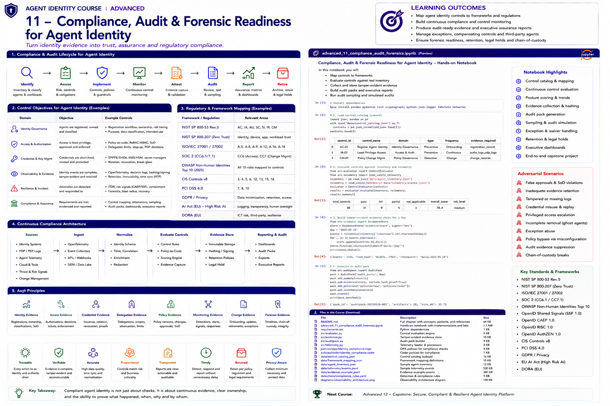

# Advanced 11 — Compliance, Audit & Forensic Readiness for Agent Identity



> **Goal:** turn agent identity controls and telemetry into continuous, defensible assurance: control objectives, machine-evaluated compliance, audit-ready evidence, traceable exceptions, and forensic readiness.

Agent identity assurance is not a yearly screenshot exercise.

```text
Identity Inventory
       ↓
Risk Classification
       ↓
Control Requirements
       ↓
Technical Enforcement
       ↓
Continuous Monitoring
       ↓
Evidence
       ↓
Attestation / Audit
       ↓
Remediation
       ↓
Recertification
```

The central question is:

> **Can the organization prove that every material agent identity has an owner, justified authority, enforced controls, trustworthy evidence, and a controlled lifecycle?**

---

# Learning outcomes

You will learn to:

- create an agent-identity control catalog;
- translate requirements into control objectives and evidence;
- map controls to NIST, ISO, SOC 2, CIS, PCI DSS, privacy and AI obligations;
- distinguish design effectiveness from operating effectiveness;
- continuously evaluate identity controls;
- build machine-verifiable control evidence;
- implement policy-as-code compliance gates;
- design access recertification and control attestations;
- prove segregation of duties;
- govern exceptions and compensating controls;
- manage third-party agent assurance;
- design evidence retention and legal-hold models;
- generate audit packs;
- perform audit sampling;
- reconstruct historical control state;
- measure control coverage and residual risk;
- build executive assurance dashboards.

---

# 1. Compliance is an outcome, not a document

A policy saying:

```text
"Production agents must use least privilege."
```

does not prove compliance.

Evidence must show:

```text
required control
→ implemented mechanism
→ current configuration
→ runtime enforcement
→ monitored operation
→ exception state
→ evidence
```

---

# 2. Agent identity control domains

A practical control catalog includes:

```text
1. inventory and ownership
2. risk classification
3. identity uniqueness
4. authentication
5. credential/key management
6. authorization and least privilege
7. delegation
8. privileged authority
9. federation and third parties
10. workload/runtime binding
11. lifecycle/offboarding
12. monitoring and detection
13. incident response
14. change management
15. evidence and audit
16. privacy and retention
```

---

# 3. Control hierarchy

Use a hierarchy:

```text
Requirement
   ↓
Control Objective
   ↓
Control
   ↓
Implementation
   ↓
Test
   ↓
Evidence
```

Example:

```text
Objective:
Only approved agents may invoke production payment tools.

Control:
Production tool gateway requires registered agent identity,
approved workload binding and payment entitlement.

Test:
Attempt invocation with registered and unregistered identities.

Evidence:
registry record + policy version + PDP decision + PEP enforcement.
```

---

# 4. Preventive, detective and corrective controls

## Preventive

Stop the violation.

Examples:

- policy-as-code;
- short-lived credentials;
- deployment gates;
- scope attenuation;
- segregation of duties.

## Detective

Find violations.

Examples:

- stale identity detection;
- privilege drift;
- revoked identity use;
- delegation anomalies.

## Corrective

Restore safe state.

Examples:

- revoke;
- rotate;
- quarantine;
- remove entitlement;
- recertify.

Mature programs use all three.

---

# 5. Manual vs automated controls

Manual:

```text
quarterly owner attestation
exception approval
high-risk architecture review
```

Automated:

```text
identity must have owner
credential lifetime <= threshold
production agent cannot use static key
delegated scope <= parent scope
revoked identity cannot execute
```

Automate deterministic controls and retain humans for judgment.

---

# 6. Control metadata

Each control should have:

```text
control_id
name
objective
domain
risk
type
frequency
owner
implementation
test
evidence
framework mappings
exceptions
status
```

This becomes the machine-readable control catalog.

---

# 7. Identity inventory as audit foundation

You cannot audit identities you cannot enumerate.

Inventory:

```text
logical agents
agent instances
workload identities
OAuth clients
service accounts
cloud roles
API keys
certificates
trust relationships
delegation authorities
external agents
CI/CD identities
```

---

# 8. Ownership evidence

Every material identity needs accountable ownership.

Evidence may include:

```text
business owner
technical owner
security owner
purpose
system
environment
risk tier
approval
review date
```

Orphaned identities should fail compliance.

---

# 9. Purpose limitation

An agent identity should have a documented purpose.

Compare:

```text
registered purpose
        ↕
permissions
        ↕
observed behavior
```

Material divergence should trigger review.

---

# 10. Risk classification

Risk can consider:

```text
autonomy
data sensitivity
business impact
external actions
financial authority
privilege
delegation
external trust
reversibility
human oversight
```

Risk tier determines control rigor.

---

# 11. Control applicability

Not every control applies to every identity.

Record:

```text
applicable
not applicable + rationale
compensating control
exception
```

Never silently omit a control.

---

# 12. NIST SP 800-53 mapping

Agent identity controls commonly map into families such as:

```text
AC — Access Control
AU — Audit and Accountability
IA — Identification and Authentication
CM — Configuration Management
SI — System and Information Integrity
IR — Incident Response
CA — Assessment, Authorization and Monitoring
SC — System and Communications Protection
```

The exact mapping depends on implementation and organizational scope.

---

# 13. NIST Zero Trust

NIST SP 800-207 emphasizes explicit authentication and authorization before resource access rather than implicit trust based on network location.

For agents, apply this to:

```text
agent → tool
agent → API
sub-agent → service
workload → cloud resource
external agent → enterprise gateway
```

---

# 14. NIST agent identity direction

NIST NCCoE's 2026 software and AI agent identity initiative explicitly focuses on applying identity standards and best practices to software/AI agents, including identification, authorization, auditing and non-repudiation.

This makes evidence and accountability central—not optional add-ons.

---

# 15. NIST AI RMF relationship

AI RMF governance can complement cybersecurity/IAM controls.

Agent identity supports governance questions such as:

```text
Who owns the agent?
What authority does it have?
What systems can it affect?
How is human accountability retained?
How are failures detected?
How is evidence preserved?
```

Identity controls are one technical layer of broader AI risk management.

---

# 16. ISO/IEC 27001

Relevant ISO/IEC 27001:2022 control areas include identity management, authentication information, access rights, logging, monitoring, configuration management, supplier relationships and information security incident management.

Do not claim certification merely because individual controls are implemented.

---

# 17. SOC 2

Agent identity evidence can support Trust Services Criteria related to:

```text
logical access
change management
system operations
risk mitigation
monitoring
```

The auditor evaluates the scoped system and control design/operation; a GitHub control mapping alone is not SOC 2 compliance.

---

# 18. CIS Controls

Useful CIS Controls include:

```text
3  Data Protection
4  Secure Configuration
5  Account Management
6  Access Control Management
8  Audit Log Management
12 Network Infrastructure
13 Network Monitoring and Defense
15 Service Provider Management
16 Application Software Security
17 Incident Response Management
```

Agent/NHI controls should be integrated into existing enterprise security programs.

---

# 19. PCI DSS

Where agents interact with cardholder-data environments, identity controls may support PCI DSS requirements for:

```text
access restriction
unique identification
authentication
logging
monitoring
security testing
```

Applicability must be determined by PCI scope and a qualified assessment process.

---

# 20. Privacy obligations

Identity evidence may contain:

```text
user identifiers
behavior
IP/network context
business actions
prompt/tool metadata
investigation records
```

Apply:

```text
purpose limitation
data minimization
access control
retention
deletion rules
legal holds
cross-border requirements
```

---

# 21. EU AI Act considerations

For in-scope high-risk AI systems, obligations can include logging, risk management, human oversight, technical documentation and quality-management requirements.

Agent identity evidence can support traceability and accountability, but regulatory applicability requires legal analysis.

---

# 22. DORA considerations

Financial entities subject to DORA may need strong ICT risk management, incident management, resilience testing and third-party risk controls.

Agent identities interacting with critical ICT services should fit into those established processes rather than creating a disconnected AI-only compliance program.

---

# 23. OWASP NHI Top 10

OWASP's 2025 NHI Top 10 includes:

```text
NHI1 Improper Offboarding
NHI2 Secret Leakage
NHI3 Vulnerable Third-Party NHI
NHI4 Insecure Authentication
NHI5 Overprivileged NHI
NHI6 Insecure Cloud Deployment Configurations
NHI7 Long-Lived Secrets
NHI8 Environment Isolation
NHI9 NHI Reuse
NHI10 Human Use of NHI
```

Map each risk to preventive, detective and corrective controls.

---

# 24. Control example: improper offboarding

Objective:

> Retired agents cannot authenticate or retain authority.

Evidence:

```text
retirement request
identity disabled
credentials revoked
delegations removed
tool grants removed
federation removed
runtime stopped
post-retirement execution test
archive record
```

---

# 25. Control example: least privilege

Evidence should prove both:

```text
configured entitlement
+
observed use
```

Unused privilege is a candidate for removal.

---

# 26. Just-in-time authority

For high-risk actions, use:

```text
request
→ approval/policy
→ temporary authority
→ action
→ automatic expiry
```

Audit the entire sequence.

---

# 27. Segregation of duties

Detect combinations such as:

```text
create agent + approve agent
write policy + approve policy
request privilege + approve privilege
deploy + waive security gate
generate evidence + approve evidence
```

SoD should be graph-tested, not only documented.

---

# 28. Machine identities need unique attribution

OWASP NHI9 highlights risk from NHI reuse.

Unique identities improve:

```text
least privilege
blast-radius control
audit attribution
behavior baselines
offboarding
incident containment
```

---

# 29. Human use of NHI

OWASP NHI10 identifies human use of non-human identities as an accountability and privilege risk.

Use:

```text
dedicated human identities
break-glass workflows
explicit impersonation events
short duration
approval
enhanced audit
```

---

# 30. Credential compliance

Evaluate:

```text
credential type
lifetime
rotation
storage
issuer
audience
scope
sender constraint
last use
revocation support
```

Critical production agents should avoid unmanaged long-lived secrets.

---

# 31. Workload identity evidence

For SPIFFE/cloud workload identity capture:

```text
workload identifier
attestation mechanism
trust domain/issuer
credential issuance
rotation
deployment binding
validation
```

This can provide stronger assurance than screenshots of secret configuration.

---

# 32. Authorization evidence

For high-risk actions preserve:

```text
principal
subject
action
resource
decision
policy ID/version
context
obligations
enforcement result
```

OpenID AuthZEN provides a standardized PDP/PEP API model that can help structure authorization integrations.

---

# 33. Delegation compliance

Test:

```text
scope attenuation
resource attenuation
time attenuation
depth
redelegation
purpose
approval
subject preservation
```

A valid child delegation must not silently become more powerful than its parent.

---

# 34. Third-party agents

Evidence should include:

```text
provider
contract owner
technical owner
identity mechanism
permissions
data access
trust/federation
security assurance
incident contact
offboarding method
review date
```

---

# 35. Supply-chain identity

Agent deployments depend on:

```text
source repository
CI identity
build identity
artifact signer
deployment identity
runtime workload identity
```

Assurance should connect build/deployment provenance to runtime identity.

---

# 36. Control design effectiveness

Ask:

> If implemented as designed, would this control address the risk?

Example failure:

```text
Control: quarterly credential review
Risk: leaked token can cause immediate critical damage
```

The control may operate perfectly yet be poorly designed.

---

# 37. Operating effectiveness

Ask:

> Did the control actually operate as designed during the review period?

Evidence includes:

```text
execution records
samples
exceptions
failures
remediation
timestamps
owners
```

---

# 38. Continuous control monitoring

Convert controls into executable checks.

Example:

```python
if agent.environment == "prod":
    assert agent.owner
    assert agent.credential_type != "static_api_key"
    assert agent.last_review <= 90_days
```

This is stronger than waiting for annual audit preparation.

---

# 39. Policy-as-code compliance

Use OPA, Cedar, cloud policy or internal engines to enforce invariants.

Separate:

```text
authorization policy
compliance policy
deployment policy
```

even if the same policy engine evaluates them.

---

# 40. CI/CD compliance gates

Before deployment verify:

```text
registered identity
approved owner
risk classification
required controls
policy tests
credential model
delegation model
observability
incident playbook
```

Block critical failures.

---

# 41. Evidence-as-code

A control should define how evidence is collected.

Example:

```yaml
control: AC-AGENT-04
test: production_agents_have_short_lived_credentials
evidence:
  - registry_snapshot
  - issuer_configuration
  - issuance_events
  - runtime_validation
```

---

# 42. Evidence qualities

Good evidence is:

```text
relevant
complete
accurate
timely
traceable
verifiable
protected
repeatable
```

---

# 43. Evidence hierarchy

Prefer stronger evidence where feasible:

```text
runtime event
machine configuration
policy evaluation
signed attestation
system-of-record entry
human attestation
screenshot
```

Screenshots are often useful supporting evidence, but weak as the sole basis for continuously changing controls.

---

# 44. Evidence provenance

Record:

```text
source
collector
collection time
scope
query/version
hash
signer
storage
```

An auditor should know where evidence came from.

---

# 45. Evidence integrity

Use controls such as:

```text
append-only storage
restricted writers
hashes
signatures
retention lock
independent collection
chain of custody
```

for high-assurance evidence.

---

# 46. Evidence freshness

Some evidence becomes stale quickly.

Define freshness:

```text
identity inventory: daily
critical policy state: deployment/change
credential status: near real time
ownership review: quarterly
penetration/red-team evidence: periodic
```

Risk determines cadence.

---

# 47. Evidence completeness

For a control population, calculate:

```text
expected population
tested population
passed
failed
exception
not applicable
missing evidence
```

Never hide missing evidence inside "pass."

---

# 48. Continuous attestation

Owners can periodically attest:

```text
identity still required
purpose still correct
owner still valid
permissions justified
delegations justified
external trust justified
```

Automated evidence should pre-populate the review.

---

# 49. Access certification

Traditional access certification must expand from humans to:

```text
agents
service accounts
workloads
OAuth clients
cloud roles
delegations
tool grants
external identities
```

---

# 50. Recertification triggers

Do not rely only on calendar reviews.

Trigger review when:

```text
owner changes
risk tier changes
new privileged tool
scope expands
new federation
credential model changes
incident occurs
deployment architecture changes
```

---

# 51. Exceptions

Every exception needs:

```text
control
business justification
risk
scope
owner
approver
compensating controls
start
expiry
review
```

No permanent exceptions by default.

---

# 52. Compensating controls

A compensating control must actually reduce the same risk.

Example:

```text
Required:
short-lived workload credential

Temporary exception:
legacy static credential

Compensating controls:
vault storage
narrow scope
IP/workload restriction
enhanced monitoring
30-day rotation
migration deadline
```

---

# 53. Exception abuse detection

Detect:

```text
expired exception still active
scope larger than approved
missing compensating control
repeated renewals
self-approval
exception after migration deadline
```

---

# 54. Change management

Material identity changes include:

```text
new permissions
new tools
new trust domain
new credential issuer
new delegation capability
policy changes
owner changes
risk-tier changes
```

Link changes to approvals, tests and evidence.

---

# 55. Configuration drift

Compare:

```text
approved state
      ↕
deployed state
      ↕
observed runtime state
```

All three matter.

---

# 56. Audit universe

Define the complete population:

```text
all production agents
all critical identities
all high-risk delegations
all external agents
all privileged credentials
all exceptions
all retired identities
```

Sampling without a trustworthy universe is unreliable.

---

# 57. Audit sampling

Sampling strategies:

```text
random
risk-based
stratified
judgmental
100% automated testing
```

For machine-evaluable controls, testing the full population is often preferable.

---

# 58. Risk-based sampling

Oversample:

```text
high autonomy
privileged agents
external trust
financial actions
sensitive data
recent incidents
recent exceptions
rapidly changing systems
```

---

# 59. Audit trail

For every audit result retain:

```text
control
population
sample
test procedure
evidence
result
tester
date
exception
remediation
retest
```

---

# 60. Findings

Classify findings by:

```text
risk
impact
likelihood
scope
root cause
repeat finding
control failure type
```

Avoid treating every failed check as equally severe.

---

# 61. Remediation

A finding lifecycle:

```text
open
→ owner assigned
→ remediation planned
→ implemented
→ retested
→ closed
```

Track overdue high-risk findings.

---

# 62. Continuous assurance dashboard

Useful metrics:

```text
inventory coverage
ownership coverage
control pass rate
critical failures
evidence freshness
exception count
expired exceptions
recertification overdue
orphaned identities
overprivileged identities
static credentials
offboarding failures
audit findings
MTTR
```

---

# 63. Do not optimize for pass rate

A 99% pass rate can hide one catastrophic failure.

Use:

```text
aggregate score
+
critical-condition overrides
+
risk-weighted failures
```

---

# 64. Executive assurance

Executives need:

```text
Are critical agents controlled?
Where is residual risk?
What changed?
What is overdue?
Which exceptions matter?
Are incidents increasing?
Can we prove compliance?
```

Avoid flooding them with raw IAM metrics.

---

# 65. Board/audit committee reporting

Focus on:

```text
material risks
control effectiveness
critical exceptions
major incidents
third-party exposure
regulatory implications
remediation trajectory
assurance limitations
```

---

# 66. Forensic readiness

Forensic readiness means preparing **before** an incident.

Define:

```text
required evidence
collection points
retention
integrity
time synchronization
investigation access
chain of custody
case procedures
```

---

# 67. Legal hold

When required, legal hold can override ordinary deletion/retention schedules for scoped evidence.

Implement:

```text
hold identifier
scope
custodian/system
start
authorization
preservation status
release
```

Legal requirements should be defined with counsel.

---

# 68. Evidence retention

Retention should account for:

```text
regulation
contract
security investigation
privacy
litigation
business need
storage cost
```

Do not keep sensitive identity telemetry forever "just in case."

---

# 69. Chain of custody

For forensic evidence record:

```text
what
where from
who collected
when
hash
where stored
who accessed
copies/exports
disposition
```

---

# 70. Historical reconstruction

An audit may ask:

> What authority did this agent have on March 15?

Retain/version enough information to reconstruct:

```text
identity
credential
entitlement
delegation
policy
exception
owner
runtime binding
```

at the relevant time.

---

# 71. Audit pack

A generated audit pack can include:

```text
scope
control matrix
population
control results
evidence manifest
exceptions
samples
findings
remediation
attestations
evidence integrity report
```

Automate generation from source systems.

---

# 72. Evidence manifest

Example:

```json
{
  "control": "AC-AGENT-04",
  "period": "2026-Q3",
  "artifacts": [
    {
      "name": "credential_inventory.json",
      "sha256": "...",
      "source": "identity-registry"
    }
  ]
}
```

---

# 73. Independent verification

Where assurance matters, the evidence producer and evidence verifier should not be the same uncontrolled component.

Examples:

```text
agent ≠ evidence signer
developer ≠ final approver
policy author ≠ sole auditor
```

---

# 74. Third-party assurance

Request evidence appropriate to risk:

```text
identity architecture
authentication model
credential lifecycle
access model
audit capabilities
incident process
subprocessors
certifications/reports
penetration testing
offboarding
```

Certifications supplement—not replace—technical integration controls.

---

# 75. Continuous third-party monitoring

Monitor:

```text
trust changes
certificate/key changes
security incidents
scope changes
contract changes
stale integrations
unused external identities
```

---

# 76. Control inheritance

Platform controls may be inherited by many agents.

Example:

```text
central tool gateway
central workload identity
central audit pipeline
central policy engine
```

Record:

```text
inherited control
provider
consumer
assumptions
consumer responsibilities
```

---

# 77. Shared responsibility

A platform may provide authentication while the agent team remains responsible for:

```text
correct permissions
purpose
tool selection
data scope
delegation
business approval
```

Make boundaries explicit.

---

# 78. Assurance for autonomous actions

High-autonomy agents require stronger evidence because they may take many actions without per-action human approval.

Use:

```text
bounded authority
policy enforcement
runtime identity
complete telemetry
rapid revocation
continuous evaluation
periodic attestation
```

---

# 79. Non-repudiation considerations

NIST's agent identity work explicitly raises non-repudiation.

Practical assurance can combine:

```text
strong identity
signed/verified credentials
policy decisions
tamper-resistant logs
trusted timestamps
cryptographic evidence
separation of duties
```

The exact legal meaning of non-repudiation varies by context.

---

# 80. Continuous compliance architecture

```text
Identity / Policy / Cloud / Tool / Telemetry Sources
                         ↓
                    Collectors
                         ↓
             Normalize + Enrich + Redact
                         ↓
                 Control Evaluator
                ↙       ↓       ↘
           Policy     Tests    Analytics
                ↘       ↓       ↙
                   Evidence Store
                         ↓
            ┌────────────┼────────────┐
            ▼            ▼            ▼
       Dashboards    Audit Packs   Alerts
            │            │            │
            └────────────┼────────────┘
                         ▼
              Remediation / Review
```

---

# 81. Three lines model

A practical governance split:

```text
1st line — product/platform teams
own and operate controls

2nd line — risk/security/compliance
define requirements and challenge

3rd line — internal audit
independently assess
```

Adapt to organizational structure.

---

# 82. Control testing anti-patterns

Avoid:

```text
screenshots only
self-attestation only
testing only happy paths
no population definition
no evidence provenance
no policy version
no historical state
ignoring exceptions
ignoring inherited controls
manual annual testing of machine-testable controls
```

---

# 83. Evidence anti-patterns

Avoid:

```text
mutable spreadsheets as sole evidence
raw secrets in audit exports
unbounded PII
unknown timestamps
unverifiable exports
evidence generated by the component under investigation only
```

---

# 84. Compliance-as-code

A mature system represents:

```text
controls as data
tests as code
policies as code
evidence collection as code
mappings as data
reports as generated artifacts
```

Human judgment remains necessary for interpretation and risk acceptance.

---

# 85. Continuous assurance loop

```text
DEFINE
  ↓
IMPLEMENT
  ↓
TEST
  ↓
EVIDENCE
  ↓
ASSESS
  ↓
REMEDIATE
  ↓
ATTEST
  ↓
IMPROVE
  └──────────► repeat
```

---

# 86. Production principles

1. **Prove, don't merely assert.**
2. **Test the full population when practical.**
3. **Preserve historical policy and authority.**
4. **Treat missing evidence as a finding.**
5. **Separate evidence creation from approval.**
6. **Automate deterministic controls.**
7. **Risk-weight failures.**
8. **Time-bound exceptions.**
9. **Protect audit data like production data.**
10. **Design forensic readiness before incidents.**

---

# 87. Enterprise readiness checklist

Before production assurance is considered mature:

```text
Complete agent/NHI inventory?
Owners assigned?
Risk tiers defined?
Control catalog versioned?
Framework mappings reviewed?
Control applicability documented?
Preventive controls tested?
Detective controls tested?
Corrective controls tested?
Credential controls evidenced?
Authorization evidenced?
Delegation evidenced?
SoD graph-tested?
Third parties inventoried?
Exceptions time-bounded?
Compensating controls verified?
Continuous tests running?
Evidence provenance recorded?
Evidence integrity protected?
Historical state reconstructable?
Sampling methodology documented?
Audit universe complete?
Findings tracked?
Retests required?
Retention defined?
Legal hold supported?
Chain of custody tested?
Executive reporting risk-based?
Forensic exercises performed?
```

---

# Practical notebook

The notebook builds a complete assurance pipeline:

1. control catalog;
2. framework mappings;
3. identity inventory;
4. control applicability;
5. ownership tests;
6. risk-tier controls;
7. credential controls;
8. least-privilege tests;
9. delegation attenuation;
10. segregation-of-duties graph;
11. offboarding tests;
12. third-party controls;
13. policy-as-code checks;
14. CI/CD compliance gate;
15. evidence specifications;
16. evidence collection;
17. evidence hashing;
18. evidence manifests;
19. evidence freshness;
20. evidence completeness;
21. continuous control monitoring;
22. attestation workflows;
23. access certification;
24. event-driven recertification;
25. exception workflow;
26. compensating controls;
27. expired-exception detection;
28. configuration drift;
29. audit universe;
30. random sampling;
31. risk-based sampling;
32. control test records;
33. findings;
34. remediation/retest;
35. risk-weighted posture;
36. executive dashboard;
37. retention;
38. legal hold;
39. chain of custody;
40. historical reconstruction;
41. audit-pack generation;
42. third-party assurance;
43. inherited controls;
44. end-to-end continuous-compliance capstone.

---

# State of the art and references

## NIST NCCoE — Software and AI Agent Identity and Authorization

NIST's 2026 initiative focuses on standards-based approaches to identifying and authorizing software/AI agents and explicitly asks about identification, authorization, auditing and non-repudiation.

https://www.nccoe.nist.gov/projects/software-and-ai-agent-identity-and-authorization

## NIST SP 800-53 Rev. 5

https://csrc.nist.gov/pubs/sp/800/53/r5/upd1/final

## NIST SP 800-207 — Zero Trust Architecture

https://csrc.nist.gov/pubs/sp/800/207/final

## NIST AI Risk Management Framework

https://www.nist.gov/itl/ai-risk-management-framework

## OWASP Non-Human Identities Top 10 — 2025

https://owasp.org/www-project-non-human-identities-top-10/2025/

## OpenID AuthZEN Authorization API 1.0

AuthZEN Authorization API 1.0 became an OpenID Final Specification in January 2026.

https://openid.net/specs/authorization-api-1_0.html

## OpenID Shared Signals

https://openid.net/wg/sharedsignals/

## SPIFFE

https://spiffe.io/docs/latest/spiffe-specs/

## CIS Controls v8

https://www.cisecurity.org/controls/v8

## ISO/IEC 27001

https://www.iso.org/standard/27001

## AICPA SOC 2

https://www.aicpa-cima.com/topic/audit-assurance/audit-and-assurance-greater-than-soc-2

## PCI Security Standards Council

https://www.pcisecuritystandards.org/

## EU AI Act

https://eur-lex.europa.eu/eli/reg/2024/1689/oj

## DORA

https://eur-lex.europa.eu/eli/reg/2022/2554/oj

---

# Next course

## Advanced 12 — Capstone: Secure, Compliant & Resilient Agent Identity Platform

The capstone will integrate the full curriculum: identity model, agent registration, workload identity, OAuth/OIDC, token exchange, delegation, authorization, policy-as-code, MCP/tool identity, federation, credential lifecycle, posture management, threat detection, observability, evidence, compliance, incident response and governance into one enterprise reference implementation.
