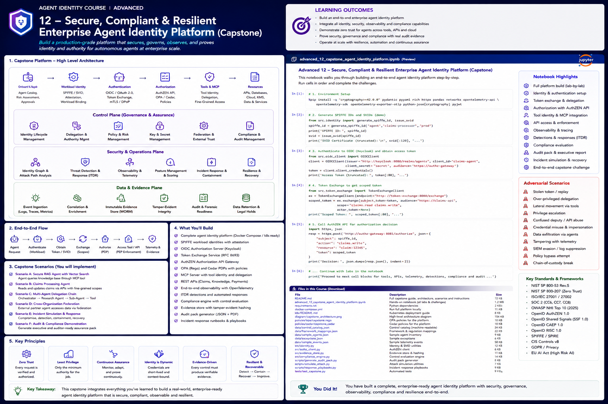

# Advanced 12 — Capstone: Secure, Compliant & Resilient Enterprise Agent Identity Platform



> **Goal:** integrate the entire Agent Identity curriculum into a production-style enterprise platform that can identify, authenticate, authorize, delegate, federate, observe, govern, detect, recover, and prove the actions of autonomous agents.

This capstone is deliberately broader than a typical notebook.

The learner builds an **enterprise control plane** around an autonomous claims-assistant ecosystem.

```text
Human / Enterprise IdP
        │
        ▼
Agent Registration + Governance
        │
        ▼
Logical Agent Identity
        │
        ▼
Workload Identity / SPIFFE
        │
        ▼
OAuth / OIDC / Token Exchange
        │
        ▼
Structured Authorization Request
        │
        ▼
AuthZEN-style PEP → PDP
        │
        ├───────────────┐
        ▼               ▼
   OPA / Cedar       OpenFGA
 context policy      relationships
        │               │
        └───────┬───────┘
                ▼
      ALLOW / DENY / STEP-UP
                │
                ▼
         Tool / MCP Gateway
        /       |       \
       ▼        ▼        ▼
 Claims API   RAG      Sub-agent
                        │
                        ▼
                 Attenuated Delegation
                        │
                        ▼
                   Partner Agent
                        │
                        ▼
                Federated Identity

All execution
        ↓
OpenTelemetry / Security Events
        ↓
Identity Graph / ITDR / Evidence
        ↓
Continuous Compliance / Audit
        ↓
Incident Response / Recovery
```

---

# 1. Why this capstone exists

The preceding courses introduced individual technologies and control problems:

```text
agent identity model
workload identity
OAuth/OIDC
delegation
fine-grained authorization
capabilities
federation
attestations
continuous trust
decentralized identity
non-human identity security
governance
ITDR
observability
compliance
```

The enterprise challenge is that none of those systems operates in isolation.

A real agent action may involve:

```text
user identity
logical agent identity
runtime workload
delegated authority
OAuth token
PDP policy
relationship data
MCP server
external sub-agent
cloud role
security telemetry
governance approval
```

The capstone therefore tests **integration discipline**.

---

# 2. Scenario

You are building a high-risk enterprise claims platform.

The primary autonomous agent is:

```text
agent:claims-orchestrator
```

It can:

```text
read assigned claims
update limited claim fields
search enterprise policy knowledge
delegate read-only research
request payment approval
invoke an external research partner
```

It cannot:

```text
directly approve payments
change identity policy
create unrestricted sub-agents
use cross-tenant data
reuse client tokens for downstream APIs
```

---

# 3. Actors and identities

## Human

```text
user:alice
```

Claims adjuster.

## Logical agents

```text
agent:claims-orchestrator
agent:research
agent:data
agent:external-research
```

## Workloads

```text
spiffe://corp.example/prod/claims-orchestrator
spiffe://corp.example/prod/research-agent
spiffe://corp.example/prod/data-agent
spiffe://partner.example/prod/research-agent
```

## Tool identities

```text
mcp:policy-search
api:claims
api:payments
vector:claims-knowledge
kms:evidence-signer
```

---

# 4. Identity layers

Keep these separate:

```text
human identity
logical agent identity
workload identity
deployment/release identity
session/task identity
delegation identity
credential identity
tool/service identity
external/federated identity
```

An enterprise platform should be able to answer:

```text
Which human initiated this?
Which logical agent acted?
Which workload ran it?
Which credential did it use?
Which delegation authorized it?
Which tool actually executed?
```

---

# 5. Security invariants

The learner must prove the following:

1. model output never creates trusted identity context;
2. logical agent identity is bound to an approved workload;
3. production workloads do not use static broad secrets;
4. tokens are audience/resource bound;
5. token exchange cannot expand scope;
6. child delegation is attenuated;
7. cross-tenant access is denied;
8. every consequential action crosses a PEP;
9. authorization is deterministic and external to the LLM;
10. high-risk actions require step-up/HITL;
11. MCP client tokens are not passed through downstream;
12. federated agents remain subject to local authorization;
13. revoked authority invalidates cached ALLOWs;
14. identity telemetry excludes raw bearer credentials;
15. every critical action produces audit evidence;
16. quarantine breaks attack paths;
17. retired identities cannot execute;
18. expired exceptions cannot silently keep controls bypassed.

---

# 6. Agent registry

Each logical agent registration should include:

```text
agent ID
owner
purpose
risk tier
autonomy level
approved workloads
approved tools
approved data classes
delegation policy
approved external trust
review interval
current status
policy version
```

---

# 7. Governance state

Use controlled lifecycle states:

```text
DRAFT
PENDING_APPROVAL
APPROVED
ACTIVE
SUSPENDED
QUARANTINED
RETIRED
REVOKED
```

No direct:

```text
DRAFT → ACTIVE
```

or:

```text
REVOKED → ACTIVE
```

without the appropriate recovery/re-onboarding workflow.

---

# 8. Human authentication

Use enterprise authentication context.

Trusted identity facts should come from:

```text
OIDC claims
enterprise IdP
session context
server-side tenant mapping
```

Never from:

```text
prompt text
retrieved document
LLM-generated user ID
tool argument
```

---

# 9. Workload identity

Use SPIFFE-style workload identity to bind runtime execution to a cryptographic workload identity.

The platform models:

```text
logical agent
     ↓ approved binding
SPIFFE ID
     ↓
SVID
     ↓
authenticated workload
```

Current SPIFFE Workload API standards support X.509-SVID and JWT-SVID profiles and now also define an optional WIT-SVID profile.

---

# 10. Workload attestation

The identity control plane should establish:

```text
which workload is running
where it is running
which selectors identify it
which trust domain issued identity
whether its runtime identity matches approved registration
```

---

# 11. Authentication vs authorization

Authentication proves:

```text
who/what is calling
```

Authorization proves:

```text
whether that caller may perform this action
on this resource
under this context
```

Never merge the two.

---

# 12. OAuth/OIDC

Use:

```text
OIDC → human/authentication context
OAuth → delegated/resource API access
```

Validate:

```text
issuer
subject
audience/resource
scope
expiry
token type
client
```

---

# 13. Token exchange

Use RFC 8693-style token exchange to convert a broader runtime identity into a narrower resource-specific token.

Example:

```text
claims-agent identity
      ↓
token exchange
      ↓
claims-api token
scope = claim.read
aud = claims-api
ttl = 5 minutes
```

Token exchange must not increase authority.

---

# 14. Sender-constrained credentials

For sensitive operations consider:

```text
mTLS-bound tokens
DPoP-bound tokens
```

These reduce the value of a stolen bearer token.

---

# 15. Delegation

Represent delegation explicitly:

```json
{
  "delegator": "user:alice",
  "delegatee": "agent:claims-orchestrator",
  "actions": ["claim.read", "claim.update"],
  "resources": ["claim:483"],
  "purpose": "process claim 483",
  "expires_at": "...",
  "redelegable": true,
  "max_depth": 1
}
```

---

# 16. Delegation attenuation

For a child delegation:

```text
actions(child)   ⊆ actions(parent)
resources(child) ⊆ resources(parent)
expiry(child)    ≤ expiry(parent)
depth(child)     ≤ max parent depth
```

---

# 17. Sub-agent governance

A sub-agent is not invisible implementation detail.

Register or record:

```text
parent
child
task
authority
lifetime
delegation chain
tool set
trace ID
owner
```

---

# 18. Relationship authorization

Use OpenFGA/ReBAC for durable relationships such as:

```text
user assigned_to claim
agent acts_for user
agent assigned_to task
task allowed_to_read claim
agent may_invoke tool
```

---

# 19. Contextual authorization

Use OPA/Rego or Cedar for dynamic facts:

```text
workload assurance
risk
time
tenant
purpose
approval
data classification
transaction amount
credential freshness
```

---

# 20. AuthZEN integration

Use an AuthZEN-style boundary:

```text
PEP
 ↓ authorization request
PDP
 ↓ decision
PEP
 ↓ enforcement
```

The capstone records both decision and enforcement evidence.

---

# 21. Rich decision contract

Return more than a boolean:

```json
{
  "decision": "allow",
  "reason": "TASK_SCOPE",
  "decision_id": "dec-44",
  "constraints": {
    "allowed_fields": ["status", "notes"]
  },
  "obligations": ["audit"],
  "expires_at": "..."
}
```

---

# 22. Constraints

A permit can still be narrow.

Example:

```text
claim.update
allowed fields:
  status
  notes

forbidden:
  reserve
  payment
  owner
```

The PEP must enforce constraints.

---

# 23. Step-up / HITL

For high-risk actions:

```text
agent requests payment
      ↓
PDP returns STEP_UP
      ↓
human approval
      ↓
transaction-bound capability
      ↓
re-authorization
      ↓
execution
```

---

# 24. Transaction binding

Bind approval to:

```text
agent
task
action
resource
critical parameters
amount
currency
expiry
```

Parameter changes after approval invalidate approval.

---

# 25. Authorization-aware RAG

Before retrieval reaches model context enforce:

```text
tenant
document ACL
task scope
relationship
data classification
```

Authorization after retrieval can be too late.

---

# 26. Memory authorization

Treat memory as a resource:

```text
read
search
write
update
delete
```

Enforce:

```text
tenant
owner
task
purpose
retention
```

---

# 27. MCP authorization

MCP is a protocol boundary, not authorization by itself.

Current MCP authorization expects:

```text
Protected Resource Metadata
authorization-server discovery
resource indicators
OAuth 2.1-style authorization
resource-bound tokens
```

---

# 28. MCP token passthrough

Do not:

```text
client token
   ↓
MCP server
   ↓ same token
downstream API
```

Use:

```text
client → MCP-specific token
MCP → downstream-specific credential
```

---

# 29. External/federated agents

External agents require:

```text
foreign issuer/trust domain
approved federation relationship
local identity mapping
delegation validation
local policy
resource constraints
audit evidence
```

---

# 30. OpenID Federation 1.1

OpenID Federation 1.1 is current Final Specification material for trust chains, trust anchors, entity statements, metadata policy and multilateral federation.

Use it as the trust-framework layer—not as local authorization.

---

# 31. SPIFFE federation

Federated SPIFFE bundles allow workloads in one trust domain to validate SVIDs from another domain.

Federation authenticates foreign workload identity.

Local authorization still decides whether that workload may act.

---

# 32. Federated authority intersection

Use:

```text
effective authority =
verified foreign identity
∩ valid delegation
∩ federation policy
∩ local authorization
∩ resource policy
∩ current risk
```

---

# 33. Credentials and key custody

Prefer:

```text
short-lived credentials
non-exportable keys
KMS/HSM signing
workload federation
tool-specific tokens
```

Avoid:

```text
shared long-lived API keys
model-visible secrets
generic signing oracles
```

---

# 34. Key-purpose separation

Separate keys for:

```text
TLS
token signing
delegation
evidence signing
encryption
```

---

# 35. Observability

Correlate:

```text
user request
agent invocation
workload identity
delegation
token exchange
authorization decision
PEP enforcement
tool invocation
downstream action
security signal
business result
```

---

# 36. OpenTelemetry

Use OpenTelemetry-style trace trees:

```text
invoke_agent
   ├─ model_call
   ├─ authorize
   ├─ execute_tool
   │    └─ downstream_api
   └─ delegate
        └─ invoke_subagent
```

Keep identity context distinct from trace context.

---

# 37. Identity telemetry

Normalize fields such as:

```text
actor.id
subject.id
agent.id
workload.id
credential.fingerprint
delegation.id
action
resource
decision
policy.version
trace_id
tool.id
tenant
result
```

---

# 38. Security events

Support:

```text
credential revoked
risk changed
agent quarantined
delegation escalated
workload changed
federation suspended
telemetry missing
```

---

# 39. Continuous trust

A valid token does not guarantee current trust.

Re-evaluate on:

```text
risk change
revocation
owner change
workload posture
delegation change
policy change
credential compromise
```

---

# 40. Adaptive responses

Policy can produce:

```text
ALLOW
REDUCE
STEP_UP
REVOKE
QUARANTINE
```

---

# 41. Identity graph

Model nodes:

```text
users
agents
workloads
credentials
tools
roles
resources
trust domains
delegations
policies
```

Edges:

```text
acts_for
runs_as
has_token
can_access
delegates
trusts
can_mint
can_sign
```

---

# 42. Attack-path analysis

Find paths such as:

```text
external agent
→ delegated research agent
→ MCP tool
→ claims API
→ cloud role
→ KMS
```

Prioritize by business impact.

---

# 43. Threat detection

Detect:

```text
wrong audience
credential replay
revoked identity use
delegation escalation
cross-tenant attempt
unexpected token exchange
KMS signing spike
telemetry suppression
human use of workload identity
stale credential after rotation
```

---

# 44. Containment

Contain at the smallest safe scope:

```text
revoke token
remove delegation
disable tool
quarantine workload
suspend agent
disable signing
suspend federation
```

---

# 45. Recovery

Recovery requires:

```text
remove persistence
rotate affected credentials
re-attest workload
re-evaluate identity
rebuild delegation
verify telemetry
validate policy
restore authority gradually
```

---

# 46. Compliance

Controls must be machine-testable where practical.

Examples:

```text
production agent has owner
no static prod credential
review current
delegation attenuated
critical actions auditable
revoked agent cannot execute
```

---

# 47. Evidence

Evidence should connect:

```text
control
implementation
test
result
artifact
hash
source
time
```

---

# 48. Tamper-evident evidence

Use:

```text
append-only storage
hash chains
Merkle roots
KMS/HSM signing
retention locks
restricted writers
```

as appropriate.

---

# 49. Audit reconstruction

An auditor should be able to answer:

```text
Why did this identity exist?
Who approved it?
What workload executed?
What authority existed?
Which policy applied?
Was enforcement successful?
What changed afterward?
```

---

# 50. Continuous compliance

Evaluate continuously:

```text
inventory
ownership
credential posture
delegation
runtime binding
review freshness
telemetry coverage
critical findings
exceptions
```

---

# 51. Exception governance

An exception requires:

```text
control
scope
justification
risk
owner
approver
compensating controls
expiry
remediation plan
```

Expired exceptions must not silently continue.

---

# 52. Third-party assurance

For partner agents require:

```text
identity mechanism
trust framework
credential lifecycle
incident contact
data boundaries
offboarding
permissions
review
evidence
```

---

# 53. State-of-the-art standards baseline

The capstone uses current standards and guidance including:

```text
NIST 2026 Software and AI Agent Identity initiative
NIST SP 800-207 Zero Trust
SPIFFE / SPIRE
OpenID AuthZEN Authorization API 1.0
OpenID Federation 1.1
OAuth 2.0 / RFC 8693 Token Exchange
OAuth mTLS / DPoP
OpenID Shared Signals / CAEP / RISC
MCP authorization specification
OpenTelemetry GenAI semantic conventions
OPA / Cedar / OpenFGA
OWASP Non-Human Identities Top 10
SLSA / in-toto
```

---

# 54. Platform components

The capstone package implements teaching versions of:

```text
Agent Registry
Lifecycle Controller
Workload Binding Registry
Token Broker
Delegation Service
Relationship Store
Authorization PDP
Tool Gateway / PEP
MCP Gateway
Federation Trust Registry
Risk Engine
Telemetry Pipeline
Identity Graph
Detection Engine
Response Orchestrator
Compliance Evaluator
Evidence Store
Audit Pack Generator
```

---

# 55. Reference architecture

```text
                        ┌──────────────────────┐
                        │ Enterprise IdP       │
                        └──────────┬───────────┘
                                   │
                                   ▼
                        ┌──────────────────────┐
                        │ Agent Gateway / PEP  │
                        └───────┬──────────────┘
                                │
                ┌───────────────┼────────────────┐
                ▼               ▼                ▼
        Agent Runtime       Token Broker     Governance
        / LLM Planner       / Exchange       / Registry
                │               │                │
                └───────┬───────┘                │
                        ▼                        │
                Authorization PDP ◄──────────────┘
             OPA/Cedar + OpenFGA
                        │
               ┌────────┼───────────┐
               ▼        ▼           ▼
            ALLOW    STEP-UP       DENY
               │        │
               │        ▼
               │    Human Approval
               │        │
               └────────┘
                    │
                    ▼
             Tool / MCP Gateway
            /       |         \
           ▼        ▼          ▼
     Claims API   RAG        Sub-agent
                               │
                               ▼
                        Partner Agent
                               │
                               ▼
                         Federation

Security plane:
SPIFFE • KMS • Risk • ITDR • Revocation

Evidence plane:
OpenTelemetry • events • hash chains • audit packs
```

---

# 56. Failure model

Explicitly model failure of:

```text
PDP
IdP
SPIFFE
token broker
relationship store
MCP server
federation metadata
risk service
telemetry pipeline
evidence signer
```

Sensitive actions must not silently fail open.

---

# 57. Revocation model

Support revocation of:

```text
human
agent
workload
credential
delegation
task
tool access
federation
approval
exception
```

---

# 58. Performance model

Security controls must scale.

Consider:

```text
authorization latency
relationship checks
token exchange rate
trace volume
identity graph size
event throughput
cache invalidation
revocation propagation
```

Never optimize by skipping authorization.

---

# 59. Privacy model

Minimize:

```text
raw prompts
tool arguments
bearer tokens
PII
credential material
security detector internals
```

Use metadata and fingerprints where possible.

---

# 60. Production readiness scorecard

Evaluate:

```text
identity completeness
workload binding
credential hygiene
authorization
delegation
federation
runtime enforcement
observability
threat defense
compliance
revocation
recovery
evidence integrity
```

A critical failure should override a high average score.

---

# 61. Capstone scenarios

## Scenario A — Secure RAG

The claims agent retrieves enterprise policy documents.

Prove:

```text
tenant isolation
ACL-aware retrieval
workload identity
resource-bound token
PDP decision
PEP enforcement
trace correlation
```

## Scenario B — Claims Update

Agent updates `status` and `notes`.

Prove:

```text
field-level constraints
policy decision
delegated authority
evidence
```

## Scenario C — Sub-agent Delegation

Claims agent delegates research.

Prove:

```text
scope attenuation
resource attenuation
TTL attenuation
depth limit
lineage
```

## Scenario D — External Partner Agent

Research is delegated to partner.

Prove:

```text
federated authentication
trust registry
local authorization
resource boundary
```

## Scenario E — High-Risk Payment

Agent requests payment.

Prove:

```text
STEP_UP
transaction-bound approval
one-use capability
re-authorization
```

## Scenario F — Incident

A research token is stolen.

Prove:

```text
audience restriction
replay defense
detection
quarantine
revocation
attack-path reduction
recovery
```

## Scenario G — Compliance Audit

Generate:

```text
control results
evidence manifest
critical findings
exceptions
audit pack
executive assurance summary
```

---

# 62. What the learner builds

The notebook walks through:

1. platform bootstrapping;
2. registry and lifecycle;
3. workload identity binding;
4. token issuance and exchange;
5. delegation;
6. ReBAC relationships;
7. OPA/Cedar-style authorization;
8. AuthZEN-style request/decision model;
9. secure RAG;
10. secure tool gateway;
11. MCP resource binding;
12. sub-agent delegation;
13. federation;
14. HITL payment approval;
15. OpenTelemetry-style events;
16. identity graph;
17. attack paths;
18. detections;
19. quarantine;
20. revocation;
21. recovery;
22. compliance tests;
23. evidence integrity;
24. audit pack;
25. production scorecard;
26. adversarial end-to-end exercise.

---

# 63. Final design review

For every consequential arrow in the architecture, answer:

1. What identity crosses it?
2. How is that identity authenticated?
3. What credential is used?
4. What authority is represented?
5. Which resource is targeted?
6. Which PDP decides?
7. Which PEP enforces?
8. What happens if the PDP is unavailable?
9. How is revocation handled?
10. What telemetry is emitted?
11. What evidence proves the action?
12. Which adversarial test validates the boundary?

If an arrow cannot answer these questions, the architecture is incomplete.

---

# 64. Completion criterion

The platform must be able to answer:

> **Who initiated this action, which logical agent acted, which workload executed it, which credential and delegated authority it used, which policy permitted it, which tool/resource changed, what current risk applied, what evidence proves the chain, and whether that authority can be revoked immediately?**

If the platform cannot answer that consistently, it is not enterprise-ready.

---

# References

- NIST NCCoE — Software and AI Agent Identity and Authorization  
  https://www.nccoe.nist.gov/projects/software-and-ai-agent-identity-and-authorization
- NIST 2026 Concept Paper  
  https://csrc.nist.gov/pubs/other/2026/02/05/accelerating-the-adoption-of-software-and-ai-agent/ipd
- NIST SP 800-207  
  https://csrc.nist.gov/pubs/sp/800/207/final
- SPIFFE Standard  
  https://spiffe.io/docs/latest/spiffe-specs/
- SPIFFE Workload API  
  https://spiffe.io/docs/latest/spiffe-specs/spiffe_workload_api/
- SPIFFE Federation  
  https://spiffe.io/docs/latest/spiffe-specs/spiffe_federation/
- OpenID AuthZEN Authorization API 1.0  
  https://openid.net/specs/authorization-api-1_0.html
- OpenID Federation 1.1  
  https://openid.net/specs/openid-federation-1_1-final.html
- OpenID Shared Signals  
  https://openid.net/wg/sharedsignals/
- OAuth Token Exchange — RFC 8693  
  https://www.rfc-editor.org/rfc/rfc8693
- OAuth mTLS — RFC 8705  
  https://www.rfc-editor.org/rfc/rfc8705
- DPoP — RFC 9449  
  https://www.rfc-editor.org/rfc/rfc9449
- MCP Authorization  
  https://modelcontextprotocol.io/specification/2025-11-25/basic/authorization
- OpenTelemetry GenAI Semantic Conventions  
  https://opentelemetry.io/docs/specs/semconv/gen-ai/
- Open Policy Agent  
  https://www.openpolicyagent.org/
- Cedar  
  https://www.cedarpolicy.com/
- OpenFGA  
  https://openfga.dev/
- OWASP Non-Human Identities Top 10  
  https://owasp.org/www-project-non-human-identities-top-10/
- SLSA  
  https://slsa.dev/
- in-toto  
  https://in-toto.io/
