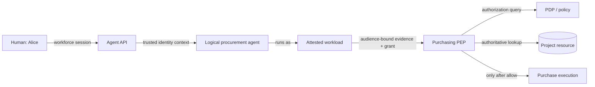
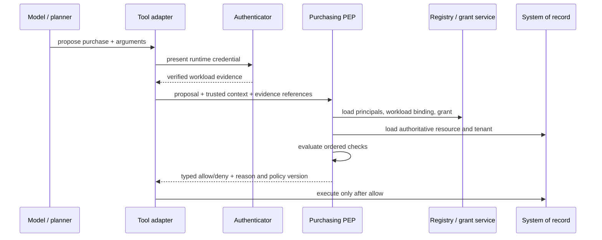

# Beginner 01 — Agent Identity Foundations

> **Goal:** explain, implement, evaluate, and productionize the identity boundary that keeps a human requester, logical agent, runtime workload, delegated authority, and protected resource distinct.

## Course thesis

After this course, you can model every principal in an agent workflow, bind a model-proposed action to verified workload evidence and explicit delegated authority, measure the failure of caller-declared identity, and choose an appropriate production identity architecture.

## Learning outcomes

You will be able to:

1. distinguish identity, authentication, authorization, delegation, approval, and accountability;
2. model human, logical-agent, workload, service/tool, and resource principals;
3. preserve requester, actor, workload, tenant, audience, task, and authority as separate facts;
4. identify trust boundaries and name the trust anchor at every crossing;
5. implement an evidence-bound policy-enforcement point outside the model;
6. compare a caller-declared baseline with a controlled design using labelled adversarial cases;
7. explain where SPIFFE/SPIRE, cloud workload identity, OAuth, JOSE libraries, schema validation, and policy engines fit; and
8. plan lifecycle, revocation, observability, reliability, privacy, and governance upgrades.

## Prerequisites, success criteria, and non-goals

You need basic Python and HTTP/API concepts. No cloud account, API key, model provider, or local service is required.

The practical work succeeds when:

- the valid Project Atlas purchase remains available;
- nine invalid identity, workload, tenant, audience, lifecycle, and delegation cases fail closed;
- unauthorized success falls from `9/9` in the teaching baseline to `0/9` in the controlled gate;
- every controlled decision carries correlation, policy, evidence, binding, grant, and reason references; and
- raw credentials, secrets, prompt text, and private model reasoning never enter the decision record.

This course does not implement JWT signature validation, a SPIRE deployment, OAuth flows, or a production policy engine. Those are covered later. `IdentityEvidence` represents the sanitized output of an upstream authenticator so this lesson can focus on system boundaries.

Continue with [Beginner 02 — Humans, Workloads and Agents](../02-humans-workloads-agents/README.md) after completing the lab.

## 1. Why agent identity is different

An employee asks a procurement agent to buy approved Project Atlas supplies:

```text
Alice → agent API → procurement agent → runtime workload → purchasing API → project resource
```

The instruction “buy two chairs” hides several independent questions:

- Who requested the business action?
- Which logical agent interpreted it?
- Which deployed workload executed the code?
- Which trust domain authenticated that workload?
- Which API is the credential intended for?
- What authority did Alice intentionally delegate?
- Is the target owned by Alice’s tenant?
- Is the amount, action, resource, purpose, and time within the grant?
- Can an auditor reconstruct the exact decision without reading a model’s hidden reasoning?

A prompt saying “Alice approved this” is not identity evidence. A schema-valid tool call naming `agent:procurement` is still untrusted data. The governing boundary is:

```text
model / agent → proposes an action and arguments
trusted application → authenticates, validates, authorizes, executes, verifies, records
```

NIST’s current software-agent identity work frames identification, authorization, auditing, non-repudiation, and prompt-injection-related controls as one enterprise problem. It is an active initiative, not a completed universal agent-identity standard ([NIST announcement](https://www.nist.gov/news-events/news/2026/02/new-concept-paper-identity-and-authority-software-agents), [August 2026 update](https://www.nist.gov/blogs/cybersecurity-insights/back-future-why-agentic-ai-needs-strong-identity-foundation)).

## 2. Six concepts that must remain separate

| Concept | Question | Evidence or control | Does not establish |
| --- | --- | --- | --- |
| Identity | Who or what is this governed principal? | stable identifier, owner, tenant, lifecycle | proof of possession |
| Authentication | What verified the caller? | signature, certificate, attestation, trusted channel | permission |
| Authorization | May it do this action on this resource now? | resource facts + policy decision | delegated authority |
| Delegation | What bounded authority did one principal pass to another? | explicit grant with actor, target, constraints, lifetime | authentication or approval |
| Approval | Did an authorized reviewer accept this exact consequential proposal? | single-use, exact-action-bound receipt | standing scope |
| Accountability | Can the decision and effect be reconstructed? | actor/subject/workload, evidence IDs, policy version, result | permission by itself |

An identifier alone is only a claim:

```python
identity = "agent:payments"  # a string, not authentication
```

Authentication must derive the caller from evidence verified against an authoritative trust anchor. Authorization then evaluates that identity with resource and policy facts.

## 3. Principal, subject, actor, requester, and workload

| Term | Working definition | Procurement example |
| --- | --- | --- |
| Principal | Security entity the system can name and govern | Alice, procurement agent, production workload |
| Requester | Principal that initiated the business intent | `user:alice` |
| Subject | Principal whose data or authority is represented | often Alice, but not always |
| Actor | Principal currently taking the application action | `agent:procurement` |
| Workload | Running process presenting verifiable runtime identity | `spiffe://example.com/prod/procurement` |
| Resource | Authoritative object being read or changed | `project:atlas/purchase-order` |
| Delegator / delegate | Authority source and bounded recipient | Alice / procurement agent |

One request therefore needs a tuple such as:

```text
R = (requester, actor, workload, tenant, audience, action, resource, amount, task, time)
```

Collapsing it to `user == agent` loses the actor. Collapsing `agent == workload` lets a development deployment silently inherit production authority. Forwarding Alice’s token everywhere hides the software actor and usually transfers more permission than the task requires.

## 4. Trust-boundary model


```mermaid
flowchart LR
  U[Human: Alice] -->|workforce session| G[Agent API]
  G -->|trusted identity context| A[Logical procurement agent]
  A -->|runs as| W[Attested workload]
  W -->|audience-bound evidence + grant| P[Purchasing PEP]
  P -->|authorization query| D[PDP / policy]
  P -->|authoritative lookup| R[(Project resource)]
  P -->|only after allow| E[Purchase execution]
```

At every arrow ask:

1. Which issuer, CA, platform, or federation configuration is the trust anchor?
2. Which principal was authenticated, and by which mechanism?
3. Is the evidence current and intended for this audience?
4. How is the logical agent bound to the runtime workload?
5. Which authoritative system owns tenant and resource facts?
6. What exact authority was delegated, and can it grow?
7. How is lifecycle disablement or revocation enforced at use time?
8. Which stable IDs and versions support audit without logging secrets?

Network location, model name, agent card, prompt role, function name, and JSON schema are context—not identity proof.

## 5. Acceptance predicate

The purchasing boundary accepts a proposal only when all required predicates hold:

```text
verified(evidence)
∧ registered(workload) ∧ active(workload)
∧ evidence.workload = context.workload
∧ approved_binding(context.actor, context.workload, production)
∧ registered(context.requester) ∧ registered(context.actor)
∧ same_tenant(evidence, requester, actor, workload, grant, resource)
∧ evidence.audience = grant.audience = purchasing_api
∧ grant.delegator = requester
∧ grant.delegate = actor
∧ proposal.action = grant.action
∧ proposal.resource ∈ grant.resources
∧ proposal.amount ≤ grant.max_amount
∧ issued_at ≤ now < expires_at
```

Schema validation is deliberately absent. It is necessary to parse a tool request safely, but it does not prove provenance, ownership, freshness, or authority.

## 6. Internal mechanics

The lab begins after cryptographic authentication and keeps sources separate:

| Input | Owner | Why it matters |
| --- | --- | --- |
| `PurchaseProposal` | model/tool adapter; untrusted | action request only |
| `IdentityEvidence` | trusted authenticator | identifies the presenting workload, issuer, audience, tenant, lifetime |
| `Principal` registry | identity/governance plane | owner, kind, tenant, trust domain, active state |
| `AgentWorkloadBinding` | deployment registry | binds logical agent to approved runtime/environment |
| `DelegationGrant` | authorization/delegation service | requester, actor, target, amount, audience, time |
| `ResourceRecord` | purchasing system of record | authoritative resource tenant and supported actions |
| `Decision` | resource-side PEP | allow/deny, reason, validated identities, evidence references |


```mermaid
sequenceDiagram
  participant M as Model / planner
  participant T as Tool adapter
  participant I as Authenticator
  participant P as Purchasing PEP
  participant G as Registry / grant service
  participant S as System of record

  M->>T: propose purchase + arguments
  T->>I: present runtime credential
  I-->>T: verified workload evidence
  T->>P: proposal + trusted context + evidence references
  P->>G: load principals, workload binding, grant
  P->>S: load authoritative resource and tenant
  P->>P: evaluate ordered checks
  P-->>T: typed allow/deny + reason and policy version
  T->>S: execute only after allow
```

The gate establishes workload authenticity before promoting actor or requester fields into trusted audit identity. Early denials may keep the presented evidence, binding, and grant IDs for investigation, but they do not assert that unchecked names are valid.

## 7. Delegation is not impersonation

Impersonation may expose only `user:alice` downstream, hiding the agent and transferring all of Alice’s authority. Delegation preserves both sides:

```text
requester / delegator = user:alice
actor / delegate      = agent:procurement
workload              = spiffe://example.com/prod/procurement
```

Safe authority normally attenuates:

```text
authority(sub-agent) ⊆ authority(procurement-agent) ⊆ authority(Alice)
```

The course grant narrows action, project, amount, audience, and lifetime. A production grant may also constrain purpose, call count, risk tier, environment, approval, and delegation depth.

## 8. Architecture patterns

| Pattern | Best fit | Strengths | Main failure mode | Cost |
| --- | --- | --- | --- | --- |
| Resource validates credential directly | high-risk or internet-facing APIs | strongest receiver control | inconsistent validators across services | medium |
| Authenticated gateway forwards signed/private-hop context | centralized ingress | consistent edge verification | spoofed headers, bypass path, lost actor | medium |
| SPIFFE/SPIRE mTLS workload identity | heterogeneous service-to-service estate | short-lived identity, attestation, rotation, federation | mistaking authenticated channel for authorization | high control-plane cost |
| Cloud managed identity/federation | cloud-centered workloads | eliminates many static service keys | provider semantics, broad mappings, subject collisions | low–medium |
| Per-hop OAuth token exchange | delegated/on-behalf-of API chains | audience- and scope-specific credentials | token passthrough, authority amplification | medium–high |

Consequential resources should retain enforcement ownership. A mesh or gateway may authenticate the caller, but the purchasing service still decides whether this actor may create this purchase order.

## 9. Technology landscape

| Technology | Role | Production fit | Limitation |
| --- | --- | --- | --- |
| [SPIFFE](https://spiffe.io/docs/latest/spiffe-specs/spiffe-id/) and [SPIRE](https://spiffe.io/docs/latest/spire-about/) | portable workload IDs, attestation, SVIDs, trust domains, rotation | mature workload identity plane | does not define application authorization |
| Google Workload Identity Federation, Microsoft Entra Workload ID, AWS IAM Roles Anywhere | managed short-lived workload credentials | strong provider-native integrations | portability and governance differ by provider |
| [PyJWT](https://pyjwt.readthedocs.io/en/stable/usage.html) | focused JWT/JWS verification | common Python resource-server adapter | parsing is not verification; policy remains separate |
| [joserfc](https://jose.authlib.org/en/guide/jwt/) | JOSE/JWK handling and explicit claims validation | broader typed JOSE needs | safe key resolution and policy are still application concerns |
| [Pydantic strict mode](https://docs.pydantic.dev/latest/concepts/strict_mode/) / JSON Schema | typed input validation | tool and API contracts | schema-valid values may be malicious or unauthorized |
| OPA / Cedar | attribute and policy decision engines | central/versioned policy | requires trustworthy identity and resource inputs |
| [OpenFGA agent models](https://openfga.dev/docs/modeling/agents) | relationship/task-based authorization | graph-shaped access and narrow task grants | not an authenticator or execution verifier |
| Agent frameworks and MCP SDKs | orchestration and protocol transport | workflow/tool integration | agent names and sessions do not establish authority |

The executable lab uses frozen dataclasses and the standard library to expose the primitive. Production code should use maintained SDKs for cryptography, identity retrieval, token verification, and policy evaluation rather than reimplementing them.

## 10. State of the art (September 2026)

### Established practice

- Short-lived workload credentials, attestation, audience restriction, resource-side authorization, and lifecycle ownership are established patterns.
- SPIFFE defines verifiable workload identities and a stable Workload API; SPIRE provides a production implementation for attestation and SVID issuance ([SPIFFE Workload API](https://spiffe.io/docs/latest/spiffe-specs/spiffe_workload_api/)).
- OAuth/OIDC and token exchange provide common subject, actor, audience, scope, and delegated API vocabulary ([RFC 8693](https://www.rfc-editor.org/rfc/rfc8693.html), [RFC 9700](https://www.rfc-editor.org/rfc/rfc9700.html)).

### Emerging practice

- Identity platforms are adding explicit agent lifecycle, sponsorship, and governance constructs. Treat them as evolving provider capabilities, not a portable standard.
- OpenFGA’s current agent guidance models agents as principals and task grants with expiration, call counts, agent binding, and narrower sub-agent tasks ([task-based authorization](https://openfga.dev/docs/modeling/agents/task-based-authorization)).
- NIST launched an AI Agent Standards Initiative and continues work on applying established identity and authorization practice to software agents ([NIST initiative](https://www.nist.gov/news-events/news/2026/02/announcing-ai-agent-standards-initiative-interoperable-and-secure)).

### Research and standards frontier

- The IETF WIMSE working group is developing architecture, credential, mTLS, HTTP-signature, and operational-practice drafts for workload identity across systems. The July 2026 architecture is an active Internet-Draft, not an RFC ([WIMSE architecture](https://datatracker.ietf.org/doc/html/draft-ietf-wimse-arch)).
- Portable agent-instance identity, trustworthy execution context, cross-organization delegation, rapid revocation, capability attenuation across protocols, and independently verifiable action evidence remain integration problems.

An agent card, registry entry, model signature, remote-attestation result, credential, or authorization tuple may contribute evidence. None alone authorizes a specific real-world effect.

## 11. Worked procurement decision

The valid case uses independently controlled values:

```text
requester  = user:alice
actor      = agent:procurement
workload   = spiffe://example.com/prod/procurement
audience   = purchasing-api
resource   = project:atlas/purchase-order
action     = purchase:create
amount     = CAD 180
grant max  = CAD 500
```

The public decision trace is:

```text
workload_registered_and_active
→ issuer_and_trust_domain_valid
→ evidence_current_and_audience_bound
→ context_bound_to_authenticated_workload
→ agent_and_requester_registered
→ tenant_bound_to_resource
→ logical_agent_bound_to_workload
→ delegator_delegate_and_lifetime_valid
→ action_resource_and_amount_granted
→ ALLOW
```

In the forged-label experiment, the context still calls the actor `agent:procurement`, but authenticated evidence identifies the research workload. The baseline accepts the label; the controlled gate denies because that workload is not the approved runtime for the procurement agent.

## 12. Practical lab

The canonical implementation is [`lab.py`](lab.py). From the repository root:

```bash
python3 curriculum/beginner/01-agent-identity-foundations/lab.py
uv run pytest curriculum/beginner/01-agent-identity-foundations/tests -q
```

Use the [guided notebook](agent_identity_foundations.ipynb) for the full baseline → trace → experiments → evaluation → failure-injection sequence.

The ten labelled cases are:

| Case | Variable changed | Expected result | Invariant |
| --- | --- | --- | --- |
| Valid purchase | none | allow | valid work remains available |
| Forged agent label | authenticated workload | deny | logical name is not runtime proof |
| Development workload | runtime/environment binding | deny | dev cannot inherit production authority |
| Wrong audience | credential audience | deny | credential cannot be replayed at another API |
| Expired evidence | credential lifetime | deny | workload evidence is current |
| Untrusted domain | trust root and tenant | deny | registry presence does not authorize foreign trust |
| Cross-tenant resource | authoritative target tenant | deny | model cannot select tenant scope |
| Amount escalation | proposed amount | deny | delegated authority does not widen |
| Expired grant | grant lifetime | deny | stale delegation is terminal |
| Unknown requester | requester identity | deny | caller-supplied subject is not trusted |

## 13. Evaluation

The metrics use explicit, non-overlapping labelled populations:

```text
valid_task_success_rate = allowed valid cases / all valid cases
unauthorized_success_rate = allowed invalid cases / all invalid cases
invalid_block_rate = denied invalid cases / all invalid cases
evidence_completeness_rate = decisions with required evidence references / all decisions
```

The deterministic fixture’s release gate is:

| Metric | Direction | Baseline | Controlled gate |
| --- | --- | ---: | ---: |
| Valid task success | higher | `1/1` | `1/1` |
| Unauthorized success | lower | `9/9` | `0/9` |
| Invalid block rate | higher | `0/9` | `9/9` |
| Evidence completeness | higher | `0/10` | `10/10` |

These numbers prove only the listed invariants for the synthetic dataset. They are not a penetration test, model-quality benchmark, or claim about production reliability. A release corpus should add key rotation, cache staleness, dependency failure, concurrency, duplicate requests, unknown execution outcomes, and tenant/risk slices.

## 14. Failure modes and mitigations

| Failure | Impact | Mitigation |
| --- | --- | --- |
| Trust prompt role or `agent_id` argument | caller impersonates another agent | derive actor/workload from authenticated application state |
| Decode JWT without verification | attacker supplies arbitrary claims | pin algorithms and verify signature, issuer, audience, time, key source |
| Shared workload identity | agents cannot be independently constrained or investigated | bind logical agents to distinct or attributable runtimes |
| User-token passthrough | hides agent and transfers broad user authority | exchange/down-scope and preserve subject + actor |
| Tenant from tool arguments | cross-tenant access | load ownership from the resource system |
| TLS success implies permission | authenticated workload gains broad effects | run action/resource authorization after authentication |
| Stale registry/grant cache | disabled identity remains usable | short TTL, versioned keys, event invalidation, use-time checks |
| Prompt-only policy | injection bypasses guidance | deterministic PEP/PDP at the tool/resource boundary |
| Secrets or prompts in audit logs | credential/PII disclosure | record IDs, digests, decisions, reasons, and versions only |
| Fail-open identity dependency | outage becomes privilege bypass | fail closed or use narrow, separately governed break-glass behavior |

## 15. Production upgrade path

| Teaching component | Production replacement | Operational requirement |
| --- | --- | --- |
| In-memory registry | governed IdP/agent inventory/CMDB | owner, purpose, risk, status, review, retirement, version |
| Synthetic evidence | verified SVID/mTLS peer or access token | issuer/key/audience/time checks, rotation, revocation |
| Workload binding | deployment/attestation registry | image/build provenance, environment, rollout, rollback |
| In-memory grant | authorization/token-exchange service | attenuation, expiry, exact binding, revocation, atomic consumption where needed |
| Resource fixture | transactional system of record | authoritative tenant/owner lookup, stale-read strategy |
| Python gate | PEP middleware/service boundary | bounded latency, fail-closed errors, versioned policy |
| Tuple trace | OpenTelemetry + security audit | correlation, privacy, retention, alerting, no secrets |
| Unit fixture | integration/adversarial/restart/concurrency suite | key rollover, cache invalidation, dependency outage, unknown outcome |

Production design also needs availability SLOs for identity and policy dependencies, safe caching keyed by identity/resource/action/tenant/policy version/expiry, emergency disable paths, idempotent execution, privacy retention, key rotation, incident ownership, and measurable false-denial rates.

## 16. Exercises

### Implementation

1. Add a future-dated evidence case and predict the denial reason before running it.
2. Add a vendor-research sub-agent, a distinct workload binding, and a grant that permits `vendor:search` but not `purchase:create`.
3. Add a registry version to every decision and require it in the completeness metric.

### Diagnosis

4. A gateway validates a token and forwards `X-Agent-Id`, but the purchasing API also accepts direct internet traffic. Draw two bypass paths and the smallest correction.
5. The controlled gate starts denying valid work after a registry cache is introduced. Define the numerator, denominator, and slices needed to separate stale lifecycle data from audience failures.
6. An mTLS-authenticated workload reads a prompt-supplied tenant. Identify the exact boundary violation.

### Architecture judgment

7. Choose SPIFFE/SPIRE, cloud workload federation, or per-hop OAuth exchange for a multicloud procurement fleet. State trust anchors, portability cost, and revocation behavior.
8. Decide whether ephemeral sub-agents deserve distinct principals. Consider ownership, capabilities, isolation, lifecycle, and audit requirements.
9. Design a safe degraded mode when the registry is unavailable. Which reads, if any, may continue? Which effects must stop?

## 17. Checkpoint

A schema-valid purchase call claims to be `agent:procurement`. The credential authenticates the research workload, while the grant names the procurement agent. What should the purchasing API do?

- A. Allow because the tool schema is valid.
- B. Allow because both agents belong to the same tenant.
- C. Deny because the logical actor, authenticated workload binding, and grant do not identify one authorized execution path.

**Answer: C.** The call is a proposal. The resource must bind workload evidence to the approved logical agent and exact delegated grant.

## 18. Key takeaways

1. Agent names, prompts, schemas, and protocol metadata are not identity evidence.
2. Human requester, logical actor, runtime workload, tenant, resource, and grant remain distinct.
3. Authentication establishes a principal; authorization separately evaluates a specific effect.
4. Delegation should be explicit, bounded, expiring, attenuating, and revocable.
5. Resource ownership comes from the system of record, not tool arguments.
6. The model proposes; trusted code validates, authorizes, executes, verifies, and records.
7. Compare controls with a simpler baseline and measure valid work and forbidden outcomes separately.
8. Production identity uses maintained SDKs and governed lifecycle—not custom cryptography or prompt instructions.

## References

### Standards and primary guidance

- NIST NCCoE, [Software and AI Agent Identity and Authorization concept paper](https://www.nccoe.nist.gov/sites/default/files/2026-02/accelerating-the-adoption-of-software-and-ai-agent-identity-and-authorization-concept-paper.pdf), 2026.
- NIST, [AI Agent Standards Initiative](https://www.nist.gov/news-events/news/2026/02/announcing-ai-agent-standards-initiative-interoperable-and-secure), 2026.
- NIST SP 800-207, [Zero Trust Architecture](https://csrc.nist.gov/pubs/sp/800/207/final).
- IETF, [OAuth 2.0 Token Exchange, RFC 8693](https://www.rfc-editor.org/rfc/rfc8693.html).
- IETF, [OAuth 2.0 Security Best Current Practice, RFC 9700](https://www.rfc-editor.org/rfc/rfc9700.html).
- IETF WIMSE, [Workload Identity in a Multi System Environment Architecture](https://datatracker.ietf.org/doc/html/draft-ietf-wimse-arch), active Internet-Draft.
- SPIFFE, [Identity and SVID](https://spiffe.io/docs/latest/spiffe-specs/spiffe-id/), [Workload API](https://spiffe.io/docs/latest/spiffe-specs/spiffe_workload_api/), and [Trust Domain and Bundle](https://spiffe.io/docs/latest/spiffe-specs/spiffe_trust_domain_and_bundle/).

### Official implementation guidance

- SPIFFE, [working with SVIDs](https://spiffe.io/docs/latest/deploying/svids/) and [library examples](https://spiffe.io/docs/latest/deploying/libraries/).
- Google Cloud, [Workload Identity Federation](https://cloud.google.com/iam/docs/workload-identity-federation).
- Microsoft, [Entra workload identities](https://learn.microsoft.com/en-us/entra/workload-id/workload-identities-overview).
- AWS, [IAM Roles Anywhere](https://docs.aws.amazon.com/rolesanywhere/latest/userguide/introduction.html).
- OpenFGA, [authorization for agents](https://openfga.dev/docs/modeling/agents) and [task-based authorization](https://openfga.dev/docs/modeling/agents/task-based-authorization).
- PyJWT, [usage and claims validation](https://pyjwt.readthedocs.io/en/stable/usage.html); Authlib, [joserfc JWT guide](https://jose.authlib.org/en/guide/jwt/); Pydantic, [strict mode](https://docs.pydantic.dev/latest/concepts/strict_mode/).
- OWASP, [AI Agent Security Cheat Sheet](https://cheatsheetseries.owasp.org/cheatsheets/AI_Agent_Security_Cheat_Sheet.html).
