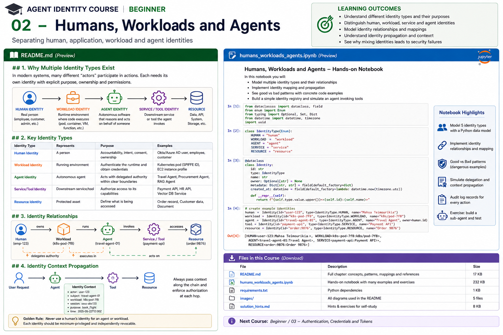

# Beginner 02 — Humans, Workloads and Agents



> **Goal:** learn to model the different identities participating in an agentic system instead of collapsing a user, application, logical agent, runtime workload, tool, and resource into one security principal.

The first course established that agent identity, authentication, authorization, and delegation are different concerns. This chapter goes deeper into **what exactly receives an identity**.

In an enterprise agent system, a single business action can involve a human employee, an interactive client, a logical agent, an orchestration service, a container or serverless workload, several tools, sub-agents, and protected resources. Each exists for a different reason and has a different lifecycle, owner, credential, and authorization boundary.

---

## Learning outcomes

You will be able to:

- distinguish human, application, agent, workload, service/tool, and resource identities;
- explain logical identity versus runtime identity;
- model ownership and delegation separately;
- distinguish an OAuth client from the human using it;
- distinguish a service account from the software using it;
- understand workload identity and attestation at a conceptual level;
- map identity across Kubernetes, cloud, serverless, and agent runtimes;
- preserve identity context through multi-hop calls;
- recognize shared-account, credential-reuse, environment-confusion, and attribution anti-patterns;
- design an agent identity registry.

---

# 1. One action, many actors

Consider a travel assistant:

```text
Employee
   |
   v
Web Application
   |
   v
Travel Agent
   |
   v
Agent Runtime / Pod
   |
   +------> Calendar Tool
   +------> Travel Policy API
   +------> Booking Agent
                    |
                    v
                Booking API
```

"Who made the booking?" has several valid answers:

- the **employee** requested it;
- the **travel agent** decided to invoke a booking capability;
- a particular **runtime workload** executed the code;
- a **booking sub-agent** may have performed a delegated step;
- an OAuth **client/application** obtained a token;
- the **booking API** changed the reservation.

Security architecture needs enough identity information to answer the intended question precisely.

---

# 2. Identity taxonomy

## Human identity

Represents a natural person.

Examples:

- Microsoft Entra ID user;
- Okta workforce user;
- Google Workspace account;
- customer identity;
- privileged administrator.

Typical properties:

```yaml
id: user:alice
employee_id: E-1048
department: finance
manager: user:carol
groups:
  - procurement-requesters
assurance:
  mfa: true
```

Human identities carry organizational meaning: employment status, role, consent, accountability, and ownership.

They should not normally become the runtime identity of autonomous software.

---

## Application / client identity

An application identity represents software registered with an identity provider.

In OAuth terminology, a **client** is an application making protected-resource requests with authorization from a resource owner or on its own behalf.

Examples include:

```text
client:web-travel-portal
client:procurement-backend
client:mcp-client
```

A client registration can have:

- client ID;
- redirect URIs;
- permitted grant types;
- authentication method;
- allowed audiences/scopes;
- owner;
- credentials.

A client ID is not necessarily the identity of a logical AI agent. One application may host several agents, and one agent may execute across several workloads.

---

## Service account / service principal

Platforms often provide non-human identities:

- Microsoft Entra service principals / managed identities;
- AWS IAM roles;
- Google Cloud service accounts;
- Kubernetes ServiceAccounts.

These are useful building blocks, but terminology differs by platform.

A key design question is:

> Does this platform principal identify the logical agent, the deployed application, the workload, or merely a shared execution environment?

Do not assume a service account automatically gives you meaningful **agent-level** attribution.

---

## Logical agent identity

The logical agent represents the autonomous/semi-autonomous software entity as a security actor.

Examples:

```text
agent:travel-planner
agent:refund-specialist
agent:underwriting-assistant
agent:vendor-research
```

Useful metadata includes:

```yaml
id: agent:travel-planner
owner: team:travel-platform
purpose: employee travel planning
risk_tier: medium
production_status: approved
allowed_delegation_depth: 1
```

Why create a distinct logical identity?

Because you may need to:

- assign agent-specific policy;
- disable one agent without disabling its owner;
- distinguish two agents using the same infrastructure;
- audit agent actions;
- constrain delegation;
- bind an agent to approved workloads or versions;
- manage its lifecycle.

---

# 3. Logical agent versus workload

This distinction is fundamental.

A logical agent is a conceptual security actor:

```text
agent:travel-planner
```

A workload is executing software:

```text
Kubernetes pod
ECS task
Lambda invocation/environment
VM process
Cloud Run instance
container
serverless function
```

One logical agent can execute in many environments:

```text
                   agent:travel-planner
                           |
            +--------------+--------------+
            |              |              |
            v              v              v
           DEV           STAGING         PROD
            |              |              |
         workload        workload        workload
```

Production policy should not rely solely on the logical name.

For example:

```text
agent == travel-planner
AND
workload.trust_domain == corp.example
AND
workload.environment == production
```

This allows a system to reject a valid logical agent running from an unapproved environment.

---

# 4. Workload identity

A workload identity is an identity assigned to running software so it can authenticate without embedding long-lived secrets.

Modern patterns favor:

- platform-issued identity;
- attestation;
- short-lived credentials;
- automatic rotation;
- federation into external identity systems.

SPIFFE formalizes this around **SPIFFE IDs**, **SVIDs**, trust domains, and the Workload API.

Conceptually:

```text
Workload starts
     |
     v
Platform / agent attests workload
     |
     v
Identity system verifies selectors/evidence
     |
     v
Short-lived workload credential issued
     |
     v
Workload authenticates to service
```

Later courses build this with SPIFFE/SPIRE.

---

# 5. Workload attestation

The difficult question is not merely "what name should the workload have?"

It is:

> Why should the identity system believe this running process is entitled to that name?

Attestation can use evidence such as:

- Kubernetes namespace;
- Kubernetes ServiceAccount;
- pod labels;
- cloud instance identity;
- VM metadata;
- process information;
- node identity;
- container properties.

Example conceptual registration:

```text
If:
  namespace      = "agents-prod"
  serviceAccount = "travel-agent"
then:
  issue identity = spiffe://corp.example/prod/travel-agent
```

This moves trust away from static secrets baked into code.

---

# 6. SPIFFE ID mental model

A SPIFFE ID is a URI identifying a workload or other entity:

```text
spiffe://corp.example/prod/travel-agent
```

Components:

```text
spiffe://corp.example / prod / travel-agent
       ^ trust domain   ^ path
```

The URI is an identifier, not itself a credential.

An SVID is a verifiable identity document representing the SPIFFE ID. Common profiles include X.509-SVID and JWT-SVID.

That mirrors the distinction from Course 01:

```text
SPIFFE ID = identity
SVID      = evidence / credential
```

---

# 7. Human ownership is not execution identity

A human may own an agent:

```text
Alice ----owns----> Forecast Agent
```

That does not imply:

```text
Forecast Agent == Alice
```

Ownership is a **relationship**, not identity equality.

This distinction becomes important for:

- employee departure;
- team ownership transfer;
- audit;
- separation of duties;
- production support;
- revocation.

Enterprise agents should usually be organizational assets with explicit accountable owners, not shadow identities tied permanently to one employee's credentials.

---

# 8. Delegation is also a relationship

Likewise:

```text
Alice ----delegates----> Travel Agent
```

does not mean the agent becomes Alice.

A useful model is:

```text
identity:
  requester: user:alice
  actor: agent:travel-planner
  workload: spiffe://corp.example/prod/travel-agent

authority:
  delegated_by: user:alice
  task: trip:483
  scopes:
    - itinerary:read
    - flight:search
  expires_at: ...
```

Identity describes actors. Delegation describes authority between actors.

---

# 9. Resource identity

Authorization also needs a stable way to name the thing being protected.

Examples:

```text
document:policy-173
customer:8372
project:atlas
calendar:user:alice
purchase-order:PO-382
tool:create-refund
```

Without resource identity, authorization tends to collapse into coarse rules such as:

```text
agent may call documents_api
```

Fine-grained systems instead ask:

```text
May agent:research,
acting for user:alice,
read document:policy-173?
```

---

# 10. Tools and services are principals too

A tool may be a local function, remote API, MCP server, database facade, or another agent.

Remote services often need identities for both ends of the connection:

```text
Agent Workload --authenticated request--> Tool Service
Agent Workload <--authenticated service--- Tool Service
```

Mutual authentication matters in zero-trust architectures: the agent should also know that it is talking to the intended service.

---

# 11. Identity mapping

Real enterprise systems must map identities between domains.

Example:

```text
Entra user
   |
   | oid = 4f8...
   v
Internal user principal
   |
   | delegates
   v
Logical agent
   |
   | approved deployment mapping
   v
SPIFFE workload
   |
   | federates
   v
Cloud role
```

A mapping should be explicit and auditable.

Dangerous pattern:

```python
cloud_role = f"role/{agent_name}"
```

A name transformation is not proof of entitlement.

Secure mapping requires a trusted issuer, registration, policy, federation rule, or attestation.

---

# 12. Identity propagation

A multi-hop request can lose attribution:

```text
User -> Agent API -> Agent -> Tool Gateway -> Service -> Database
```

If every hop forwards only:

```text
Authorization: Bearer <service-token>
```

the final service may know the immediate caller but not the originating user or logical agent.

The correct solution is **not blindly forward all credentials**.

Instead distinguish:

1. authentication of the immediate caller;
2. trusted representation of upstream subject/actor context;
3. delegated authority;
4. trace/audit context.

Later OAuth courses examine token exchange rather than unsafe token passthrough.

---

# 13. Direct versus indirect identity

Suppose a tool receives:

```text
mTLS peer = workload:tool-gateway
```

but an application-level security context says:

```text
requester = user:alice
actor = agent:travel-planner
```

These are not contradictory.

They answer different questions:

```text
Who directly connected?       workload:tool-gateway
Who initiated business intent? user:alice
Which agent is acting?         agent:travel-planner
```

Production authorization may use all three.

---

# 14. Multi-agent identity

Multi-agent architectures increase the need for explicit identity.

```text
User
 |
 v
Supervisor Agent
 | \
 |  +----> Research Agent
 |
 +-------> Booking Agent
```

Never reduce this to:

```text
user -> "agent system"
```

Preserve:

```text
requester
current actor
parent actor
delegation chain
task
workload
```

A child agent should have independently constrainable authority.

---

# 15. Environment identity

Development and production must not be interchangeable.

Bad:

```text
service-account:travel-agent
```

used everywhere.

Better:

```text
spiffe://corp.example/dev/travel-agent
spiffe://corp.example/staging/travel-agent
spiffe://corp.example/prod/travel-agent
```

or equivalent cloud/platform identities.

Benefits:

- blast-radius reduction;
- clearer policy;
- safer CI/CD;
- independent revocation;
- better audit attribution.

---

# 16. Identity lifecycle differences

Different identity classes have different lifecycle triggers.

| Identity | Created when | Rotated/changed when | Disabled when |
|---|---|---|---|
| Human | join/customer signup | role/security changes | departure/account closure |
| App/client | application registration | credential/config change | application retired |
| Agent | agent onboarding | ownership/risk/purpose changes | agent retired |
| Workload | deployment/runtime | continuously/ephemerally | workload terminates |
| Service/tool | service onboarding | deployment/security changes | service retired |
| Resource | resource creation | ownership/classification change | deletion/archive |

Treating these as one identity creates lifecycle bugs.

---

# 17. Identity registry

An enterprise agent inventory should connect logical identity to governance metadata.

Example:

```json
{
  "id": "agent:travel-planner",
  "owner": "team:employee-experience",
  "purpose": "employee travel planning",
  "risk_tier": "medium",
  "approved_workloads": [
    "spiffe://corp.example/prod/travel-agent"
  ],
  "tools": [
    "tool:travel-policy",
    "tool:flight-search"
  ],
  "status": "active"
}
```

This is not a replacement for an IdP. It is a governance/control-plane view of the agent.

---

# 18. Anti-patterns

## Agent runs as the employee

Using an employee's credentials makes revocation, attribution, least privilege, and automation lifecycle difficult.

## One service account for all agents

You lose independent policy and forensic attribution.

## Same workload identity across environments

A compromised development workload can gain production-equivalent identity.

## Agent name from the prompt

Natural-language claims are not authenticated principal information.

## OAuth client ID == agent identity

Sometimes they map one-to-one, but this must be an architectural decision, not an assumption.

## Service account == workload instance

A platform account may be shared by many runtime instances. Decide what granularity your threat model requires.

## Owner == actor

The team or employee responsible for an agent is not the principal executing each action.

---

# 19. Enterprise reference model

A useful conceptual model is:

```text
+-------------------+
| HUMAN DIRECTORY   |
| users / groups    |
+---------+---------+
          |
          | owns / delegates
          v
+-------------------+
| AGENT REGISTRY    |
| logical agents    |
| owner / purpose   |
| risk / status     |
+---------+---------+
          |
          | approved deployment
          v
+-------------------+
| WORKLOAD IDENTITY |
| attestation       |
| short-lived creds |
+---------+---------+
          |
          | authenticates
          v
+-------------------+
| POLICY / TOOLS    |
| action/resource   |
| authorization     |
+-------------------+
```

The systems may be separate products. The important point is preserving the relationships.

---

# 20. State of the art and tooling

## SPIFFE / SPIRE

SPIFFE defines workload identity standards. SPIRE implements SPIFFE and performs node/workload attestation before issuing identities.

Use it when you need portable workload identity across heterogeneous infrastructure.

## Kubernetes ServiceAccounts

Kubernetes ServiceAccounts provide workload-oriented identities inside Kubernetes and can participate in projected token and federation patterns.

Do not confuse a Kubernetes ServiceAccount name with a complete cross-system identity architecture.

## Cloud workload identity

Major clouds provide secret-reducing workload identity patterns:

- AWS IAM roles for workloads, including roles for EC2/ECS/Lambda and IRSA-style Kubernetes integrations;
- Microsoft Entra managed identities and workload identity federation;
- Google Cloud service accounts and Workload Identity Federation.

The common architectural direction is **platform identity + federation + short-lived credentials**, rather than embedded static secrets.

## IETF WIMSE

The IETF Workload Identity in Multi System Environments work is developing architecture and practices for workload identity across systems. It is highly relevant to agents because agents are ultimately software workloads crossing trust boundaries.

---

# 21. Practical notebook

The notebook builds a small identity registry and demonstrates:

1. multiple identity classes;
2. owner relationships;
3. logical-agent-to-workload mappings;
4. environment isolation;
5. identity propagation;
6. immediate caller versus business actor;
7. multi-agent delegation;
8. shared-service-account attribution failure;
9. lifecycle/revocation behavior;
10. audit records.

---

# 22. Design review checklist

For every enterprise agent ask:

- What is the human/requester identity?
- What is the logical agent identity?
- What workload identity executes it?
- Is the workload identity environment-specific?
- What application/OAuth client identity exists?
- Which tools/services have identities?
- How are resources named?
- Who owns the agent?
- How is owner different from actor?
- How is user-to-agent delegation represented?
- How is agent-to-agent delegation represented?
- How is a workload mapped to an approved logical agent?
- Can one agent be disabled independently?
- Can one deployment environment be disabled independently?
- Are upstream identities preserved without unsafe token forwarding?
- Can audit records distinguish immediate caller, actor, and requester?

---

# 23. Key takeaways

1. A business action can contain several legitimate identities.
2. A human, OAuth client, logical agent, workload, tool, and resource represent different security concepts.
3. Ownership and delegation are relationships, not identity equality.
4. Logical agent identity gives agent-level governance; workload identity proves which software is executing.
5. Workload identity should favor attestation and short-lived credentials.
6. Identity mappings must be explicit and trusted.
7. Preserve requester and actor context across hops without blindly forwarding credentials.
8. Multi-agent systems require stronger, not weaker, identity separation.
9. Environment-specific identity reduces blast radius.
10. Identity lifecycle must match the thing being identified.

---

# References

### Workload identity
- SPIFFE overview: https://spiffe.io/docs/latest/spiffe-about/overview/
- SPIFFE concepts: https://spiffe.io/docs/latest/spiffe-about/spiffe-concepts/
- SPIFFE Workload API: https://spiffe.io/docs/latest/spiffe-specs/spiffe_workload_api/
- SPIRE concepts: https://spiffe.io/docs/latest/spire-about/spire-concepts/

### Standards
- OAuth 2.0 — RFC 6749: https://datatracker.ietf.org/doc/html/rfc6749
- OAuth Token Exchange — RFC 8693: https://datatracker.ietf.org/doc/html/rfc8693
- IETF WIMSE working group: https://datatracker.ietf.org/wg/wimse/about/

### Platform identity
- Kubernetes Service Accounts: https://kubernetes.io/docs/concepts/security/service-accounts/
- Microsoft Entra workload identities: https://learn.microsoft.com/en-us/entra/workload-id/
- AWS IAM roles: https://docs.aws.amazon.com/IAM/latest/UserGuide/id_roles.html
- Google Workload Identity Federation: https://cloud.google.com/iam/docs/workload-identity-federation

### Agent identity
- NIST NCCoE agent identity concept paper: https://csrc.nist.gov/pubs/other/2026/02/05/accelerating-the-adoption-of-software-and-ai-agent/ipd
- OpenFGA agent authorization: https://openfga.dev/docs/use-cases/ai-agent-authorization

---

## Next course

**Beginner 03 — Authentication, Credentials and Tokens**

We next move from *what receives an identity* to *how a principal proves it*: keys, secrets, certificates, JWT/JWS/JWK, bearer versus proof-of-possession credentials, credential validation, expiry, rotation, and the foundations needed before OAuth.
