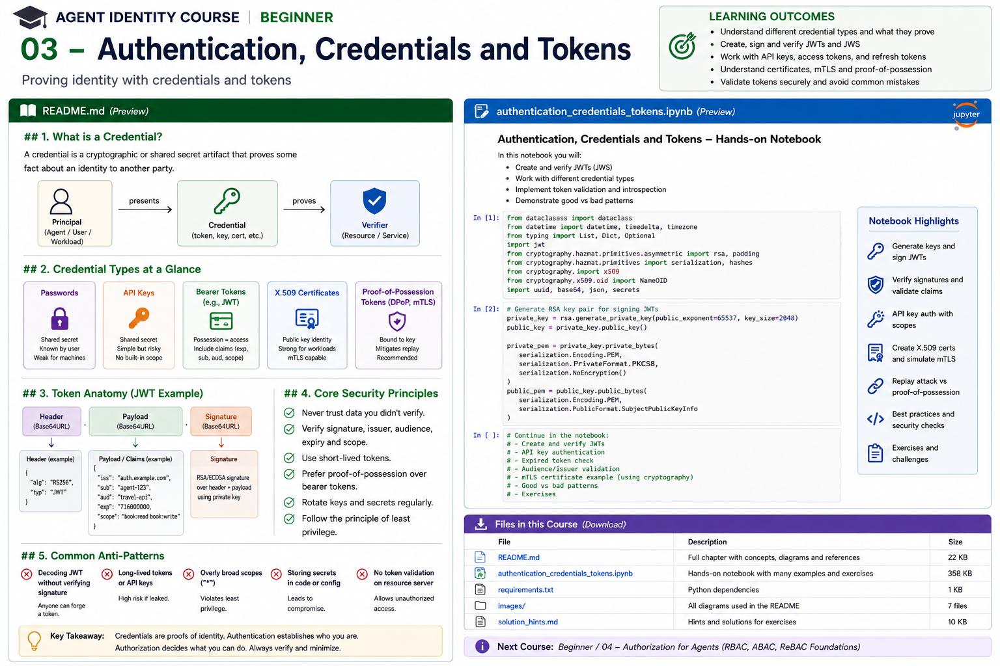

# Beginner 03 — Authentication, Credentials and Tokens



> **Goal:** understand how humans, agents, workloads, and services prove identity, how credentials differ, and how to validate tokens safely before moving into OAuth/OIDC and production workload identity.

Course 01 separated identity, authentication, authorization, and delegation. Course 02 separated human, logical-agent, application, workload, service, and resource identities. This course adds the next layer:

> **How does a principal prove an identity claim?**

The answer is a credential plus a verification process—not an agent name, prompt, decoded JWT payload, or arbitrary metadata.

---

## Learning outcomes

By the end you should be able to:

- distinguish identifiers, secrets, keys, credentials, certificates, and tokens;
- explain shared-secret versus asymmetric authentication;
- explain bearer versus sender-constrained credentials;
- understand JWT, JWS, JWK, and JWKS roles;
- create and verify signed JWTs;
- validate issuer, audience, expiry, not-before, token type, and algorithm;
- explain why decoding a JWT is not authentication;
- understand key IDs and key rotation;
- explain X.509 certificates and mTLS conceptually;
- understand replay attacks and proof-of-possession;
- compare API keys, bearer tokens, signed assertions, certificates, and workload credentials;
- choose safer credential patterns for agents.

---

# 1. Identifier, credential, secret, and key

These terms are often mixed together.

## Identifier

An identifier names a principal:

```text
agent:procurement
user:alice
spiffe://corp.example/prod/refund-agent
```

It is not proof.

## Secret

A secret is confidential data whose possession may authenticate a party:

```text
API key
client secret
password
symmetric signing key
```

Secrets must remain confidential.

## Cryptographic key

A symmetric key is shared by parties.

An asymmetric key pair contains:

```text
private key -> kept secret
public key  -> distributable
```

The private key can create signatures; the public key can verify them.

## Credential

A credential is evidence presented or used to establish a security property about a principal.

Examples:

- password;
- API key;
- signed JWT;
- X.509 certificate plus proof of private-key possession;
- OAuth access token;
- SPIFFE SVID.

---

# 2. Authentication is verification

A robust mental model:

```text
Principal
   |
   | presents credential / proof
   v
Verifier
   |
   +-- validate cryptography
   +-- validate issuer/trust
   +-- validate time
   +-- validate audience
   +-- validate token/profile rules
   |
   v
Authenticated principal
```

Do not start authorization until authentication succeeds.

---

# 3. Shared-secret authentication

A simple API key model:

```text
Agent ----------------> API
       X-API-Key: ...
```

Advantages:

- simple;
- widely supported.

Weaknesses:

- whoever possesses it can normally use it;
- difficult attribution when shared;
- static keys become long-lived standing credentials;
- rotation can be operationally painful;
- accidental logging/exfiltration is common;
- often no built-in audience, expiry, or scope semantics.

An API key is not automatically bad. A **shared, long-lived, overprivileged key embedded in agent code** is.

---

# 4. Asymmetric authentication

With public-key cryptography:

```text
Agent                         Verifier
private key                   public key
    |                             |
    +---- sign challenge -------->|
                                  |
                            verify signature
```

The verifier does not need the private key.

This supports stronger patterns such as:

- signed client assertions;
- certificate authentication;
- mTLS;
- proof-of-possession;
- signed tokens.

Current OAuth security BCP recommends asymmetric client authentication where feasible, including mTLS or `private_key_jwt`.

---

# 5. Bearer credentials

A bearer credential follows the basic rule:

> Whoever bears the credential can use it.

Conceptually:

```text
Authorization: Bearer eyJ...
```

If an attacker steals the token and the resource server accepts it, the attacker can replay it until it expires or is revoked/otherwise invalidated.

Mitigations include:

- TLS;
- short lifetimes;
- narrow audience;
- narrow privileges;
- secure storage;
- preventing tokens from entering prompts/logs;
- sender-constrained tokens where appropriate.

---

# 6. Sender-constrained credentials

A sender-constrained token is bound to a cryptographic key or certificate.

A stolen token alone is insufficient.

```text
Access Token
     +
proof of private key possession
     |
     v
Resource Server
```

Modern OAuth security guidance recommends sender-constraining access tokens where appropriate, using mechanisms such as:

- mutual TLS;
- DPoP (Demonstrating Proof of Possession).

This is particularly interesting for autonomous agents because token replay is a realistic consequence of logs, traces, tool arguments, prompt injection, compromised plugins, or middleware.

---

# 7. JWT is a format, not an authentication strategy

A JSON Web Token is a compact claims container.

Typical signed JWT:

```text
BASE64URL(header)
.
BASE64URL(payload)
.
BASE64URL(signature)
```

Example header:

```json
{
  "alg": "RS256",
  "kid": "agent-key-2026-08",
  "typ": "JWT"
}
```

Example claims:

```json
{
  "iss": "https://identity.example",
  "sub": "agent:procurement",
  "aud": "https://purchasing.example",
  "iat": 1787090000,
  "exp": 1787090300
}
```

A JWT may play different protocol roles:

- access token;
- ID token;
- client assertion;
- workload identity token;
- custom application token.

**Do not infer semantics merely because something is a JWT.**

---

# 8. JWT versus JWS versus JWE

## JWT

Defines claims and token structure.

## JWS

JSON Web Signature provides integrity/authenticity through digital signatures or MACs.

A signed JWT is normally represented as a JWS.

## JWE

JSON Web Encryption protects confidentiality.

A signed JWT is not encrypted merely because it looks unreadable.

Anyone holding a normal signed JWT can generally Base64URL-decode its header and payload.

Therefore:

> Never put secrets in JWT claims just because the token is signed.

---

# 9. Claims that matter

Common registered claims:

| Claim | Meaning |
|---|---|
| `iss` | issuer |
| `sub` | subject |
| `aud` | intended audience |
| `exp` | expiration |
| `nbf` | not valid before |
| `iat` | issued at |
| `jti` | unique token identifier |

For agent identity:

```json
{
  "iss": "https://sts.corp.example",
  "sub": "agent:refund-specialist",
  "aud": "refund-api",
  "exp": 1787090300
}
```

These values are security-relevant only when the verifier validates them according to the expected token profile.

---

# 10. Decoding is not verifying

This is one of the most important practical lessons.

Unsafe:

```python
claims = jwt.decode(token, options={"verify_signature": False})
print(claims["sub"])
```

The payload can be created by anyone.

Safe verification must establish at least the relevant combination of:

```text
signature
algorithm
trusted key
issuer
audience
expiry
not-before
token type/profile
required claims
```

The exact rules depend on the protocol.

---

# 11. Algorithm confusion and allowlists

JWT libraries should not blindly trust an incoming `alg`.

RFC 8725's JWT Best Current Practices requires algorithm verification and recommends explicit application-level algorithm choices.

Conceptually:

```python
jwt.decode(
    token,
    public_key,
    algorithms=["RS256"],
    issuer=EXPECTED_ISSUER,
    audience=EXPECTED_AUDIENCE,
)
```

Do not derive your trusted algorithm set from attacker-controlled token input.

---

# 12. Issuer validation

Suppose two identity systems both issue valid RS256 JWTs.

A cryptographically valid token from the wrong issuer must not authenticate into your security domain.

```text
signature valid != issuer trusted
```

The verifier needs an expected issuer:

```text
iss == https://identity.corp.example
```

and the correct trust material for that issuer.

---

# 13. Audience restriction

Audience answers:

> For which recipient/service is this token intended?

Without audience restriction:

```text
token issued for Analytics API
          |
          | replay
          v
Payments API
```

may become possible if both accept the same token format/key.

Correct:

```text
aud = payments-api
```

and Payments API validates it.

SPIFFE JWT-SVID requires an audience and recommends keeping it narrowly scoped to the intended service.

---

# 14. Time validation

Short-lived credentials reduce exposure.

Relevant claims:

```text
iat -> issued at
nbf -> not valid before
exp -> expires
```

Resource servers should reject expired credentials.

Small clock-skew allowances may be necessary, but large leeway silently extends credential life.

For autonomous workloads, minutes are often preferable to months where infrastructure supports automatic renewal.

---

# 15. Token type confusion

Two JWTs may look almost identical but represent different things:

```text
ID Token
Access Token
Client Assertion
Agent Delegation Token
JWT-SVID
```

A validator must apply **mutually exclusive validation rules** for different token kinds.

RFC 8725 specifically warns about cross-JWT confusion and recommends explicit typing and distinct validation rules.

Never accept an ID token as an API access token merely because its signature verifies.

---

# 16. JWK and JWKS

A JSON Web Key represents cryptographic key material.

Example public RSA JWK:

```json
{
  "kty": "RSA",
  "kid": "2026-08-key-1",
  "use": "sig",
  "alg": "RS256",
  "n": "...",
  "e": "AQAB"
}
```

A JWKS is a set of JWKs:

```json
{
  "keys": [
    {...},
    {...}
  ]
}
```

Why sets?

Key rotation.

```text
token header: kid=key-B
                 |
                 v
             JWKS lookup
                 |
                 v
          public key B
```

---

# 17. Key rotation

A safe issuer must rotate signing keys without breaking all outstanding tokens.

Typical transition:

```text
T0: publish A, sign A
T1: publish A+B, sign B
T2: old A tokens expire
T3: remove A
```

Consumers should support multiple currently valid public keys.

Do not immediately delete an old verification key while valid tokens signed by it still exist.

---

# 18. JWKS trust is not "fetch any URL"

A dangerous anti-pattern is allowing a token to dictate an arbitrary key location and then trusting it.

The verifier should bind:

```text
expected issuer
     |
     v
configured/discovered trusted JWKS
```

not:

```text
attacker token -> attacker URL -> attacker key -> "valid"
```

Treat key-discovery configuration as security-sensitive.

---

# 19. X.509 certificates

An X.509 certificate binds identity-related information to a public key and is signed by a certificate authority.

Conceptually:

```text
Certificate
  subject / SAN
  public key
  validity
  issuer
  extensions
  CA signature
```

Verification includes:

- chain to a trusted CA;
- validity period;
- expected identity/name;
- intended usage;
- revocation/status where applicable;
- proof that the peer possesses the corresponding private key.

A certificate file by itself is not proof of private-key possession.

---

# 20. TLS versus mutual TLS

Ordinary HTTPS commonly authenticates the server:

```text
Client ---- verifies server certificate ----> Server
```

mTLS authenticates both peers:

```text
Client <---- mutual certificate proof ----> Server
```

For workload-to-workload communication this can provide strong, key-bound identity.

SPIFFE X.509-SVIDs are designed to support workload authentication and mTLS-like patterns without provisioning static certificates manually.

---

# 21. SPIFFE SVIDs

SPIFFE separates:

```text
SPIFFE ID -> identity
SVID      -> verifiable identity document
```

Current Workload API profiles include:

- X.509-SVID;
- JWT-SVID;
- WIT-SVID (incubating/optional).

X.509-SVID and JWT-SVID profiles are mandatory in the current Workload API specification, though operators may disable profiles administratively.

SPIRE can obtain evidence about the workload and deliver short-lived SVIDs through the Workload API.

This eliminates many long-lived secret-distribution patterns.

---

# 22. X.509-SVID versus JWT-SVID

## X.509-SVID

Good fit for:

- direct workload-to-workload connections;
- mutual TLS;
- automatic rotation;
- strong proof-of-possession through TLS private keys.

## JWT-SVID

Useful when:

- authentication must cross Layer-7 boundaries;
- a proxy/load balancer makes direct mTLS identity difficult;
- JWT-compatible infrastructure is required.

But JWT-SVID is a bearer-style token and replay must be considered. SPIFFE documentation recommends X.509-SVID where practical because token credentials are susceptible to replay.

---

# 23. Replay attack

Imagine:

```text
Agent -> API
Authorization: Bearer TOKEN-123
```

An attacker obtains `TOKEN-123` from:

- application logs;
- tracing;
- debug output;
- compromised middleware;
- accidental prompt inclusion;
- browser storage;
- network compromise without TLS.

Then:

```text
Attacker -> API
Authorization: Bearer TOKEN-123
```

The API cannot distinguish the attacker from the original bearer based on token possession alone.

Short expiry limits the window; sender constraint changes the proof requirement.

---

# 24. DPoP mental model

DPoP binds an OAuth token to a public key.

The client creates a signed proof for a request.

Conceptually:

```text
client key pair
     |
     +--> token bound to public key
     |
     +--> signed DPoP proof for HTTP request
                    |
                    v
             Resource Server
             validates:
             - token
             - key binding
             - proof
             - request target/method
```

Stealing only the access token is therefore insufficient.

We implement the real protocol later in the OAuth course; here the important concept is **proof of possession**.

---

# 25. Credential comparison

| Credential | Typical proof model | Strengths | Common risks |
|---|---|---|---|
| Password | shared knowledge | human-compatible | phishing/reuse |
| API key | bearer/shared secret | simple | leakage, no built-in expiry |
| Bearer access token | possession | scoped/protocol-friendly | replay |
| Signed JWT assertion | private-key signature | asymmetric | validation mistakes |
| X.509 cert + TLS proof | private-key possession | strong mutual auth | PKI complexity |
| JWT-SVID | signed bearer token | workload-friendly L7 | replay |
| X.509-SVID | cert + private key | short-lived workload identity | direct PKI integration needed |
| DPoP-bound token | token + key proof | replay resistance | implementation complexity |

---

# 26. Credentials should not enter prompts

Never intentionally put credentials into:

```text
system prompts
user prompts
tool descriptions
retrieved documents
model-visible scratchpads
```

The model does not need raw secrets to decide that a tool should be called.

Preferred architecture:

```text
LLM
 |
 | proposes tool call
 v
Trusted Tool Gateway
 |
 | obtains/selects credential
 v
Protected API
```

Credential management belongs outside model context.

---

# 27. Credential broker pattern

A mature agent platform can separate reasoning from credential issuance.

```text
Agent Runtime
     |
     | requests credential for:
     | actor + task + audience
     v
Credential Broker / STS
     |
     | policy
     v
short-lived credential
     |
     v
Target API
```

Later courses add OAuth Token Exchange, workload federation, and task-scoped authorization to this pattern.

---

# 28. Common anti-patterns

### Decode JWT without signature verification
Claims are attacker-controlled.

### Validate signature but not audience
A token may be replayed at the wrong service.

### Validate signature but not issuer
A token from an untrusted domain may be accepted.

### Accept arbitrary algorithms
Creates algorithm-confusion risk.

### Use one symmetric JWT key everywhere
Compromise of any verifier that knows the secret may enable token forgery.

### Put API keys in source code
Creates long-lived secret exposure.

### Put tokens in logs
Turns observability systems into credential stores.

### Months-long workload tokens
Increase compromise window.

### Use ID tokens as access tokens
Creates token-type confusion.

### Trust arbitrary JWKS URLs from token data
Can turn attacker-controlled keys into trusted verification material.

---

# 29. Current best-practice direction

The modern direction is clear:

```text
long-lived shared secret
          |
          v
platform/workload identity
          |
          v
short-lived credential
          |
          v
audience restriction
          |
          v
least privilege
          |
          v
sender constraint where useful
          |
          v
automatic rotation
```

Relevant current standards include:

- JWT BCP — RFC 8725;
- OAuth 2.0 Security BCP — RFC 9700;
- DPoP — RFC 9449;
- OAuth mTLS — RFC 8705;
- SPIFFE X.509-SVID / JWT-SVID and Workload API.

RFC 9700, published in 2025, updates OAuth security practice and recommends sender-constrained access tokens such as mTLS or DPoP where appropriate. It also recommends asymmetric client authentication when feasible.

---

# 30. Practical notebook

The notebook implements:

1. API-key authentication and its limitations;
2. RSA key generation;
3. signed JWT creation;
4. unsafe JWT decoding;
5. correct signature verification;
6. issuer/audience/expiry checks;
7. tampering attack;
8. wrong-audience attack;
9. expired-token attack;
10. algorithm allowlisting;
11. JWK/JWKS construction;
12. signing-key rotation;
13. X.509 certificate generation;
14. certificate inspection;
15. bearer-token replay;
16. simplified proof-of-possession challenge;
17. security test suite.

The lab uses `PyJWT` and `cryptography`, both common Python libraries.

---

# 31. Enterprise review checklist

Before accepting a credential:

- What identity does it represent?
- Who issued it?
- Why is the issuer trusted?
- Is the signature/MAC verified?
- Are algorithms explicitly constrained?
- Is the audience correct?
- Is it currently valid?
- Is the token type correct?
- Are required claims present?
- Is the credential sufficiently short-lived?
- Can it be replayed?
- Is it sender-constrained?
- How are keys rotated?
- Where does trusted JWKS/CA material come from?
- Can it leak into prompts/logs/traces?
- What happens on compromise?
- Can the credential be revoked or allowed to expire quickly?

---

# 32. Key takeaways

1. An identifier is not proof.
2. Decoding is not verification.
3. Signature verification alone is not complete token validation.
4. Issuer, audience, time, algorithm, and token profile matter.
5. Bearer tokens can be replayed when stolen.
6. Proof-of-possession binds use to cryptographic key material.
7. Short-lived, automatically rotated credentials reduce standing risk.
8. X.509 and JWT credentials have different operational properties.
9. Credentials belong in trusted infrastructure, not model context.
10. Agent platforms should move toward workload identity and credential brokering rather than embedded secrets.

---

# References

- JWT — RFC 7519: https://www.rfc-editor.org/rfc/rfc7519
- JWS — RFC 7515: https://www.rfc-editor.org/rfc/rfc7515
- JWK — RFC 7517: https://www.rfc-editor.org/rfc/rfc7517
- JWT Best Current Practices — RFC 8725: https://www.rfc-editor.org/rfc/rfc8725
- OAuth Bearer Token Usage — RFC 6750: https://www.rfc-editor.org/rfc/rfc6750
- OAuth mTLS — RFC 8705: https://www.rfc-editor.org/rfc/rfc8705
- DPoP — RFC 9449: https://www.rfc-editor.org/rfc/rfc9449
- OAuth 2.0 Security BCP — RFC 9700: https://www.rfc-editor.org/rfc/rfc9700
- SPIFFE Workload API: https://spiffe.io/docs/latest/spiffe-specs/spiffe_workload_api/
- SPIFFE X.509-SVID: https://spiffe.io/docs/latest/spiffe-specs/x509-svid/
- SPIFFE JWT-SVID: https://spiffe.io/docs/latest/spiffe-specs/jwt-svid/
- SPIFFE Working with SVIDs: https://spiffe.io/docs/latest/deploying/svids/

---

## Next course

**Beginner 04 — Authorization for Agents**

We move from proving identity to deciding authority: RBAC, ABAC, ReBAC, capabilities, subject/action/resource/context modeling, default deny, policy decision/enforcement points, and the foundations for OPA, Cedar, and OpenFGA.
