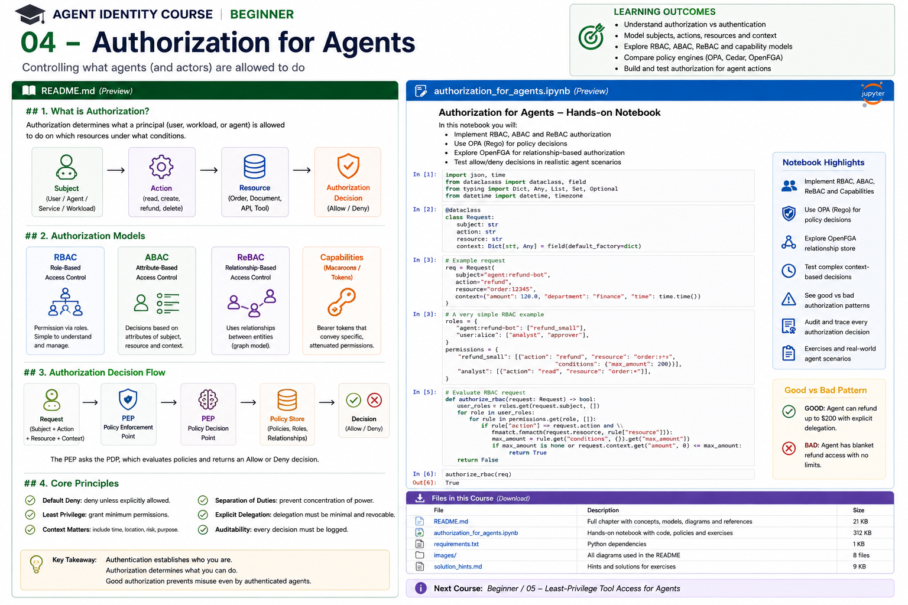

# Beginner 04 — Authorization for Agents



> **Goal:** learn how to decide what an authenticated agent may do, on which resource, under which conditions—and why agentic systems need finer-grained authorization than traditional application roles.

Authentication answers:

> **Who is the caller?**

Authorization answers:

> **May this principal perform this action on this resource in this context?**

For agents, this question becomes more important because the software can autonomously choose actions, invoke tools, traverse resources, and delegate work. A model deciding that a tool call is useful is **not** the same thing as a security system deciding that the tool call is authorized.

---

## Learning outcomes

By the end of this course you should be able to:

- model authorization as principal/subject + action + resource + context;
- distinguish authentication from authorization;
- implement default-deny authorization;
- explain RBAC, ABAC, ReBAC, and capability-based authorization;
- understand where each model works well and where it becomes difficult;
- preserve requester, actor, workload, task, and delegation context;
- design PEP/PDP architectures;
- distinguish policy from enforcement;
- model explicit agent delegation;
- understand task-scoped authorization;
- prevent privilege amplification through sub-agents;
- reason about separation of duties and high-risk actions;
- compare OPA/Rego, Cedar, and OpenFGA at an architectural level;
- build authorization regression tests.

---

# 1. Authorization starts after authentication

Suppose Course 03 authenticated:

```text
actor = agent:refund-specialist
workload = spiffe://corp.example/prod/refund-agent
```

That proves something about the caller.

It does **not** answer whether the caller can:

```text
read order:123
refund order:123
refund CAD 5,000
delete order:123
read customer:999
```

A secure system performs a second decision.

```text
authenticated principal
        |
        v
authorization request
        |
        v
policy evaluation
        |
    +---+---+
    |       |
  ALLOW    DENY
```

---

# 2. The authorization tuple

A useful generic model is:

```text
(principal, action, resource, context)
```

Cedar calls this **PARC**:

```text
Principal
Action
Resource
Context
```

For an agent:

```json
{
  "principal": "agent:refund-specialist",
  "action": "refund",
  "resource": "order:123",
  "context": {
    "requester": "user:alice",
    "amount": 120,
    "task_id": "task:refund-928",
    "risk": "low"
  }
}
```

Cedar's current authorization model explicitly evaluates principal, action, resource, and request context, with default deny when no permit policy applies. Its `forbid` policies override permits. 

Agent systems often need additional first-class application data:

```text
requester
actor
workload
delegation
task
purpose
approval
risk
```

Do not hide these inside a prompt.

---

# 3. Default deny

A foundational rule:

```text
if no rule grants authority:
    DENY
```

Unsafe:

```python
if dangerous:
    deny()
else:
    allow()
```

This assumes every unrecognized case is safe.

Better:

```python
allowed = False

if explicit_policy_matches:
    allowed = True
```

Cedar uses default-deny semantics. OPA/Rego commonly expresses the same design explicitly:

```rego
default allow := false
```

For agents, default deny matters because new tools and actions may appear over time. An unknown capability should not silently become available.

---

# 4. Subject, requester, actor, and workload

A traditional authorization request often has one principal.

Agentic workflows may require several identities:

```text
requester = user:alice
actor     = agent:refund-specialist
workload  = spiffe://corp.example/prod/refund-agent
```

Questions can differ:

```text
Is Alice allowed to request refunds?
Is this agent allowed to execute refunds?
Is this workload approved to host the agent?
Did Alice delegate this action?
Is this particular order in scope?
```

A robust policy may require all of them.

---

# 5. RBAC — Role-Based Access Control

RBAC assigns permissions to roles and principals to roles.

```text
Agent
  |
  v
Role
  |
  v
Permissions
```

Example:

```text
agent:refund-bot
    -> role:refund-agent

role:refund-agent
    -> order:read
    -> refund:create
```

### Strengths

- simple mental model;
- familiar enterprise administration;
- efficient for stable job functions;
- easy to audit at coarse granularity.

### Weaknesses for agents

Roles can become too broad.

Suppose:

```text
refund-agent -> refund:any-order
```

but the real requirement is:

```text
refund order:123
only for user:alice
only for task:928
only <= CAD 200
only until 15:00
```

Trying to encode every combination as roles creates **role explosion**.

RBAC remains useful—but is often only one layer.

---

# 6. ABAC — Attribute-Based Access Control

ABAC evaluates attributes of principals, resources, actions, and environment/context.

Example:

```text
ALLOW refund IF
  actor.type == "agent"
  AND actor.department == "customer-service"
  AND resource.region == actor.region
  AND context.amount <= 200
  AND context.risk == "low"
```

Attributes might include:

### Principal

```text
department
clearance
risk_tier
agent_type
environment
certification
```

### Resource

```text
owner
classification
region
tenant
sensitivity
```

### Context

```text
time
amount
device posture
MFA
task
purpose
risk score
approval state
```

ABAC is powerful for dynamic enterprise constraints.

---

# 7. Context is request-specific

Do not turn context into a dumping ground.

A useful distinction:

```text
principal.department -> principal attribute
resource.owner       -> resource attribute
context.amount       -> request-specific
context.current_time -> request-specific
context.mfa          -> session/request-specific
```

Current Cedar guidance similarly recommends keeping principal/resource information on those entities and using context for request-specific facts. It explicitly notes acting-agent information as a valid context use case in appropriate models.

---

# 8. ReBAC — Relationship-Based Access Control

ReBAC makes relationships central.

Instead of:

```text
Alice has role project-reader
```

you can model:

```text
Alice --member--> Project Atlas
Project Atlas --contains--> Document 17
```

Then infer:

```text
Alice can read Document 17
```

For agents:

```text
Alice
  |
  | can_act_on_behalf_of
  v
Refund Agent
  |
  | assigned
  v
Task 928
  |
  | targets
  v
Order 123
```

Graph-shaped authorization maps naturally to many agent workflows.

---

# 9. Why ReBAC is important for agents

Agent systems contain relationships such as:

```text
user owns workspace
agent acts for user
agent assigned to task
task targets resource
workspace contains document
agent delegates to sub-agent
tool belongs to server
document belongs to tenant
```

OpenFGA's current agent authorization guidance explicitly recommends:

- agents as first-class principals;
- explicit delegation rather than copied permissions;
- bounded scope;
- task-based authorization;
- authorization-aware RAG;
- MCP authorization.

This is one reason ReBAC is increasingly relevant to agent architectures.

---

# 10. Capability-based authorization

A capability represents authority to perform a particular operation.

Conceptually:

```text
Capability:
  action: refund
  resource: order:123
  max_amount: 200
  expires: 15:00
```

Possession of a valid capability authorizes the operation.

Capabilities can be designed to be:

- narrowly scoped;
- delegable;
- attenuable;
- expiring;
- cryptographically protected.

The conceptual difference from an identity-centric query is:

```text
ACL/RBAC:
"What may principal X do?"

Capability:
"What authority does this presented capability convey?"
```

Real systems can combine both.

---

# 11. Capability attenuation

A parent capability:

```text
read/write project:atlas
expires in 1 hour
```

can delegate a narrower child:

```text
read project:atlas/document:17
expires in 10 minutes
```

but should not create:

```text
admin all-projects
expires next year
```

Again:

```text
authority(child) ⊆ authority(parent)
```

This is useful for sub-agent delegation.

---

# 12. Comparing authorization models

| Model | Core idea | Strong fit | Agent challenge |
|---|---|---|---|
| RBAC | roles grant permissions | stable job functions | role explosion |
| ABAC | evaluate attributes | dynamic conditions | policy/data complexity |
| ReBAC | infer from relationships | graph-shaped sharing/delegation | relationship modeling |
| Capabilities | possession conveys bounded authority | delegation/task grants | issuance/revocation design |

These are not mutually exclusive.

A production agent platform may use:

```text
RBAC
  +
ABAC guardrails
  +
ReBAC resource relationships
  +
task-scoped capabilities
```

---

# 13. Policy Enforcement Point and Policy Decision Point

Separate:

```text
Who intercepts the action?
```

from:

```text
Who decides whether it is allowed?
```

Architecture:

```text
LLM / Agent
    |
    | proposes tool call
    v
+----------------------+
| PEP                  |
| Tool Gateway         |
+----------+-----------+
           |
           | structured authorization request
           v
+----------------------+
| PDP                  |
| Policy Engine        |
+----------+-----------+
           |
      allow / deny
           |
           v
+----------------------+
| Protected Tool/API   |
+----------------------+
```

OPA explicitly uses this model: applications act as PEPs and query OPA as a PDP. OPA can be deployed near enforcement points to reduce latency and improve resilience.

---

# 14. The LLM is not the PDP

Bad:

```text
SYSTEM:
You are allowed to refund orders below $200.
Never refund anything else.
```

The model can still generate:

```json
{
  "tool": "refund",
  "order": "123",
  "amount": 900
}
```

The model's output is a **proposal**.

Trusted code must enforce:

```python
decision = authorize(...)

if not decision.allowed:
    reject()
```

Prompt instructions can guide behavior. They cannot replace authorization.

---

# 15. Policy as code

Hard-coded authorization:

```python
if user.department == "finance" and amount < 200:
    allow()
```

becomes difficult to manage across dozens of agents/services.

Policy-as-code separates policy from application logic:

```text
Application
    |
    | authorization query
    v
Policy Engine
    |
    | versioned policy
    v
Decision
```

Benefits include:

- central reasoning;
- reviewable changes;
- testing;
- version control;
- reuse;
- decision logging;
- policy ownership.

---

# 16. OPA and Rego

Open Policy Agent is a general-purpose policy engine and CNCF graduated project.

OPA:

- accepts structured input;
- evaluates policy written in Rego;
- returns structured decisions;
- separates decision from enforcement;
- can run as sidecar, daemon, service, or embedded library;
- supports decision logging and bundles.

Example conceptual Rego:

```rego
package agent.authz

default allow := false

allow if {
    input.actor == "agent:refund-specialist"
    input.action == "refund"
    input.amount <= 200
    input.resource.tenant == input.requester.tenant
}
```

OPA is strong when authorization is part of a broader policy-as-code platform or when complex JSON/context evaluation matters.

A dedicated later course will implement OPA deeply.

---

# 17. Cedar

Cedar is an authorization policy language designed around:

```text
principal
action
resource
context
```

Example:

```cedar
permit (
    principal is Agent,
    action == Action::"refund",
    resource is Order
)
when {
    context.amount <= 200
};
```

Cedar supports:

- explicit `permit`;
- explicit `forbid`;
- entity attributes;
- entity hierarchies;
- context;
- schemas;
- policy templates.

Its current decision semantics are:

```text
matching forbid -> DENY
else matching permit -> ALLOW
else -> DENY
```

This gives explicit default deny and deny-overrides behavior.

A later course will implement Cedar and schema-based policy validation in depth.

---

# 18. OpenFGA

OpenFGA is focused on relationship-based authorization inspired by Zanzibar-style models.

Agent-oriented relationships might look conceptually like:

```text
agent:refund
  can_act_on_behalf_of
user:alice

agent:refund
  assigned
task:928

task:928
  target
order:123
```

A check asks:

```text
Can agent:refund perform refund on order:123?
```

OpenFGA's 2026 documentation now contains explicit AI-agent authorization and task-based authorization guidance.

This makes it especially relevant when access depends on graph relationships, sharing, resource containment, delegation, or task membership.

---

# 19. OPA vs Cedar vs OpenFGA

They overlap but optimize for different modeling styles.

| Tool | Primary strength | Mental model |
|---|---|---|
| OPA/Rego | general policy over structured data | evaluate rules against JSON/data |
| Cedar | application authorization policies | principal/action/resource/context |
| OpenFGA | relationship-based authorization | graph of tuples/relations |

A simplistic "which is best?" answer is usually wrong.

Ask instead:

```text
What authorization facts dominate our system?
```

If the problem is:

```text
complex request/context policy
```

OPA may fit well.

If it is:

```text
typed application authorization with explicit entities
```

Cedar may fit well.

If it is:

```text
resource relationships and delegated graph access
```

OpenFGA may fit well.

Enterprises may combine them, but every additional authorization system adds operational and reasoning complexity.

---

# 20. Task-scoped authorization

Agents frequently need authority only for one task.

Bad:

```text
agent:ticket-bot
    can create tickets in every project forever
```

Better:

```text
task:928
  actor: agent:ticket-bot
  action: ticket:create
  resource: project:atlas
  expires: 14:30
```

OpenFGA's current task-based authorization guidance describes agents beginning without standing permissions and receiving narrow task-specific access.

This aligns well with zero-standing-privilege goals.

---

# 21. Delegation must be explicit

Unsafe:

```text
agent permissions = user permissions
```

Better:

```text
user:alice
   |
   | delegates
   v
agent:travel
   |
   | task-scoped subset
   v
flight:search
```

Delegation should answer:

- who delegated?
- to whom?
- what action?
- what resource?
- for which task?
- for how long?
- under what constraints?
- may it be re-delegated?

---

# 22. Multi-agent authorization

Consider:

```text
User
 |
 v
Supervisor
 |
 +----> Research Agent
 |
 +----> Booking Agent
```

A common failure:

```text
all child agents inherit supervisor credentials
```

Now every child receives the supervisor's entire authority.

Instead:

```text
Supervisor
   |
   +--> Research Agent
   |      read travel policy
   |
   +--> Booking Agent
          reserve selected flight
          trip:483 only
          <= CAD 1,000
```

Each delegation is separately constrained.

---

# 23. Privilege amplification

A critical invariant:

```text
authority(child) <= authority(parent)
```

Suppose:

```text
Parent:
  read project:atlas

Child request:
  delete project:atlas
```

The delegation engine must reject it.

The same applies to:

```text
resource scope
amount
time
tool
tenant
environment
delegation depth
```

---

# 24. Separation of duties

Some actions should require multiple independent authorities.

Example:

```text
agent creates payment
      |
      v
different principal approves payment
```

Policy:

```text
creator != approver
```

For high-risk autonomous systems:

```text
Agent proposes
Human approves
Service executes
```

or:

```text
Agent A prepares
Agent B validates
Human approves
```

Identity separation only helps if authorization enforces the separation.

---

# 25. Risk-adaptive authorization

An authorization decision can incorporate risk:

```text
amount = 20
risk = low
-> allow

amount = 8,000
risk = high
-> require approval
```

Instead of binary policy logic alone, a PDP may return:

```json
{
  "decision": "conditional",
  "obligations": [
    "require_human_approval"
  ]
}
```

Whether a specific engine directly supports obligations varies; applications can model them around the decision architecture.

---

# 26. Tool-level versus resource-level authorization

This is too coarse:

```text
agent may call Google Drive tool
```

The tool can expose thousands of resources.

Prefer:

```text
agent may:
  read folder:project-atlas
  create file in folder:project-atlas
  not read folder:executive
```

For MCP and RAG, this distinction is essential:

```text
tool access != resource access
```

Later courses cover MCP and RAG authorization separately.

---

# 27. Authorization-aware RAG

Unsafe:

```text
retrieve top-k documents
       |
       v
send to LLM
       |
       v
check user permission
```

Too late—the model has already seen the content.

Correct:

```text
query
  |
  v
retrieve candidates
  |
  v
authorization filter
  |
  v
authorized context
  |
  v
LLM
```

Authorization must occur before protected content enters model context.

---

# 28. Policy decision evidence

An authorization event should record enough to explain a decision.

Example:

```json
{
  "requester": "user:alice",
  "actor": "agent:refund-specialist",
  "workload": "spiffe://corp.example/prod/refund",
  "action": "refund",
  "resource": "order:123",
  "task": "task:928",
  "decision": "allow",
  "policy_version": "2026.08.18.3",
  "reason": "delegated refund <= 200",
  "trace_id": "..."
}
```

OPA supports decision logs containing policy input and result, with mechanisms for masking sensitive fields.

Auditability should be designed into authorization, not added after an incident.

---

# 29. Policy testing

Authorization deserves software-engineering discipline.

Test:

```text
positive cases
negative cases
boundary cases
missing attributes
wrong tenant
wrong actor
wrong workload
expired delegation
excess amount
unknown action
unknown resource
child privilege amplification
```

The most important tests are often the DENY cases.

---

# 30. Fail-open versus fail-closed

Suppose the PDP is unavailable.

Option A:

```text
authorization unavailable -> ALLOW
```

Option B:

```text
authorization unavailable -> DENY
```

For sensitive actions, fail-open can turn an outage into a security bypass.

But fail-closed has availability implications.

Production architecture should explicitly classify actions:

```text
read public catalog -> perhaps degraded mode
transfer money      -> fail closed
delete customer     -> fail closed
```

Do not let network exception handling accidentally define security policy.

---

# 31. Common anti-patterns

## Authentication == authorization

```text
JWT valid -> allow everything
```

Wrong.

## Role explosion

Thousands of task/resource-specific roles indicate RBAC is being stretched beyond its natural fit.

## User permission cloning

The agent silently receives the user's complete permission set.

## Authorization in prompts

The model is not the enforcement boundary.

## Shared super-agent role

Every agent runs with broad platform authority.

## Tool-level permission only

Calling a tool does not imply access to every resource behind it.

## Authorization after retrieval

Protected data reaches the model before permission filtering.

## Child agents inherit all parent authority

Creates privilege amplification.

## Policy without audit evidence

You cannot later explain why an autonomous action happened.

---

# 32. Current direction in agent authorization

NIST's February 2026 NCCoE concept paper explicitly identifies authorization, auditing, non-repudiation, standards, technologies, and controls for software/AI agents as areas needing enterprise guidance.

At the same time, authorization technologies are becoming more agent-aware. OpenFGA now documents first-class agent principals, explicit delegation, task-scoped access, RAG authorization, and MCP authorization.

The architectural trend is:

```text
authenticated agent identity
        +
explicit requester/actor separation
        +
resource-level authorization
        +
bounded delegation
        +
task-scoped privilege
        +
policy outside the LLM
        +
decision evidence
```

---

# 33. Practical notebook

The accompanying notebook builds a refund-agent authorization system and implements:

1. default deny;
2. RBAC;
3. RBAC role-explosion example;
4. ABAC;
5. ReBAC graph relationships;
6. capability-style grants;
7. PEP/PDP separation;
8. requester + actor authorization;
9. task-scoped delegation;
10. delegation attenuation;
11. multi-agent sub-delegation;
12. separation of duties;
13. authorization-aware retrieval;
14. audit evidence;
15. adversarial regression tests;
16. policy-engine comparison exercises.

The notebook implements the models directly in Python first so you can see their semantics. Dedicated later courses use production engines.

---

# 34. Enterprise design checklist

Before an agent action executes:

- Is the caller authenticated?
- What is the logical actor?
- What workload is executing it?
- Who initiated the task?
- What exact action is proposed?
- What exact resource is targeted?
- What context affects the decision?
- Is there explicit delegation?
- Is the delegation still valid?
- Is authority task-scoped?
- Is the child authority no broader than the parent?
- Does the action cross tenant boundaries?
- Does it require approval?
- Is the PEP outside the model?
- What happens if the PDP fails?
- Is the decision logged?
- Can policy be tested and versioned?
- Is protected RAG/tool data filtered before model exposure?

---

# 35. Key takeaways

1. Authentication establishes identity; authorization controls authority.
2. Default deny is essential for evolving agent capabilities.
3. Agent authorization often requires requester, actor, workload, task, and resource.
4. RBAC, ABAC, ReBAC, and capabilities solve different classes of problems.
5. Agent workflows are often graph-shaped, making ReBAC especially relevant.
6. Task-scoped authorization reduces standing privilege.
7. Delegation should be explicit, revocable, expiring, and attenuated.
8. The LLM proposes actions; a PEP enforces PDP decisions.
9. Authorization should happen before protected data enters model context.
10. Every important autonomous decision should produce auditable evidence.

---

# References

## Current agent identity / authorization
- NIST NCCoE — Agent Identity and Authorization concept paper  
  https://csrc.nist.gov/pubs/other/2026/02/05/accelerating-the-adoption-of-software-and-ai-agent/ipd
- OpenFGA — AI Agent Authorization  
  https://openfga.dev/docs/use-cases/ai-agent-authorization
- OpenFGA — Task-Based Authorization  
  https://openfga.dev/docs/modeling/agents/task-based-authorization

## OPA
- Open Policy Agent documentation  
  https://www.openpolicyagent.org/docs
- Rego policy language  
  https://www.openpolicyagent.org/docs/policy-language
- OPA deployment / PDP architecture  
  https://www.openpolicyagent.org/docs/deploy
- OPA decision logs  
  https://www.openpolicyagent.org/docs/management-decision-logs

## Cedar
- Cedar Policy Language  
  https://docs.cedarpolicy.com/
- Cedar authorization semantics  
  https://docs.cedarpolicy.com/auth/authorization.html
- Cedar entities and context  
  https://docs.cedarpolicy.com/auth/entities-syntax.html

## Authorization foundations
- NIST RBAC project  
  https://csrc.nist.gov/projects/role-based-access-control
- NIST SP 800-162 — Attribute Based Access Control  
  https://csrc.nist.gov/pubs/sp/800/162/upd2/final

---

## Next course

**Beginner 05 — Least-Privilege Tool Access for Agents**

The next chapter applies authorization to the agent's most dangerous boundary: tools. We will design tool catalogs, permissions, scopes, high-risk action classes, tool gateways, runtime enforcement, argument-level constraints, approvals, and least-privilege access.
