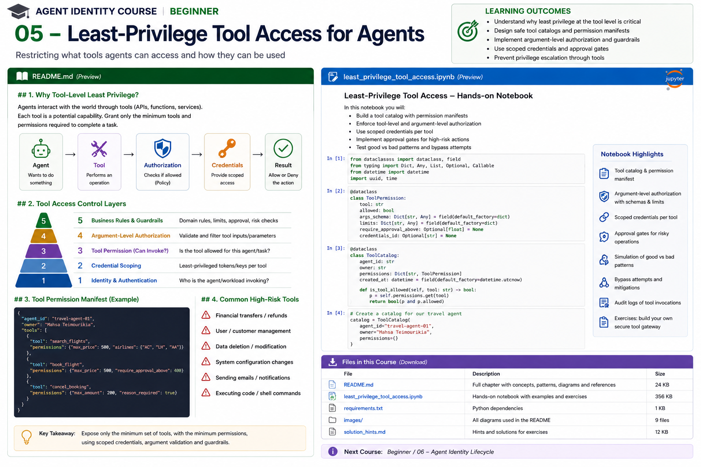

# Beginner 05 — Least-Privilege Tool Access for Agents



> **Goal:** design the agent/tool boundary so an agent receives only the tools, operations, resources, arguments, credentials, and execution authority required for the current task.

Agents become operationally powerful through **tools**:

```text
LLM
 |
 +--> search
 +--> database
 +--> email
 +--> ticketing
 +--> payments
 +--> cloud administration
 +--> code execution
```

The security question is therefore not merely:

> Can this agent call this tool?

A production system should ask:

> Can this authenticated agent, acting for this requester and task, invoke this operation on this resource with these arguments, using this credential, at this time, without violating approval, risk, rate, egress, or delegation constraints?

That is **least-privilege tool access**.

---

# Learning outcomes

You will learn to:

- distinguish tool discovery, invocation, and resource authorization;
- create a tool catalog and security metadata;
- classify tools by impact and blast radius;
- expose tools dynamically instead of giving every agent every tool;
- enforce tool-level and resource-level authorization;
- validate arguments independently of model output;
- constrain amounts, destinations, commands, paths, tenants, and recipients;
- separate read, write, destructive, financial, administrative, and external actions;
- isolate credentials from model context;
- use scoped credentials and credential brokers;
- design approval gates for high-impact actions;
- implement rate, retry, egress, and tool-chain budgets;
- prevent privilege escalation through legitimate tools;
- understand current MCP authorization patterns;
- audit tool invocations and authorization evidence.

---

# 1. Why tools are a security boundary

An LLM by itself normally produces data.

A tool turns model output into effects.

```text
"Delete account 483"
```

is text until an execution component converts it into:

```http
DELETE /accounts/483
```

That transition is a trust boundary.

```text
UNTRUSTED / PROBABILISTIC
Agent reasoning
      |
      | proposed invocation
      v
---------------- TRUST BOUNDARY ----------------
      |
Tool Gateway / Enforcement
      |
      v
REAL-WORLD EFFECT
```

Never make the model the final enforcement mechanism.

---

# 2. Least agency and least privilege

Traditional least privilege says:

> Give a principal only the authority required to perform its function.

For agents, extend this to **least agency**:

```text
minimum tools
+
minimum operations
+
minimum resources
+
minimum arguments/ranges
+
minimum credential privilege
+
minimum duration
+
minimum delegation depth
+
minimum autonomous impact
```

OWASP's current AI Agent Security guidance recommends minimum task-specific tools, per-tool permission scoping, explicit authorization for sensitive operations, human oversight for high-impact actions, structured outputs, and hard limits on retries/tool chains.

The 2026 OWASP Agentic Top 10 goes further: per-tool least-privilege profiles should include scopes, maximum rates, egress allowlists, and minimal CRUD capabilities.

---

# 3. Tool catalog

Treat tools as governed assets rather than arbitrary Python functions.

Example catalog:

```yaml
tools:
  - id: tool:orders.read
    owner: team:commerce
    risk: low
    effect: read
    credential_profile: orders-readonly

  - id: tool:refund.create
    owner: team:payments
    risk: high
    effect: financial
    credential_profile: refunds-limited

  - id: tool:customer.delete
    owner: team:customer-platform
    risk: critical
    effect: destructive
    approval: human
```

Useful metadata:

```text
owner
description
version
risk class
effect type
allowed agents
allowed resources
argument schema
credential profile
approval requirements
rate limits
egress policy
audit requirements
```

---

# 4. Tool risk classification

A useful starting taxonomy:

| Class | Examples | Typical controls |
|---|---|---|
| Read-only | search, lookup | authz, resource filter |
| Internal write | update ticket | scoped write + validation |
| External communication | email, Slack send | recipient/content controls |
| Financial | refund, purchase | amount limit + approval |
| Destructive | delete, revoke | strong approval / deny |
| Administrative | IAM/config change | privileged workflow |
| Code execution | shell/Python | sandbox + strict policy |
| Credential/security | rotate key, grant role | highly restricted |

Do not classify a tool only by its name.

A "search" tool that can send arbitrary outbound HTTP requests may have substantial egress risk.

---

# 5. Tool exposure is itself a control

Bad:

```python
tools = ALL_REGISTERED_TOOLS
```

Every prompt exposes:

```text
read_customer
update_customer
delete_customer
send_email
execute_shell
create_admin
transfer_money
...
```

Better:

```text
Agent identity + task + requester
               |
               v
      authorization filter
               |
               v
        allowed tool set
               |
               v
              LLM
```

The model should ideally see only the tools relevant and authorized for the current task.

This reduces:

- accidental selection;
- prompt-injection attack surface;
- tool confusion;
- unnecessary autonomy;
- blast radius.

But filtering discovery is **not sufficient**. Authorization must be checked again at execution.

---

# 6. Discovery authorization versus execution authorization

A secure design performs at least two controls:

```text
1. DISCOVERY
Which tools may this agent see?

2. EXECUTION
May this exact invocation execute now?
```

Why re-check?

Because between discovery and execution:

```text
permission may be revoked
task may expire
risk may change
resource may differ
arguments may exceed limits
approval may be absent
```

Current OpenFGA MCP guidance recommends exactly this pattern: filter the tool list to authorized tools and check authorization again when the tool is invoked. citeturn0search0turn0search1

---

# 7. Tool-level authorization is not enough

Suppose:

```text
agent can_call tool:drive
```

The tool can access:

```text
folder:project-atlas
folder:executive
folder:legal
folder:payroll
```

Tool permission alone is too coarse.

You also need:

```text
tool:drive
resource:folder:project-atlas
action:file:read
```

OpenFGA's current agent guidance explicitly separates tool authorization from resource-level permission checks. citeturn0search0

---

# 8. Argument-level authorization

This is one of the most important agent controls.

Consider:

```python
refund(order_id, amount)
```

Tool-level check:

```text
agent may call refund
```

is not enough.

You also need:

```text
order_id belongs to authorized tenant
amount <= 200
currency == CAD
reason in allowed set
task targets order_id
```

Or:

```python
send_email(to, subject, body)
```

may require:

```text
recipient domain in allowlist
no BCC
attachment classification <= internal
max recipients <= 5
human approval if external
```

The tool gateway must validate arguments after model generation and before execution.

---

# 9. Schema validation versus authorization

Schema validation:

```json
{
  "amount": 9000
}
```

may be perfectly valid according to:

```text
amount: number
```

but unauthorized according to:

```text
amount <= 200
```

Therefore:

```text
valid syntax != authorized operation
```

You need both.

---

# 10. Parameter allowlists

Prefer allowlists for sensitive arguments.

Bad:

```python
execute(command: str)
```

Better:

```python
restart_service(service: Literal[
    "catalog-api",
    "search-api"
])
```

Bad:

```python
http_request(url: str)
```

Better:

```text
allowed hosts:
  api.internal.example
  search.partner.example
```

Bad:

```python
read_file(path)
```

Better:

```text
root = /workspace/task-928
deny traversal
deny symlink escape
```

The more general the tool, the more difficult safe authorization becomes.

---

# 11. Avoid "god tools"

A tool such as:

```text
execute_shell(command)
```

can subsume hundreds of capabilities.

So can:

```text
sql(query)
http_request(method, url, body)
cloud_api(service, operation, params)
python(code)
```

These tools create very large action spaces.

If they are necessary:

```text
sandbox
allowlist
network isolation
filesystem isolation
resource limits
credential isolation
command restrictions
audit
```

OWASP explicitly warns against unrestricted shell access and recommends sandboxing arbitrary code execution. citeturn0search2turn0search10

---

# 12. Separate read and write capabilities

Avoid:

```text
tool:customer_database
```

Prefer:

```text
tool:customer.read
tool:customer.update_contact
tool:customer.add_note
tool:customer.delete
```

Why?

Because:

```text
read != modify != delete
```

Separating effects improves:

- policy clarity;
- credential scoping;
- approval logic;
- audit;
- model tool selection;
- blast-radius control.

---

# 13. Separate planning from execution

A powerful pattern:

```text
Agent plans:
"Refund CAD 120 to order 123"
         |
         v
Structured proposal
         |
         v
Policy / validation / approval
         |
         v
Executor
```

Instead of:

```text
LLM directly owns payment credential
```

This is especially important for:

```text
payments
external communication
deletion
IAM changes
production deployment
customer-impacting actions
```

OWASP's current agent guidance recommends separating decision-making from execution for irreversible operations. citeturn0search2

---

# 14. Credentials must be narrower than the tool

Suppose the gateway correctly decides:

```text
agent may read project Atlas
```

but then calls GitHub using a token with:

```text
admin access to every repository
```

The authorization layer reduces logical access, but credential compromise still has a huge blast radius.

Defense in depth:

```text
Agent policy
     |
     v
Tool Gateway
     |
     v
Scoped Credential
     |
     v
External API
```

The downstream credential should be as narrow as practical.

---

# 15. Credential isolation

The model should not receive:

```text
API keys
OAuth access tokens
cloud keys
private keys
database passwords
MCP server credentials
```

Architecture:

```text
LLM
 |
 | tool request
 v
Tool Gateway
 |
 | authorize
 v
Credential Broker
 |
 | obtains scoped credential
 v
External Service
```

The credential exists in trusted execution infrastructure, not model context.

---

# 16. Static credential versus task-scoped grant

Unsafe:

```text
agent has permanent Jira create/edit/delete token
```

Better:

```text
task:928
  can_call tool:jira.create_ticket
  resource project:ATLAS
  expires 14:30
```

OpenFGA's current task-based authorization model describes agents beginning with no permissions and receiving narrow task-specific grants, including optional expiration and agent binding. citeturn0search7turn0search4

---

# 17. Approval gates

Some operations should not be autonomously executable.

Example policy:

```text
refund <= 200:
    auto

200 < refund <= 1000:
    manager approval

refund > 1000:
    finance + human confirmation
```

Or:

```text
send internal email -> auto
send external email -> approval
delete production data -> two-person approval
grant IAM admin -> never available to ordinary agent
```

Approval should be enforced by trusted code.

A model asking itself:

> "Do I approve this?"

is not independent oversight.

---

# 18. Approval binding

Approval should bind to the actual operation.

Weak:

```text
Alice approved "the refund"
```

Strong:

```json
{
  "approval_id": "approval:837",
  "actor": "agent:refund",
  "action": "refund",
  "resource": "order:123",
  "amount": 850,
  "currency": "CAD",
  "expires_at": "...",
  "approved_by": "user:manager"
}
```

If the amount changes from 850 to 8,500, the approval should no longer match.

---

# 19. Egress control

Tool authorization should include **where data can go**.

Example:

```text
email:
  allowed_domains:
    - corp.example

http:
  allowed_hosts:
    - api.partner.example

storage:
  allowed_buckets:
    - project-atlas-output
```

This matters because a legitimate tool can become an exfiltration channel.

OWASP's 2026 guidance explicitly includes egress allowlists in per-tool least-privilege profiles. citeturn0search48

---

# 20. Rate and budget controls

An authorized action can still be abused through repetition.

Example:

```text
send_email allowed
```

does not mean:

```text
send 50,000 emails
```

Add budgets:

```yaml
max_calls_per_task: 10
max_calls_per_minute: 5
max_retries: 2
max_tool_chain_depth: 4
max_total_cost_usd: 2
```

OWASP recommends hard limits on tool calls, API usage, retries, recursion, and session duration to contain runaway or adversarial execution. citeturn0search2turn0search8

---

# 21. Tool chaining risk

Individually safe tools can combine into unsafe behavior.

Example:

```text
read_customer_list
      |
      v
format_as_csv
      |
      v
send_email
```

Each action may be allowed independently.

Together:

```text
sensitive data -> external destination
```

This means authorization may need workflow context:

```text
data classification
origin
destination
previous tool outputs
task purpose
chain depth
```

The OWASP Agentic Top 10 specifically highlights misuse of legitimate tools in multi-step workflows. citeturn0search48

---

# 22. Confused deputy at the tool boundary

A tool service may have broader privileges than the calling agent.

```text
Agent
  |
  | "read document 123"
  v
Document Tool
  |
  | service credential: read ALL documents
  v
Storage
```

If the tool checks only its own credential, it becomes a confused deputy.

It must enforce:

```text
requester
actor
delegated authority
resource
```

not merely:

```text
service itself can access storage
```

---

# 23. Tool description injection and metadata trust

Tool metadata can influence model behavior:

```text
name
description
schema
examples
server instructions
```

Treat remotely supplied tool metadata as potentially untrusted.

Security decisions must not rely on:

```text
"This tool says it is safe."
```

Maintain trusted administrative metadata separately:

```text
risk classification
owner
approval policy
credential profile
egress rules
```

---

# 24. Tool identity

Tools/services should have identities too.

A secure connection should answer both:

```text
Who is the agent/workload?
Who is the tool service?
```

This prevents the agent from sending sensitive requests to an impersonated service.

Workload identity, mTLS, OAuth audiences, service discovery, and signed metadata can contribute to this assurance.

---

# 25. MCP and tool authorization

Model Context Protocol standardizes how clients interact with servers exposing:

```text
tools
resources
prompts
```

But exposing a tool does not mean every authenticated caller should be allowed to invoke it.

Current OpenFGA guidance for MCP recommends:

```text
authenticate caller
      |
      v
filter tool list
      |
      v
agent sees authorized tools
      |
      v
tool invocation
      |
      v
re-check authorization
      |
      v
resource-level checks
```

It also documents time-limited grants and role/group-based tool access. citeturn0search0turn0search1

---

# 26. Dynamic tool exposure

Suppose:

```text
Research Agent
```

is doing:

```text
task: summarize quarterly report
```

It may receive:

```text
document.search
document.read
```

but not:

```text
document.delete
email.send
payment.transfer
shell.execute
```

For another task:

```text
send approved summary to team
```

the agent may temporarily receive:

```text
email.send_internal
```

This is stronger than a permanent global tool catalog.

---

# 27. Risk-aware tool routing

You can classify proposed actions before execution:

```text
LOW
  search
  read public data

MEDIUM
  write internal note

HIGH
  external communication
  refund
  delete

CRITICAL
  IAM change
  production secret access
  large payment
```

Then enforce:

```text
LOW      -> policy check
MEDIUM   -> policy + stronger validation
HIGH     -> approval
CRITICAL -> privileged workflow / deny agent
```

Risk classification is not a substitute for authorization; it determines additional controls.

---

# 28. Tool permission manifest

An agent deployment can carry an explicit manifest:

```yaml
agent: research-agent
tools:
  - id: web.search
    effect: read
    max_calls: 20

  - id: docs.read
    effect: read
    resources:
      - workspace:atlas

  - id: email.send
    effect: external-write
    allowed_domains:
      - corp.example
    max_recipients: 5
    approval_required: true
```

Benefits:

```text
reviewable
versioned
testable
diffable
deployable
auditable
```

This can become part of agent onboarding/governance.

---

# 29. Enforcement layers

A robust tool call can pass through several controls:

```text
1 Identity
      |
2 Task / delegation
      |
3 Tool authorization
      |
4 Resource authorization
      |
5 Argument validation
      |
6 Business guardrails
      |
7 Approval
      |
8 Credential selection
      |
9 Rate / budget controls
      |
10 Execution
      |
11 Audit
```

Do not expect one control to solve every layer.

---

# 30. Example: safe refund tool

Model proposal:

```json
{
  "tool": "refund.create",
  "arguments": {
    "order_id": "123",
    "amount": 120,
    "currency": "CAD"
  }
}
```

Gateway checks:

```text
agent may call refund.create?
task targets order 123?
requester owns/is authorized for order?
amount <= delegated amount?
currency allowed?
risk acceptable?
approval required?
task still active?
rate limit okay?
credential scope sufficient?
```

Only then:

```text
Payments API
```

---

# 31. Example: safe email tool

Instead of:

```python
send_email(to, cc, bcc, subject, body, attachments)
```

for an internal summarizer, expose:

```python
send_internal_summary(
    team,
    subject,
    body
)
```

Trusted code maps:

```text
team -> approved distribution list
```

The model cannot arbitrarily choose external recipients.

Tool design itself can encode least privilege.

---

# 32. Tool capability design principle

Prefer:

```text
business capability
```

over:

```text
generic technical primitive
```

Examples:

```text
create_support_ticket
```

instead of:

```text
http_post(url, body)
```

```text
read_project_document
```

instead of:

```text
sql(query)
```

```text
restart_catalog_service
```

instead of:

```text
execute_shell(command)
```

Narrow tools reduce the authorization problem.

---

# 33. Audit tool calls

Record:

```json
{
  "requester": "user:alice",
  "actor": "agent:refund",
  "workload": "spiffe://corp.example/prod/refund",
  "task": "task:928",
  "tool": "refund.create",
  "resource": "order:123",
  "arguments_hash": "...",
  "decision": "allow",
  "approval": "approval:837",
  "credential_profile": "refunds-limited",
  "policy_version": "2026.08.18.2",
  "trace_id": "..."
}
```

Sensitive values should be redacted or hashed where appropriate.

Do not turn audit logs into credential or PII leakage.

---

# 34. Revocation

Least privilege needs fast revocation.

You may need to revoke:

```text
agent -> tool
task -> tool
user -> delegation
workload -> agent
credential
approval
tool version
MCP server
```

A tool discovered five minutes ago must not remain executable solely because the model remembers it.

Execution authorization must use current state.

---

# 35. Fail-closed behavior

If the tool authorization service is unavailable:

```text
payment.transfer -> DENY
customer.delete -> DENY
IAM.grant_admin -> DENY
```

Some low-risk read-only operations may have explicitly designed degraded behavior.

Do not accidentally implement:

```python
try:
    authorize()
except:
    execute_tool()
```

---

# 36. Common anti-patterns

### Every agent gets every tool

Large blast radius.

### "The prompt says don't use it"

Not enforcement.

### Tool-level authorization only

Ignores resource and argument scope.

### Broad external credential

Tool gateway is narrow but compromise bypasses it.

### Credentials in prompts

Leaks security material into an untrusted reasoning environment.

### Generic shell/SQL/HTTP tools

Huge capability surface.

### Discovery filtering without execution checks

Creates TOCTOU/revocation gaps.

### Approval without parameter binding

Approved action can mutate afterward.

### Unlimited retries/tool chaining

Authorized capability becomes denial-of-wallet or abuse.

### Logging raw credentials/tool outputs

Audit infrastructure becomes a data leak.

---

# 37. Current state of practice

NIST's 2026 agent identity/authorization work highlights the risk created when software and AI agents receive access to diverse data, tools, and applications and calls for appropriate identity and authorization controls. citeturn0search5

OpenFGA's July 2026 agent guidance now explicitly models:

```text
agents as principals
task-based authorization
RAG authorization
MCP tool authorization
resource-level checks
temporal grants
```

citeturn0search4turn0search7

OWASP's current agent security guidance emphasizes:

```text
least-privilege tools
explicit sensitive-tool authorization
human oversight
structured validation
sandboxing
rate/retry/tool-chain limits
audit
```

citeturn0search2turn0search48

The direction is toward **zero standing agent privilege**, dynamic task-scoped authority, narrowly designed tools, and enforcement outside the model.

---

# 38. Practical notebook

The notebook builds an enterprise travel assistant and implements:

1. insecure unrestricted tool registry;
2. governed tool catalog;
3. risk/effect classification;
4. dynamic tool exposure;
5. execution-time authorization;
6. resource-level authorization;
7. JSON-like argument schema validation;
8. amount and destination constraints;
9. approval binding;
10. scoped credential profiles;
11. credential broker;
12. call budgets and rate limits;
13. tool-chain controls;
14. safe versus generic tool design;
15. confused-deputy prevention;
16. audit evidence;
17. adversarial bypass tests;
18. secure tool gateway.

---

# 39. Enterprise review checklist

For each tool ask:

- Who owns it?
- What identity does the tool service have?
- Which agents can discover it?
- Which agents can invoke it?
- Which tasks can invoke it?
- Which resources can it touch?
- Which arguments are allowed?
- Which arguments require authorization?
- What is its effect class?
- What is the maximum blast radius?
- What credential does it use?
- Is that credential narrower than the service's total authority?
- Can the model see the credential?
- Is external egress constrained?
- Is an approval required?
- Is approval bound to exact parameters?
- What are rate/retry/tool-chain limits?
- Can the permission expire?
- Can it be revoked immediately?
- What happens if authorization is unavailable?
- What audit evidence is recorded?
- Could this tool combine with another to bypass policy?

---

# 40. Key takeaways

1. Tools convert model output into real-world effects.
2. Least privilege for agents must include tools, resources, arguments, credentials, duration, and delegation.
3. Filter tools at discovery, but always authorize again at execution.
4. Tool permission is not resource permission.
5. Schema-valid arguments can still be unauthorized.
6. Narrow business capabilities are safer than generic shell/SQL/HTTP primitives.
7. Credentials belong behind trusted gateways, not in model context.
8. High-impact actions need independent approval or privileged workflows.
9. Tool chaining, rate, egress, and retry limits are part of authorization safety.
10. The long-term direction is task-scoped, zero-standing agent privilege.

---

# References

## Agent security
- OWASP AI Agent Security Cheat Sheet  
  https://cheatsheetseries.owasp.org/cheatsheets/AI_Agent_Security_Cheat_Sheet.html
- OWASP Agentic AI security material  
  https://genai.owasp.org/

## Agent authorization
- NIST NCCoE — Agent Identity and Authorization concept paper  
  https://csrc.nist.gov/pubs/other/2026/02/05/accelerating-the-adoption-of-software-and-ai-agent/ipd
- OpenFGA — Authorization for Agents  
  https://openfga.dev/docs/modeling/agents
- OpenFGA — Task-Based Authorization  
  https://openfga.dev/docs/modeling/agents/task-based-authorization
- OpenFGA — MCP Authorization  
  https://openfga.dev/docs/modeling/agents/mcp-authorization
- OpenFGA — AI Agent Authorization  
  https://openfga.dev/docs/use-cases/ai-agent-authorization

## MCP
- Model Context Protocol  
  https://modelcontextprotocol.io/

---

## Next course

**Beginner 06 — Agent Identity Lifecycle**

Next we move from runtime access to lifecycle governance: registration, ownership, provisioning, activation, deployment binding, credential rotation, change management, suspension, revocation, recertification, offboarding, and evidence across the lifetime of an enterprise agent.
