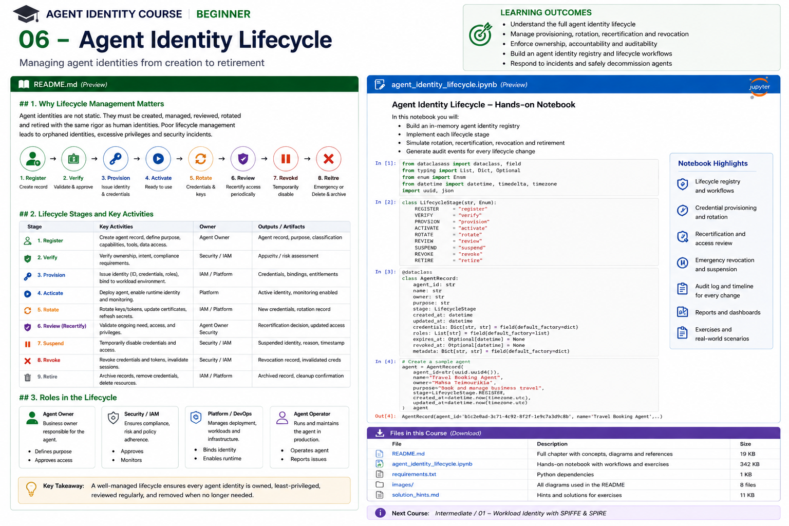

# Beginner 06 — Agent Identity Lifecycle



> **Goal:** treat an agent identity as a governed enterprise asset with an accountable owner, explicit purpose, controlled provisioning, runtime bindings, recurring review, rapid suspension/revocation, and auditable retirement.

An agent identity is not finished when an ID is created.

A production lifecycle looks more like:

```text
REGISTER
   |
   v
ASSESS / APPROVE
   |
   v
PROVISION
   |
   v
BIND TO WORKLOAD
   |
   v
ACTIVATE
   |
   +-------> ROTATE / CHANGE
   |              |
   |              v
   +--------> RECERTIFY
   |              |
   |              v
   +----------> CONTINUE
   |
   +----------> SUSPEND / REVOKE
   |
   v
RETIRE
```

Lifecycle governance prevents **orphaned agents, stale credentials, permission accumulation, shadow agents, unowned automation, and identities that survive long after their business purpose disappears**.

---

## Learning outcomes

You will learn to:

- define an enterprise agent identity lifecycle;
- distinguish logical agent lifecycle from workload/credential lifecycle;
- build an agent identity registry;
- assign technical owners and accountable business sponsors;
- define lifecycle states and legal transitions;
- provision identities and entitlements from approved metadata;
- bind logical agents to approved runtime workloads;
- separate agent versions from stable logical identity;
- rotate credentials without changing logical identity;
- implement access expiration and recertification;
- detect ownership drift and orphaned agents;
- suspend and revoke compromised agents;
- safely retire identities and downstream access;
- preserve audit evidence across the complete lifecycle;
- design lifecycle automation and policy gates.

---

# 1. Why lifecycle management matters

Consider:

```text
2026-01: expense agent created
2026-02: receives finance API access
2026-04: developer moves teams
2026-06: agent replaced by v2
2026-08: old workload still has credentials
```

The identity exists, but nobody knows whether it should.

This is an identity-governance failure.

Current Microsoft Entra Agent ID guidance now treats AI agents as first-class governed identities and explicitly recommends centralized registration, accountable sponsors, lifecycle management, access reviews, and controls that prevent stale permissions. Microsoft also distinguishes technical **owners** from business **sponsors**. citeturn0search1turn0search3turn0search4turn0search8

---

# 2. Three related lifecycles

Do not collapse these into one object.

## Logical agent

```text
agent:travel-booking
```

Represents the durable enterprise actor/purpose.

## Deployment / workload

```text
deployment:travel-booking:v3:prod
spiffe://corp.example/prod/travel-booking
```

Represents running software.

## Credential

```text
X.509-SVID
OAuth token
certificate
client assertion key
```

Represents temporary proof.

They evolve at different speeds:

```text
Logical agent:       months / years
Deployment version:  days / weeks / months
Credential:          minutes / hours
```

A credential rotation should not create a new logical agent identity.

---

# 3. Agent registry

Every enterprise agent should be discoverable.

Minimum registry fields:

```yaml
agent_id: agent:travel-booking
display_name: Travel Booking Agent
purpose: Book approved employee travel
business_sponsor: user:alice
technical_owner: team:travel-platform
risk_tier: high
environment: production
status: active
created_at: ...
last_reviewed_at: ...
next_review_at: ...
```

Useful additional metadata:

```text
data classifications
approved tools
approved resources
model/provider
deployment references
workload identities
credential profiles
delegation policy
human oversight policy
incident contact
repository
policy version
change history
```

A registry is not just inventory. It becomes a governance anchor.

---

# 4. Agent sprawl and shadow agents

Without centralized registration:

```text
Team A -> creates agent
Team B -> creates duplicate
Developer -> creates test agent
Vendor -> deploys third-party agent
Old prototype -> remains active
```

Nobody has a complete picture.

Microsoft's current Agent ID guidance recommends registering agents centrally specifically to reduce shadow AI and improve visibility. citeturn0search4turn0search12

---

# 5. Ownership versus sponsorship

These roles should be explicit.

## Technical owner

Responsible for:

```text
implementation
configuration
deployment
runtime maintenance
technical changes
incident remediation
```

## Business sponsor

Accountable for:

```text
why the agent exists
whether it is still needed
business risk
access decisions
recertification
retirement
```

Microsoft Entra Agent ID currently formalizes this distinction: owners administer agent configuration while sponsors are accountable for purpose, lifecycle decisions, and access reviews. citeturn0search8turn0search3

For high-impact agents, do not let:

```text
creator == sole approver == sole sponsor == privileged operator
```

become the default.

---

# 6. Prevent orphaned agents

An agent becomes orphaned when:

```text
owner leaves
sponsor leaves
team reorganizes
repository archived
application abandoned
```

but the identity remains active.

Lifecycle controls should detect:

```text
missing sponsor
disabled owner
deleted team
expired business justification
inactive deployment
no recent usage
```

Current Microsoft lifecycle guidance includes sponsor reassignment workflows when sponsors change roles or leave, specifically to prevent orphaned agents. citeturn0search1turn0search7

---

# 7. Lifecycle state machine

Define legal states explicitly.

Example:

```text
DRAFT
  |
  v
REGISTERED
  |
  v
UNDER_REVIEW
  |
  +--> REJECTED
  |
  v
APPROVED
  |
  v
PROVISIONED
  |
  v
ACTIVE
  |
  +--> SUSPENDED --> ACTIVE
  |
  +--> REVOKED
  |
  v
RETIRING
  |
  v
RETIRED
```

Do not allow arbitrary transitions such as:

```text
DRAFT -> ACTIVE
REVOKED -> ACTIVE
RETIRED -> ACTIVE
```

without a controlled new approval/provisioning process.

---

# 8. Registration

Registration should establish:

```text
identity
purpose
owner
sponsor
risk
environment
expected autonomy
expected tools
expected data
expected resources
deployment mechanism
```

Registration is not approval.

It means:

> This agent now exists in our governance system.

---

# 9. Risk assessment before provisioning

Provisioning should depend on risk.

Questions:

```text
Can it write?
Can it delete?
Can it spend money?
Can it communicate externally?
Can it access regulated data?
Can it delegate?
Can it execute code?
Can it modify IAM?
Does it act autonomously?
```

The result can determine:

```text
required approvers
credential type
review frequency
tool restrictions
monitoring
human oversight
red-team requirements
```

---

# 10. Identity provisioning

After approval:

```text
logical identity
+
authorization relationships
+
workload registration
+
credential policy
+
tool grants
```

may be provisioned.

Avoid manual one-off identity creation when possible.

Prefer:

```text
approved agent metadata
       |
       v
lifecycle workflow
       |
       +--> IAM identity
       +--> workload identity registration
       +--> policy relationships
       +--> monitoring
       +--> audit record
```

This makes onboarding reproducible.

---

# 11. Blueprint / template pattern

A mature organization should not configure every agent from scratch.

Define templates:

```text
Customer Service Read-Only Agent
Travel Booking Agent
Engineering Research Agent
High-Risk Finance Agent
```

A template can define:

```text
baseline policies
required metadata
risk tier
allowed credential patterns
review cadence
monitoring
Conditional Access
default tool classes
```

Microsoft Entra Agent ID uses **agent identity blueprints** as governance templates from which runtime agent identities inherit settings and controls. citeturn0search3turn0search4turn0search12

---

# 12. Bind identity to runtime

Logical identity alone is insufficient.

You must know:

```text
Which runtime may execute as this agent?
```

Example:

```text
agent:travel-booking
        |
        | approved runtime binding
        v
spiffe://corp.example/prod/travel-booking
```

Do not let:

```text
developer laptop
random container
staging workload
```

automatically assume production agent identity.

---

# 13. Workload attestation

Runtime identity can be based on platform evidence:

```text
Kubernetes namespace
service account
pod selectors
cloud instance identity
process metadata
node attestation
```

SPIFFE/SPIRE provides a well-known workload-identity architecture for this.

The SPIFFE Workload API identifies the local caller out of band and returns only identities the workload is entitled to. citeturn0search0turn0search2

The next course explores this deeply.

---

# 14. Activation

Activation means:

```text
identity approved
runtime binding valid
credentials obtainable
policies deployed
monitoring enabled
```

Before activation verify:

```text
sponsor exists
owner exists
risk approved
deployment approved
tools approved
credentials configured
audit enabled
review date assigned
```

Only then:

```text
status = ACTIVE
```

---

# 15. Credential lifecycle

Credential lifecycle is faster than agent lifecycle.

Bad:

```text
agent created 2026
API key expires 2028
```

Better:

```text
agent identity persists
credentials continuously renew
```

SPIFFE's workload identity model uses short-lived identity documents and automatic updates/rotation. Its Workload API streams updates such as SVID rotation, trust changes, and revocation information to connected workloads. citeturn0search0turn0search6turn0search11

---

# 16. Rotation without identity replacement

Suppose:

```text
agent:payments
```

uses certificate:

```text
serial 123
```

After rotation:

```text
serial 456
```

The agent is still:

```text
agent:payments
```

Separate:

```text
identity continuity
```

from:

```text
credential continuity
```

This allows rapid key rotation without rewriting authorization policy.

---

# 17. Change management

Agents change.

Examples:

```text
new model
new system prompt
new tools
new MCP server
new data source
new permissions
new autonomy
new deployment
new sub-agent
```

Not every change has the same identity impact.

Classify changes:

```text
PATCH
minor implementation change

MATERIAL
new tool/resource/data access

MAJOR
new purpose/autonomy/risk profile
```

Material changes should trigger re-evaluation.

---

# 18. Stable identity versus agent version

Example:

```text
agent:claims-assistant
```

versions:

```text
v1.3
v1.4
v2.0
```

If purpose and authority remain stable, the logical identity may remain stable while deployment metadata changes.

But if:

```text
read-only assistant
```

becomes:

```text
autonomous claims settlement agent
```

that may justify a new risk assessment, permissions, and possibly a new identity/blueprint.

Do not blindly equate code version with identity.

---

# 19. Access accumulation

A classic lifecycle failure:

```text
Jan -> read docs
Mar -> add email
May -> add CRM
Jul -> add payments
```

Old permissions are never removed.

Eventually:

```text
agent = superuser
```

Lifecycle governance must evaluate **current required access**, not merely approve additions.

---

# 20. Recertification

Periodic review asks:

```text
Does the agent still exist?
Is its purpose still valid?
Is the sponsor still accountable?
Are current permissions required?
Are tool grants still appropriate?
Is the risk classification accurate?
Are runtime bindings current?
Has the agent been used?
```

Microsoft currently recommends including agent identities in access reviews, with sponsor attestation on a periodic cadence; its published best-practice example suggests reviews every 6–12 months, while higher-risk organizations may choose shorter intervals. citeturn0search4

Risk-based cadence is better than one global number.

---

# 21. Example review cadence

```text
LOW RISK
12 months

MEDIUM
6 months

HIGH
3 months

CRITICAL
continuous monitoring + quarterly formal review
```

This is an example enterprise policy, not a universal standard.

Review frequency should reflect:

```text
impact
autonomy
data sensitivity
financial authority
external communication
regulatory requirements
```

---

# 22. Access expiration

Prefer grants that expire.

Instead of:

```text
agent can access finance forever
```

use:

```text
grant expires 2026-11-01
```

Then:

```text
renew only if sponsor re-attests
```

This converts forgotten access into automatic removal rather than permanent standing privilege.

Microsoft's current governance model supports time-bound access packages and expiration/extension workflows for agent identities. citeturn0search3

---

# 23. Suspension versus revocation

These are useful separate concepts.

## Suspension

Temporary:

```text
agent suspected compromised
investigation ongoing
deployment unhealthy
sponsor missing
```

May preserve configuration while preventing use.

## Revocation

Security action:

```text
invalidate credentials
remove sessions
remove grants
deny token issuance
disable runtime binding
```

Revocation should propagate quickly.

---

# 24. Emergency kill path

Every high-impact agent needs a tested emergency path.

```text
Incident
   |
   v
Disable agent identity
   |
   +--> block token issuance
   +--> revoke tool grants
   +--> revoke task grants
   +--> disable workload binding
   +--> terminate sessions
   +--> notify owner/sponsor
   +--> preserve evidence
```

Do not design this for the first time during an incident.

---

# 25. Revocation propagation

Revoking a registry record is not enough if:

```text
cached token remains valid
tool gateway cached permissions
workload certificate still active
long-running session continues
```

Design for bounded propagation time.

SPIFFE Workload API streaming exists partly so identity and trust updates—including rotation and revocation-related information—can propagate to workloads rapidly. citeturn0search0

---

# 26. Deprovisioning

When retiring an agent, remove:

```text
identity credentials
OAuth grants
API keys
role assignments
ReBAC tuples
task grants
tool permissions
MCP access
cloud roles
database grants
secrets
service accounts
workload registrations
scheduled jobs
webhooks
```

Retirement is not:

```text
delete Python repository
```

The access graph must be cleaned.

---

# 27. Preserve the audit record

Do not necessarily erase governance evidence when the runtime identity is retired.

You may need:

```text
who created it
who sponsored it
what access it had
what versions ran
when credentials rotated
who approved changes
when it was suspended
why it was retired
```

Retention depends on organizational/legal requirements.

Think:

```text
disable operational authority
retain appropriate evidence
```

---

# 28. Lifecycle events

Useful event types:

```text
agent.registered
agent.approved
agent.provisioned
agent.activated
agent.updated
credential.rotated
access.granted
access.removed
review.completed
owner.changed
sponsor.changed
agent.suspended
agent.revoked
agent.reactivated
agent.retired
```

Events enable:

```text
audit
monitoring
automation
analytics
incident reconstruction
```

---

# 29. Event-driven lifecycle automation

Example:

```text
employee termination event
        |
        v
find sponsored agents
        |
        +--> transfer sponsorship
        |
        +--> suspend if no valid successor
        |
        v
audit
```

Another:

```text
agent risk -> HIGH
       |
       v
disable autonomous execution
       |
       +--> require approval
       +--> trigger access review
       +--> notify sponsor
```

Lifecycle should be automated where deterministic policy exists.

---

# 30. Ownership drift

Detect:

```text
owner account disabled
sponsor changed department
team no longer exists
repository archived
deployment absent
zero usage for 180 days
```

These signals can trigger review.

But:

```text
unused != automatically safe to delete
```

Some agents may be emergency-only. Use evidence plus policy.

---

# 31. Third-party agents

Vendor agents create additional lifecycle questions:

```text
Who owns the enterprise identity?
Who owns the vendor software?
What happens when contract ends?
How are vendor credentials rotated?
Can vendor personnel assume the identity?
Where are logs stored?
What happens during vendor compromise?
```

Enterprise identity should remain under enterprise governance even when implementation is external.

---

# 32. Non-human scale

Human IAM processes may assume:

```text
tens of thousands of employees
```

Agent ecosystems may produce:

```text
many agent instances
ephemeral workloads
task agents
sub-agents
```

Do not require a human ticket for every ephemeral credential.

Automate:

```text
short-lived workload identity
task-scoped access
policy-derived grants
automatic expiry
```

while retaining human accountability at the appropriate logical-agent level.

---

# 33. Blueprint versus instance

A useful model:

```text
Agent Blueprint
"Travel Booking Agent"
       |
       +--> prod instance
       +--> Canada instance
       +--> Europe instance
```

The blueprint can govern shared baseline policy while instances receive distinct runtime identities.

Microsoft Entra Agent ID now uses blueprint and runtime agent identity constructs for this type of governance model. citeturn0search1turn0search12

---

# 34. Lifecycle invariants

Useful security invariants:

```text
ACTIVE -> must have sponsor
ACTIVE -> must have owner
ACTIVE -> must have approved runtime binding
ACTIVE -> review not expired
ACTIVE -> risk controls satisfied
REVOKED -> cannot obtain new credentials
RETIRED -> cannot reactivate directly
credential lifetime << agent lifetime
child deployment cannot exceed blueprint policy
```

Encode these as automated tests.

---

# 35. Metrics

Measure lifecycle health.

Examples:

```text
% agents with sponsor
% agents with technical owner
% agents reviewed on time
orphaned agent count
expired grants
stale credentials
average credential age
agents with standing high-risk privilege
revocation propagation time
inactive active agents
unregistered/shadow agents discovered
```

Metrics turn lifecycle governance into an operating discipline.

---

# 36. Current state of the art

Agent identity is rapidly moving from using generic application identities toward purpose-built identity-governance models.

NIST's 2026 NCCoE concept work identifies agent identification and authorization as an emerging enterprise security problem because agents increasingly access diverse tools, data, and applications. citeturn0search13

Microsoft Entra Agent ID became generally available in 2026 and now provides dedicated agent identity constructs plus governance capabilities around sponsors, access packages, lifecycle workflows, access reviews, Conditional Access, and risk protection. citeturn0search1turn0search14

SPIFFE addresses the runtime side of the lifecycle with platform-agnostic workload identities, short-lived credentials, automated rotation, and streamed trust/identity updates. citeturn0search0turn0search5turn0search6

These solve different layers:

```text
Agent governance plane
        |
        | purpose / sponsor / access / lifecycle
        v
Logical Agent Identity
        |
        | runtime binding
        v
Workload Identity Plane
        |
        | short-lived proof
        v
Credentials / SVIDs / Tokens
```

---

# 37. Practical notebook

The notebook builds an in-memory enterprise agent registry and implements:

1. lifecycle state machine;
2. registration;
3. owner/sponsor accountability;
4. approval;
5. provisioning;
6. workload binding;
7. activation invariants;
8. credential rotation;
9. material-change review;
10. access grants with expiry;
11. recertification;
12. orphan detection;
13. suspension;
14. emergency revocation;
15. revocation propagation checks;
16. retirement/deprovisioning;
17. immutable-style lifecycle events;
18. lifecycle health metrics;
19. negative transition tests.

---

# 38. Enterprise lifecycle checklist

## Registration

- unique agent identity;
- purpose;
- sponsor;
- technical owner;
- environment;
- risk tier;
- autonomy level;
- data/tool requirements.

## Provisioning

- approval complete;
- authorization policy;
- workload binding;
- credential profile;
- monitoring;
- review date.

## Operation

- short-lived credentials;
- rotation;
- current sponsor;
- current owner;
- least privilege;
- change monitoring;
- audit events.

## Review

- business need;
- access;
- risk;
- workload bindings;
- ownership;
- usage;
- exceptions.

## Incident

- suspend;
- revoke;
- terminate credentials;
- remove grants;
- preserve evidence.

## Retirement

- disable identity;
- remove downstream access;
- remove workload registration;
- archive evidence;
- verify no active credentials remain.

---

# 39. Key takeaways

1. Agent identity is a lifecycle, not a registration event.
2. Logical agent, workload, and credential lifecycles are different.
3. Every enterprise agent needs discoverability and accountability.
4. Business sponsor and technical owner are different roles.
5. Runtime identity must be bound to approved workloads.
6. Credentials should rotate much faster than logical identities.
7. Material changes should trigger risk/access re-evaluation.
8. Recertification prevents permission and ownership drift.
9. Suspension, revocation, and retirement solve different problems.
10. Decommissioning must remove the entire access graph, not just application code.
11. High-impact agents need a tested kill path.
12. Lifecycle health should be measurable.

---

# References

- NIST NCCoE — Agent Identity and Authorization  
  https://csrc.nist.gov/pubs/other/2026/02/05/accelerating-the-adoption-of-software-and-ai-agent/ipd
- Microsoft Entra Agent ID — What's New  
  https://learn.microsoft.com/en-us/entra/agent-id/whats-new-agent-id
- Microsoft Entra Agent ID — Best Practices  
  https://learn.microsoft.com/en-us/entra/agent-id/best-practices-agent-id
- Microsoft Entra ID Governance  
  https://learn.microsoft.com/en-us/azure/active-directory/governance/identity-governance-overview
- Microsoft — Owners and Sponsors for Agent Identities  
  https://learn.microsoft.com/en-us/entra/agent-id/manage-owners-sponsors-agents
- Microsoft — Agent Sponsor Lifecycle Tasks  
  https://learn.microsoft.com/en-us/entra/id-governance/agent-sponsor-tasks
- SPIFFE Specification  
  https://spiffe.io/docs/latest/spiffe-specs/spiffe/
- SPIFFE Workload API  
  https://spiffe.io/docs/latest/spiffe-specs/spiffe_workload_api/
- SPIFFE Workload Endpoint  
  https://spiffe.io/docs/latest/spiffe-specs/spiffe_workload_endpoint/
- SPIFFE — Working with SVIDs  
  https://spiffe.io/docs/latest/deploying/svids/

---

# Next course

## Intermediate 01 — Workload Identity with SPIFFE & SPIRE

The beginner foundation is now complete.

The intermediate track begins by replacing conceptual workload identity with a real production architecture: trust domains, SPIFFE IDs, SVIDs, node/workload attestation, SPIRE Server/Agent, Workload API, X.509-SVIDs, JWT-SVIDs, mTLS, selectors, registration entries, rotation, federation, Kubernetes integration, and agent-to-workload identity binding.
