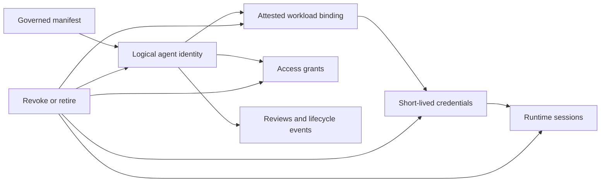
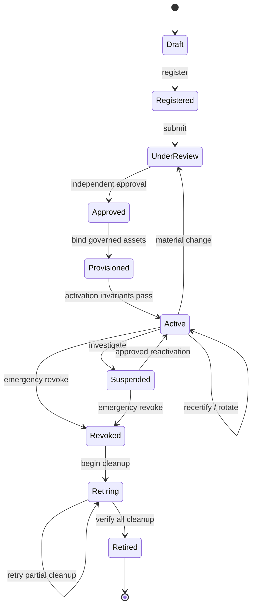

# Beginner 06 — Agent Identity Lifecycle

> **Goal:** design, implement, attack-test, evaluate, and productionize a governed agent-identity lifecycle in which registration, ownership, provisioning, runtime binding, review, suspension, revocation, and retirement are deterministic, authorized, and auditable.

An agent identity is not complete when an identifier is created. It is a governed enterprise asset whose purpose, owner, runtime, access, credentials, and continued existence must remain justified throughout its life.

This chapter closes the beginner track by connecting the identity, authentication, authorization, and tool-control boundaries from the earlier courses into one operating lifecycle.

## Learning outcomes

After completing the chapter and lab, you can:

- distinguish logical-agent, deployment/workload, credential, access, and session lifecycles;
- model legal lifecycle states and fail-closed transitions;
- register an agent against an approved blueprint and accountable humans;
- bind provisioning to an approved manifest and attested workload;
- enforce activation invariants, review deadlines, and separation of duties;
- process material changes without silently inheriting old approval;
- implement sponsor succession without allowing arbitrary ownership takeover;
- distinguish suspension, revocation, retirement, and deletion;
- propagate revocation across the complete access graph;
- make retries safe with optimistic versions, stable operation IDs, and reconciliation;
- detect partial deprovisioning instead of reporting false success;
- produce tamper-evident lifecycle evidence without logging secrets; and
- compare common identity-governance standards, services, libraries, and policy tools.

## Prerequisites

Complete or review:

- [Beginner 01 — Agent Identity Foundations](../01-agent-identity-foundations/README.md) for logical agent, workload, and requester identity;
- [Beginner 02 — Humans, Workloads and Agents](../02-humans-workloads-agents/README.md) for relationship and provenance chains;
- [Beginner 03 — Authentication, Credentials and Tokens](../03-authentication-credentials-tokens/README.md) for credential issuance, rotation, and replay;
- [Beginner 04 — Authorization for Agents](../04-authorization-for-agents/README.md) for deterministic authorization and approval evidence; and
- [Beginner 05 — Least-Privilege Tool Access](../05-least-privilege-tool-access/README.md) for bounded capabilities and verified effects.

The lab requires Python 3.10 or newer, Pydantic 2, and pytest. It runs offline and uses no secrets or external services.

---

# 1. Scenario: Northstar Travel

Northstar Travel deploys a production agent that searches for flights and books policy-compliant employee travel.

The initial governance record says:

```yaml
agent_id: agent:northstar:travel-booking
purpose: Book policy-compliant employee travel within approved limits
sponsor: user:alice
technical_owner: team:travel-platform
environment: production
risk_tier: high
autonomy: bounded
blueprint: blueprint:travel-agent@2.1.0
requested_capabilities:
  - flight.search
  - flight.book_limited
```

Several things can go wrong after registration:

- the sponsor leaves but the agent remains active;
- a provisioning workflow adds `payment.refund`, which was never approved;
- a development workload is bound to the production agent;
- the review expires while access remains active;
- two reviewers update the same record concurrently;
- a compromised agent is disabled in one directory but its grants, sessions, or workload bindings survive;
- retirement removes three of four downstream artifacts and reports success; or
- a caller retries a lifecycle command and applies it twice.

The lab compares two designs:

1. **Unsafe state-field updater** — trusts the request and writes the requested state.
2. **Governed lifecycle controller** — derives administrator identity from trusted context and enforces state, version, approval, ownership, workload, review, propagation, and evidence invariants.

## Success criteria

The governed controller must:

- apply every labelled legitimate lifecycle change;
- block every labelled unauthorized or stale change;
- identify partial retirement cleanup;
- commit no forbidden lifecycle effect;
- reconcile exact retries without duplicating effects; and
- emit complete decision evidence for every attempt.

## Non-goals

The lab does not:

- call Microsoft Graph, SCIM, SPIRE, a cloud IAM API, or a credential service;
- issue real tokens, certificates, passwords, or private keys;
- claim that a hash chain is equivalent to an externally anchored transparency log;
- replace organization-specific risk, privacy, legal, or records-retention review; or
- prove the behavior of any vendor product.

It teaches the portable control plane that production integrations must preserve.

---

# 2. Mental model: five connected lifecycles

Do not collapse every identity concern into one object.

| Object | Answers | Typical lifetime | Example |
| --- | --- | --- | --- |
| Logical agent | What governed actor and purpose is this? | Months or years | `agent:northstar:travel-booking` |
| Deployment/workload | Which approved software instance is running? | Hours to months | `spiffe://corp.example/prod/travel-booking` |
| Credential | What current proof can the workload present? | Minutes or hours | X.509-SVID or access token |
| Access grant | Which resource capability is permitted? | Task, review period, or assignment | `flight.book_limited` |
| Runtime session | Which active execution context may continue? | Minutes to hours | `session:travel-prod` |

A stable logical agent can survive many deployments and credential rotations. Conversely, retiring a logical agent should end every deployment, credential, grant, and session that derives authority from it.


```mermaid
flowchart LR
    M[Governed manifest] --> A[Logical agent identity]
    A --> W[Attested workload binding]
    A --> G[Access grants]
    W --> C[Short-lived credentials]
    C --> S[Runtime sessions]
    A --> R[Reviews and lifecycle events]
    X[Revoke or retire] --> A
    X --> W
    X --> G
    X --> C
    X --> S
```

The lifecycle controller governs relationships. It does not treat a display name, prompt, process label, or model output as identity evidence.

---

# 3. The trust boundary

The central boundary is:

```text
UI / workflow / agent
    proposes action, target, operation ID, expected version, payload
                         |
                         v
trusted lifecycle controller
    authenticates administrator
    derives tenant and roles
    loads authoritative agent record
    validates typed payload
    checks state, version, policy, approval, directory, and attestations
    changes state and downstream artifacts
    verifies the effect
    records public evidence
```

The request in `lab.py` intentionally contains no actor, role, tenant, sponsor authority, approval, or credential field:

```python
@dataclass(frozen=True)
class LifecycleRequest:
    operation_id: str
    agent_id: str
    action: Action
    expected_version: int
    payload: dict[str, Any]
```

Authenticated middleware supplies `VerifiedAdminContext`. Directory status, blueprints, workload attestations, and current records come from trusted stores.

Typed input proves shape, not authority. A schema-valid command can still be cross-tenant, stale, self-approved, overbroad, or illegal in the current state.

---

# 4. Lifecycle state machine

A state machine makes legal changes explicit and testable.


```mermaid
stateDiagram-v2
    [*] --> Draft
    Draft --> Registered: register
    Registered --> UnderReview: submit
    UnderReview --> Approved: independent approval
    Approved --> Provisioned: bind governed assets
    Provisioned --> Active: activation invariants pass
    Active --> Active: recertify / rotate
    Active --> UnderReview: material change
    Active --> Suspended: investigate
    Suspended --> Active: approved reactivation
    Active --> Revoked: emergency revoke
    Suspended --> Revoked: emergency revoke
    Revoked --> Retiring: begin cleanup
    Retiring --> Retiring: retry partial cleanup
    Retiring --> Retired: verify all cleanup
    Retired --> [*]
```

## State meaning

| State | Meaning | May authenticate or act? |
| --- | --- | --- |
| Draft | Record is incomplete and editable | No |
| Registered | Required identity metadata passed registration checks | No |
| Under review | Risk, security, access, and ownership are being assessed | No |
| Approved | Exact manifest was independently approved | No |
| Provisioned | Runtime binding and bounded access artifacts exist | Not yet |
| Active | Activation invariants pass | Yes, within current grants |
| Suspended | Temporarily quarantined while evidence is preserved | No |
| Revoked | Authority is terminated across runtime artifacts | No |
| Retiring | Downstream cleanup is in progress or incomplete | No |
| Retired | Cleanup was verified; tombstone and evidence remain | No |

Do not implement lifecycle as a freely editable `status` column. Every transition needs an authorized command, preconditions, atomic state change, and evidence.

---

# 5. Governed identity record

The logical record combines stable identity with versioned governance state.

## Manifest

The manifest declares:

- business purpose;
- accountable sponsor;
- technical owner;
- environment and risk tier;
- autonomy level;
- data classifications;
- requested capabilities; and
- blueprint ID and version.

The lab validates it with a strict, immutable Pydantic model. Its canonical digest binds approval to the exact manifest.

## Blueprint

A blueprint constrains families of identities:

```text
blueprint:travel-agent@2.1.0
  allowed capabilities
  allowed credential profiles
  workload trust domain
  active/inactive lifecycle
```

The blueprint is not the runtime identity. It is a policy template and control point. Microsoft Entra Agent ID similarly uses agent identity blueprints as templates and policy containers for agent identities, but its exact object and credential semantics are product-specific and should not be generalized to every IAM system ([Microsoft blueprint documentation](https://learn.microsoft.com/en-us/entra/agent-id/agent-blueprint)).

## Runtime artifacts

The lab record retains non-secret metadata for:

- workload bindings and attestation evidence;
- access grants and expiry;
- credential profiles, audiences, generations, and status;
- sessions;
- review decisions; and
- retirement cleanup receipts.

Secrets never belong in lifecycle evidence.

---

# 6. Ownership, sponsorship, and separation of duties

Ownership and sponsorship are different responsibilities.

| Role | Accountability |
| --- | --- |
| Technical owner | Configuration, deployment, runtime maintenance, change requests |
| Business sponsor | Continued purpose, risk acceptance, access need, renewal, retirement |
| Risk approver | Independent assessment of the exact proposed manifest or reactivation |
| Provisioner | Creates approved downstream identity and access artifacts |
| Platform operator | Activates a deployment only after invariants pass |
| Security responder | Suspends, revokes, investigates, and coordinates recovery |

Microsoft’s current Agent ID administrative model separately describes owners, sponsors, and managers. Sponsors provide business accountability without receiving all technical administrative permissions ([administrative relationships](https://learn.microsoft.com/en-us/entra/agent-id/agent-owners-sponsors-managers)). That product is one implementation; the portable lesson is to separate accountability from technical administration.

For a high-impact production agent, avoid:

```text
creator == owner == sponsor == approver == provisioner
```

The lab rejects an approval when the approver is the current command actor, sponsor, or owner.

---

# 7. Registration

Registration is an admission decision, not a database insert.

Before moving from `DRAFT` to `REGISTERED`, verify:

1. the sponsor exists, is active, and belongs to the tenant;
2. the technical owner exists, is active, and belongs to the tenant;
3. the named blueprint exists and is active;
4. the blueprint belongs to the same tenant;
5. the manifest uses the current approved blueprint version; and
6. the caller has a trusted owner or IAM administrator role.

Registration should also perform organization-specific duplicate detection, naming rules, risk classification, data-processing assessment, and vendor review.

## Shadow-agent discovery

Registration controls only known creation paths. Production governance also needs discovery:

- cloud inventory and service-principal enumeration;
- CI/CD and repository scanning;
- SaaS and low-code platform inventory;
- API gateway and network observations;
- expense/vendor records; and
- reconciliation between declared agents and observed workloads.

An unregistered workload should not receive production authority merely because it can call an API.

---

# 8. Exact approval

An approval boolean such as `approved=True` is replayable and ambiguous.

The lab uses an approval receipt bound to:

```text
approval ID
approver and verified approver role
tenant
agent
action
stable operation ID
canonical request digest
policy version
issued-at and expiry
```

The receipt is single-use and is consumed atomically only after the request, approver, time, and separation-of-duties checks pass.

If the manifest changes after approval, its digest changes and the prior approval no longer authorizes it.

---

# 9. Provisioning from approved intent

Provisioning materializes approved intent. It must not become an opportunity to widen access.

The lab requires:

```text
requested capabilities == approved manifest capabilities
requested capabilities subset-of blueprint capabilities
credential profiles subset-of blueprint profiles
workload has current attestation
workload bound to exact logical agent
tenant and environment match
SPIFFE trust domain matches blueprint
```

It then creates local metadata representing:

- one attested workload binding;
- capability-specific access grants bounded by review expiry; and
- credential profiles containing audience, generation, and status—but no token or secret.

## Why exact equality matters

If provisioning accepts any subset of the manifest, that may be safe from privilege escalation but can hide an incomplete production deployment. If it accepts a superset, it creates unauthorized authority. The lab chooses exact equality so drift is visible. A production organization may allow explicitly documented optional capabilities, but that rule belongs in the approved manifest or blueprint.

---

# 10. Runtime binding and workload attestation

The logical identity says what the agent is. Workload identity proves which approved software instance is running.

SPIFFE defines portable workload identities and a Workload API. The API identifies the local caller out of band and returns only authorized identities. Current Workload API profiles include mandatory X.509-SVID and JWT-SVID profiles and an optional WIT-SVID profile; streamed responses propagate rotations and revocation-related changes ([SPIFFE Workload API](https://spiffe.io/docs/latest/spiffe-specs/spiffe_workload_api/)).

This chapter uses an attestation record rather than implementing SPIRE. The next course implements the workload-identity layer in depth.

Never bind a logical agent based only on:

- a process-supplied agent name;
- a container label controlled by the deployment itself;
- an unverified URI in a request;
- a shared API key; or
- a model-generated claim.

---

# 11. Activation invariants

Provisioned is not active. Activation is a separate gate.

The controller requires:

```text
sponsor active
owner active
review exists and is not overdue
workload binding active
every grant active and unexpired
at least one credential profile configured
```

Only then does it increment credential generation metadata, mark profiles active, create a runtime session, and transition to `ACTIVE`.

This avoids “half-provisioned but live” identities.

---

# 12. Reviews and access expiration

Periodic review asks two distinct questions:

1. Does the agent still need to exist?
2. Does it still need each current capability and runtime binding?

The lab uses a risk-based example cadence:

| Risk tier | Example maximum interval |
| --- | ---: |
| Low | 365 days |
| Medium | 180 days |
| High | 90 days |
| Critical | 30 days |

These are teaching defaults, not universal requirements. Production cadence should reflect business impact, change rate, regulation, threat exposure, and compensating controls.

Each review records reviewer, verdict, time, next review, manifest digest, and a stable review ID.

The current sponsor can choose:

- `CONTINUE` — extend review validity;
- `MODIFY` — disable runtime artifacts and return to review; or
- `REVOKE` — terminate authority.

Access-grant expiry should never exceed the approved review horizon.

---

# 13. Material change

A version number alone does not determine whether a change is material.

Examples include new tools, higher autonomy, more sensitive data, a new provider, a new environment or trust domain, changed purpose, new delegation behavior, or expanded financial impact.

For an active agent, the lab treats a capability change as material and atomically:

1. changes state to `UNDER_REVIEW`;
2. stores the new manifest and digest;
3. clears the next review date;
4. suspends grants and credential profiles; and
5. revokes runtime sessions.

Old approval does not follow the new manifest.

---

# 14. Sponsor succession and orphan prevention

An identity becomes orphaned when its accountable people disappear while its authority remains active.

Useful orphan signals include disabled sponsors or owners, archived repositories, absent workloads, expired business justification, and overdue reviews.

The lab’s succession workflow accepts a transfer only when:

- the caller is an IAM administrator;
- the command names the current sponsor as its expected value;
- the old sponsor is inactive;
- the new sponsor is active and in the tenant; and
- directory evidence shows the new sponsor is the old sponsor’s manager.

The expected-old-sponsor check prevents a stale workflow from overwriting a more recent transfer.

Microsoft documents automated sponsor maintenance and reassignment workflows for agent identities; organizations should still define escalation, notification, and exception policies ([governing agent identities](https://learn.microsoft.com/en-us/entra/id-governance/agent-id-governance-overview)).

---

# 15. Suspension, revocation, retirement, and deletion

These are not synonyms.

| Operation | Purpose | Reversible? | Evidence retained? |
| --- | --- | ---: | ---: |
| Suspend | Rapid quarantine while investigating | Usually | Yes |
| Revoke | Terminate current authority and sessions | Not by simple toggle | Yes |
| Retire | Remove downstream access after business end | No direct reactivation | Yes |
| Delete | Apply retention policy after retirement | Product/policy dependent | Required records may remain |

## Suspension and reactivation

The lab suspends grants and credential profiles and revokes sessions. Reactivation requires security authority, request-bound independent approval, a new credential generation, all normal activation invariants, and a new session.

## Revocation propagation

Changing only the logical record leaves authority elsewhere. The lab propagates revocation to workload bindings, access grants, credential profiles, and sessions.

Production systems may use directory disablement, token revocation, short lifetimes, certificate or trust-bundle updates, policy changes, gateway blocks, queue cancellation, and resource-side session termination.

The OpenID Shared Signals Framework, CAEP, and RISC became final specifications in 2025. CAEP defines events that receivers can use to attenuate access when session, credential, assurance, or device state changes ([OpenID Shared Signals specifications](https://openid.net/wg/sharedsignals/specifications/)). These signals complement—not replace—resource-side authorization and short credential lifetimes.

## Retirement

Retirement is a verified saga across multiple systems. The lab removes workload registration, access grants, credential profiles, and runtime sessions.

If credential cleanup fails after earlier steps succeeded, the outcome is `PARTIAL`, state remains `RETIRING`, and the same stable operation can resume. The controller reports `RETIRED` only after all cleanup receipts exist.

---

# 16. Concurrency, retries, and idempotency

Lifecycle controllers are distributed systems.

## Optimistic version

Every command carries `expected_version`. The controller accepts it only if it matches the current record. Two concurrent reviewers can read version 7, but after one commits version 8, the other must reload and reconsider rather than overwrite it.

## Stable operation ID

```text
same operation ID + same request digest
    -> reconcile prior result or resume partial cleanup

same operation ID + different request digest
    -> idempotency conflict
```

Do not retry a retirement saga with a new operation ID after an unknown or partial outcome. Reconcile the original operation first.

## Atomicity boundary

The in-memory lab uses a lock to illustrate atomic decision, version check, approval consumption, and transition. Production designs need a database transaction, compare-and-swap, workflow engine, or another durable coordination mechanism. A process-local lock does not coordinate multiple replicas.

---

# 17. Audit evidence

Useful lifecycle evidence records observable decisions rather than private model reasoning.

The lab records event and decision IDs, sequence and timestamp, tenant, agent, verified actor, action, outcome, reason code, operation ID, request digest, policy version, record version, and hash-chain values.

Events are frozen objects held in an append-only tuple and linked by hashes. Tests prove that altered event content breaks verification.

This demonstrates tamper evidence, not durable non-repudiation. Production designs may require write-once storage, external timestamping or hash anchoring, signed events, controlled export, retention, legal hold, and monitoring for missing events.

Do not log tokens, passwords, private keys, raw approval secrets, unnecessary personal data, or hidden reasoning.

---

# 18. Architecture patterns

## Central lifecycle service

One service owns records, transitions, approvals, and integrations.

**Strengths:** consistent invariants, strong inventory, simple audit point.

**Limitations:** availability dependency, integration bottleneck, central blast radius.
**Best fit:** organizations standardizing agent creation and governance.

## IAM-platform extension

Use purpose-built agent objects or service principals, entitlement management, access reviews, Conditional Access, and directory workflows.

**Strengths:** existing administrator controls, directory signals, enterprise reporting.

**Limitations:** product-specific semantics, licensing, incomplete coverage of non-directory tools.
**Best fit:** organizations centered on one enterprise IAM platform.

## Kubernetes/operator reconciliation

A declarative manifest and controller reconcile desired identity state into workload, policy, and credential systems.

**Strengths:** GitOps, repeatability, continuous drift repair.

**Limitations:** cluster-centric view, eventual consistency, careful status design required.
**Best fit:** platform-engineering organizations with cloud-native workloads.

## Federated domain controllers

Each business or trust domain controls local lifecycle while publishing a common inventory and evidence contract.

**Strengths:** domain autonomy, scalability, local integrations.

**Limitations:** inconsistent policy, difficult global revocation, reconciliation complexity.
**Best fit:** large multi-cloud or multi-business organizations.

A common production design combines central policy and inventory, domain reconciliation, IAM integration, and resource-side enforcement.

---

# 19. Technology landscape

| Technology | Lifecycle contribution | Strengths | Limits / selection questions |
| --- | --- | --- | --- |
| SCIM 2.0 (RFC 7643/7644) | Standard schemas and HTTP provisioning | Portable CRUD, filters, bulk patterns, enterprise adoption | Generic user/group model; agent extensions require design |
| Microsoft Entra Agent ID + Graph | Agent identities, blueprints, sponsors, access packages/reviews, monitoring | Purpose-built directory objects and governance integration | Vendor semantics, licensing, tenant dependency |
| SPIFFE/SPIRE | Runtime workload identity, attestation, short-lived SVIDs | Portable, secretless workload identity, rotation | Not a business-purpose registry or entitlement-review system |
| OpenID SSF/CAEP/RISC | Continuous security and access-change signals | Cross-domain event vocabulary and delivery | Receivers must validate, map, and enforce correctly |
| OPA, Cedar, OpenFGA | Deterministic lifecycle/action authorization | Policy separation, tests, fine-grained decisions | No registry, workflow, or cleanup by themselves |
| Terraform/Pulumi and cloud IAM | Declarative downstream resources | Reviewable changes and drift detection | Runtime sessions and emergency paths need faster controls |
| Kubernetes controllers | Desired-state reconciliation | Continuous repair and status conditions | Eventual consistency; status is not proof of external effects |
| Temporal and durable workflow engines | Long-running lifecycle sagas | Durable retries, timers, compensation, observability | Still need authorization, idempotency, and evidence design |
| SIEM/SOAR platforms | Detection and response orchestration | Central monitoring and incident workflows | Playbook completion does not prove resource cleanup |

Use common SDKs at integration boundaries—Microsoft Graph SDKs, SCIM clients, SPIFFE Workload API libraries, and cloud IAM SDKs—but keep portable lifecycle invariants outside provider-specific adapters.

---

# 20. State of the art in September 2026

## Established practice

Established controls include authoritative inventory, accountable ownership, short-lived workload credentials, least privilege, periodic review, time-bound access, explicit deprovisioning, policy-as-code, and auditable incident response.

SCIM defines an HTTP-based protocol for provisioning and managing identities across domains ([RFC 7644](https://www.rfc-editor.org/rfc/rfc7644)). It is established infrastructure, although agent-specific schema and relationship conventions remain organization dependent.

## Rapidly adopted agent-specific practice

Agent platforms are introducing first-class inventories, blueprints, sponsor relationships, access reviews, lifecycle workflows, risk monitoring, and programmatic APIs. Microsoft Graph documents Agent ID resources and governance integrations, including access packages, reviews, sponsors, audit logs, and sign-in activity ([Microsoft Graph Agent ID overview](https://learn.microsoft.com/en-us/graph/api/resources/agentid-platform-overview?view=graph-rest-1.0)).

These product capabilities are current but evolving. Pin documentation dates and test real tenant behavior before treating a preview or recently introduced API as stable.

## Current standards work

NIST’s February 2026 software and AI agent identity and authorization paper is an **initial public draft concept paper**, not a final agent-identity standard. Its comment period is closed and the NCCoE project is reviewing comments. It frames open questions around identification, authentication, authorization, delegation, auditing, non-repudiation, and prompt injection ([NIST CSRC record](https://csrc.nist.gov/pubs/other/2026/02/05/accelerating-the-adoption-of-software-and-ai-agent/ipd), [NCCoE project status](https://www.nccoe.nist.gov/projects/software-and-ai-agent-identity-and-authorization)).

NIST IR 8587 became final on September 15, 2026. It covers protection of tokens and assertions, key management, verification, lifecycle controls, and continuous monitoring. NIST notes that agent identity risks require broader treatment, so IR 8587 is relevant credential guidance rather than a complete agent-lifecycle architecture ([NIST IR 8587](https://csrc.nist.gov/pubs/ir/8587/final)).

## Open problems

- portable agent identity and blueprint schemas;
- high-volume ephemeral and sub-agent lifecycle;
- intent and delegation evidence across multi-agent chains;
- cross-platform revocation guarantees;
- lifecycle semantics for agents that use both agent and user-like accounts;
- proof that downstream cleanup completed across eventually consistent systems;
- privacy-preserving inventory and audit correlation; and
- interoperable discovery of shadow agents.

---

# 21. Worked lifecycle trace

The Northstar controller processes a valid production path:

```text
1. Owner registers exact manifest
   -> sponsor, owner, blueprint, tenant verified

2. Owner submits it for review
   -> state becomes UNDER_REVIEW

3. IAM workflow presents independent approval
   -> approval bound to manifest digest and consumed once
   -> next review computed from risk tier

4. Provisioner requests exact capabilities
   -> blueprint and manifest bounds checked
   -> SPIFFE workload attestation matched
   -> grants and non-secret credential profiles created

5. Platform activates
   -> sponsor, owner, review, binding, grants, credentials checked
   -> credential generation increments and session opens

6. Sponsor recertifies
   -> manifest digest and continued purpose recorded

7. Security detects compromise
   -> binding, grants, credentials, and sessions revoked

8. Sponsor retires
   -> cleanup saga verifies every downstream category
   -> tombstone and evidence retained
```

The adversarial dataset also tests inactive sponsorship, cross-tenant administration, self-approval, altered approval, capability widening, untrusted workload binding, overdue review, stale concurrency, wrong reviewer, unsafe reactivation, partial cleanup, and retired-identity reactivation.

---

# 22. Practical lab

## Install

From the repository root:

```bash
uv sync
```

Or install only the course dependencies:

```bash
python -m pip install -r curriculum/beginner/06-agent-identity-lifecycle/requirements.txt
```

## Run the reusable implementation

```bash
python curriculum/beginner/06-agent-identity-lifecycle/lab.py
```

## Run focused tests

```bash
pytest -q curriculum/beginner/06-agent-identity-lifecycle/tests/test_course06_lifecycle.py
```

## Run the guided notebook

Open [agent_identity_lifecycle.ipynb](agent_identity_lifecycle.ipynb) and run it top-to-bottom. The notebook imports the same `lab.py` tested by pytest.

---

# 23. Experiments

The notebook walks through these experiments:

1. inspect the manifest, state machine, and strict JSON Schemas;
2. run the unsafe baseline across all labelled cases;
3. run the governed controller across the same cases;
4. compare outcome, safety, partial-failure, duplication, and evidence metrics;
5. inspect an exact approval and show altered/self approval failures;
6. attempt capability and workload-binding escalation;
7. race two reviews against one optimistic version;
8. submit a material change and inspect disabled runtime artifacts;
9. propagate emergency revocation across the access graph;
10. inject a retirement cleanup outage and resume the same operation; and
11. alter an audit event and verify that the hash chain fails.

Every result is produced by deterministic local code. There are no fabricated quality scores or simulated sleeps presented as latency.

---

# 24. Evaluation

The evaluation contains 20 labelled attempts: 7 expected legitimate applications, 12 expected denials or approval challenges, and 1 expected partial-cleanup outcome.

## Metrics

| Metric | Numerator | Denominator | Desired direction |
| --- | --- | --- | --- |
| Outcome match rate | Attempts matching their label | All attempts | Higher |
| Valid apply rate | Expected legitimate changes applied | Expected legitimate changes | Higher |
| Forbidden effect rate | Blocked/challenged attempts that committed an effect | Expected blocked/challenged attempts | Lower |
| Partial detection rate | Expected partial failures reported as partial | Expected partial failures | Higher |
| Duplicate effect rate | Reconciled attempts that committed again | All attempts | Lower |
| Evidence completeness | Decisions with IDs, actor, digest, policy, and audit hash | All attempts | Higher |

## Deterministic results

| System | Outcome match | Valid apply | Forbidden effect | Partial detection | Duplicate effect | Evidence complete |
| --- | ---: | ---: | ---: | ---: | ---: | ---: |
| Unsafe updater | 7/20 | 7/7 | 12/12 | 0/1 | 0/20 | 20/20 |
| Governed controller | 20/20 | 7/7 | 0/12 | 1/1 | 0/20 | 20/20 |

The baseline can emit structured events, so evidence completeness alone does not make it safe. It records unauthorized effects accurately. Evaluation must measure enforcement outcomes, not merely logging presence.

The release gate requires all six governed metrics to reach their defined targets.

---

# 25. Failure modes and mitigations

| Failure | Consequence | Mitigation | Lab evidence |
| --- | --- | --- | --- |
| Editable status field | Illegal activation or reactivation | Enumerated transitions and preconditions | Retired reactivation denied |
| Request-supplied actor or role | Privilege escalation | Trusted authentication context | Request-field invariant test |
| Self approval | No independent risk check | Exact receipt plus separation of duties | Self-approval denied |
| Approval after payload change | Stale authorization | Canonical request and manifest digests | Altered approval denied |
| Provisioning wider than manifest | Permission accumulation | Exact manifest equality and blueprint subset | Overbroad capability denied |
| Unattested workload binding | Attacker runtime gets production identity | Authoritative attestation match | Wrong workload denied |
| Overdue review | Stale access stays active | Review gate and grant expiry | Activation denied |
| Concurrent writes | Last writer silently wins | Optimistic record version | One concurrent review denied |
| Sponsor departure | Orphaned identity | Verified succession workflow | Manager transfer test |
| Material change inherits authority | New behavior uses old approval | Return to review and disable runtime | Material-change test |
| Logical revoke only | Tokens/sessions/grants survive | Propagate across access graph | Revocation test |
| Cleanup outage | False retired state | Durable partial state and receipts | Fail-once cleanup test |
| Blind retry | Duplicate effects | Stable operation ID and digest | Reconciliation/conflict tests |
| Mutable log | History can be rewritten silently | Append-only store and hash anchoring | Tamper test |

---

# 26. Production upgrade path

| Lab component | Production upgrade |
| --- | --- |
| In-memory records | Transactional database with unique operation IDs and optimistic concurrency |
| Process lock | Database transaction, compare-and-swap, or durable workflow coordination |
| Static directory fixture | Enterprise directory/HR source with authenticated access and change events |
| Static blueprint | Versioned policy repository with signed releases and rollback |
| Attestation fixture | SPIRE, cloud workload federation, or platform attestation service |
| Local approval store | Durable single-use receipt store with atomic consumption and expiry |
| Cleanup adapter | Idempotent provider adapters with reconciliation and dead-letter handling |
| Hash-chained tuple | Append-only evidence store, external anchoring/signing, retention controls |
| Fixed time | Trusted clock abstraction and bounded clock-skew policy |
| One controller | Highly available service with transaction strategy and recovery |
| Hand-built metrics | OpenTelemetry traces, lifecycle SLOs, dashboards, and alerts |

## Operational metrics

Track agents with active sponsors/owners, overdue reviews, shadow identities, idle active identities, grants outside manifests, credential age, rotation failures, time to suspend/revoke, propagation success, unfinished retirement, version conflicts, workflow retries, and expiring exceptions.

Define an owner, threshold, alert, and response for every production metric.

---

# 27. Security and responsible-use boundaries

- A model may recommend lifecycle action; it does not authorize it.
- A typed manifest remains untrusted until checked against directory, blueprint, tenant, and policy state.
- Reviewer identity and role must be verified independently of the request.
- Lifecycle events may contain sensitive organizational relationships; minimize and protect them.
- Emergency suspension should be fast, but recovery must not become an unreviewed bypass.
- Short-lived credentials reduce exposure but do not replace resource-side revocation.
- A workflow engine’s “completed” status is not proof that every provider effect occurred.
- Never retain live credentials in registries, notebooks, approvals, or audit events.

---

# 28. Exercises

## Implementation

1. Add a `REJECT` action that records independent review evidence and prevents provisioning.
2. Add an expiring exception object for one temporary capability; prove it cannot outlive the next review.
3. Add a credential-broker adapter that returns only non-secret lease metadata.
4. Export events in CloudEvents format without weakening the controller boundary.

## Diagnosis

5. Remove optimistic version checking, run two concurrent reviews, and explain the lost update.
6. Report retirement success after the first cleanup call; write a test exposing the false terminal state.
7. Let reactivation reuse the previous credential generation and identify the incident risk.

## Architecture judgment

8. Design lifecycle for 100 long-lived enterprise agents and 100,000 ephemeral task agents per day. Decide what needs individual review and what inherits blueprint policy.
9. Map the portable objects to SCIM, Microsoft Graph Agent ID, SPIFFE/SPIRE, and your cloud IAM system. Identify semantic gaps.
10. Define an emergency-revocation SLO that measures resource-side completion, not controller acknowledgement.

---

# 29. Review questions

1. Why is a logical agent identity different from a workload identity?
2. Why should approval bind a manifest digest and operation ID?
3. Which activation invariants prevent a half-provisioned identity from becoming active?
4. Why is a role check insufficient for sponsor succession?
5. What should happen when a material change adds a new capability?
6. When should an identity be suspended rather than revoked?
7. Why can revocation be incomplete after a directory object is disabled?
8. What does optimistic concurrency prevent?
9. Why must partial retirement remain nonterminal?
10. What turns a local hash chain into stronger durable evidence?

---

# 30. Key takeaways

1. Agent identity is a governed lifecycle, not a one-time registration.
2. Logical agent, workload, credential, grant, and session lifetimes are distinct.
3. Lifecycle commands propose changes; trusted controllers authorize and verify them.
4. Registration needs active accountability and an approved blueprint.
5. Provisioning derives from an exact approved manifest and attested workload.
6. Activation needs current owner, sponsor, review, and runtime invariants.
7. Material changes invalidate inherited approval and active runtime authority.
8. Suspension, revocation, retirement, and deletion have distinct purposes.
9. Revocation must propagate through the entire access graph.
10. Versions, stable operation IDs, and idempotent adapters make retries safe.
11. Partial cleanup remains visible until every downstream effect is verified.
12. Audit evidence is useful only when enforcement outcomes are also measured.

---

# References

## Agent identity and governance

- NIST NCCoE, [Accelerating the Adoption of Software and Artificial Intelligence Agent Identity and Authorization — Initial Public Draft](https://csrc.nist.gov/pubs/other/2026/02/05/accelerating-the-adoption-of-software-and-ai-agent/ipd).
- NCCoE, [Software and AI Agent Identity and Authorization project status](https://www.nccoe.nist.gov/projects/software-and-ai-agent-identity-and-authorization).
- Microsoft Learn, [Microsoft Entra Agent ID documentation](https://learn.microsoft.com/en-us/entra/agent-id/).
- Microsoft Learn, [Agent identity blueprints](https://learn.microsoft.com/en-us/entra/agent-id/agent-blueprint).
- Microsoft Learn, [Administrative relationships: owners, sponsors, and managers](https://learn.microsoft.com/en-us/entra/agent-id/agent-owners-sponsors-managers).
- Microsoft Learn, [Governing agent identities](https://learn.microsoft.com/en-us/entra/id-governance/agent-id-governance-overview).
- Microsoft Graph, [Agent ID platform API overview](https://learn.microsoft.com/en-us/graph/api/resources/agentid-platform-overview?view=graph-rest-1.0).

## Standards and runtime identity

- IETF, [RFC 7643 — SCIM Core Schema](https://www.rfc-editor.org/rfc/rfc7643).
- IETF, [RFC 7644 — SCIM Protocol](https://www.rfc-editor.org/rfc/rfc7644).
- OpenID Foundation, [Shared Signals final specifications](https://openid.net/wg/sharedsignals/specifications/).
- OpenID Foundation, [Continuous Access Evaluation Profile 1.0 Final](https://openid.net/specs/openid-caep-1_0-final.html).
- SPIFFE, [SPIFFE specification](https://spiffe.io/docs/latest/spiffe-specs/spiffe/).
- SPIFFE, [Workload API specification](https://spiffe.io/docs/latest/spiffe-specs/spiffe_workload_api/).
- NIST, [SP 800-207 — Zero Trust Architecture](https://csrc.nist.gov/pubs/sp/800/207/final).
- NIST, [IR 8587 — Protecting Tokens and Assertions from Forgery, Theft, and Misuse](https://csrc.nist.gov/pubs/ir/8587/final).

## Common implementation tools

- Pydantic, [Strict mode](https://docs.pydantic.dev/latest/concepts/strict_mode/) and [JSON Schema](https://docs.pydantic.dev/latest/concepts/json_schema/).
- Open Policy Agent, [Documentation](https://www.openpolicyagent.org/docs/).
- Cedar, [Policy language documentation](https://docs.cedarpolicy.com/).
- OpenFGA, [Documentation](https://openfga.dev/docs).
- Temporal, [Durable execution documentation](https://docs.temporal.io/).

---

# Next course

[Intermediate 01 — Workload Identity with SPIFFE & SPIRE](../../intermediate/01-workload-identity-spiffe-spire/README.md) replaces the lab’s attestation fixture with production-shaped trust domains, SPIFFE IDs, SVIDs, node and workload attestation, Workload API integration, rotation, federation, and resource-side authentication.
