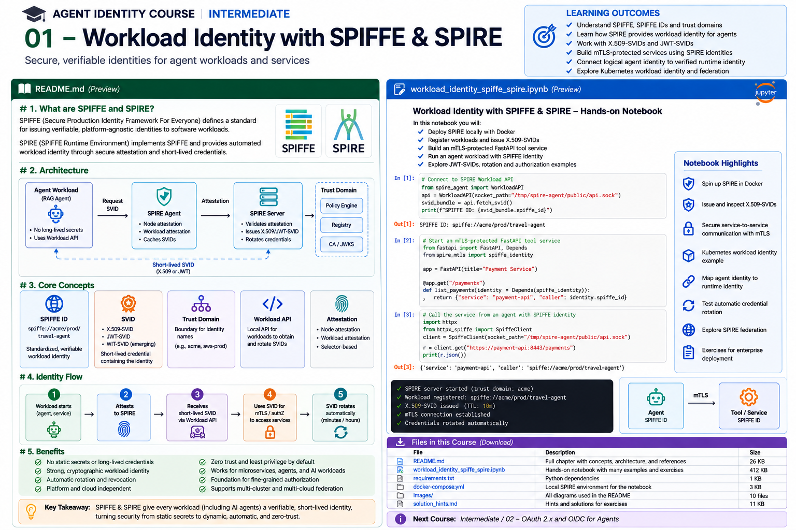

# Intermediate 01 — Workload Identity with SPIFFE & SPIRE



> **Goal:** give an AI agent's running workload a cryptographically verifiable, short-lived identity without shipping long-lived application secrets.

In the beginner track we separated:

```text
Logical Agent Identity
        |
        | runtime binding
        v
Running Workload
        |
        | proves itself
        v
Credential
```

This course implements the runtime layer using **SPIFFE** and **SPIRE**.

---

## Learning outcomes

You will learn to:

- explain SPIFFE, SPIRE, trust domains, SPIFFE IDs, SVIDs and trust bundles;
- distinguish logical agent identity from workload identity;
- design stable SPIFFE ID naming schemes;
- understand node and workload attestation;
- understand SPIRE Server and SPIRE Agent responsibilities;
- retrieve identities through the SPIFFE Workload API;
- compare X.509-SVID, JWT-SVID and the newer WIT-SVID profile;
- use X.509-SVIDs for mutually authenticated TLS;
- understand audience-bound JWT-SVIDs and replay risk;
- reason about automatic credential rotation;
- map Kubernetes metadata to workload identity;
- design registration/selector rules;
- separate authentication from authorization;
- federate trust domains;
- connect SPIFFE identities to agent registries and policy engines;
- avoid common production anti-patterns.

---

# 1. Why workload identity?

Traditional applications often start with:

```text
SERVICE_API_KEY=...
CLIENT_SECRET=...
DATABASE_PASSWORD=...
```

For autonomous agents this becomes especially dangerous because agents may:

```text
call many tools
run in ephemeral containers
spawn sub-agents
move between clusters
access sensitive systems
```

Static secrets answer:

> Does the caller possess this secret?

Workload identity aims to answer:

> Which verified workload is making this request?

---

# 2. What is SPIFFE?

**SPIFFE — Secure Production Identity Framework for Everyone** — defines standards for securely identifying software workloads across heterogeneous infrastructure.

The current SPIFFE standard has three central ideas:

```text
SPIFFE ID
   +
SVID
   +
Workload API
```

The SPIFFE specification describes a standardized identity namespace, verifiable identity documents, and a runtime API through which workloads obtain identity. citeturn0search4turn0search5

SPIFFE is a **standard**, not the identity server itself.

---

# 3. What is SPIRE?

**SPIRE — SPIFFE Runtime Environment** is a CNCF-graduated open-source implementation of SPIFFE.

A simplified deployment:

```text
                         +------------------+
                         |   SPIRE Server   |
                         |                  |
                         | Identity policy  |
                         | Signing          |
                         | Registration     |
                         +--------+---------+
                                  ^
                                  |
                           node attestation
                                  |
                         +--------+---------+
                         |   SPIRE Agent    |
                         |                  |
                         | workload attest. |
                         | Workload API     |
                         +--------+---------+
                                  ^
                                  |
                           local workload API
                                  |
                         +--------+---------+
                         | AI Agent Runtime |
                         +------------------+
```

SPIRE automates identity issuance after attesting infrastructure and workloads.

---

# 4. SPIFFE IDs

A SPIFFE ID is a URI:

```text
spiffe://trust-domain/path
```

Example:

```text
spiffe://prod.example.com/agents/travel-booking
```

Breakdown:

```text
spiffe://
    scheme

prod.example.com
    trust domain

/agents/travel-booking
    workload path
```

The ID identifies the workload. It is **not a secret**.

---

# 5. Naming SPIFFE IDs for agents

Do not encode unstable infrastructure unnecessarily.

Fragile:

```text
spiffe://example.com/node-42/pod-a98f2
```

More semantic:

```text
spiffe://example.com/prod/agents/travel-booking
```

Possible enterprise convention:

```text
spiffe://corp.example/<environment>/<workload-type>/<name>
```

Examples:

```text
spiffe://corp.example/prod/agent/travel
spiffe://corp.example/prod/tool/payments
spiffe://corp.example/prod/service/policy-engine
```

Authorization policy becomes easier to understand when IDs express meaningful workload roles.

---

# 6. Trust domains

The trust domain is the root namespace and trust boundary:

```text
spiffe://corp.example/...
```

A trust domain has associated signing/trust material.

Possible design:

```text
spiffe://prod.corp.example
spiffe://staging.corp.example
```

or organizational boundaries:

```text
spiffe://company-a.example
spiffe://company-b.example
```

Trust-domain design is an architectural decision.

Too broad:

```text
everything everywhere shares one administrative trust boundary
```

Too fragmented:

```text
hundreds of domains requiring unnecessary federation
```

---

# 7. SVIDs

An **SVID — SPIFFE Verifiable Identity Document** — is cryptographic evidence that a workload holds a particular SPIFFE identity.

Current SPIFFE standards define profiles for:

```text
X.509-SVID
JWT-SVID
WIT-SVID
```

The Workload API specification currently requires X.509 and JWT profiles in conforming implementations, while WIT-SVID is optional. citeturn0search0

---

# 8. X.509-SVID

An X.509-SVID represents the SPIFFE identity in an X.509 certificate.

Conceptually:

```text
Certificate
  Subject Alternative Name:
    URI: spiffe://corp.example/prod/agent/travel
```

It can be used for:

```text
mTLS
TLS client authentication
TLS server authentication
message signing
service-to-service identity
```

SPIFFE's X.509-SVID standard builds on normal X.509 validation plus SPIFFE-specific validation requirements. citeturn0search2

---

# 9. Why X.509-SVID is powerful

Consider:

```text
Travel Agent
     |
     | mTLS
     v
Payment Tool
```

Both sides prove workload identity:

```text
caller:
spiffe://corp.example/prod/agent/travel

server:
spiffe://corp.example/prod/tool/payment
```

Then authorization can evaluate:

```text
principal = SPIFFE ID
action = payment:create
resource = trip:483
```

This is much stronger than trusting:

```text
source IP
network location
shared API key
```

SPIRE explicitly documents mTLS between workloads on otherwise untrusted networks as a core use case. citeturn0search10

---

# 10. JWT-SVID

A JWT-SVID is a signed JWT whose subject is the SPIFFE ID.

Conceptually:

```json
{
  "sub": "spiffe://corp.example/prod/agent/travel",
  "aud": ["payment-api"],
  "exp": 1787000000
}
```

JWT-SVID is useful across L7 systems that already understand bearer tokens.

The specification requires:

```text
sub = SPIFFE ID
aud = present and validated
exp = present and validated
```

and recommends narrowly scoped audiences. citeturn0search9

---

# 11. X.509-SVID versus JWT-SVID

| | X.509-SVID | JWT-SVID |
|---|---|---|
| Format | X.509 certificate | JWT/JWS |
| Typical use | mTLS | L7 bearer auth |
| Identity | URI SAN | `sub` |
| Target binding | TLS peer verification | `aud` |
| Replay | stronger channel properties | bearer replay concern |
| Rotation | automatic | short-lived issuance |
| Best default | service/workload communication | compatibility/L7 cases |

SPIFFE guidance recommends X.509-SVIDs where possible because bearer JWTs can be replayed if stolen. citeturn0search6

---

# 12. WIT-SVID

The latest Workload API standard also defines an optional **WIT-SVID** profile.

This is newer than the X.509/JWT profiles and should currently be treated as an emerging capability rather than the default enterprise path.

For this course:

```text
production focus -> X.509-SVID
interoperability focus -> JWT-SVID
awareness -> WIT-SVID
```

The practical lab focuses on the mature X.509/JWT paths.

---

# 13. Trust bundles

How does a payment service verify:

```text
spiffe://corp.example/prod/agent/travel
```

?

It needs the trust material for:

```text
corp.example
```

A SPIFFE bundle contains public key material required to verify SVIDs from a trust domain. Workloads receive relevant bundles through the Workload API. citeturn0search6turn0search0

Trust bundles also rotate.

Do not hard-code one forever.

---

# 14. Workload API

A major SPIFFE design property is that workloads do not need a bootstrap API secret to ask for their identity.

The Workload API is normally local:

```text
unix:///run/spire/sockets/agent.sock
```

The workload connects locally.

The SPIFFE implementation identifies the caller using out-of-band platform/process information rather than an application-supplied bearer credential. citeturn0search4turn0search0

That removes a difficult bootstrap problem:

```text
How does a workload authenticate to the system that gives it credentials?
```

---

# 15. Workload API flow

```text
AI Agent Process
      |
      | local API request
      v
SPIRE Agent
      |
      | inspect workload attributes
      v
Selector match
      |
      | authorized identity
      v
SVID + trust bundle
```

The workload does not say:

```text
"I am travel-agent, trust me."
```

SPIRE derives identity from attested runtime attributes.

---

# 16. Node attestation

Before a SPIRE Agent can issue identities locally, the infrastructure node itself must be trusted.

Examples of node evidence can come from:

```text
cloud instance identity
Kubernetes
TPM
platform-specific attestors
```

Conceptually:

```text
Node
 |
 | proves platform identity
 v
SPIRE Server
 |
 | node accepted
 v
SPIRE Agent becomes trusted delegate
```

---

# 17. Workload attestation

Once the node is trusted, the local SPIRE Agent identifies workloads.

Possible selectors:

```text
unix:uid
unix:gid
k8s:namespace
k8s:service-account
container metadata
process attributes
```

Then policy maps selectors to SPIFFE IDs.

Example concept:

```text
namespace = agents
service_account = travel-agent
        |
        v
spiffe://corp.example/prod/agent/travel
```

This is the key transition:

```text
runtime evidence -> cryptographic identity
```

---

# 18. Registration entries

SPIRE needs policy describing which workloads receive which identities.

Conceptually:

```text
SPIFFE ID:
spiffe://corp.example/prod/agent/travel

selectors:
k8s:ns:agents
k8s:sa:travel-agent
```

Avoid overly broad selectors such as:

```text
namespace = default
```

if many unrelated workloads share it.

Attestation quality determines identity quality.

---

# 19. Identity issuance

A simplified flow:

```text
1. SPIRE Agent attests node
2. workload starts
3. workload connects to Workload API
4. SPIRE Agent attests workload
5. selectors match registration policy
6. workload receives SVID
7. workload uses SVID
8. SVID rotates automatically
```

The application should consume the identity dynamically rather than copy it into a static secret file forever.

---

# 20. Automatic rotation

One of SPIFFE's most important operational properties is short-lived credentials.

The SPIFFE documentation describes private keys and corresponding certificates as short lived and automatically rotated, with workloads able to receive updated identity and bundle material before expiry. citeturn0search6turn0search1

This changes operations from:

```text
create secret
store secret
distribute secret
rotate manually
```

to:

```text
attest workload
stream short-lived identity
renew automatically
```

---

# 21. Streaming identity updates

The Workload API is not merely:

```text
GET certificate once
```

It supports streaming updates.

Changes can include:

```text
SVID rotation
bundle rotation
federated bundle updates
identity changes
```

Applications should be designed to consume updates rather than assume identity material never changes. citeturn0search0

---

# 22. Authentication is not authorization

SPIFFE proves:

```text
caller =
spiffe://corp.example/prod/agent/travel
```

It does **not** automatically mean:

```text
caller may transfer $10,000
```

Architecture:

```text
SPIFFE/SPIRE
   |
   | authenticated workload
   v
SPIFFE ID
   |
   v
Authorization Policy
   |
   +--> OpenFGA
   +--> Cedar
   +--> OPA
   +--> custom PDP
```

SPIFFE answers **who**.

Authorization answers **what may they do**.

---

# 23. Connecting logical agent identity to workload identity

From the beginner track:

```text
agent:travel-booking
```

is a governed logical identity.

At runtime:

```text
spiffe://corp.example/prod/agent/travel-booking
```

is the workload identity.

Registry:

```yaml
agent_id: agent:travel-booking
approved_workloads:
  - spiffe://corp.example/prod/agent/travel-booking
```

Then a gateway can require:

```text
logical actor == agent:travel-booking
AND
runtime workload == approved SPIFFE ID
```

This prevents a stolen logical identifier from being enough.

---

# 24. Agent-to-tool mTLS

Production pattern:

```text
Travel Agent
SPIFFE ID:
.../agent/travel
      |
      | X.509-SVID
      | mTLS
      v
Payment Tool
SPIFFE ID:
.../tool/payment
```

The payment tool:

1. validates the certificate chain;
2. extracts the SPIFFE ID;
3. verifies expected trust domain;
4. passes the authenticated principal to authorization.

Do not use the certificate's display fields as your policy identity when the SPIFFE ID is the intended principal.

---

# 25. Kubernetes architecture

Typical deployment:

```text
Kubernetes Cluster
|
+-- SPIRE Server
|
+-- Node A
|   |
|   +-- SPIRE Agent (DaemonSet)
|   |
|   +-- travel-agent Pod
|       SA: travel-agent
|
+-- Node B
    |
    +-- SPIRE Agent
    |
    +-- payment-tool Pod
        SA: payment-tool
```

Workload selectors can use Kubernetes metadata.

This enables identity independent of:

```text
pod IP
pod name
node IP
```

which are ephemeral.

---

# 26. Sidecar/proxy versus native integration

Two broad integration models:

## Native

Application consumes Workload API directly.

```text
application
    |
    v
Workload API
```

Pros:

```text
explicit identity handling
fine control
no proxy dependency
```

Cons:

```text
application integration work
```

## Proxy / service mesh

```text
application
    |
    v
Envoy / mesh
    |
    v
SPIFFE identity
```

Pros:

```text
transparent mTLS
less application code
```

Cons:

```text
proxy/mesh complexity
identity may be less visible to application
```

SPIFFE's ecosystem includes projects such as Envoy and Istio with SPIFFE support. citeturn0search7

---

# 27. Federation

Suppose:

```text
Company A
spiffe://a.example

Company B
spiffe://b.example
```

By default they have separate trust domains.

Federation allows them to exchange the public trust material needed to validate each other's SVIDs.

```text
a.example bundle <----> b.example bundle
```

SPIFFE Federation standardizes secure retrieval and maintenance of foreign trust-domain bundles. citeturn0search3

---

# 28. Federation is not authorization

Federation means:

> I can cryptographically verify identities issued by this other trust domain.

It does not mean:

> I authorize all of them.

Example:

```text
authenticated:
spiffe://partner.example/agent/research

authorization:
only document:public may be read
```

Trust and privilege remain separate.

---

# 29. Federation for multi-agent ecosystems

Federation becomes relevant when:

```text
enterprise agent
    |
    v
partner agent
    |
    v
external tool
```

Each organization can preserve its own identity authority.

A policy can then reason about:

```text
trust domain
specific SPIFFE ID
logical agent
delegated task
resource
```

This is more scalable than sharing one secret across organizations.

---

# 30. Cloud federation and keyless access

SVIDs can also be exchanged for or used to obtain access to external platforms rather than provisioning additional static credentials.

SPIFFE documents patterns for authenticating workloads to AWS and HashiCorp Vault using SPIRE-issued identity. citeturn0search11

This enables:

```text
workload attestation
      |
      v
SPIFFE identity
      |
      v
federation / token exchange
      |
      v
cloud access
```

instead of:

```text
long-lived cloud access key
```

---

# 31. SPIFFE and agent credentials

SPIFFE does not replace every credential.

An agent may still need:

```text
OAuth token for SaaS
delegated user token
database token
cloud role
```

But SPIFFE can provide the workload identity used to obtain those credentials.

Pattern:

```text
Agent Workload
     |
     | SPIFFE identity
     v
Credential Broker / STS
     |
     | scoped short-lived token
     v
Tool / Cloud / SaaS
```

This is much safer than storing every downstream secret inside the agent.

---

# 32. Security boundaries

SPIFFE/SPIRE security depends on:

```text
trust-domain signing authority
node attestation
workload attestation
SPIRE Agent integrity
Workload API socket permissions
registration policy
selector quality
bundle distribution
```

A bad selector can undermine otherwise excellent cryptography.

Example:

```text
any pod in namespace agents
    ->
payment-agent identity
```

may be dangerously broad.

---

# 33. Workload API socket security

Because the Workload API relies on local/out-of-band caller identification, the endpoint itself is sensitive.

Protect:

```text
Unix socket access
host filesystem
container mounts
privileged containers
host PID access
SPIRE Agent
```

Do not casually mount the SPIRE socket into unrelated workloads.

---

# 34. JWT audience design

Bad:

```text
aud = production
```

Better:

```text
aud = payment-api
```

or:

```text
aud = spiffe://corp.example/prod/tool/payment
```

The JWT-SVID specification explicitly discourages overly broad audiences because compromise of one audience member can increase impersonation risk. citeturn0search9

---

# 35. Identity and observability

Include SPIFFE identity in traces and security events:

```json
{
  "logical_agent": "agent:travel-booking",
  "workload_identity": "spiffe://corp.example/prod/agent/travel",
  "tool": "payment.create",
  "decision": "allow",
  "trace_id": "..."
}
```

Do not log:

```text
private key
full bearer JWT
```

Identity should improve observability without leaking credentials.

---

# 36. Common anti-patterns

### SPIFFE ID stored as a secret

It is an identifier, not proof.

### One shared SVID for many unrelated workloads

Destroys workload-level accountability.

### Broad selectors

Weakens attestation.

### Long-lived copied certificate files

Defeats rotation.

### Trusting any identity in the trust domain

Authentication is not authorization.

### JWT-SVID with huge audience

Increases replay/blast radius.

### Static trust bundle forever

Breaks key rotation and revocation handling.

### Mounting Workload API everywhere

Expands local identity attack surface.

### Encoding pod IDs in stable policy

Creates brittle authorization.

### Treating logical agent and workload as identical

Loses governance/runtime separation.

---

# 37. Production design checklist

## Trust domain

- What boundary does it represent?
- Are prod and non-prod separated appropriately?
- Is federation needed?

## SPIFFE IDs

- Are names semantic and stable?
- Do they avoid transient infrastructure IDs?
- Can authorization policy understand them?

## Attestation

- How are nodes attested?
- How are workloads attested?
- Are selectors narrow enough?
- Can a neighboring workload satisfy them?

## SVID

- X.509 or JWT?
- What lifetime?
- Does the application handle rotation?
- Are JWT audiences narrow?

## Workload API

- Who can reach the socket?
- Is it mounted only where required?
- Does the application consume updates?

## Authorization

- How does SPIFFE ID map to logical agent?
- Which PDP evaluates privileges?
- Is resource-level authorization enforced?

## Operations

- How quickly can identity be revoked?
- Are bundle rotations tested?
- Is federation monitored?
- Are identity events observable?

---

# 38. Practical notebook

The accompanying notebook is designed as an **executable architecture lab**.

It covers:

1. SPIFFE ID parsing and validation;
2. trust-domain design;
3. logical-agent-to-workload mappings;
4. simulated node/workload attestation;
5. selector-based identity assignment;
6. short-lived SVID modeling;
7. certificate generation for X.509-SVID-like lab identities;
8. SPIFFE URI SAN inspection;
9. local mTLS client/server identity;
10. authorization from authenticated SPIFFE ID;
11. JWT-SVID claim modeling and audience checks;
12. rotation;
13. trust bundles;
14. federation reasoning;
15. Kubernetes registration examples;
16. Docker/SPIRE command walkthroughs;
17. adversarial selector tests;
18. enterprise exercises.

The Python sections can run locally. The SPIRE CLI/Docker sections are provided as reproducible environment exercises for machines with Docker installed.

---

# 39. Tooling landscape

SPIFFE is an interoperability standard with a growing ecosystem.

The official ecosystem overview currently lists SPIRE as supporting X.509/JWT SVIDs, attestation, Workload API, SDS, federation, OIDC federation, PKI integration, Kubernetes, VM/bare-metal and serverless environments. It also lists integrations/implementations involving projects and platforms such as Istio, Envoy, Dapr, cert-manager, AWS IAM Roles Anywhere and GCP Workload Identity Federation. citeturn0search7

For this curriculum, **SPIRE** is the reference implementation because it exposes the architecture most directly.

---

# 40. Key takeaways

1. SPIFFE standardizes workload identity; SPIRE implements it.
2. A SPIFFE ID identifies a workload but is not itself proof.
3. SVIDs provide cryptographic proof of SPIFFE identity.
4. X.509-SVIDs are the preferred path for workload mTLS.
5. JWT-SVIDs help at L7 boundaries but require careful audience/replay handling.
6. The Workload API solves identity bootstrap without application secrets.
7. Attestation quality is as important as certificate quality.
8. Credentials should be short lived and rotate automatically.
9. Authentication through SPIFFE must still feed an authorization layer.
10. Logical agent identity should be mapped to—not confused with—runtime workload identity.
11. Federation extends verifiable trust, not privilege.
12. SPIFFE provides a strong foundation for zero-standing-credential agent architectures.

---

# References

- SPIFFE Standard  
  https://spiffe.io/docs/latest/spiffe-specs/spiffe/
- SPIFFE Concepts  
  https://spiffe.io/docs/latest/spiffe/concepts/
- SPIFFE Workload API  
  https://spiffe.io/docs/latest/spiffe-specs/spiffe_workload_api/
- SPIFFE Workload Endpoint  
  https://spiffe.io/docs/latest/spiffe-specs/spiffe_workload_endpoint/
- X.509-SVID Specification  
  https://spiffe.io/docs/latest/spiffe-specs/x509-svid/
- JWT-SVID Specification  
  https://spiffe.io/docs/latest/spiffe-specs/jwt-svid/
- SPIFFE Federation  
  https://spiffe.io/docs/latest/spiffe-specs/spiffe_federation/
- Working with SVIDs  
  https://spiffe.io/docs/latest/deploying/svids/
- SPIRE Use Cases  
  https://spiffe.io/docs/latest/spire-about/use-cases/
- SPIFFE Ecosystem Overview  
  https://spiffe.io/docs/latest/spiffe-about/overview/
- Keyless Authentication Patterns  
  https://spiffe.io/docs/latest/keyless/

---

# Next course

## Intermediate 02 — OAuth 2.x and OpenID Connect for Agents

Next we move from workload identity to delegated/API identity:

```text
OAuth clients
authorization servers
access tokens
OIDC
audiences/scopes
client credentials
authorization code + PKCE
token exchange
sender-constrained tokens
DPoP
mTLS-bound tokens
workload-to-OAuth federation
delegated user authority
agent-on-behalf-of flows
```
