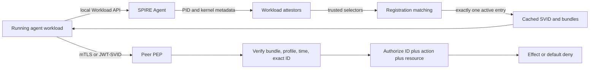

# Workload Identity with SPIFFE and SPIRE

> **Goal:** Design, implement, attack-test, and productionize workload identity for an AI-agent runtime using attestation, short-lived SVIDs, exact peer verification, lifecycle-aware authorization, rotation, and federation—without shipping a long-lived workload secret.

This intermediate course treats workload identity as a runtime security system, not a certificate-format exercise. The reusable lab and notebook implement the same deterministic Northstar Travel scenario, then compare an unsafe “credential present” baseline with a hardened control across 20 labelled cases.

## Start here

1. Read this chapter for the architecture, mechanics, trade-offs, and production guidance.
2. Run the [guided notebook](workload_identity_spiffe_spire.ipynb) for the complete lab narrative.
3. Inspect [lab.py](lab.py) for the reusable implementation.
4. Run `uv run pytest -q curriculum/intermediate/01-workload-identity-spiffe-spire/tests`.
5. Run `uv run python curriculum/intermediate/01-workload-identity-spiffe-spire/lab.py` for the baseline/control report.

The default path is deterministic, credential-free, offline, and side-effect free. It is a teaching simulator—not a SPIFFE conformance suite and not a substitute for deploying SPIRE.

## Learning outcomes

After completing the course, you can:

- distinguish human, logical-agent, workload, node, service, and resource identities;
- explain how a trust domain, SPIFFE ID, SVID, bundle, Workload API, node attestation, and workload attestation fit together;
- design registration entries whose selectors map one observed runtime to exactly one identity;
- validate X.509-SVID chain, time, profile, URI SAN, trust domain, exact peer, and lifecycle;
- validate JWT-SVID key, algorithm, subject, audience, time, lifetime, exact peer, and lifecycle;
- consume full-state Workload API updates correctly, including rotation and redaction;
- keep cryptographic authentication separate from resource authorization;
- operate federation without turning an external trust bundle into blanket access; and
- define release gates for invalid acceptance, valid-work blocking, stale credentials, and authorization violations.

## Prerequisites

- [Authentication, Credentials and Tokens](../../beginner/03-authentication-credentials-tokens/)
- [Authorization for Agents](../../beginner/04-authorization-for-agents/)
- [Least-Privilege Tool Access](../../beginner/05-least-privilege-tool-access/)
- [Agent Identity Lifecycle](../../beginner/06-agent-identity-lifecycle/)
- Python dataclasses, public-key signatures, TLS, JWTs, and Kubernetes concepts

## Scenario, success criteria, and boundaries

Northstar Travel runs a logical booking agent in Kubernetes. The runtime calls an internal payment API and a partner research service. Pods are replaced frequently; a static API key cannot prove which node, namespace, service account, image, or approved deployment produced a request.

The control plane must:

- derive workload identity from attested runtime evidence, never a requested agent name;
- issue short-lived credentials only when one active registration entry matches;
- accept the booking workload only as `spiffe://corp.example/ns/travel/sa/booking-agent`;
- rotate keys and bundles without losing valid traffic or extending stale trust;
- authenticate `partner.example` workloads only through configured partner bundles;
- authorize the exact authenticated SPIFFE ID, action, and resource independently;
- stop using an SVID when a full-state update removes it; and
- log decisions, reason codes, versions, and digests without credential material.

Success means all 20 labelled cases match their expected outcome, with zero invalid acceptance, authorization violation, stale-credential acceptance, or valid-work block.

### Non-goals

The local lab does not implement the complete SPIFFE specifications, TLS handshakes, SPIRE plugins, high availability, ACME, OAuth token exchange, or production PKI ceremonies. It makes the security boundaries observable. Use the official SPIRE quickstart and supported client libraries for real integration.

## 1. Why workload identity is necessary

A workload is executing code: a process, container, pod, VM, serverless instance, or agent worker. A logical AI agent is a governed software identity: purpose, owner, version, policy, and lifecycle. They are related, but not interchangeable.

| Question | Identity that answers it |
| --- | --- |
| Who initiated the task? | human or service principal |
| Which governed agent is acting? | logical agent identity |
| Which running code is on the connection? | workload identity |
| Which machine attested that runtime? | node identity |
| What object is being accessed? | resource identity |

TLS encryption alone proves only that a peer owns a key accepted by the verifier. A generic certificate, shared token, pod label, or caller-supplied agent name does not prove that the approved workload is using that key now.

SPIFFE standardizes how a workload is named and receives verifiable identity documents. SPIRE is a production implementation that performs node/workload attestation, registration, issuance, rotation, and bundle distribution. See the [SPIFFE overview](https://spiffe.io/docs/latest/spiffe-about/overview/) and [SPIRE concepts](https://spiffe.io/docs/latest/spire-about/spire-concepts/).

## 2. Mental model: identity is a pipeline


```mermaid
flowchart LR
    W[Running agent workload] -->|local Workload API| A[SPIRE Agent]
    A -->|PID and kernel metadata| T[Workload attestors]
    T -->|trusted selectors| M[Registration matching]
    M -->|exactly one active entry| C[Cached SVID and bundles]
    C --> W
    W -->|mTLS or JWT-SVID| P[Peer PEP]
    P --> V[Verify bundle, profile, time, exact ID]
    V --> Z[Authorize ID plus action plus resource]
    Z --> R[Effect or default deny]
```

The workload does not choose its identity. It calls a local endpoint. The agent identifies the caller out of band, obtains selectors from trusted attestor plugins, matches registration state, and returns authorized credentials. The official [Workload API specification](https://spiffe.io/docs/latest/spiffe-specs/spiffe_workload_api/) defines streaming responses; [SPIRE concepts](https://spiffe.io/docs/latest/spire-about/spire-concepts/) explains the implementation path.

```text
agent/model -> proposes an action and business arguments
trusted runtime -> obtains attested workload credentials
peer/gateway -> verifies credential and exact expected peer
policy enforcement point -> authorizes action and resource
service -> performs and verifies the effect
```

An SVID authenticates a workload. It does not grant “admin,” approve a payment, validate a model answer, or authorize every resource in its trust domain.

## 3. Foundations

### 3.1 Trust domain and bundle

A trust domain is the administrative security boundary within which SPIFFE IDs are issued, such as `corp.example`. Its bundle contains public verification material. A DNS-like name does not mean DNS is consulted during every decision, and possession of a bundle does not create application authorization.

Rotation usually needs an overlap:

1. distribute a bundle containing old and new roots;
2. issue credentials from the new root;
3. observe verifier adoption;
4. stop issuance from the old root; and
5. remove the old root after its credential window and rollback policy permit.

Issuing from the new root before bundle distribution causes outages. Retaining every old root indefinitely preserves stale trust.

### 3.2 SPIFFE ID

```text
spiffe://corp.example/ns/travel/sa/booking-agent
└────┬────┘ └─────┬──────┘└──────────────┬──────────────┘
   scheme      trust domain            workload path
```

The [SPIFFE ID specification](https://spiffe.io/docs/latest/spiffe-specs/spiffe-id/) defines canonical syntax. Generic URL parsing is insufficient: user info, ports, queries, fragments, encoded path separators, mixed-case trust domains, and dot segments can create identity confusion. The lab implements a deliberately narrow documented subset.

Names should describe stable workload properties, not transient pod IDs or mutable role claims. A path convention may encode namespace and service account, but it is an organizational policy, not evidence of Kubernetes state.

### 3.3 SVID profiles

- **X.509-SVID:** certificate/private-key material for mutual TLS and direct peer authentication.
- **JWT-SVID:** signed bearer token with subject and audience for protocols where mTLS is unavailable.
- **WIT-SVID:** optional, incubating workload identity token profile in the current Workload API specification.

X.509- and JWT-SVIDs are separate forms. JWT-SVIDs are bearer credentials, so exact audience, short lifetime, transport protection, and replay-aware application design matter. The authoritative profiles are linked from the [SPIFFE specifications index](https://spiffe.io/docs/latest/spiffe-specs/).

### 3.4 Registration entries and selectors

A registration entry binds a parent node, issued SPIFFE ID, workload-attestor selectors, credential lifetimes, and lifecycle/version state. Selectors may represent Kubernetes namespace, service account, image digest, Unix UID, or process path. They are authority only when produced by a trusted attestor; a caller’s JSON field named `namespace` is not a selector.

```text
observed node + trusted selectors -> exactly one active registration entry
```

Zero matches deny issuance. Multiple matches indicate policy collision and also deny. Broad entries such as only `k8s:sa:default` make identity theft easy after a scheduling or namespace mistake.

## 4. Internal mechanics

### 4.1 Node and workload attestation

A SPIRE Agent first proves the node on which it runs. Environments use evidence such as cloud instance identity, Kubernetes projected service-account material, TPM evidence, or join tokens. Join tokens are convenient for demonstrations but usually weaker because possession is the proof.

When a process connects to the Workload API, the agent identifies it using OS mechanisms and invokes workload-attestor plugins. Registration matching uses those observed selectors. The endpoint must be local and protected by OS access controls; sharing it across hosts destroys the caller-to-runtime binding. See the [Workload Endpoint specification](https://github.com/spiffe/spiffe/blob/main/standards/SPIFFE_Workload_Endpoint.md).

### 4.2 Issuance, caching, and streaming

The SPIRE Server signs SVIDs and returns them through agents. Agents cache material so workloads survive brief server interruptions. Caching does not permit use after expiry or after removal state arrives.

Workload API fetch calls stream complete state. A client replaces its view rather than merging entries forever. If a later response omits an SVID or bundle, the client stops using it. The lab’s `WorkloadClientCache` rejects partial/replayed updates and empties the SVID cache on removal.

### 4.3 X.509 verification

The lab verifier:

1. parses the locally configured expected peer SPIFFE ID;
2. selects the bundle for that trust domain;
3. verifies the certificate signature against an allowed root;
4. enforces time and maximum lifetime;
5. enforces a non-CA leaf profile with digital signature and exactly one URI SAN;
6. parses the URI SAN as a canonical SPIFFE ID;
7. compares it with the exact expected peer;
8. checks lifecycle state; then
9. authorizes the exact identity, action, and resource.

Production code should use a maintained SPIFFE-aware TLS library. The local implementation is inspectable and does not claim complete RFC 5280 path validation.

### 4.4 JWT verification

The verifier uses `kid` only among keys already bound to the expected trust-domain bundle, permits only EdDSA, verifies the signature, requires `sub`/`aud`/`iat`/`exp`, checks exact audience and time, parses `sub`, checks exact peer/lifecycle, then authorizes. It never follows a token-supplied key URL. A received `jku` or `x5u` is not a trust anchor.

## 5. Authentication is not authorization

```text
Authenticated(peer, expected_id, bundle, time, lifecycle)
AND
Authorized(authenticated_id, action, resource, policy_version)
```

Northstar allows the booking agent to `charge` only `payment:booking-1042`. A partner research workload can authenticate through its federated bundle and still receive `resource_not_authorized`. Federation expands verifiable identity, not business authority.

Policy uses the authenticated SPIFFE ID returned by verification—not a caller-supplied `agent_id`, certificate common name, unverified claim, network-received pod label, or model role.

## 6. Architecture patterns

| Pattern | Strengths | Limitations | Best fit |
| --- | --- | --- | --- |
| Native Workload API SDK | rotation updates, exact identity-aware TLS/JWT | app changes; language maturity differs | security-sensitive services |
| Local proxy or sidecar | legacy app uses conventional interfaces | proxy may collapse multiple apps; socket is critical | brownfield migration |
| Service mesh/SDS | centralized traffic policy and transparent mTLS | mesh identity is not resource authorization | broad Kubernetes estates |
| Identity-aware gateway | centralized verification/token exchange | high-value enforcement point; narrowed end-to-end context | boundary translation |
| Cloud workload federation | short-lived cloud credentials | provider-specific subject/audience policy | managed cloud APIs |
| Secret-manager bootstrap | useful for non-SPIFFE systems | still needs initial identity; often pull rotation | transitional environments |

Avoid adding SPIFFE when an existing managed workload identity already meets the threat model and portability needs. Do not add a second identity control plane without an owner, reliability budget, incident process, and clear benefit.

## 7. Technology landscape

| Technology | Role | Selection guidance |
| --- | --- | --- |
| SPIFFE specifications | vendor-neutral identity, SVID, bundle, API, endpoint, federation | source of protocol guarantees |
| SPIRE | production attestation, registration, issuance, federation | default open-source implementation to evaluate |
| `go-spiffe` | official Go Workload API, SVID source, mTLS, bundle library | strongest native Go path ([repository](https://github.com/spiffe/go-spiffe)) |
| Java client | officially maintained client path referenced by SPIRE | validate release compatibility in [SPIRE](https://github.com/spiffe/spire) |
| Python `spiffe` | community package, not officially maintained | evaluate maintenance/API compatibility ([PyPI](https://pypi.org/project/spiffe/)) |
| Envoy SDS / service mesh | infrastructure delivery and rotation | retain exact application authorization |
| SPIRE Controller Manager | Kubernetes-native registration reconciliation | protect change control and selector quality |
| SPIRE examples | maintained integration examples | reference, not production defaults ([repository](https://github.com/spiffe/spire-examples)) |

As of September 2026, the current SPIRE release line is 1.15; confirm the exact version and security notes on the [official releases page](https://github.com/spiffe/spire/releases). Pin production images by digest and test upgrades rather than copying an old tutorial tag.

## 8. State of the art

**Established:** short-lived X.509-SVID mTLS, local attestation-backed Workload API access, automated rotation/bundles, selector-based Kubernetes/cloud/Unix attestation, SDK or proxy integration, and authorization after authentication.

**Evolving:** cross-domain and cloud federation, Kubernetes-native registration reconciliation, stronger hardware/cloud node evidence, freshness telemetry, and SPIFFE Broker API/Endpoint work for intermediated delivery.

**Emerging:** WIT-SVID support is optional and incubating in the current Workload API specification. Validate interoperability, threat assumptions, libraries, and lifecycle semantics before adoption.

**Open problems:** binding a governed AI-agent version to ephemeral runtime evidence; preserving user delegation through hops; revoking authority faster than issued lifetime; continuously measuring selector ambiguity and federation blast radius; and proving approved model/tools/policy/code rather than only a service account.

## 9. Worked Northstar trace

1. A pod starts on `node-a` with namespace `travel`, service account `booking-agent`, and approved image digest.
2. The local agent identifies the process and emits trusted selectors.
3. Selectors and parent match exactly `entry:booking-agent:v3`.
4. The server issues short-lived X.509- and JWT-SVIDs; caller-requested names are ignored.
5. The client applies a full-state update and caches SVIDs plus the bundle.
6. The payment API validates chain, profile, time, URI SAN, bundle, and lifecycle against the exact expected ID.
7. Policy permits `charge` only on `payment:booking-1042`.
8. The gateway records reason, policy, bundle/entry versions, evidence IDs, and credential digest.
9. Rotation changes key/certificate while the SPIFFE ID remains stable.
10. A removal update omits the SVID; the client erases and stops using it.

## 10. Implementation and experiments

[lab.py](lab.py) provides a strict parser, selector-matching `WorkloadAPI`, fixed-key `DeterministicIssuer`, full-state cache, X.509/JWT `WorkloadGateway`, unsafe baseline, 20 labelled cases, metrics, and release gate. It logs SHA-256 digests, never raw JWTs, keys, or certificates. The fixed clock is for reproducibility; production uses a trustworthy clock and monitors skew.

### A. Selector precision

Run valid selectors, remove the image selector, change namespace, and add a second matching registration. Observe `svids_issued`, `registration_not_found`, and `registration_ambiguous`. Deny-on-ambiguity is a security property.

### B. Bundle rotation

Verify a generation-2 SVID using old-only (deny), overlap old+new (allow), and new-only after drain (allow). The identity remains stable while verification material changes.

### C. X.509 versus JWT-SVID

Change a JWT audience while keeping its subject/signature valid. Then present an X.509-SVID for the wrong exact peer. Both fail: “signed” is not a complete policy.

### D. Federation versus access

Authenticate `RESEARCH_ID` through the partner bundle. Payment remains denied. A narrow `research:read` rule can enable only the intended resource.

## 11. Evaluation

The dataset has 20 attempts: 2 expected valid and 18 expected blocked, spanning attestation, selectors, endpoint locality, X.509 profile/time/trust, JWT key/audience/time, lifecycle, rotation, federation, and resource scope.

| Metric | Population | Numerator | Direction |
| --- | --- | --- | --- |
| outcome accuracy | all 20 | decisions matching labels | higher |
| invalid acceptance | 18 blocked cases | blocked cases allowed | zero |
| valid work blocked | 2 valid cases | valid cases denied | zero |
| authorization violation | two policy-negative cases | forbidden actions allowed | zero |
| stale-credential acceptance | expired, stale-bundle, removed, expired-JWT | stale cases allowed | zero |

The unsafe baseline reads identity-shaped data but skips trust, exact peer, time, lifecycle, and authorization, so it accepts all 18 invalid attempts. The hardened path matches all 20 and passes. These are fixture results—not performance benchmarks or production proof.

Production evaluation also measures issuance latency, renewal lead time, API availability, bundle age, overlap, attestation denial, ambiguity, expiry headroom, policy-denial slices, and recovery time. Report percentiles and slices; never present simulated fixed durations as latency.

## 12. Failure modes

| Failure | Why it fails | Control |
| --- | --- | --- |
| shared API key | no runtime binding; replay window | attested short-lived SVID |
| caller chooses SPIFFE ID | claim becomes authority | trusted selectors/registration |
| one broad selector | workloads collide | conjunctive selectors and ambiguity alarms |
| cross-host API socket | breaks local caller binding | node-local endpoint and OS permissions |
| trust any URI SAN | wrong workload authenticates | exact expected ID |
| use certificate CN | not the SPIFFE profile | validate URI SAN/profile |
| signature-only JWT | wrong audience/time/key accepted | bundle and claim profile |
| follow `jku` | redirected trust and SSRF risk | configured bundle keys only |
| append stream updates | removed credentials persist | replace complete snapshots |
| federation means allow | external identity gains unintended access | local authorization |
| log tokens/keys | telemetry leaks credentials | digests and metadata |
| retain all roots | stale compromise remains trusted | measured retirement |
| mesh policy equals app policy | misses resource context | application PEP/PDP |

## 13. Production upgrade

### Control plane

- run SPIRE Server HA with supported datastore and protected signing keys;
- align trust domains to administrative/security boundaries;
- choose node attestors for the threat model;
- reconcile registrations through reviewed IaC/controller workflows;
- version/audit selectors, TTL policy, bundles, and federation;
- monitor agent/server health, renewal, ambiguity, and expiry headroom; and
- test backup, restore, signer rotation, disaster recovery, and migration.

### Workloads

- prefer official Go/Java clients where available;
- use rotating SVID sources rather than copying credentials to files;
- protect the local endpoint and restrict socket access;
- configure exact peer IDs or narrow match policies;
- fail closed on missing/stale bundle, malformed ID, or policy outage;
- treat attestation/policy denial as terminal and bound transient retries; and
- never put keys or SVIDs in model context, logs, task state, or memory.

### Lifecycle and federation

- derive TTL/renewal from measured outage, revocation, and rotation requirements;
- stop use on Workload API redaction;
- propagate logical-agent suspension into registration and resource policy;
- verify that issuance stopped, caches changed, and policies deny;
- allowlist partner domains/bundle sources through controlled configuration;
- constrain each partner identity to local actions/resources; and
- monitor bundle age/key change with an emergency removal owner.

### Optional real SPIRE path

The prior container file referenced missing configuration and could not start; it is removed rather than advertised as runnable. For a real exercise:

1. complete [SPIRE 101](https://spiffe.io/docs/latest/try/spire101/);
2. inspect current [server configuration](https://spiffe.io/docs/latest/deploying/spire_server/) and pin the tested release/digests;
3. create the booking-agent registration using namespace, service-account, and image selectors;
4. fetch credentials through an officially supported SDK where possible;
5. implement exact peer authorization and observe rotation; and
6. map live outputs into this lab’s decision/evaluation contract.

## 14. Exercises and review

1. Add `research:read` for `RESEARCH_ID` on `catalog:destinations`; prove payment stays denied.
2. Add a Unix workload with UID and executable selectors.
3. Add JWT not-yet-valid and maximum-lifetime cases.
4. Implement old+new then new-only bundle retirement.
5. Diagnose a rotation rollout failing on half the fleet using bundle versions and root digests.
6. Repair two overlapping production registrations with the narrowest selector change.
7. Diagnose a client that merged instead of replacing full-state updates.
8. Choose native SDK, sidecar, mesh, or gateway for a Go/Java/Python estate; document identity granularity and failure ownership.
9. Design trust domains for two business units and a regulated payments boundary.
10. Define how logical-agent suspension disables issuance and downstream access.

Review questions: Why fail closed on multiple registrations? What does a bundle establish—and not establish? Why is a valid partner SVID insufficient for payment? What does an omitted SVID mean in a later full-state update? Which facts must come from the attestor? When is JWT-SVID less suitable than X.509 mTLS? Why must rotation prove both issuance and verifier rollout?

## 15. Summary

- SPIFFE names workloads; SPIRE attests runtimes and delivers rotating SVIDs/bundles.
- A workload never becomes trusted by declaring a SPIFFE ID.
- Exact matching, local endpoint protection, and deny-on-ambiguity protect issuance.
- Verification covers trust, profile, time, audience, exact peer, and lifecycle.
- Workload API streams are complete state; removal means stop using old material.
- Federation authenticates external identities but grants no automatic access.
- Production readiness requires measured rotation, availability, revocation, observability, and ownership.

## 16. Authoritative references

### Standards

- [SPIFFE specifications](https://spiffe.io/docs/latest/spiffe-specs/)
- [SPIFFE ID](https://spiffe.io/docs/latest/spiffe-specs/spiffe-id/)
- [Trust Domain and Bundle](https://spiffe.io/docs/latest/spiffe-specs/spiffe_trust_domain_and_bundle/)
- [X.509-SVID](https://spiffe.io/docs/latest/spiffe-specs/x509-svid/)
- [JWT-SVID](https://spiffe.io/docs/latest/spiffe-specs/jwt-svid/)
- [Workload API](https://spiffe.io/docs/latest/spiffe-specs/spiffe_workload_api/)
- [Workload Endpoint](https://github.com/spiffe/spiffe/blob/main/standards/SPIFFE_Workload_Endpoint.md)
- [Federation](https://spiffe.io/docs/latest/spiffe-specs/spiffe_federation/)

### Implementation and operations

- [SPIRE concepts](https://spiffe.io/docs/latest/spire-about/spire-concepts/)
- [Working with SVIDs](https://spiffe.io/docs/latest/deploying/svids/)
- [SPIRE Server configuration](https://spiffe.io/docs/latest/deploying/spire_server/)
- [SPIRE 101](https://spiffe.io/docs/latest/try/spire101/)
- [SPIRE releases](https://github.com/spiffe/spire/releases)
- [SPIRE repository](https://github.com/spiffe/spire)
- [`go-spiffe`](https://github.com/spiffe/go-spiffe)
- [SPIRE examples](https://github.com/spiffe/spire-examples)
- [SPIRE use cases](https://spiffe.io/docs/latest/spire-about/use-cases/)
- [Community Python `spiffe` package](https://pypi.org/project/spiffe/)

## Next course

Continue to [Agent Authentication with OAuth 2.0 and OpenID Connect](../02-oauth-oidc-for-agents/), where workload identity is represented or exchanged at API boundaries without confusing workload authentication, user delegation, and authorization.
