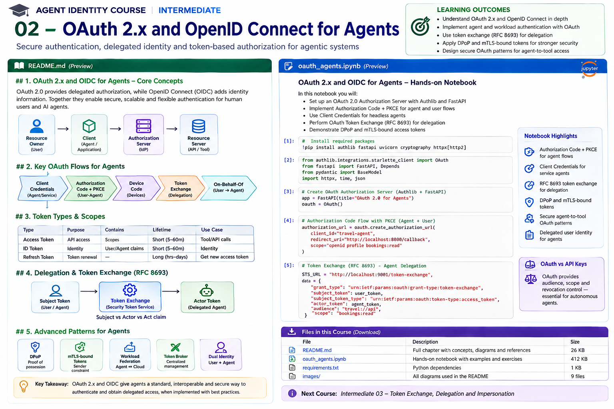

# Intermediate 02 — OAuth 2.x and OpenID Connect for Agents



> **Goal:** use modern OAuth and OpenID Connect correctly when an AI agent acts as a workload, acts for a user, or obtains narrowly scoped access to tools and APIs.

Agent identity usually contains more than one principal:

```text
Human / Resource Owner
          |
          | delegates
          v
Agent / OAuth Client
          |
          | obtains constrained token
          v
Authorization Server
          |
          v
Tool / API / MCP Server
```

The central security question is not merely:

> "Is this agent authenticated?"

It is:

> **Which actor is calling, on whose authority, for which resource, with what permissions, for how long, and with what cryptographic constraints?**

---

## Learning outcomes

You will learn to:

- distinguish OAuth authorization from OIDC authentication;
- model resource owner, client, authorization server and resource server;
- distinguish user identity, agent/client identity and workload identity;
- understand access, ID and refresh tokens;
- design scopes, audiences and resource indicators;
- use Authorization Code + PKCE for user-delegated agent flows;
- use Client Credentials for non-user workload access;
- understand why Client Credentials does not mean "act as the user";
- use RFC 8693 OAuth Token Exchange for delegation;
- reason about `subject_token` and `actor_token`;
- preserve user + agent dual identity;
- use DPoP sender-constrained tokens;
- understand mutual-TLS certificate-bound access tokens;
- integrate SPIFFE workload identity with OAuth token issuance;
- build token-broker / STS architectures;
- understand current MCP OAuth authorization patterns;
- defend against token forwarding, confused deputy, audience errors and excessive scope;
- design OAuth telemetry and revocation controls.

---

# 1. OAuth is authorization

OAuth lets a client obtain constrained access to a protected resource.

Roles:

```text
Resource Owner
     |
     v
Client
     |
     v
Authorization Server
     |
     v
Access Token
     |
     v
Resource Server
```

For agents:

```text
employee
   |
   v
travel agent
   |
   v
enterprise authorization server
   |
   v
travel-api access token
```

OAuth does not inherently say:

> "This token proves the user's login identity."

That is one reason OpenID Connect exists.

---

# 2. OpenID Connect is an identity layer

OpenID Connect builds an identity layer on OAuth.

A client requests OIDC scopes such as:

```text
openid
profile
email
```

and receives an **ID Token** containing claims about the authenticated subject.

Simplified:

```text
User
 |
 | authenticates
 v
OpenID Provider
 |
 +--> ID Token       -> identity information for client
 |
 +--> Access Token   -> authorization at API
```

Do not send an ID token to an API merely because it is a JWT.

The API should receive an **access token intended for that API**.

The OpenID Foundation describes OIDC as an OAuth-based identity framework in which an OpenID Provider authenticates the user and returns identity information, normally including an ID Token. citeturn0search9turn0search7

---

# 3. Agent identity is multi-principal

A useful enterprise model separates:

```text
User
agent:client
runtime workload
```

Example:

```text
user = alice
logical agent = agent:travel-booking
OAuth client = travel-agent-prod
workload = spiffe://corp.example/prod/agent/travel
```

These should not be flattened into:

```text
sub = alice
```

and then forgotten.

Audit needs to know both:

```text
who delegated
AND
which agent acted
```

---

# 4. OAuth client is not automatically a strong workload identity

An OAuth `client_id` identifies a registered OAuth client.

Example:

```text
client_id = travel-agent-prod
```

But client ID alone is public metadata.

Proof may come from:

```text
client secret
private_key_jwt
mTLS
workload federation
SPIFFE
platform identity
```

The OpenID Foundation's recent agent-identity work explicitly notes that OAuth client identifiers and MCP client registration alone are not equivalent to robust workload identity, and points to workload identity systems such as SPIFFE/SPIRE as complementary. citeturn0search37

---

# 5. Access token

An access token authorizes calls to a resource server.

Conceptually:

```json
{
  "iss": "https://id.example",
  "sub": "user:alice",
  "aud": "travel-api",
  "scope": "trips:read trips:book",
  "exp": 1787000000
}
```

Possible additional actor information:

```json
{
  "act": {
    "sub": "agent:travel-booking"
  }
}
```

Exact claims depend on profile and issuer.

Do not design authorization by assuming every provider uses identical JWT claims.

---

# 6. ID token

ID tokens are consumed by the OIDC client.

Typical claims:

```text
iss
sub
aud
exp
iat
nonce
```

The client validates:

```text
signature
issuer
audience
expiration
nonce where applicable
```

An ID token is not a generic API authorization credential.

---

# 7. Refresh token

Refresh tokens allow a client to obtain new access tokens.

For agents they are especially sensitive because:

```text
access token = temporary authority
refresh token = capability to mint more authority
```

Avoid exposing refresh tokens to:

```text
LLM context
tool arguments
logs
memory stores
prompt traces
```

Store and use them in a trusted token-management component.

---

# 8. Scopes

Scopes represent requested/issued authorization dimensions.

Example:

```text
trips:read
trips:book
payments:create
```

Avoid:

```text
scope = admin
```

for ordinary agent workflows.

Agent access should generally be:

```text
task-specific
resource-specific
short-lived
```

Scopes alone are often insufficient for object-level authorization.

A scope:

```text
invoices:read
```

does not necessarily answer:

```text
which invoices?
```

That requires resource-level policy.

---

# 9. Audience

Audience constrains **where** a token is valid.

```text
aud = travel-api
```

A payment API should reject it.

This prevents a major agent failure mode:

```text
Agent gets token for Service A
       |
       | forwards same token
       v
Service B
       |
       X reject wrong audience
```

Never accept arbitrary tokens merely because:

```text
signature is valid
```

Validate issuer **and audience**.

---

# 10. Resource indicators

OAuth resource indicators allow the client to identify the target protected resource.

Conceptually:

```text
resource=https://api.example.com/travel
```

This helps authorization servers issue appropriately audience-restricted tokens.

For agents with many tools:

```text
one token for every tool
```

is a dangerous default.

Prefer:

```text
tool-specific / resource-specific tokens
```

---

# 11. Authorization Code + PKCE

When an agent operates with user authorization through an interactive application, a modern pattern is:

```text
User
 |
 v
Agent Client
 |
 | authorization request + PKCE challenge
 v
Authorization Server
 |
 | user authenticates / consents
 v
authorization code
 |
 | code + verifier
 v
tokens
```

PKCE binds the authorization code to the client instance that initiated the flow.

Avoid the old implicit grant.

---

# 12. PKCE

Client generates:

```text
code_verifier = random secret
```

then:

```text
code_challenge = BASE64URL(SHA256(code_verifier))
```

Authorization request sends:

```text
code_challenge
code_challenge_method=S256
```

Token request sends:

```text
code_verifier
```

A stolen authorization code alone is therefore insufficient.

---

# 13. Client Credentials

For machine-to-machine access:

```text
Agent Workload
      |
      | authenticates as client
      v
Authorization Server
      |
      | access token
      v
Tool API
```

This is useful when:

```text
no human delegation exists
agent acts under its own service authority
```

Example:

```text
inventory-monitor agent
    ->
inventory:read
```

---

# 14. Client Credentials is not user delegation

Bad reasoning:

```text
client credentials token
therefore agent is Alice
```

No.

The subject/authority is the client/workload.

Use a user-delegated flow when the operation must be performed under a user's authority.

This distinction is fundamental for auditability.

---

# 15. Agent acting for a user

Suppose Alice asks:

```text
"Book the cheapest policy-compliant flight."
```

We want:

```text
Alice
   |
   | delegates
   v
Travel Agent
   |
   | acts within bounded authority
   v
Travel API
```

The API should be able to reason about:

```text
user = Alice
agent = Travel Agent
scope = booking:create
resource = Alice's trip
constraints = corporate policy
```

This is richer than impersonating Alice.

---

# 16. Impersonation versus delegation

### Impersonation

Downstream sees:

```text
Alice
```

but may not know an agent acted.

### Delegation

Downstream can preserve:

```text
subject = Alice
actor = Travel Agent
```

Delegation is generally more auditable for agent systems.

A useful principle:

> Do not erase the intermediary actor unless the protocol/use case truly requires impersonation.

---

# 17. OAuth Token Exchange — RFC 8693

OAuth Token Exchange defines an STS-like operation where one security token is exchanged for another.

Conceptually:

```text
subject token
      |
      v
Security Token Service
      |
      + actor token / policy
      |
      v
new access token
```

Request uses:

```text
grant_type =
urn:ietf:params:oauth:grant-type:token-exchange
```

Common parameters include:

```text
subject_token
subject_token_type
actor_token
actor_token_type
resource
audience
scope
requested_token_type
```

This is a foundational primitive for agent delegation.

---

# 18. Subject token and actor token

Think:

```text
subject_token -> on whose behalf?
actor_token   -> which actor is acting?
```

Example:

```text
subject = Alice
actor = Travel Agent
```

The STS can issue:

```text
token valid only for travel-api
scope = booking:create
TTL = 5 minutes
```

This is much safer than handing the agent Alice's broad original token.

---

# 19. Downscoping during token exchange

A token exchange should often reduce authority.

Input:

```text
user token
scopes:
  profile
  travel
  expense
  documents
```

Agent task:

```text
book trip
```

Output:

```text
aud = travel-api
scope = trips:read trips:book
TTL = 5m
```

Principle:

```text
derived authority <= source authority
```

and preferably:

```text
derived authority == task-required subset
```

---

# 20. Token broker architecture

A mature agent should not perform arbitrary token manipulation inside LLM-generated code.

Use:

```text
Agent
  |
  | authenticated workload identity
  v
Token Broker / STS
  |
  | policy
  | delegation checks
  | token exchange
  v
Tool-specific token
```

The broker becomes a control point for:

```text
scope
audience
TTL
delegation
approvals
logging
revocation
```

---

# 21. SPIFFE -> OAuth federation

From Intermediate 01:

```text
spiffe://corp.example/prod/agent/travel
```

can authenticate the workload.

Then:

```text
SPIFFE SVID
    |
    v
STS / token broker
    |
    v
OAuth access token
```

The OAuth token can be tailored for:

```text
SaaS API
MCP server
cloud API
enterprise tool
```

This avoids storing an OAuth client secret in the agent container.

---

# 22. DPoP — Demonstrating Proof of Possession

Bearer token problem:

```text
steal token -> replay token
```

DPoP adds proof that the caller holds a private key associated with the token.

Request:

```text
Authorization: DPoP <access-token>
DPoP: <signed proof JWT>
```

The proof includes values such as:

```text
htm -> HTTP method
htu -> HTTP URI
iat
jti
```

and is signed with the client's key.

RFC 9449 standardizes DPoP for sender-constraining OAuth tokens.

---

# 23. DPoP does not make theft irrelevant

DPoP reduces usefulness of a stolen access token if the attacker does not possess the associated private key.

But protect:

```text
DPoP private key
proof replay
nonce handling
token binding validation
```

A token plus stolen key can still be dangerous.

---

# 24. mTLS-bound access tokens

OAuth mutual-TLS profiles can bind an access token to a client certificate.

Conceptually:

```text
client certificate
      |
      v
Authorization Server
      |
      v
certificate-bound access token
```

At the API:

```text
token
+
TLS client certificate
```

must correspond.

This is another sender-constrained token approach.

---

# 25. SPIFFE and mTLS-bound OAuth

An advanced architecture can combine:

```text
SPIFFE workload certificate
       |
       v
OAuth authorization server / STS
       |
       v
certificate-bound access token
```

Implementation support varies by platform, but the architectural goal is powerful:

```text
token cannot simply move to an unrelated workload
```

---

# 26. Sender-constrained tokens for agents

Agents are good candidates for proof-of-possession because they:

```text
call many remote APIs
operate unattended
may process hostile content
may be exposed to prompt injection
```

If a bearer token leaks into:

```text
trace
prompt
tool output
log
memory
```

it may be replayed.

Sender-constrained tokens reduce that blast radius.

---

# 27. Token lifetime

Prefer short-lived agent access tokens.

Example policy:

```text
read-only API       -> 15m
sensitive write     -> 5m
high-impact action  -> 1-2m + approval
```

These are example policies, not standards.

The right lifetime depends on:

```text
risk
revocation capability
latency
workflow duration
offline requirements
```

---

# 28. Token caching

Do not request a new token for every line of code.

But do not cache forever.

Token cache key should include relevant dimensions:

```text
subject
actor
issuer
audience/resource
scope
proof key
```

Never accidentally reuse:

```text
Alice's travel token
```

for:

```text
Bob's request
```

Agent runtimes require careful principal-aware caches.

---

# 29. Confused deputy

Scenario:

```text
Attacker
  |
  | asks agent
  v
Privileged Agent
  |
  | uses its own broad token
  v
Sensitive API
```

The agent becomes a confused deputy.

Mitigations:

```text
task-bound authorization
user authority checks
resource checks
downscoped tokens
audience restriction
approval for high-impact calls
actor preservation
```

Authentication alone does not solve this.

---

# 30. Token forwarding

Bad architecture:

```text
user token
  |
  v
agent
  |
  v
tool A
  |
  v
tool B
  |
  v
tool C
```

The original token accumulates exposure.

Prefer:

```text
user authority
   |
   v
token broker
   |
   +--> token for A
   +--> token for B
   +--> token for C
```

Each:

```text
narrow audience
narrow scope
short TTL
```

---

# 31. ID token forwarding is also wrong

A common mistake:

```text
agent receives ID token
agent sends ID token to tool
```

ID token:

```text
audience = OAuth/OIDC client
```

Tool API:

```text
audience = resource server
```

Use the correct token type for the correct recipient.

---

# 32. MCP authorization

Modern remote MCP authorization is based on OAuth.

The current MCP ecosystem uses **Protected Resource Metadata** to tell clients which authorization servers protect an MCP resource. Servers return OAuth-style `401` responses and clients discover how to authorize. Current MCP guidance supports server-wide and per-tool authorization patterns. citeturn0search0

The July 28, 2026 MCP specification also strengthened authorization behavior, including authorization-server issuer validation and a transition from Dynamic Client Registration toward Client ID Metadata Documents. citeturn0search1

---

# 33. MCP Protected Resource Metadata

A protected MCP server can publish:

```text
/.well-known/oauth-protected-resource
```

Metadata can identify:

```text
resource
authorization_servers
scopes_supported
```

Client flow:

```text
MCP Client
    |
    | request
    v
MCP Server
    |
    | 401 + WWW-Authenticate
    v
discover protected resource metadata
    |
    v
discover authorization server
    |
    v
OAuth
```

This keeps resource and authorization-server roles clean.

---

# 34. MCP token audience

An MCP server must not accept a token intended for an unrelated service.

Example:

```text
aud = github-api
```

must not be treated as:

```text
aud = finance-mcp
```

Token forwarding across MCP servers is a serious confused-deputy risk.

---

# 35. MCP 2026 authorization changes

As of the **2026-07-28 MCP specification**, authorization hardening includes:

```text
RFC 9207 issuer validation
credential isolation by issuer
scope step-up behavior
movement toward Client ID Metadata Documents (CIMD)
```

The new stateless core also exposes method/tool names in headers, which makes gateway-level routing and policy enforcement easier. citeturn0search1turn0search5

This is highly relevant to enterprise agent identity because OAuth policy can increasingly be enforced at infrastructure boundaries rather than buried inside tool implementations.

---

# 36. Per-tool authorization

Not every tool needs the same authority.

Example MCP server:

```text
weather.search       -> public
calendar.read        -> user auth
calendar.create      -> elevated scope
payment.execute      -> elevated scope + approval
```

Current MCP Apps guidance explicitly describes per-server and per-tool OAuth authorization patterns. citeturn0search0

Agent architecture should support **step-up** rather than asking for maximum privilege at startup.

---

# 37. Incremental authorization

Bad:

```text
agent startup:
request every scope it might ever need
```

Better:

```text
initial:
docs:read

later:
calendar:read

only when required:
calendar:write
```

This reduces standing authority.

---

# 38. Authorization is moving beyond scopes

OAuth gets a token to a resource server.

The resource server still needs fine-grained policy.

Example:

```text
scope = payments:create
```

does not answer:

```text
may this agent pay vendor X?
is amount <= $500?
is user Alice allowed to approve?
has human approval been satisfied?
```

The OpenID Foundation's AuthZEN Authorization API became a final specification in January 2026, standardizing the interface between policy enforcement and policy decision systems. citeturn0search12

In 2026, AuthZEN also introduced agent-oriented drafts for access prerequisites/approvals and MCP tool authorization. citeturn0search3turn0search8

We cover this deeper in the authorization courses.

---

# 39. Dual identity in audit logs

A strong event:

```json
{
  "user": "user:alice",
  "agent": "agent:travel-booking",
  "oauth_client": "travel-agent-prod",
  "workload": "spiffe://corp.example/prod/agent/travel",
  "audience": "travel-api",
  "scope": ["trips:book"],
  "action": "trip.create",
  "resource": "trip:123",
  "decision": "allow"
}
```

This enables:

```text
human accountability
agent accountability
runtime accountability
authorization reconstruction
```

Do not log raw bearer tokens.

---

# 40. Revocation

Short token TTL reduces revocation dependence, but revocation still matters.

Revoke:

```text
refresh token
client credential
delegation grant
session
proof key
workload trust
```

depending on the incident.

Architecture should define:

```text
how quickly does downstream authority disappear?
```

---

# 41. OAuth threat model for agents

Threats include:

```text
token theft
refresh-token theft
redirect URI abuse
authorization-code interception
CSRF/state attacks
issuer mix-up
wrong audience
overbroad scopes
token forwarding
confused deputy
cross-user token cache leakage
prompt-driven privilege escalation
malicious MCP server
malicious tool result
stolen DPoP key
```

Modern OAuth profiles solve some—not all—of these.

---

# 42. State and nonce

For browser-based authorization:

```text
state
```

helps correlate request/response and mitigate request-forgery classes of attack.

OIDC:

```text
nonce
```

binds an ID Token to the authentication request and mitigates replay/substitution scenarios.

Use framework/library implementations rather than inventing these flows manually.

---

# 43. Redirect URI security

Register precise redirect URIs.

Avoid overly permissive patterns.

For local/native agent clients, current OAuth ecosystems have specialized patterns for loopback redirects and native apps.

Never accept:

```text
redirect_uri = attacker-controlled URL
```

without exact policy.

---

# 44. Client authentication

Confidential clients may authenticate using mechanisms such as:

```text
client secret
private_key_jwt
mTLS
workload identity federation
```

For production agents, avoid embedding long-lived client secrets when platform/workload identity can replace them.

---

# 45. Private key JWT

Instead of:

```text
client_secret = static shared string
```

a client can sign a JWT assertion with a private key.

This improves some properties but introduces:

```text
private-key lifecycle
JWKS management
rotation
```

Workload federation can often remove even that application-managed key.

---

# 46. OAuth and zero standing privilege

Combine:

```text
workload identity
+
token exchange
+
short TTL
+
narrow audience
+
narrow scope
+
step-up
+
resource policy
```

to approach:

```text
zero standing agent privilege
```

The agent holds only the authority needed for its current task.

---

# 47. Reference architecture

```text
                   User
                    |
             Authorization Code
                 + PKCE
                    |
                    v
            Authorization Server
                    |
          user authority / consent
                    |
                    v
Agent Registry --> Token Broker <--- SPIFFE Workload Identity
                    |
                    | token exchange
                    |
       +------------+-------------+
       |            |             |
       v            v             v
 Travel Token   Calendar Token  Payment Token
 aud=travel     aud=calendar    aud=payment
 5 min          5 min           1 min
       |            |             |
       v            v             v
 Travel API    Calendar API   Payment Tool
```

At each resource:

```text
validate issuer
validate audience
validate expiry
validate sender constraint if used
extract subject + actor
perform resource-level authorization
```

---

# 48. Practical notebook

The notebook implements a compact **OAuth Security Lab for Agents** using standard Python libraries and Authlib-style concepts.

It covers:

1. PKCE generation and verification;
2. authorization-code state handling;
3. access-token claim validation;
4. audience enforcement;
5. scope enforcement;
6. client-credentials semantics;
7. user + agent dual identity;
8. RFC 8693 token-exchange request construction;
9. downscoping;
10. token broker policy;
11. DPoP proof creation;
12. DPoP proof validation;
13. sender-constrained token modeling;
14. token caching isolation;
15. MCP Protected Resource Metadata;
16. MCP 401 discovery flow;
17. per-tool step-up authorization;
18. confused-deputy tests;
19. token-forwarding attacks;
20. SPIFFE-to-OAuth federation design.

The notebook deliberately separates **protocol learning** from a particular commercial identity provider so the concepts transfer to Entra ID, Keycloak, Auth0/Okta-style systems, cloud STSs and enterprise authorization servers.

---

# 49. Production checklist

## Client

- Is this a user-delegated or workload-only flow?
- Is PKCE used where appropriate?
- Is client authentication strong?
- Are redirect URIs exact?
- Are tokens protected from LLM context?

## Token

- Correct issuer?
- Correct audience?
- Minimal scopes?
- Short TTL?
- Sender constrained where useful?
- Actor preserved?
- Resource-specific?

## Resource server

- Validate signature/issuer/audience/expiry.
- Validate sender constraint.
- Do not accept ID tokens as API tokens.
- Do resource-level authorization.
- Do not trust scopes as complete policy.

## Delegation

- Preserve subject and actor.
- Downscope derived tokens.
- Bind to task/resource where possible.
- Prevent delegation chains from amplifying authority.

## MCP

- Publish Protected Resource Metadata.
- Return standards-compliant 401 challenges.
- Validate token audience.
- Isolate credentials by issuer.
- Support step-up scopes.
- Never forward unrelated tokens.

## Operations

- Principal-aware token cache.
- Refresh-token isolation.
- Revocation path.
- Audit subject + actor + workload.
- Never log raw tokens.

---

# 50. Key takeaways

1. OAuth is primarily authorization; OIDC adds identity.
2. Access tokens, ID tokens and refresh tokens have different recipients and purposes.
3. An OAuth client ID is not sufficient workload proof.
4. Client Credentials represents the client—not a human user.
5. User-delegated agents should preserve both user and agent identity.
6. RFC 8693 Token Exchange is a key primitive for bounded delegation.
7. Derived tokens should normally be downscoped.
8. Audience restriction is essential in multi-tool systems.
9. DPoP and mTLS can sender-constrain tokens.
10. SPIFFE can authenticate a workload that then obtains OAuth tokens from an STS.
11. MCP authorization now has increasingly mature OAuth discovery and hardening patterns.
12. OAuth scopes do not replace fine-grained resource authorization.
13. Token brokers keep credential logic out of the LLM execution path.
14. Agent systems should aim for short-lived, task-specific authority rather than standing privilege.

---

# References

- OAuth 2.0 Authorization Framework — RFC 6749  
  https://www.rfc-editor.org/rfc/rfc6749
- OAuth 2.0 Security Best Current Practice — RFC 9700  
  https://www.rfc-editor.org/rfc/rfc9700
- OAuth 2.0 Token Exchange — RFC 8693  
  https://www.rfc-editor.org/rfc/rfc8693
- OAuth 2.0 DPoP — RFC 9449  
  https://www.rfc-editor.org/rfc/rfc9449
- OAuth 2.0 Mutual-TLS — RFC 8705  
  https://www.rfc-editor.org/rfc/rfc8705
- OAuth Resource Indicators — RFC 8707  
  https://www.rfc-editor.org/rfc/rfc8707
- OAuth Protected Resource Metadata — RFC 9728  
  https://www.rfc-editor.org/rfc/rfc9728
- PKCE — RFC 7636  
  https://www.rfc-editor.org/rfc/rfc7636
- OpenID Connect Core  
  https://openid.net/specs/openid-connect-core-1_0.html
- OpenID Foundation — How OpenID Connect Works  
  https://openid.net/developers/how-connect-works/
- OpenID AuthZEN Authorization API 1.0  
  https://openid.net/specs/authorization-api-1_0.html
- OpenID AuthZEN agent-era authorization work  
  https://openid.net/openid-foundation-advances-authorization-for-the-agent-era-with-new-authzen-working-group-drafts/
- MCP Authorization  
  https://modelcontextprotocol.io/specification/2026-07-28/basic/authorization
- MCP 2026-07-28 release  
  https://blog.modelcontextprotocol.io/posts/2026-07-28/
- SPIFFE  
  https://spiffe.io/

---

# Next course

## Intermediate 03 — Token Exchange, Delegation & Impersonation

We will go deeper into:

```text
RFC 8693
delegation chains
subject vs actor
act claims
on-behalf-of
impersonation
downscoping
task-bound tokens
delegation depth
cross-domain delegation
token brokers
STS design
privilege amplification prevention
delegation evidence
```
