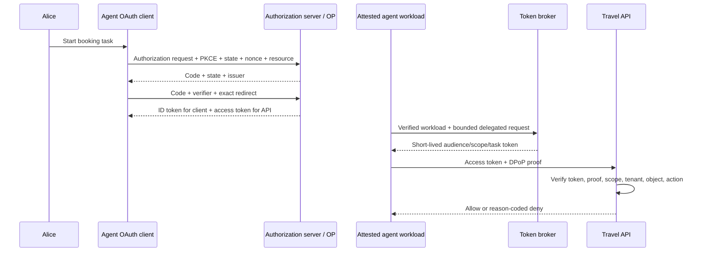

# OAuth and OpenID Connect for Agents

> **Goal:** implement, attack-test, and productionize OAuth/OIDC for an agent that acts as a workload or for a user, while preserving subject, agent, client, workload, audience, task, and resource boundaries.

This course follows one Northstar Travel booking task through an authorization-code/OIDC client, an attested agent runtime, a token broker, a DPoP-bound access token, and a resource server. The reusable lab compares a claims-only anti-pattern with a hardened path across 25 labelled cases.

## Start here

1. Read this chapter for the protocol model, choices, current standards, and production guidance.
2. Run the [guided notebook](oauth_oidc_for_agents.ipynb).
3. Inspect the reusable [lab.py](lab.py).
4. Run `uv run pytest -q curriculum/intermediate/02-oauth-oidc-for-agents/tests`.
5. Run `uv run python curriculum/intermediate/02-oauth-oidc-for-agents/lab.py` for the baseline/control evaluation.

The default path is deterministic, credential-free, offline, and side-effect free. It is a teaching simulator—not an authorization server, identity provider, OAuth/OIDC certification suite, or production DPoP implementation.

## Learning outcomes

After completing the course, you can:

- distinguish OAuth authorization, OIDC authentication, workload authentication, and resource authorization;
- model resource owner, client, authorization server, OpenID Provider, and resource server roles;
- keep the user subject, logical agent, OAuth client, and runtime workload distinct;
- implement Authorization Code with PKCE, exact redirect/state/issuer validation, one-time code use, and OIDC nonce validation;
- explain Client Credentials without inventing a human subject;
- issue audience/resource-restricted, short-lived JWT access tokens using the RFC 9068 profile;
- validate issuer-bound keys, type, audience, time, client, actor, workload, tenant, task, and scope;
- attenuate authority at a token broker rather than trusting requested scopes;
- bind a token to a DPoP key and reject wrong-key, wrong-method, wrong-URI, wrong-token, stale, and replayed proofs;
- apply object/tenant/action authorization after token verification;
- design MCP protected-resource discovery and bounded step-up behavior; and
- compare mature libraries, platforms, high-security profiles, and emerging agent/workload work.

## Prerequisites and continuity

- [Authentication, Credentials and Tokens](../../beginner/03-authentication-credentials-tokens/)
- [Authorization for Agents](../../beginner/04-authorization-for-agents/)
- [Least-Privilege Tool Access](../../beginner/05-least-privilege-tool-access/)
- [Workload Identity with SPIFFE and SPIRE](../01-workload-identity-spiffe-spire/)
- HTTP, URI, JWT, public-key signatures, and basic web-application concepts

This topic teaches the secure client/resource-server boundary. [Intermediate 03](../03-token-exchange-delegation-impersonation/) goes deeper into RFC 8693, nested actors, attenuation across hops, delegation evidence, and impersonation.

## Scenario, success criteria, and non-goals

Alice asks Northstar's booking agent to book `trip:1042`. Four identities participate:

```text
user subject   user:alice
logical agent  agent:northstar:travel-booking
OAuth client   client:northstar:travel-agent-ui
workload       spiffe://corp.example/ns/travel/sa/booking-agent
```

The system must authenticate Alice to the client, bind the transaction to the configured issuer/client/redirect/resource, prove the approved workload is the client, intersect user delegation with client/agent policy, issue a short-lived token for one API, bind high-risk use to a DPoP key, and independently authorize the target object.

Success means all 25 labelled cases match their expected outcomes with zero invalid acceptance, valid-work block, authority amplification, replay acceptance, or cross-resource acceptance.

The lab does not implement login UI, consent UX, WebAuthn, a general OAuth server, HTTP transport, TLS, full JOSE algorithm agility, PAR/JAR, refresh-token families, distributed replay storage, or RFC conformance. Those are production responsibilities described later.

## 1. Mental model: authorization is a chain


```mermaid
sequenceDiagram
    participant U as Alice
    participant C as Agent OAuth client
    participant AS as Authorization server / OP
    participant W as Attested agent workload
    participant B as Token broker
    participant RS as Travel API
    U->>C: Start booking task
    C->>AS: Authorization request + PKCE + state + nonce + resource
    AS-->>C: Code + state + issuer
    C->>AS: Code + verifier + exact redirect
    AS-->>C: ID token for client + access token for API
    W->>B: Verified workload + bounded delegated request
    B-->>W: Short-lived audience/scope/task token
    W->>RS: Access token + DPoP proof
    RS->>RS: Verify token, proof, scope, tenant, object, action
    RS-->>W: Allow or reason-coded deny
```

The central boundary is:

```text
agent/model -> proposes resource, scopes, and action
trusted application -> validates transaction and authenticated identities
authorization server/broker -> derives narrower token authority
resource server -> verifies token/proof and authorizes the exact object/action
```

Schema-valid requests, model text, client IDs, scopes, and signed tokens do not independently grant authority.

## 2. OAuth, OIDC, and workload identity answer different questions

| Mechanism | Primary question | Consumer |
| --- | --- | --- |
| OAuth access token | What constrained API authority was granted? | resource server |
| OIDC ID token | Who authenticated, for this client session? | OIDC client/relying party |
| Workload credential | Which running code is presenting? | platform, AS, broker, or peer |
| Application authorization | May this identity perform this action on this object now? | PEP/PDP/resource service |

OAuth does not define user authentication. OIDC adds an identity layer and ID Token for the client; this course's OIDC-specific simulator therefore requires the `openid` scope. An API must not accept an ID Token merely because it is a signed JWT. The normative starting points are [OAuth 2.0](https://www.rfc-editor.org/rfc/rfc6749.html), [OpenID Connect Core](https://openid.net/specs/openid-connect-core-1_0.html), and the current [OAuth Security Best Current Practice](https://www.rfc-editor.org/rfc/rfc9700.html).

## 3. Roles and identity separation

- **Resource owner:** authorizes access, often Alice.
- **Client:** requests tokens and calls APIs; it is not the resource server.
- **Authorization server (AS):** validates grants/client and issues tokens.
- **OpenID Provider (OP):** AS that authenticates a user using OIDC.
- **Resource server (RS):** accepts access tokens for its own resource URI.
- **Logical agent:** governed actor operating within purpose/task constraints.
- **Workload:** runtime instance cryptographically bound to the OAuth client.

`client_id` is a public identifier, not proof. Client authentication may use private-key JWT, mTLS, workload federation, platform identity, or—only where appropriate—a client secret. The agent name in a prompt is not client authentication.

## 4. Tokens and grants

### Access token

An access token represents authority for a resource server. It may be opaque (validated by introspection) or structured (commonly JWT). The [JWT Profile for OAuth access tokens](https://www.rfc-editor.org/rfc/rfc9068.html) standardizes an interoperable JWT shape, including `typ=at+jwt`. A JWT's readable claims are not verified authority until signature, issuer, audience, time, key lifecycle, and the selected profile are checked.

### ID token

The ID Token authenticates the subject to the OIDC client. Validate signature, issuer, audience, authorized party when applicable, time, and the transaction nonce. Do not send it to a resource API.

### Refresh token

A refresh token lets a client request new access tokens. It is high-value durable credential material. Public clients should use rotation or sender constraint as required by policy; servers should detect family reuse, bind client/grant, support revocation, and limit inactivity/absolute lifetime. The local lab omits refresh tokens rather than teaching an incomplete family model.

### Authorization grant

A grant is the authorization used to obtain a token; it is not the access token itself. Authorization Code, Client Credentials, JWT assertions, device authorization, CIBA, and Token Exchange have different subjects and assurance properties.

## 5. Authorization Code with PKCE and OIDC

The client creates one transaction record before redirecting:

```text
transaction ID
expected issuer
client ID
exact redirect URI
state digest
nonce digest
PKCE challenge
requested resource
requested scopes
subject/task context
expiry and consumed state
```

The response and token redemption enforce:

1. exact transaction lookup and expiry;
2. exact `state` comparison;
3. authorization-response `iss` comparison where supported, preventing mix-up ([RFC 9207](https://www.rfc-editor.org/rfc/rfc9207.html));
4. exact pre-registered redirect URI;
5. S256 PKCE verifier binding ([RFC 7636](https://www.rfc-editor.org/rfc/rfc7636.html));
6. code-to-transaction binding and single atomic consumption;
7. authenticated client/workload binding at the token boundary;
8. grant and resource/scope attenuation; and
9. ID Token nonce, audience, issuer, authorized-party, and time validation.

PKCE does not replace state, exact redirects, issuer validation, TLS, client authentication where applicable, or OIDC nonce. State is correlated to a browser transaction; nonce is bound into the ID Token.

## 6. Client Credentials

Client Credentials represents the client acting on its own behalf. It does not mean “Alice,” even when the same workload sometimes handles Alice's tasks.

The lab's machine token uses:

```text
sub       = client:northstar:travel-agent-ui
client_id = client:northstar:travel-agent-ui
scope     = inventory:read
```

It contains no `act` user-delegation chain and no human task. A resource server must not infer a user from process memory, prompt text, or an unrelated session.

## 7. Audience, resource, scopes, and object policy

The OAuth `resource` parameter identifies the target protected resource during authorization/token requests ([RFC 8707](https://www.rfc-editor.org/rfc/rfc8707.html)). The resulting access token must be audience-restricted. A travel token forwarded to the payment API is rejected even if its scope text looks useful.

Scopes are coarse delegated permissions, not complete object authorization:

```text
token has trips:read
AND token subject belongs to resource tenant
AND subject owns trip:1042
AND action is allowed for current object state
AND current application policy permits it
```

For structured, transaction-specific rights, consider [Rich Authorization Requests](https://www.rfc-editor.org/rfc/rfc9396.html). Do not encode every object into an ever-growing scope vocabulary.

## 8. Agent token broker and attenuation

Northstar's broker computes effective authority from trusted state:

```text
requested scopes
∩ registered client maximum
∩ verified workload/client/agent binding
∩ active user delegation
∩ exact task
∩ allowed resource
= issued token authority
```

The request cannot supply workload or tenant identity. The broker rejects empty scope, arbitrary resources, task substitution, agent substitution, expired grants, inactive workloads, and request-ID reuse with changed content. It records an operation digest without logging the token.

RFC 8693 Token Exchange can carry subject/actor semantics, but validating the input tokens, exchange policy, actor chain, resource, and attenuation is substantive work. This course establishes the boundary; Intermediate 03 implements it deeply.

## 9. Access-token validation

The lab's resource server follows this order:

1. parse protected header and require the mutually exclusive access-token profile;
2. allow only EdDSA and `typ=at+jwt`;
3. select `kid` only from issuer-bound configured keys;
4. reject unknown/revoked keys and verify signature;
5. validate exact issuer and resource-server audience;
6. require profile claims and validate current time and maximum lifetime;
7. validate actor shape, client/workload/tenant/task fields used by policy;
8. validate DPoP when `cnf.jkt` is present;
9. require the action scope; then
10. authorize tenant, subject ownership, object state, and action.

Opaque tokens use introspection ([RFC 7662](https://www.rfc-editor.org/rfc/rfc7662.html)) instead of local JWT verification, but the RS still needs audience/resource, active state, client/subject, scope, and local authorization checks.

## 10. Sender constraint with DPoP and mTLS

Bearer-token theft enables replay. Sender constraint requires token possession plus a bound key.

### DPoP

[RFC 9449](https://www.rfc-editor.org/rfc/rfc9449.html) binds access/refresh tokens to an application key. For each resource request, the lab verifies:

- `typ=dpop+jwt`, asymmetric algorithm, and public JWK;
- JWK thumbprint equals access-token `cnf.jkt`;
- signature;
- exact HTTP method (`htm`) and target URI (`htu`);
- proof freshness (`iat`);
- access-token hash (`ath`); and
- one-time `(jkt, jti)` replay consumption.

The proof's embedded public key proves only that proof's signature; the access token's `cnf` creates authority binding. Trusting an arbitrary proof JWK without `cnf` repeats the original notebook's critical mistake.

Production deployments may also need AS/RS nonce handling, canonical URI rules, distributed replay storage, key protection/rotation, and authorization-code binding to the DPoP key.

### Mutual TLS

[RFC 8705](https://www.rfc-editor.org/rfc/rfc8705.html) supports OAuth client authentication and certificate-bound access tokens. mTLS integrates strongly with transport but can be harder through proxies and multi-tenant infrastructure. DPoP works at the application layer but adds proof/replay/nonce machinery. High-risk profiles such as FAPI 2.0 require sender-constrained access tokens.

## 11. MCP authorization

The current MCP HTTP authorization specification uses OAuth, protected-resource metadata, authorization-server discovery, resource indicators, audience validation, and scope challenges. A protected MCP server is an OAuth resource server, not an authorization server by default.

Northstar validates:

- exact HTTPS MCP resource URI;
- a configured authorization-server issuer;
- metadata/discovery before following endpoints;
- resource parameter in authorization and token requests;
- token audience for this MCP server; and
- operation/tool authorization beyond scope.

The [MCP 2026-07-28 authorization specification](https://modelcontextprotocol.io/specification/2026-07-28/basic/authorization) prioritizes Client ID Metadata Documents, retains Dynamic Client Registration for compatibility, and defines bounded scope challenge/step-up behavior. A client must cap reauthorization retries; a model cannot decide that a new scope is safe.

## 12. Architecture patterns

| Pattern | Strengths | Risks and trade-offs | Best fit |
| --- | --- | --- | --- |
| Central enterprise AS/OP | consistent policy, lifecycle, federation, audit | dependency concentration and tenant configuration risk | most enterprises |
| API gateway + external AS | centralized token enforcement and protocol translation | gateway can lose object/user context | mixed legacy APIs |
| Token broker/STS | audience exchange and attenuation near workloads | high-value policy/signing service; confused-deputy risk | multi-resource agents |
| Native service OAuth client | end-to-end client semantics and DPoP | library and key lifecycle in every service | security-sensitive clients |
| Service mesh/workload federation to OAuth | avoids static client secrets | workload proof must map to registered client policy | cloud-native machine access |
| Opaque access tokens | central revocation/introspection and minimal disclosure | network dependency, cache/freshness design | sensitive internal ecosystems |
| JWT access tokens | offline verification and scale | revocation lag, key/profile drift, claim disclosure | distributed APIs with short TTLs |

Do not add OAuth between processes merely because they are “agents.” For same-platform RPC already protected by managed workload identity and application policy, another token layer may add little value. OAuth is strongest at delegated/resource boundaries and cross-domain API ecosystems.

## 13. Common tools and libraries

| Option | Role | Guidance |
| --- | --- | --- |
| Authlib | Python OAuth/OIDC client/server integrations and JOSE | strong Python teaching/production candidate; use framework adapters and provider metadata |
| PyJWT + `cryptography` | focused JWT/JWK signing and validation | suitable for bounded profiles; application owns protocol/state policy |
| OAuthlib / Requests-OAuthlib | mature Python OAuth client mechanics | useful for clients; not a complete identity platform |
| Keycloak | open-source AS/OP and federation platform | strong self-hosted option; secure realms, clients, keys, and upgrades |
| ORY Hydra | OAuth/OIDC server integrated with external login/consent | useful for composable platforms; you own surrounding identity UX/policy |
| Microsoft Entra, Okta, Auth0 | managed enterprise AS/OP platforms | assess workload federation, token customization, policy, tenancy, logs, and portability |
| `oauth4webapi` | standards-focused JavaScript OAuth/OIDC client | useful in browser/server JS; follow runtime-specific secure storage patterns |
| OpenID conformance suites | protocol interoperability evidence | certification does not replace application authorization or deployment review |

Do not build a general authorization server from the lab. Use maintained providers and libraries, pin compatible versions, validate metadata/JWKS trust, and exercise failure paths.

## 14. State of the art (September 2026)

### Established standards

- OAuth 2.0 plus [Security BCP RFC 9700](https://www.rfc-editor.org/rfc/rfc9700.html);
- Authorization Code with PKCE, exact redirects, issuer/mix-up defenses;
- OIDC Core and Discovery;
- JWT access-token profile, introspection, revocation, resource indicators, PAR, RAR;
- DPoP or mTLS sender constraint where the threat model warrants it; and
- final [FAPI 2.0 Security Profile](https://openid.net/specs/fapi-security-profile-2_0-final.html) for high-security ecosystems.

### Active standards work

[OAuth 2.1 draft-16](https://datatracker.ietf.org/doc/draft-ietf-oauth-v2-1/) consolidates modern OAuth guidance but remains an Internet-Draft, not a final RFC. Treat RFC 9700 and the referenced final RFCs as the stable authority today.

[OAuth SPIFFE Client Authentication](https://datatracker.ietf.org/doc/draft-ietf-oauth-spiffe-client-auth/) is an active OAuth Working Group draft profiling SPIFFE SVIDs for client authentication. It is promising for removing additional static client credentials but remains work in progress.

### Agent-oriented frontier

Agent authorization has many competing 2026 drafts. The newly proposed [Workload Authorization Grant](https://datatracker.ietf.org/doc/html/draft-carleton-workload-authz-grant-01) targets platform-attested workloads obtaining third-party tokens without per-workload provisioning. Other drafts explore mission/task-bound authorization, transaction tokens, delegation chains, structured operation approval, and agent-native discovery. These are research/standards frontier inputs—not interchangeable production standards.

Open problems include user consent that remains meaningful across autonomous replanning, authority accumulation across tools, privacy-preserving actor chains, durable task binding, revocation across derived tokens, client-instance identity, and evaluation that measures actual forbidden effects rather than token shape.

## 15. Worked Northstar trace

1. The client begins a transaction with exact redirect, issuer, resource, scopes, state digest, nonce digest, and S256 challenge.
2. Alice authenticates; the AS returns a code, state, and issuer.
3. The client validates state/issuer and atomically redeems the code using its verifier and exact redirect.
4. Trusted middleware supplies the approved workload/client/agent binding.
5. The active delegation binds Alice, agent, tenant, task, resources, scopes, and expiry.
6. The AS returns an ID Token for the client and a short-lived access token for the travel API.
7. For a high-risk operation, the token contains the client's `cnf.jkt`.
8. The agent signs a request-specific DPoP proof containing method, URI, time, JTI, and access-token hash.
9. The API validates token profile and proof, then checks that Alice owns `trip:1042` and `book` is allowed.
10. The decision record contains identities, audience, scopes, action/resource, reason, versions, token digest, and evidence IDs—never credentials.

## 16. Implementation and experiments

[lab.py](lab.py) includes:

- deterministic Ed25519 issuer and issuer-bound key lifecycle;
- one-time `AuthorizationServer` transaction/code store;
- strict ID/access-token profiles;
- `TokenBroker` authority intersection and idempotency conflict detection;
- Client Credentials with machine-only subject semantics;
- RFC 7638-style OKP JWK thumbprints and DPoP proof binding;
- replay-safe `ResourceServer` validation and object authorization;
- MCP protected-resource metadata trust checks; and
- 25 labelled scenarios with baseline/control metrics.

### Experiment A: transaction substitution

Change state, issuer, redirect, and PKCE verifier independently. Each fails for a distinct reason. Redeem the valid code concurrently; only one consumer succeeds.

### Experiment B: authority amplification

Request `admin`, an undelegated MCP resource, another task, or another agent. The broker denies before signing. Then issue the allowed `payments:create` token for the exact task.

### Experiment C: audience versus object authorization

Forward a valid travel token to payments, then keep the correct audience but target Bob's trip. Audience stops cross-API replay; object authorization stops same-API horizontal access.

### Experiment D: DPoP proof attacks

Run missing proof, arbitrary key, wrong method, wrong URI, wrong access-token hash, stale proof, and repeated JTI. Each demonstrates a separate sender-constraint invariant.

## 17. Evaluation

The dataset has 25 attempts: 2 expected valid and 23 expected blocked.

| Metric | Population | Numerator | Direction |
| --- | --- | --- | --- |
| outcome accuracy | all 25 attempts | label matches | higher |
| invalid acceptance | 23 blocked attempts | blocked cases allowed | zero |
| valid work blocked | 2 valid attempts | valid cases denied | zero |
| authority amplification | nine authority-negative cases | forbidden cases allowed | zero |
| replay acceptance | five proof replay/substitution cases | replay cases allowed | zero |
| cross-resource acceptance | audience/subject/tenant cases | boundary cases allowed | zero |

The unsafe baseline decodes unverified claims and checks only a scope string. It accepts 19 invalid attempts, including every measured replay and cross-resource case. The hardened path matches all 25 labels. These are deterministic fixture results—not latency measurements, interoperability certification, or production-security proof.

Production evaluation also tracks authorization completion/abandonment, login and token endpoint latency percentiles, code replay, state/issuer/nonce failure rate, refresh-family reuse, invalid audience, JWKS staleness, introspection availability, DPoP replay/nonce challenges, step-up loops, policy-denial slices, token issuance volume, and revocation convergence.

## 18. Failure modes and mitigations

| Failure | Impact | Control |
| --- | --- | --- |
| ID Token accepted at API | authentication assertion becomes API authority | mutually exclusive token profiles |
| decode without verify | attacker-authored claims accepted | issuer-bound signature/profile validation |
| arbitrary token `jku` | redirected trust and SSRF | configured metadata/JWKS only |
| missing state/issuer | CSRF or AS mix-up | transaction-bound state and RFC 9207 issuer |
| loose redirect matching | authorization code theft | exact pre-registration and equality |
| reusable code | concurrent token issuance | atomic one-time consumption |
| scope equals authorization | horizontal/object access | tenant/owner/action policy after token validation |
| broker trusts request scope | privilege amplification | set intersection with trusted grants/policy |
| client credentials means user | false attribution | machine client subject, no human implication |
| access token logged | bearer/sender-bound credential leakage | digest and non-secret metadata only |
| DPoP trusts proof JWK | attacker supplies own proof key | compare JWK thumbprint to token `cnf.jkt` |
| no DPoP replay store | captured proof reused | atomic `(jkt,jti)` consumption and freshness |
| token cache omits principal/resource/key | cross-user/resource reuse | complete cache key plus expiry/policy invalidation |
| unlimited step-up retries | consent loops and scope accumulation | bounded attempts and trusted scope policy |
| stale JWKS accepted forever | compromised key remains trusted | lifecycle-aware refresh and fail-safe expiry |

## 19. Production upgrade path

### Client and browser flow

- use a maintained OAuth/OIDC library and validated provider metadata;
- generate high-entropy state, nonce, verifier, code, and operation identifiers;
- store transactions server-side or integrity/confidentiality protect them;
- consume state/code atomically and expire abandoned transactions;
- pre-register exact redirect URIs; prevent open redirects;
- keep tokens out of URLs, logs, analytics, model context, and browser storage where possible;
- use PAR/JAR/FAPI profiles for high-value ecosystems; and
- design consent and step-up for the exact task rather than broad future autonomy.

### Authorization server and broker

- protect signing keys using managed KMS/HSM and rotate with overlap;
- authenticate clients using appropriate private-key, mTLS, attestation, or federation methods;
- validate input grants/tokens before deriving authority;
- enforce user/client/agent/workload/task/resource/scope intersection;
- make operation IDs and code/refresh/proof consumption atomic;
- propagate user, client, workload, grant, and policy revocation;
- minimize claim disclosure; avoid sensitive prompts or chain-of-thought; and
- separate Token Exchange support from arbitrary JWT wrapping.

### Resource servers

- bind metadata/JWKS to a configured issuer and cache with bounded freshness;
- require one exact access-token profile and expected audience/resource;
- validate algorithm, key lifecycle, issuer, time, lifetime, client, scope, and sender constraint;
- use introspection safely for opaque tokens and fail closed according to risk policy;
- perform object/tenant/action authorization after token validation;
- implement DPoP replay/nonce handling in shared durable state where horizontally scaled; and
- return 401 for invalid authentication and 403 for insufficient authority without leaking sensitive detail.

### Operations

- version client registrations, broker policy, scopes, resources, and token profiles;
- monitor issuance, verification, denial reason, replay, cache, key, and revocation metrics;
- rehearse signing-key compromise, issuer outage, introspection outage, and token theft;
- bound retry and reauthorization loops;
- test clock skew and multi-region consistency; and
- use conformance suites plus application-level adversarial tests.

## 20. Exercises and review

1. Add an ID Token with multiple audiences and prove `azp` handling.
2. Add DPoP nonce challenge/response while preventing nonce downgrade.
3. Implement a token cache keyed by subject, actor, workload, audience, scopes, task, confirmation key, and policy version.
4. Add refresh-token family rotation and concurrent reuse detection.
5. Model an opaque-token introspection cache with bounded stale behavior.
6. Add a RAR `authorization_details` object for one payment and enforce it at the API.
7. Map the flow to Authlib and a real provider without bypassing the same invariants.
8. Design an MCP insufficient-scope response and cap step-up attempts.
9. Compare DPoP and mTLS for browser, server, and service-mesh clients.
10. Explain why Token Exchange needs a separate deep implementation rather than wrapping claims into a new JWT.

Review questions: Which token belongs at the API? What does PKCE protect, and what does it not? Why must issuer be stored with the transaction? How does Client Credentials affect attribution? Why is audience insufficient for object authorization? What creates DPoP authority binding? Which facts come from verified workload state? When should a broker refuse to issue any token?

## 21. Summary

- OAuth grants constrained API authority; OIDC authenticates a subject to the client.
- User, agent, client, workload, task, tenant, and resource identities remain distinct.
- Authorization transactions bind state, issuer, redirect, PKCE, nonce, resource, and one-time code state.
- Token brokers derive narrower authority from trusted inputs; requested scopes are not authority.
- Resource servers validate exact token profiles and independently authorize objects/actions.
- DPoP requires token-key, request, access-token, time, and replay binding.
- Current production practice is established; several agent-specific 2026 proposals remain drafts.

## 22. Authoritative references

### Core and security

- [OAuth 2.0 — RFC 6749](https://www.rfc-editor.org/rfc/rfc6749.html)
- [OAuth Security Best Current Practice — RFC 9700](https://www.rfc-editor.org/rfc/rfc9700.html)
- [OpenID Connect Core 1.0](https://openid.net/specs/openid-connect-core-1_0.html)
- [OAuth 2.1 active draft](https://datatracker.ietf.org/doc/draft-ietf-oauth-v2-1/)
- [PKCE — RFC 7636](https://www.rfc-editor.org/rfc/rfc7636.html)
- [Authorization Server Issuer Identification — RFC 9207](https://www.rfc-editor.org/rfc/rfc9207.html)
- [OAuth Authorization Server Metadata — RFC 8414](https://www.rfc-editor.org/rfc/rfc8414.html)
- [JWT Access Token Profile — RFC 9068](https://www.rfc-editor.org/rfc/rfc9068.html)
- [Token Introspection — RFC 7662](https://www.rfc-editor.org/rfc/rfc7662.html)
- [Token Revocation — RFC 7009](https://www.rfc-editor.org/rfc/rfc7009.html)

### Resource and high-security profiles

- [Resource Indicators — RFC 8707](https://www.rfc-editor.org/rfc/rfc8707.html)
- [Protected Resource Metadata — RFC 9728](https://www.rfc-editor.org/rfc/rfc9728.html)
- [Rich Authorization Requests — RFC 9396](https://www.rfc-editor.org/rfc/rfc9396.html)
- [Pushed Authorization Requests — RFC 9126](https://www.rfc-editor.org/rfc/rfc9126.html)
- [JWT-Secured Authorization Request — RFC 9101](https://www.rfc-editor.org/rfc/rfc9101.html)
- [DPoP — RFC 9449](https://www.rfc-editor.org/rfc/rfc9449.html)
- [OAuth mTLS — RFC 8705](https://www.rfc-editor.org/rfc/rfc8705.html)
- [FAPI 2.0 Security Profile](https://openid.net/specs/fapi-security-profile-2_0-final.html)

### Agent, workload, and MCP boundary

- [OAuth Token Exchange — RFC 8693](https://www.rfc-editor.org/rfc/rfc8693.html)
- [OAuth SPIFFE Client Authentication draft](https://datatracker.ietf.org/doc/draft-ietf-oauth-spiffe-client-auth/)
- [Workload Authorization Grant draft](https://datatracker.ietf.org/doc/html/draft-carleton-workload-authz-grant-01)
- [MCP 2026-07-28 Authorization](https://modelcontextprotocol.io/specification/2026-07-28/basic/authorization)

## Next course

Continue to [Token Exchange, Delegation and Impersonation](../03-token-exchange-delegation-impersonation/) to implement multi-hop authority attenuation and actor-chain evidence.
