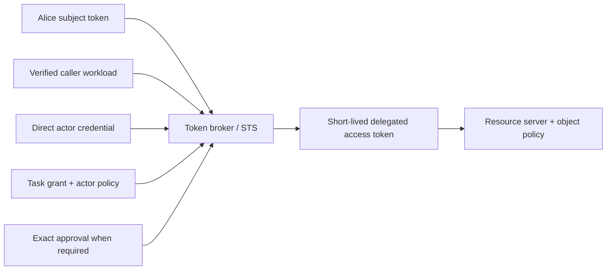

# Intermediate 03 — Token Exchange, Delegation, and Impersonation

> **Goal:** implement, attack-test, and productionize an OAuth 2.0 Token Exchange broker that preserves subject and actor accountability while every derived credential becomes narrower, shorter-lived, lifecycle-aware, and bound to its presenter.

This chapter continues [OAuth and OpenID Connect for Agents](../02-oauth-oidc-for-agents/) and produces trusted delegation context for [Fine-Grained Authorization](../04-fine-grained-authorization/).

## Start here

```bash
python3 -m pip install -r curriculum/intermediate/03-token-exchange-delegation-impersonation/requirements.txt
python3 curriculum/intermediate/03-token-exchange-delegation-impersonation/lab.py
pytest -q curriculum/intermediate/03-token-exchange-delegation-impersonation/tests
```

The default path is deterministic, credential-free, offline, and side-effect free. It is a teaching simulator—not a production authorization server, RFC conformance suite, or proof that a product implements every RFC 8693 feature.

## Learning outcomes

After completing the course, you can:

- construct and validate the RFC 8693 token request and response contract;
- distinguish the OAuth client, authenticated workload, subject, current actor, prior actors, and resource server;
- model delegation and impersonation without confusing either with authentication;
- validate input credential type, profile, issuer, audience, key, time, client, workload, and lifecycle;
- derive nested issuer-qualified `act` claims without changing the underlying subject;
- enforce monotonic attenuation across scope, audience, resource, action, amount, purpose, lifetime, depth, redelegation, and sender key;
- bind consequential impersonation to an exact, single-use approval;
- make exchange retries idempotent and reject operation-ID conflicts;
- stop new issuance and existing-token use when a delegation family is revoked;
- evaluate a broker against labelled positive, adversarial, boundary, replay, and lifecycle cases; and
- map the teaching implementation to maintained libraries, identity platforms, policy engines, and emerging standards.

### Prerequisites

- OAuth roles, access-token validation, resource indicators, OIDC token separation, and DPoP from Intermediate 02;
- JWT/JWS and issuer-bound key selection from Beginner 03;
- workload-to-agent binding from Intermediate 01; and
- Python dataclasses, sets, exceptions, and basic tests.

### Scenario and success criteria

Northstar Travel lets Alice delegate a trip-booking task to a Travel Supervisor Agent. The supervisor may delegate only flight search to a Flight Specialist Agent. A legacy travel API requires tightly controlled impersonation.

Success means:

1. Alice remains the top-level subject across delegation hops.
2. The outermost `act` member is the current actor; nested actors are history only.
3. Each output is no broader than the verified parent, client, actor policy, task grant, and request.
4. A child cannot be minted by changing an actor name, task, audience, object, purpose, amount, lifetime, or redelegation flag.
5. Exact retries reconcile to one result; changed requests cannot reuse an operation ID or approval.
6. Revocation and sender binding are enforced at both issuance and resource use.
7. Evidence contains stable IDs, versions, reason codes, and credential digests—never raw tokens.

Non-goals include building a general-purpose authorization server, reproducing provider-specific consent UX, or claiming interoperability from an offline simulator.

## 1. Why exchange instead of forwarding

Forwarding Alice's original token through every agent leaks a reusable credential, hides the current actor, couples unrelated APIs to one audience, and usually carries excess authority. A broker derives a credential for one downstream boundary.


```mermaid
flowchart LR
    U[Alice subject token] --> B[Token broker / STS]
    W[Verified caller workload] --> B
    A[Direct actor credential] --> B
    G[Task grant + actor policy] --> B
    P[Exact approval when required] --> B
    B --> T[Short-lived delegated access token]
    T --> R[Resource server + object policy]
```

The model may propose a target or scope. Trusted application code authenticates the caller, validates inputs, derives authority, issues the token, authorizes the object, and records evidence.

## 2. Mental model: identities and authority

| Element | Question | Northstar example |
| --- | --- | --- |
| OAuth client | Which registered software requests exchange? | `northstar-agent-platform` |
| caller workload | Which runtime authenticated to the broker? | supervisor SPIFFE workload |
| subject | Whose authority remains involved? | `user:alice` |
| current actor | Who will perform the next action? | flight specialist |
| prior actor | Who delegated earlier? | travel supervisor |
| task grant | What independently approved work exists? | `task:trip-483` |
| resource server | Who consumes the output token? | flight API |
| protected object | Which business object is affected? | `flight-search:483` |

Neither a valid `actor_token` nor an `act` claim grants authority by itself. The broker must prove the relationship among the subject, current presenter, desired actor, registered client, attested workload, task grant, target, and policy.

## 3. RFC 8693 request and response

[RFC 8693](https://www.rfc-editor.org/rfc/rfc8693.html) defines an OAuth extension grant to an authorization server acting as a Security Token Service (STS).

```http
POST /token
Content-Type: application/x-www-form-urlencoded

grant_type=urn:ietf:params:oauth:grant-type:token-exchange
&subject_token=...
&subject_token_type=urn:ietf:params:oauth:token-type:access_token
&actor_token=...
&actor_token_type=urn:northstar:params:oauth:token-type:actor-credential
&requested_token_type=urn:ietf:params:oauth:token-type:access_token
&resource=https://api.northstar.example/travel
&scope=travel%3Abook
```

The response extends the normal OAuth token response:

```json
{
  "access_token": "...",
  "issued_token_type": "urn:ietf:params:oauth:token-type:access_token",
  "token_type": "Bearer",
  "expires_in": 240,
  "scope": "travel:book"
}
```

`subject_token_type` tells the STS how the subject credential must be interpreted; it does not rescue a credential with the wrong signature, issuer, audience, or profile. `requested_token_type` asks for an output type; the STS may reject it. `resource` and `audience` identify targets but do not authorize them. The token requester remains an OAuth client and must authenticate. RFC 8693 defines a protocol framework; issuance policy, consent, object constraints, revocation linkage, and many product behaviors remain deployment responsibilities.

## 4. Delegation, impersonation, and direct action

Delegation preserves subject and actor:

```json
{
  "sub": "user:alice",
  "act": {
    "iss": "https://workload.northstar.example",
    "sub": "agent:travel-supervisor"
  }
}
```

Impersonation produces a token in which the actor acts indistinguishably from the subject to the consumer. It may omit `act`. That attribution loss is why the lab restricts impersonation to one legacy audience, requires exact approval, disables redelegation, shortens lifetime, and preserves the intermediary in broker evidence.

Direct client action has neither delegation nor impersonation: the client acts for itself. Do not manufacture a human subject from Client Credentials.

## 5. `act`, nested history, and `may_act`

RFC 8693 defines `act` as an object identifying the current actor. A delegation chain nests prior actors:

```json
{
  "sub": "user:alice",
  "act": {
    "iss": "https://workload.northstar.example",
    "sub": "agent:flight-specialist",
    "act": {
      "iss": "https://workload.northstar.example",
      "sub": "agent:travel-supervisor"
    }
  }
}
```

The outermost actor is current. RFC 8693 requires access-control decisions to use top-level claims and the current actor; nested actors are informational history. The lab rejects malformed, cyclic, or oversized chains and includes issuer plus subject because `sub` alone may not be globally unique.

`may_act` identifies a party eligible to become the actor. It is an assertion from the token issuer, not universal permission. Northstar requires both a matching issuer-qualified `may_act` and an active authoritative task grant for the initial hop.

## 6. Exchange trust pipeline

The broker performs these steps before signing:

1. validate exact grant and token-type identifiers;
2. authenticate the registered client and attested caller workload;
3. select keys only from the configured issuer's key ring;
4. validate subject signature, type, issuer, audience, time, and maximum lifetime;
5. validate the direct actor credential independently;
6. bind caller, current presenter, desired actor, client, workload, and tenant;
7. load active task and lifecycle state from authoritative storage;
8. validate `may_act` for the first hop or an explicit parent→child edge;
9. enforce depth and redelegation limits before issuance;
10. prove requested authority is a subset across every dimension;
11. consume exact approval atomically when impersonation requires it;
12. cap lifetime by all parent and policy ceilings;
13. bind the output to the new sender key; and
14. record non-secret evidence.

The output access token is still not an object-level allow decision. The resource server validates it and then authorizes the requested object and action.

## 7. Authority attenuation

For set-valued dimensions:

```text
ceiling = parent ∩ client ∩ actor-policy ∩ task-grant
requested ⊆ ceiling
issued = requested
```

For numerical limits and lifetime:

```text
issued_amount ≤ min(parent, actor, task)
issued_ttl ≤ min(parent_remaining, actor_remaining, task_remaining,
                 requested_ttl, broker_max_ttl)
```

Northstar attenuates scopes, API audience, protected resource IDs, actions, maximum amount, purpose, task, subject, tenant, current actor, approved actor edge, lifetime, delegation depth, redelegation, and sender confirmation key.

Silent intersection can conceal an overly broad request. The lab rejects widening and issues exactly the approved request, producing a specific reason code for the faulty dimension.

## 8. Multi-hop delegation without privilege resurrection

The flight token is derived from the supervisor token—not from a newly invented broad fixture. The broker:

1. verifies Alice is still the subject;
2. verifies the supervisor is the current presenter;
3. verifies the supervisor token was explicitly exchangeable;
4. validates a direct credential for the flight specialist;
5. checks the supervisor→specialist edge;
6. carries the supervisor into nested history;
7. narrows travel/flight authority to flight search only; and
8. disables another delegation hop at maximum depth.

Historical actor privileges never reappear. If a prior supervisor once had `admin`, it is neither copied into the child token nor considered by the flight API.

## 9. Redelegation ceilings versus API authority

An API token's immediate authority and its permitted child-delegation ceiling are different concepts. The lab keeps them separate:

- `aud`, `resource_ids`, `scope`, `actions`, and `max_amount` govern current API use;
- `delegation_*` claims carry a strictly bounded ceiling only when policy permits another exchange; and
- `exchangeable=false` terminates the chain.

This is a Northstar application profile, not a claim set standardized by RFC 8693. A production ecosystem must document and version private claims or adopt an agreed profile.

## 10. Replay, idempotency, approvals, and concurrency

Token exchange can be retried after a timeout. A stable `operation_id` maps to a canonical request digest:

- exact retry returns the recorded response;
- changed request with the same ID fails `operation_id_conflict`; and
- raw credentials are hashed into the digest and evidence, not logged.

Legacy impersonation approval binds operation, credential digests, audience, resource, scope, action, amount, purpose, task, lifetime, sender key, semantics, policy version, approver identity/role, issuance, and expiry. Consumption is lock-protected and single-use. A Boolean `approved=true` establishes none of these facts.

## 11. Revocation and lifecycle

RFC 8693 exchange does not create automatic revocation propagation for every derived access token. Northstar assigns an application-level delegation family from the trusted task grant. The broker refuses new issuance when it is revoked, and resource servers reject an otherwise valid existing token carrying it.

Production choices include short access-token lifetimes, centrally introspected opaque tokens, authorization/security-event delivery, gateway revocation caches with bounded staleness, refresh-family rotation/reuse detection, and task cancellation that reaches every enforcement point. Define convergence targets and degraded-mode policy. “Revoked in the database” is not proof that use stopped.

## 12. Sender constraint through delegation

A delegated token should be bound to its immediate presenter. The lab writes the new actor's key thumbprint to `cnf.jkt` and requires the resource server to compare it with authenticated sender proof.

At each hop decide whether the output continues the existing presenter binding or rebinds to a newly validated actor credential. Do not copy a parent's `cnf` while claiming the child is the presenter. [DPoP](https://www.rfc-editor.org/rfc/rfc9449.html) and [OAuth mTLS](https://www.rfc-editor.org/rfc/rfc8705.html) provide established sender-constraint mechanisms; cross-hop rebinding policy remains security-sensitive.

## 13. Resource-server authorization

The resource server validates broker issuer, exact audience, access-token type, algorithm, key, time, lifetime, sender key, active family, tenant, subject ownership, resource, action, amount, and purpose. Token validity remains necessary but insufficient. Intermediate 04 takes the verified subject/current-actor/task/resource tuple into OPA, Cedar, OpenFGA, and AuthZEN-style decisions.

## 14. Architecture patterns

| Pattern | Strengths | Limitations | Best fit |
| --- | --- | --- | --- |
| Central enterprise AS/STS | consistent trust, signing, policy, evidence | high-value dependency; latency and blast radius | most enterprise exchange |
| API gateway exchange | shields services and centralizes enforcement | may lose business-object context | mixed legacy estates |
| Workload federation → STS | avoids static workload secrets | attribute mapping and trust configuration are critical | cloud/multicloud workloads |
| Provider OBO flow | integrated consent and directory policy | often provider-specific, not portable RFC semantics | one identity ecosystem |
| Opaque derived token | central introspection/revocation | availability and cache design | high-control internal APIs |
| JWT derived token | offline verification and scale | revocation lag and profile drift | distributed short-lived access |
| Transaction-context token | separates internal context from external access token | emerging specification and trust-domain assumptions | service call chains |

Do not add multi-hop delegation when a direct, narrower service credential or one broker-issued token is enough. Every hop adds policy state, identity mapping, failures, and audit cost.

## 15. Technology landscape

| Technology | What it provides | Selection notes |
| --- | --- | --- |
| Keycloak Standard Token Exchange V2 | supported internal-to-internal RFC 8693 subset, client policy, sender constraints | current docs note partial coverage, experimental delegation, and no `resource` parameter support |
| Microsoft Entra OBO / Agent ID | delegated API access with Entra-specific agent, blueprint, managed-identity, and audience linkage | OBO is not interchangeable with generic RFC 8693 |
| Google Cloud Workload Identity Federation | external credential exchange through Google STS; direct access or service-account impersonation | Google IAM semantics govern output authority |
| AWS STS AssumeRole | temporary role sessions, source identity, external IDs, tags, and chaining | analogous STS pattern, not RFC 8693 |
| Authlib / OAuthlib | Python OAuth protocol/client building blocks | use maintained integrations; application still owns policy |
| PyJWT + `cryptography` | bounded JWT/JWK profiles used by this lab | not a complete STS; prevent algorithm/key/profile confusion |
| SPIFFE/SPIRE | caller and actor workload authentication | authentication does not create delegation authority |
| OPA, Cedar, OpenFGA, AuthZEN API | externalized authorization decisions | broker remains PEP and must honor denial/obligations |

Use provider conformance tests plus application-level adversarial tests. Product names do not prove identical token types, actor semantics, revocation, or cross-domain behavior.

## 16. State of the art (September 2026)

### Established

- [RFC 8693](https://www.rfc-editor.org/rfc/rfc8693.html) defines exchange plus `act`, `may_act`, `scope`, and `client_id` claims.
- [RFC 9700](https://www.rfc-editor.org/rfc/rfc9700.html) is the OAuth Security BCP.
- [RFC 9068](https://www.rfc-editor.org/rfc/rfc9068.html) and [RFC 8725](https://www.rfc-editor.org/rfc/rfc8725.html) guide JWT access-token profiles and JWT security.
- [RFC 8707](https://www.rfc-editor.org/rfc/rfc8707.html), [RFC 9396](https://www.rfc-editor.org/rfc/rfc9396.html), DPoP, mTLS, and introspection provide resource, structured-authority, sender, and active-state mechanisms.
- [AuthZEN Authorization API 1.0](https://openid.net/wg/authzen/specifications/) is a final PEP/PDP interface; it complements rather than replaces exchange.

### Emerging

- [Transaction Tokens draft-11](https://datatracker.ietf.org/doc/draft-ietf-oauth-transaction-tokens/) reached OAuth Working Group consensus awaiting write-up in August 2026. It remains an Internet-Draft.
- [OAuth Identity and Authorization Chaining Across Domains draft-10](https://datatracker.ietf.org/doc/draft-ietf-oauth-identity-chaining/10/) combines token exchange and JWT authorization grants across trust domains.
- [Delegated Refresh Tokens draft-05](https://datatracker.ietf.org/doc/draft-zhu-oauth-async-delegation/) explores asynchronous delegated continuation, rotation, task revocation, and monotonic restrictions.

### Proposal frontier

Agent transaction tokens, actor/entity profiles, cryptographically linked delegation chains, and self-verifiable attenuating agent tokens are competing proposals. They explore purpose binding, actor classification, chain integrity, offline attenuation proofs, and agent-to-agent handoffs. Treat them as design input, not interchangeable production standards.

Open problems include consent across autonomous replanning, privacy-preserving chain evidence, cross-domain subject mapping, safe presenter rebinding, long-running renewal, revocation convergence, preventing authority accumulation across parallel branches, and interoperable task/purpose semantics.

## 17. Worked Northstar trace

1. Alice's issuer creates an access token intended for the broker, naming the supervisor in issuer-qualified `may_act`.
2. The supervisor authenticates as the registered client from its attested workload and supplies a direct actor credential.
3. The broker validates both credentials and loads the task grant independently.
4. It proves requested travel/flight authority is within every source and issues a 240-second travel token.
5. The token records Alice as `sub`, supervisor as current `act`, the task/family, immediate API authority, bounded child ceiling, and supervisor sender key.
6. The supervisor requests a flight-specialist child token. The broker verifies current presenter and supervisor→specialist edge.
7. The child keeps Alice as subject, makes the specialist outer actor, nests the supervisor, narrows to flight search, and stops redelegation at depth two.
8. The flight API validates token and specialist sender, then authorizes the exact search object.
9. A separate approved impersonation request for the legacy API omits `act`; broker evidence still records the supervisor.
10. Cancelling the trip revokes the family at issuance and resource enforcement points.

## 18. Practical implementation

[lab.py](lab.py) contains deterministic Ed25519 key rings, mutually exclusive token profiles, typed RFC request/response contracts, issuer-qualified bounded actor chains, a policy-enforcing broker, exact retry reconciliation, atomic approval, family revocation, sender-bound resource authorization, an unsafe baseline, and 33 labelled scenarios.

The [notebook](token_exchange_delegation.ipynb) imports the same implementation tested by the repository. It does not maintain a second drifting broker.

## 19. Experiments

### A — claim-copy baseline

Decode the subject without verifying it and check only requested scope. Observe that signatures, types, actors, targets, constraints, lifecycle, approvals, and sender keys become irrelevant.

### B — real child derivation

Issue the supervisor token, use that exact output as the child's subject token, then inspect nested `act`, narrowed authority, depth, exchangeability, and sender binding.

### C — dimension-by-dimension amplification

Change scope, audience, resource, action, amount, or purpose. Each fails with a distinct reason instead of silently issuing a surprising token.

### D — replay and lifecycle

Compare exact operation retry, changed-request conflict, approval reuse, family revocation, and wrong sender binding.

### E — delegation versus impersonation

Compare token and evidence visible to a modern API with a legacy impersonation consumer. Decide whether attribution loss is acceptable.

## 20. Evaluation

The deterministic dataset has 33 attempts: 4 expected valid and 29 expected blocked.

| Metric | Population | Numerator | Target |
| --- | --- | --- | --- |
| outcome accuracy | all 33 | label matches | 100% |
| invalid acceptance | 29 blocked | blocked cases allowed | 0 |
| valid work blocked | 4 valid | valid cases denied | 0 |
| authority amplification | 11 authority-negative | cases allowed | 0 |
| identity substitution | 10 identity-negative | cases allowed | 0 |
| replay/lifecycle acceptance | 5 replay/lifecycle | cases allowed | 0 |

The scope-only baseline accepts 28 invalid attempts. The hardened broker matches all 33 labels and passes the release gate. These results prove deterministic fixture behavior—not interoperability, production latency, distributed atomicity, or external security.

Production evaluation also measures exchange latency/availability, issuance volume, denial slices, valid-work abandonment, actor/depth distribution, approval latency, operation conflicts, sender failures, revocation convergence, JWKS freshness, policy drift, chain size, and cost per successful compliant task.

## 21. Failure modes

| Failure | Consequence | Control |
| --- | --- | --- |
| accept any signed JWT | ID/access/actor confusion | exact type, issuer, audience, algorithm, key, claims |
| trust actor name in request | actor substitution | direct credential plus registry/workload binding |
| `sub` alone identifies actor | cross-issuer collision | issuer-qualified actor identity |
| copy requested scopes | privilege amplification | parent/client/actor/task set proof |
| attenuate only scope | resource/action/amount/purpose widening | multidimensional typed authority |
| synthesize child from fresh broad fixture | privilege resurrection | derive from actual parent token |
| historical actor authorizes request | inherited privilege | current outer actor only |
| unbounded nested `act` | resource exhaustion/cycle | shape, cycle, and depth validation |
| caller chooses family ID | revocation evasion | family from authoritative grant |
| approval Boolean | altered/replayed issuance | exact expiring single-use receipt |
| retry remints independently | duplicate credentials/effects | operation ledger and reconciliation |
| copy parent `cnf` to child | wrong presenter | validated rebind to child key |
| revoke only at broker | existing tokens remain usable | resource/gateway lifecycle enforcement |
| log tokens for audit | credential disclosure | digests and non-secret evidence |

## 22. Production upgrade path

### Broker and trust

- use maintained AS/STS software; do not deploy the teaching broker;
- authenticate clients with asymmetric credentials, mTLS, attestation, or managed federation;
- keep signing keys in KMS/HSM and rotate with verifier-ready overlap;
- bind metadata/JWKS to configured issuers and constrain token types;
- isolate tenants and subject namespaces explicitly;
- version client, actor, task, exchange, and claim-profile policy;
- make operation, approval, and revocation transitions transactional or durably coordinated; and
- fail closed when authoritative state is unavailable according to risk policy.

### Delegation and authorization

- use RAR or a documented typed profile for resources/actions;
- authorize the requesting client to present each input token;
- distinguish presenter continuation from validated rebind;
- bound chain depth, token size, privacy disclosure, lifetime, and fan-out;
- make impersonation exceptional, audience-limited, observable, and approval-bound;
- authorize the object at the API after token validation; and
- enforce PDP obligations rather than merely logging them.

### Reliability, operations, and privacy

- persist idempotency outcomes before acknowledging issuance;
- reconcile unknown outcomes rather than blindly retrying;
- distribute revocation/status events with replay protection and bounded stale caches;
- rehearse key compromise, broker/policy outage, event loss, and regional failover;
- monitor chain anomalies, denial shifts, high-risk issuance, refresh reuse, and unusual audiences;
- minimize actor history and business constraints in portable tokens;
- prefer opaque references when disclosure or revocation dominates; and
- never record raw tokens, private keys, prompts, or hidden reasoning.

## 23. Exercises and review

1. Add multiple resource indicators and decide whether they produce one or multiple tokens.
2. Add a refresh-token profile with rotation, replay-family detection, and bounded delegated lifetime.
3. Replace private action/amount fields with RFC 9396 authorization details.
4. Model cross-domain subject translation while preserving issuer-qualified identity.
5. Add distributed idempotency with optimistic versions and concurrent regions.
6. Add a revocation-event cursor and prove recovery after missed delivery.
7. Add full DPoP proof validation at the broker for presenter rebind.
8. Map the request to Keycloak V2 and document unsupported parameters first.
9. Compare direct resource access with service-account impersonation in workload federation.
10. Send the verified tuple to an AuthZEN-compatible PDP and enforce an obligation.

Review questions: Why are client and actor distinct? What does `subject_token_type` guarantee—and not guarantee? Which `act` node is current? Why can `may_act` be insufficient? Which dimensions must shrink? How does exact retry differ from approval replay? Why is family revocation an application profile? When should impersonation be refused? What changes when the sender key changes?

## 24. Summary

- RFC 8693 is a token-exchange protocol, not complete delegation policy.
- Subject, current actor, prior actors, client, workload, task, tenant, and resource remain distinct.
- Input credentials require mutually exclusive issuer-bound profiles.
- Each child derives from the actual parent and cannot widen any authority dimension.
- Current actor affects authorization; prior actors provide history only.
- Impersonation loses downstream attribution and therefore needs exceptional controls.
- Idempotency, exact approval, sender rebinding, lifecycle propagation, evidence, and object authorization remain application responsibilities.
- Emerging agent-chain proposals are research inputs and remain work in progress.

## 25. Authoritative references

### Standards and security

- [OAuth 2.0 Token Exchange — RFC 8693](https://www.rfc-editor.org/rfc/rfc8693.html)
- [OAuth Security Best Current Practice — RFC 9700](https://www.rfc-editor.org/rfc/rfc9700.html)
- [JWT Profile for OAuth Access Tokens — RFC 9068](https://www.rfc-editor.org/rfc/rfc9068.html)
- [JWT Best Current Practices — RFC 8725](https://www.rfc-editor.org/rfc/rfc8725.html)
- [OAuth Resource Indicators — RFC 8707](https://www.rfc-editor.org/rfc/rfc8707.html)
- [Rich Authorization Requests — RFC 9396](https://www.rfc-editor.org/rfc/rfc9396.html)
- [Token Introspection — RFC 7662](https://www.rfc-editor.org/rfc/rfc7662.html)
- [Token Revocation — RFC 7009](https://www.rfc-editor.org/rfc/rfc7009.html)
- [DPoP — RFC 9449](https://www.rfc-editor.org/rfc/rfc9449.html)
- [OAuth mTLS — RFC 8705](https://www.rfc-editor.org/rfc/rfc8705.html)
- [AuthZEN specifications](https://openid.net/wg/authzen/specifications/)

### Official implementations and platforms

- [Keycloak token exchange](https://www.keycloak.org/securing-apps/token-exchange)
- [Keycloak DPoP](https://www.keycloak.org/securing-apps/dpop)
- [Microsoft Entra Agent ID on-behalf-of flow](https://learn.microsoft.com/en-us/entra/agent-id/agent-on-behalf-of-oauth-flow)
- [Google Cloud Workload Identity Federation](https://cloud.google.com/iam/docs/workload-identity-federation)
- [AWS IAM role chaining and session tags](https://docs.aws.amazon.com/IAM/latest/UserGuide/id_session-tags.html)
- [SPIFFE concepts](https://spiffe.io/docs/latest/spiffe-about/spiffe-concepts/)

### Active drafts and frontier work

- [Transaction Tokens](https://datatracker.ietf.org/doc/draft-ietf-oauth-transaction-tokens/)
- [OAuth Identity and Authorization Chaining Across Domains](https://datatracker.ietf.org/doc/draft-ietf-oauth-identity-chaining/)
- [Delegated Refresh Tokens for OAuth Token Exchange](https://datatracker.ietf.org/doc/draft-zhu-oauth-async-delegation/)
- [OAuth Actor Profile for Delegation](https://datatracker.ietf.org/doc/draft-mcguinness-oauth-actor-profile/)
- [Transaction Tokens for Agents](https://datatracker.ietf.org/doc/draft-oauth-transaction-tokens-for-agents/)
- [Attenuating Authorization Tokens for Agentic Delegation Chains](https://datatracker.ietf.org/doc/draft-niyikiza-oauth-attenuating-agent-tokens/)

## Next course

Continue to [Fine-Grained Authorization with OPA, Cedar, and OpenFGA](../04-fine-grained-authorization/) to turn the verified delegation tuple into deterministic resource-level decisions.
