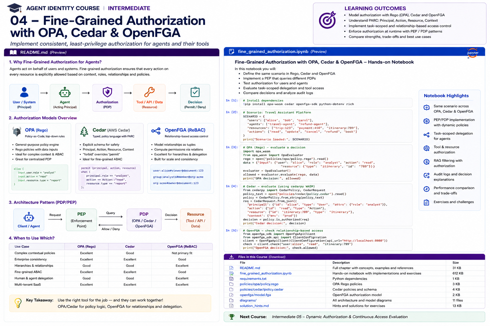

# Intermediate 04 — Fine-Grained Authorization with OPA, Cedar & OpenFGA



> **Goal:** move from authenticated agents and delegated tokens to deterministic, resource-level authorization for every agent action.

Authentication answers **who is this?** Token exchange answers **whose authority is being delegated?** Fine-grained authorization answers:

> **May this specific user + agent perform this action on this resource, in this context, right now?**

```text
User + Agent + Task + Context
             |
             v
        PEP / Gateway
             |
             v
       Authorization PDP
       /       |       \
     OPA     Cedar    OpenFGA
             |
             v
        Allow / Deny
             |
             v
      Tool / API / RAG
```

## Learning outcomes

You will learn to:

- separate authentication, delegation and authorization;
- design PEP/PDP architectures;
- understand RBAC, ABAC, ReBAC and task-based authorization;
- treat agents as first-class principals;
- implement contextual agent policy with OPA/Rego;
- model typed PARC requests and explicit forbids with Cedar;
- model relationships, delegation and resource hierarchies with OpenFGA;
- authorize MCP tools and their target resources separately;
- enforce authorization in RAG before content reaches the model;
- combine user and agent authority without silently impersonating the user;
- test authorization policies and negative cases;
- generate decision evidence suitable for audit;
- choose OPA, Cedar, OpenFGA, or a hybrid architecture.

---

# 1. Why agent authorization is different

Traditional applications often ask:

```text
Can Alice access document 123?
```

Agent systems need richer questions:

```text
Can agent:travel, acting for Alice,
under task trip:483,
call tool payment.create,
against invoice 927,
for CAD 300,
before task expiry,
from an approved workload?
```

A broad OAuth scope cannot answer all of that.

A token may prove:

```text
scope = payments:create
```

but resource authorization still needs to decide:

```text
which payment?
how much?
which account?
which user?
which agent?
which task?
was approval obtained?
```

Fine-grained authorization belongs at the action/resource boundary.

---

# 2. Authentication is not authorization

Do not write:

```python
if token_valid:
    execute_tool()
```

A valid token proves only that a credential passed authentication/validation.

A stronger flow is:

```text
authenticate caller
      |
resolve subject + actor
      |
resolve task/resource/context
      |
authorize
      |
execute
```

---

# 3. PEP and PDP

A **Policy Enforcement Point (PEP)** intercepts an operation.

A **Policy Decision Point (PDP)** decides whether it is allowed.

```text
Agent
  |
  v
PEP ----------------> PDP
 |                    |
 | request            | policy + relationships + context
 |                    |
 | <------ decision --+
 |
 v
Tool/API
```

Examples of PEPs:

```text
API gateway
MCP server
tool wrapper
RAG retriever
agent runtime
service middleware
token broker
```

The LLM should not be the authorization PEP.

---

# 4. Default deny

A core rule:

```text
No matching permission -> deny
```

Do not rely on:

```text
"the prompt told the agent not to do it"
```

Authorization must be deterministic and outside model reasoning.

---

# 5. RBAC

Role-Based Access Control:

```text
user -> role -> permissions
```

Example:

```text
Alice -> claims_adjuster
claims_adjuster -> claim:read
```

RBAC is useful for broad organizational permissions but becomes awkward when agents need task/resource-specific grants.

---

# 6. ABAC

Attribute-Based Access Control evaluates attributes:

```text
principal.department
agent.risk_tier
resource.classification
context.amount
context.time
task.purpose
```

Example:

```text
allow if:
user.department == "claims"
AND resource.region == user.region
AND amount <= 500
AND agent.risk_tier <= 2
```

OPA and Cedar are especially natural for this style.

---

# 7. ReBAC

Relationship-Based Access Control evaluates graph relationships.

```text
Alice --member--> project:atlas
project:atlas --contains--> document:42
agent:research --assigned--> task:9
task:9 --targets--> project:atlas
```

OpenFGA is designed around this model.

OpenFGA's current agent guidance explicitly recommends treating agents as first-class principals, using explicit delegation and task-scoped grants rather than copying a user's entire permission footprint. Its 2026 agent documentation also includes dedicated patterns for MCP and RAG authorization. 

---

# 8. Task-based authorization

A useful agent model is:

```text
agent starts with zero task permission
       |
       v
task created
       |
       v
narrow grant
       |
       v
task ends / expires
       |
       v
grant disappears
```

Example:

```text
task:refund-928
agent:refund-bot
action: refund:create
resource: order:123
max_amount: 200
expires: 14:05
```

OpenFGA's current task-based agent guidance uses this same core idea: temporary, task-specific permissions rather than permanent broad credentials.

---

# 9. User AND agent authority

When an agent acts for a user, two authorization dimensions may matter:

```text
Can Alice do it?
AND
May this agent do it?
```

Avoid:

```text
agent inherits everything Alice can do
```

Prefer an intersection:

```text
effective authority =
user authority
∩ agent authority
∩ task authority
∩ runtime policy
```

---

# 10. OPA and Rego

Open Policy Agent is a general-purpose policy engine. Its declarative language, **Rego**, evaluates structured input and data.

A request can be represented as JSON:

```json
{
  "user": {"id":"alice","roles":["employee"]},
  "agent": {"id":"travel","risk_tier":1},
  "action":"book",
  "resource":{"type":"trip","owner":"alice"},
  "context":{"amount":450,"task_active":true}
}
```

Rego:

```rego
package agent.authz

default allow := false

allow if {
    input.user.id == input.resource.owner
    input.agent.id == "travel"
    input.action == "book"
    input.context.task_active
    input.context.amount <= 500
}
```

OPA is deliberately general: policy can reason over nested structured data, external policy data, API requests, deployment metadata and arbitrary contextual inputs. Its built-in test framework supports policy unit tests and coverage.

---

# 11. Why OPA fits agents

OPA is strong when the authorization question combines many dynamic facts:

```text
JWT claims
agent metadata
task metadata
risk score
approval state
resource attributes
tool metadata
environment
network
time
amount
```

It is also useful when the same policy platform governs:

```text
API authorization
Kubernetes admission
CI/CD
infrastructure
agent actions
```

---

# 12. Rego design for agent policy

Separate:

```text
identity facts
relationship facts
task facts
policy
```

Avoid hard-coding all enterprise state directly into policy files.

Example policy decision:

```rego
decision := {
  "allow": allow,
  "reason": reason,
  "policy": "payment-v3"
}
```

Returning structured decision metadata improves auditability.

---

# 13. OPA policy testing

OPA supports tests written as Rego rules prefixed with `test_`.

For security policy, test both:

```text
expected allow
expected deny
```

especially:

```text
wrong user
wrong agent
expired task
wrong resource
too much money
missing approval
untrusted workload
```

Policy tests belong in CI.

---

# 14. Cedar

Cedar is a purpose-built authorization policy language.

A Cedar request has four core components, commonly called **PARC**:

```text
Principal
Action
Resource
Context
```

The current Cedar documentation describes authorization precisely as:

```text
Can this principal take this action
on this resource
in this context?
```

Cedar 4.5 is the current documented language version as of this course update.

---

# 15. Cedar policy

Example:

```cedar
permit (
    principal is Agent,
    action == Action::"ReadDocument",
    resource is Document
)
when {
    resource.owner == context.onBehalfOf &&
    principal.riskTier <= 2 &&
    context.taskActive
};
```

A `forbid` can override a permit:

```cedar
forbid (
    principal,
    action == Action::"ExecutePayment",
    resource
)
when {
    context.amount > 500
};
```

This explicit permit/forbid model is attractive for security-sensitive agent rules.

---

# 16. Cedar schemas

Cedar supports schemas describing:

```text
principal types
resource types
actions
attributes
context
```

Schemas help catch policy/model mistakes before runtime.

For enterprise agent authorization, define types such as:

```text
User
Agent
Task
Document
Account
Tool
Action
```

rather than passing unstructured blobs everywhere.

---

# 17. Cedar agent patterns

Current Cedar guidance explicitly documents two patterns for agents acting on behalf of a user:

```text
Pattern A
principal = Agent
context.onBehalfOf = User
```

when agent permissions are primary;

or:

```text
Pattern B
principal = User
context.viaAgent = Agent
```

when user permissions are primary.

The correct choice depends on which identity should be the primary authorization principal. Both identities should remain available to policy.

---

# 18. Cedar forbid precedence

Cedar's decision algorithm is deny-safe:

```text
matching forbid -> Deny
else matching permit -> Allow
else -> Deny
```

This is useful for enterprise guardrails.

Example:

```text
permit claims agent to update claim
```

but:

```text
forbid if fraud_hold == true
```

The forbid wins.

---

# 19. OpenFGA

OpenFGA is a relationship-based authorization system inspired by Zanzibar-style modeling.

Instead of asking:

```text
Does this JSON satisfy a rule?
```

the core question is:

```text
Does principal X have relation Y with object Z?
```

Example tuple:

```text
agent:researcher
viewer
document:42
```

or:

```text
user:alice
member
workspace:atlas
```

---

# 20. OpenFGA model

Example:

```text
model
  schema 1.1

type user

type agent

type workspace
  relations
    define member: [user]
    define agent_member: [agent]

type document
  relations
    define workspace: [workspace]
    define viewer: [user, agent] or member from workspace
```

Relationships become explicit, queryable authorization state.

---

# 21. Agents as first-class principals

OpenFGA's current agent authorization documentation recommends modeling:

```text
type agent
```

rather than pretending the agent is a user.

This allows:

```text
independent grants
independent revocation
agent-specific permissions
list accessible objects
audit agent access
```

and preserves the distinction:

```text
on behalf of != as
```

---

# 22. Delegation in ReBAC

Model:

```text
agent:travel
  can_act_on_behalf_of
user:alice
```

Then separately:

```text
user:alice
  owner
calendar:alice
```

and:

```text
agent:travel
  assigned
task:trip-483
```

Authorization can require multiple relationships.

---

# 23. Contextual tuples

Some permissions are temporary.

Rather than persisting a permanent relationship:

```text
agent:refund can_execute refund:123
```

a request can provide contextual relationship information representing the current task/session.

This is useful for:

```text
temporary task grants
session context
organization context
ephemeral delegation
```

Be careful that the PEP—not the untrusted agent—constructs trusted contextual authorization facts.

---

# 24. OpenFGA and MCP

Current OpenFGA guidance includes a dedicated MCP authorization pattern.

Model:

```text
tool:search
tool:calendar-read
tool:payment-create
```

and relation:

```text
can_call
```

Then check each MCP invocation.

For agents requiring agent-specific permissions, model the agent itself as a principal rather than relying only on the human caller.

---

# 25. Tool authorization is not resource authorization

Suppose:

```text
agent may call:
document.read
```

That does not mean:

```text
agent may read every document
```

Perform two checks:

```text
1. may call tool?
2. may access target resource?
```

Example:

```text
can_call(agent, document.read)
AND
can_view(user/agent, document:42)
```

---

# 26. Authorization-aware RAG

A RAG pipeline can leak data before generation if retrieval ignores permissions.

Unsafe:

```text
query
 -> vector search
 -> top 20 confidential chunks
 -> LLM
 -> filter final answer
```

The model already saw the data.

Safer:

```text
query
 -> retrieve candidates
 -> authorization filter
 -> authorized chunks only
 -> LLM
```

OpenFGA's current RAG guidance explicitly recommends placing authorization after retrieval and **before documents reach the LLM**, with patterns for LangChain, LlamaIndex and custom pipelines.

---

# 27. Pre-filter vs post-retrieval authorization

### Pre-filter

Use authorized IDs/metadata during retrieval.

Pros:

```text
less sensitive data retrieved
efficient if backend supports filters
```

Cons:

```text
permission filters can be complex
index synchronization required
```

### Post-retrieval authorization

Retrieve candidates, then authorize each.

Pros:

```text
simple security boundary
works across vector stores
```

Cons:

```text
more authorization calls
must over-fetch
```

Hybrid designs are common.

---

# 28. OPA vs Cedar vs OpenFGA

| Dimension | OPA/Rego | Cedar | OpenFGA |
|---|---|---|---|
| Core strength | General policy logic | Typed authorization policy | Relationship graph |
| Natural model | ABAC/general | PARC + RBAC/ABAC | ReBAC |
| Dynamic context | Excellent | Excellent | Good via conditions/context |
| Hierarchies | Possible | Entity hierarchy | Excellent |
| Agent relationships | Custom | Custom typed entities | Excellent |
| Explicit forbid | Policy logic | Native `forbid` | Model-dependent |
| Schema | Input conventions | Strong schema support | Authorization model |
| Policy tests | Strong | Strong tooling/ecosystem | Model tests/checks |
| RAG permissions | Good custom integration | Good custom integration | Strong relationship model |
| MCP tool graph | Good | Good | Strong |
| General non-auth policy | Excellent | Not primary goal | Not primary goal |

This is not a winner-takes-all comparison.

---

# 29. When to choose OPA

Choose OPA when:

```text
authorization is highly contextual
you already operate OPA
policy spans many system domains
input is naturally JSON
complex computed rules matter
```

Example:

```text
allow payment if
user + agent + task + risk + amount + approval + environment satisfy policy
```

---

# 30. When to choose Cedar

Choose Cedar when:

```text
authorization is the primary problem
typed principals/actions/resources matter
schema validation is valuable
explicit forbid semantics are attractive
you want analyzable authorization policies
```

Cedar is also the policy language behind AWS Verified Permissions.

---

# 31. When to choose OpenFGA

Choose OpenFGA when:

```text
permissions are graph-shaped
resources have hierarchies
sharing matters
agents need first-class relationships
you need "what can this agent access?" queries
RAG/document authorization is central
delegation is relationship-heavy
```

OpenFGA's reverse-query capabilities are particularly useful for permission-aware retrieval and UI/tool discovery.

---

# 32. Hybrid architecture

Many enterprises need both relationship facts and contextual policy.

Example:

```text
OpenFGA:
Does Alice have access to account 42?
Is agent A assigned to task 9?

OPA/Cedar:
Is this action allowed right now,
given risk, amount, approval, workload,
purpose and environment?
```

Architecture:

```text
PEP
 |
 +--> OpenFGA relationship check
 |
 +--> OPA/Cedar contextual policy
 |
 +--> combine decisions
 |
 v
allow only if both allow
```

---

# 33. Avoid policy-engine bypass

Every sensitive path must pass the PEP.

Bad:

```text
API endpoint -> PDP
background worker -> direct DB write
MCP tool -> direct DB write
admin script -> direct API bypass
```

Attackers will find the unguarded path.

Centralize enforcement or enforce consistently at every boundary.

---

# 34. Policy input trust

Authorization is only as strong as its input.

Untrusted:

```text
LLM says user is Alice
agent says approval=true
prompt says task is active
tool argument says classification=public
```

Trusted inputs should come from authoritative systems:

```text
verified identity
agent registry
task service
resource service
approval service
risk service
```

---

# 35. Decision evidence

Useful decision log:

```json
{
  "decision_id":"dec:992",
  "subject":"user:alice",
  "actor":"agent:travel",
  "action":"payment:create",
  "resource":"invoice:927",
  "task":"trip:483",
  "decision":"deny",
  "reason":"amount exceeds autonomous limit",
  "policy_version":"payments-17",
  "pdp":"opa"
}
```

Do not log secrets or raw bearer tokens.

---

# 36. Policy versioning

Every decision should be reproducible against:

```text
policy version
authorization model version
relationship snapshot/version where practical
input facts
decision
```

Policies are production code.

Use:

```text
Git
code review
tests
CI/CD
rollbacks
change approval
```

---

# 37. Testing strategy

Test categories:

```text
happy path
default deny
wrong user
wrong agent
wrong workload
wrong resource
wrong tenant
expired task
scope escalation
amount escalation
missing approval
historical actor privilege
prompt-injected fields
relationship removed
policy rollback
```

Authorization training should contain more deny tests than typical demo notebooks.

---

# 38. Performance

Authorization sits on the hot path.

Consider:

```text
local/sidecar PDP
central PDP
batch checks
caching
list-objects queries
precomputed relationships
policy compilation
partial evaluation
```

Never cache a decision without considering:

```text
principal
actor
resource
action
context
policy version
relationship changes
expiry
revocation
```

---

# 39. Fail-open vs fail-closed

If the PDP is unavailable:

```text
payment.execute -> fail closed
document.delete -> fail closed
public search -> perhaps degraded behavior
```

For sensitive agent actions, default to deny.

Design availability so security does not depend on unsafe fail-open behavior.

---

# 40. Practical notebook

The notebook implements one enterprise scenario three ways:

```text
Claims Assistant
User: Alice
Agent: claims-agent
Task: claim-483
Resource: claim-483
Tools:
  claim.read
  claim.update
  payment.create
Documents:
  claim-note
  medical-document
```

You will:

1. implement deterministic reference authorization;
2. generate OPA/Rego policy and tests;
3. model Cedar PARC and permit/forbid rules;
4. model OpenFGA tuples and relationship checks;
5. implement agent + user intersection;
6. authorize MCP tool calls;
7. authorize target resources;
8. implement task-scoped access;
9. filter RAG results before LLM exposure;
10. simulate policy changes and revocation;
11. produce decision logs;
12. compare the three approaches.

The notebook uses executable Python simulations so it runs without external services, while also generating real policy/model artifacts you can run against OPA, Cedar tooling and OpenFGA.

---

# 41. Production checklist

- Is the agent a distinct principal?
- Is the user preserved when acting on behalf of them?
- Is default deny enforced?
- Is authorization outside the LLM?
- Is tool access separate from resource access?
- Are task grants temporary?
- Are resource relationships explicit?
- Are context facts authoritative?
- Are deny/forbid rules tested?
- Does RAG filter before model exposure?
- Can permissions be revoked independently?
- Are decisions versioned and logged?
- Does PDP failure fail safely?
- Are policies tested in CI?

---

# 42. Key takeaways

1. Authentication and OAuth scopes are not enough for agent authorization.
2. Every sensitive action should pass a deterministic PEP/PDP decision.
3. Effective agent authority is usually an intersection of user, agent, task and runtime policy.
4. OPA excels at general contextual policy over structured data.
5. Cedar offers a purpose-built, typed PARC authorization model with explicit forbid semantics.
6. OpenFGA excels at graph-shaped permissions, delegation, hierarchies and agent relationships.
7. Agents should be first-class principals.
8. Tool authorization and target-resource authorization are different checks.
9. RAG authorization must happen before retrieved content reaches the LLM.
10. Hybrid relationship + contextual policy architectures are often appropriate.
11. Policy inputs must come from trusted systems, not model-generated assertions.
12. Authorization policy needs tests, versioning, evidence and safe failure behavior.

---

# References

- Open Policy Agent — Policy Language  
  https://www.openpolicyagent.org/docs/policy-language
- Open Policy Agent — Policy Testing  
  https://www.openpolicyagent.org/docs/policy-testing
- Open Policy Agent — Policy Performance  
  https://www.openpolicyagent.org/docs/policy-performance
- Cedar Policy Language  
  https://docs.cedarpolicy.com/
- Cedar Authorization  
  https://docs.cedarpolicy.com/auth/authorization.html
- Cedar Context — Agents Acting on Behalf of a Principal  
  https://docs.cedarpolicy.com/bestpractices/bp-using-the-context.html
- OpenFGA — Authorization for Agents  
  https://openfga.dev/docs/modeling/agents
- OpenFGA — Agents as Principals  
  https://openfga.dev/docs/modeling/agents/agents-as-principals
- OpenFGA — Task-Based Authorization  
  https://openfga.dev/docs/modeling/agents/task-based-authorization
- OpenFGA — MCP Authorization  
  https://openfga.dev/docs/modeling/agents/mcp-authorization
- OpenFGA — RAG Authorization  
  https://openfga.dev/docs/modeling/agents/rag-authorization

---

# Next course

## Intermediate 05 — Dynamic Authorization & Continuous Access Evaluation

Next we move from static request-time decisions to continuously changing authorization state:

```text
risk changes
session changes
revocation
policy changes
task expiry
continuous access evaluation
step-up
real-time authorization signals
```
