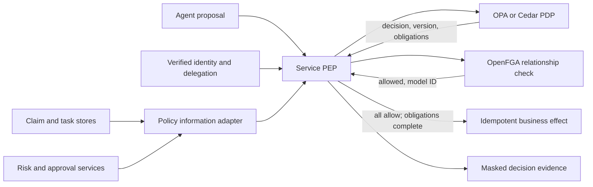

# Fine-Grained Authorization for AI Agents

Authentication establishes who is present. Delegation constrains what an agent may carry. Fine-grained authorization decides whether this verified subject, current agent, workload, task, resource, action, and runtime context may produce this effect now.

This course builds a realistic insurance-claims policy enforcement point (PEP), a deterministic reference policy decision point (PDP), executable Cedar policies, OPA and OpenFGA policy artifacts, SDK-ready requests, a labeled adversarial evaluation, and a production rollout plan.

> **Goal:** Derive trusted authorization facts, compose attribute and relationship policy, enforce obligations, and detect semantic drift before an agent action reaches a business effect.

## Course thesis

After this course, you can derive a trustworthy authorization request from authenticated application state, implement default-deny object-level decisions, compose relationship and attribute policy, enforce obligations and approvals at the PEP, test policy parity, and operate policy changes without mistaking a simulation for production evidence.

## Learning outcomes

You will be able to:

1. separate authentication, delegation, policy decision, policy enforcement, and side effects;
2. derive subject, agent, workload, tenant, task, and resource facts from trusted systems rather than model arguments;
3. model RBAC, ABAC, ReBAC, and policy-as-code as complementary tools;
4. express the same core invariants in a reference evaluator, OPA/Rego, Cedar, and OpenFGA;
5. use AuthZEN's subject-action-resource-context (SARC) request shape at the PEP/PDP boundary;
6. bind approvals to an exact proposal and enforce every returned obligation;
7. measure invalid acceptances, valid work blocked, semantic drift, and dependency failure behavior; and
8. plan policy versioning, distribution, observability, rollback, and governance.

## Prerequisites

- [Authorization for Agents](../../beginner/04-authorization-for-agents/)
- [Least-Privilege Tool Access](../../beginner/05-least-privilege-tool-access/)
- [OAuth and OIDC for Agents](../02-oauth-oidc-for-agents/)
- [Token Exchange, Delegation, and Impersonation](../03-token-exchange-delegation-impersonation/)
- Python 3.10+

The next course, [Dynamic Authorization and Continuous Access Evaluation](../05-dynamic-authorization-cae/), adds mid-session signal changes and revocation. This course focuses on one correctly assembled authorization decision and its enforcement.

## Scenario and success criteria

Northstar Mutual uses an AI claims-adjuster to read a claim, update an open claim, or create a settlement payment. Alice starts a bounded task for `claim:clm-100`. The workload is authenticated as `spiffe://northstar.example/claims/adjuster`. A fraud service supplies a short-lived risk signal. Payments require a supervisor receipt bound to the exact proposal.

The lab succeeds only when:

- the four valid cases execute;
- all 29 invalid, boundary, and dependency-failure cases are blocked;
- no decision trusts identity, tenant, scope, or approval supplied by the agent proposal;
- Cedar and the reference evaluator agree on all 30 policy cases they both execute;
- unsupported obligations, stale policy versions, and PDP outages fail closed; and
- the release gate reports zero invalid acceptances and zero valid work blocked.

### Non-goals

- Building an identity provider or token broker; the prior courses establish those facts.
- Claiming that local policy tests prove a distributed production deployment.
- Treating OpenFGA alone as an attribute/risk/approval engine.
- Using an LLM to decide authorization.

## The central trust boundary

```text
agent/model -> proposes {action, resource, parameters, operation_id}
application -> authenticates caller and loads task/resource/risk/approval facts
PEP         -> constructs a trusted request and asks the PDP
PDP         -> returns allow/deny, reasons, policy version, obligations
PEP         -> verifies response, fulfills every obligation, executes once, records evidence
```

An agent-provided `tenant_id`, `is_admin`, `approved=true`, or `workload_trusted=true` is data, not authority. In `lab.py`, `ActionProposal` deliberately cannot carry identity, tenant, scopes, or approval state.

## Mental model: five planes

| Plane | Responsibility | Example source | Must not do |
|---|---|---|---|
| Identity | Authenticate user, client, agent, and workload | OIDC, mTLS, SPIFFE | Infer identity from prompt text |
| Delegation | Bound task, scopes, actor chain, resource and lifetime | token exchange / task grant | Widen parent authority |
| Information | Supply current resource, tenant, risk and lifecycle facts | claims DB, fraud service | Accept caller assertions as facts |
| Decision | Evaluate policy and return structured output | OPA, Cedar, OpenFGA composition | Perform the business effect |
| Enforcement | Fulfill obligations and execute exactly once | API gateway / service PEP | Treat `allow` as successful execution |

The Policy Information Point (PIP) supplies facts; the PDP decides; the PEP enforces. These are logical roles and may be separate services, sidecars, libraries, or modules.

## Authorization models

### RBAC

Role-based access control maps principals to roles and roles to permissions. It is simple and auditable, but roles become unwieldy when policy depends on object ownership, tenant, task, amount, risk, or time. Use roles as one input, not as the entire decision.

### ABAC

Attribute-based access control evaluates principal, resource, action, and environmental attributes. It naturally handles tenant equality, risk thresholds, resource state, and payment limits. Its weakness is attribute provenance: an expressive policy is unsafe when attributes are stale or attacker-controlled.

### ReBAC

Relationship-based access control answers graph questions such as “is this agent both assigned and delegated to the task that is attached to this claim?” It is strong for sharing and nested relationships. Highly dynamic numeric conditions, receipts, and operational obligations usually require composition with an attribute-aware layer.

### Policy as code

Policy as code stores reviewable, testable, versioned decision logic separately from business handlers. Separation does not remove the PEP's responsibility. A perfect policy with a handler that ignores obligations or uses the wrong object still fails.

## Decision contract

The lab evaluates a typed `AuthorizationInput`:

- `VerifiedCaller`: authenticated subject, current agent, workload, tenant, scopes, and attestation result;
- `TaskGrant`: requester, assignee, object, allowed actions, status, and expiry;
- `ResourceRecord`: authoritative object, tenant, owner, state, and version;
- `RiskSignal`: resource-bound, tenant-bound, timestamped signal and source;
- `ActionProposal`: action, object, parameters, purpose, and stable operation ID; and
- `ApprovalReceipt`: exact, role-bound, expiring approval for high-impact payment.

The `Decision` contains `allowed`, stable reason codes, mandatory obligations, a decision ID, policy version, and an input digest. It excludes raw credentials and private reasoning.

## Mechanics: how one request is decided

### 1. Authenticate before authorization

The application verifies the user session, client, workload identity, token issuer/audience/time/key profile, and delegation chain. The resulting `VerifiedCaller` is not created from the tool call.

### 2. Hydrate authoritative objects

The resource service loads `claim:clm-100`; the task store loads the exact task; the risk service returns a recent signal. Each record carries its own tenant and object identifier so the PDP can detect confused-deputy substitutions.

### 3. Bind all dimensions

The reference policy checks:

```text
verified caller
AND attested allowed workload
AND subject == task.requester
AND agent == task.assignee
AND task active and current
AND proposal.resource == task.resource == loaded resource
AND caller.tenant == task.tenant == resource.tenant == risk.tenant
AND action in task.allowed_actions
AND required scope present
AND action-specific state, risk, purpose, amount, and approval constraints
```

Missing data denies. A broad token scope never replaces object and task checks.

### 4. Return obligations

An allow decision may require machine-readable work:

- `audit`: persist privacy-safe decision evidence;
- `redact_pii`: remove protected fields before returning a read result; or
- `idempotency`: execute the payment under the stable operation ID.

If the PEP does not support every obligation, it denies. AuthZEN's obligations profile follows the same principle: obligations are mandatory, not suggestions.

### 5. Execute once and verify

The PEP consumes an exact payment approval atomically, reconciles an identical retry, rejects a changed request that reuses an operation ID, performs the side effect, and records the outcome. PDP allow is not itself proof of execution.

## AuthZEN interoperability

The OpenID AuthZEN Authorization API standardizes the PEP/PDP request boundary without prescribing a policy language. Its core request is SARC: subject, action, resource, and context. `authzen_request()` creates this structure from trusted state.

As of January 2026, Authorization API 1.0 is a final specification. The working group also publishes drafts for obligations, access requests/approvals, and MCP-oriented COAZ mappings. A requestable denial remains a denial until re-evaluation; an approval workflow must not silently convert a deny into access.

## OPA and Rego

[Open Policy Agent](https://www.openpolicyagent.org/) is a general-purpose policy engine. Rego evaluates structured input and data. In this course:

- `policies/opa/claims.rego` implements default deny, common trust checks, action-specific policy, and obligations;
- `policies/opa/claims_test.rego` tests tenant, object, workload, risk, approval, and obligation behavior;
- `opa_input()` creates a privacy-conscious input document; and
- `opa_client()` constructs the maintained Python client without pretending a server call occurred.

Run a local OPA binary when available:

```bash
opa check policies/opa/claims.rego policies/opa/claims_test.rego
opa test -v policies/opa
opa eval --data policies/opa/claims.rego --input request.json 'data.claims.authz.decision'
```

Production OPA typically distributes signed/versioned bundles, reports status, and emits decision logs. Logs can contain sensitive input, so use masking and retain the decision ID and bundle revision rather than copying credentials or full claim records.

## Cedar

[Cedar](https://www.cedarpolicy.com/) is an authorization policy language with explicit `permit` and `forbid` semantics and schema-based validation. Any matching `forbid` overrides permits; no matching permit means deny.

This course uses:

- `policies/cedar/schema.json`, in the current namespaced JSON schema shape;
- `policies/cedar/claims.cedar`, with read, update, payment, and cross-cutting forbid logic;
- `cedarpy.validate_policies()` to prove policy/schema compatibility; and
- `cedarpy.is_authorized()` to execute every normal labeled case locally.

Schema validation and authorization are distinct. Validate during build and deployment, but still submit schema-conforming entities and context at runtime. The PIP-derived booleans in this lab are an integration boundary: production systems should preserve source IDs, timestamps, and versions alongside them.

## OpenFGA

[OpenFGA](https://openfga.dev/) models relationships with tuples and evaluates checks against a versioned authorization model. The model in this course requires an agent to be both `assignee` and `delegated_agent` for a task attached to the claim.

`openfga_check()` creates a real `openfga_sdk.client.models.ClientCheckRequest` with contextual tuples. Contextual tuples are request-scoped facts; they are not persisted and must be validated and bounded like any other authorization input.

OpenFGA establishes the relationship plane. The reference/OPA/Cedar layer still checks workload attestation, tenant consistency, task expiry, resource state, risk, amount, exact approval, and obligations. A production service can deny unless both layers allow:

```text
final_allow = openfga_relationship_allow AND attribute_policy_allow
```

Persist lifecycle relationships when they must survive requests. Delete task tuples when a task ends. Use explicit consistency choices for high-impact operations, record the model ID, and test stale-model behavior.

## Technology landscape

| Option | Best fit | Strengths | Limitations | Evidence in this lab |
|---|---|---|---|---|
| In-process reference PDP | Teaching, small bounded services | Deterministic, debuggable, no network | Application-specific; governance burden | Fully executed and tested |
| OPA/Rego | Polyglot attribute policy and platform control | Mature ecosystem, bundles, tests, decision logs | Separate runtime/operations; Rego learning curve | Policy and tests included; server adapter only |
| Cedar / Verified Permissions | Application authorization with typed schema | Readable policies, forbid precedence, validation | Entity/context integration work; hosted AVP differs operationally | Policy is validated and executed locally |
| OpenFGA | Relationship-heavy sharing and task graphs | Purpose-built ReBAC, model IDs, SDKs | Not a complete risk/approval/obligation system | Model and real SDK check request; no default server |
| AuthZEN | Vendor-neutral PEP/PDP boundary | Interoperability and SARC contract | Does not define business policy or fact provenance | Request builder and response concepts |

Selection questions:

1. Are rules primarily relationships, attributes, or a composition?
2. Must decisions run locally, remotely, or both?
3. How are policies/models versioned, validated, distributed, and rolled back?
4. What consistency is required for revocation and high-impact writes?
5. Can the PEP support every obligation and preserve decision evidence?
6. Who owns attribute quality and lifecycle cleanup?

## Worked request

Alice delegates an active claim task to the verified claims workload. The agent proposes a USD 250 settlement payment for `claim:clm-100`.

1. The application loads the caller, task, claim, and fraud signal.
2. It computes the proposal digest and retrieves a supervisor receipt bound to the task, object, action, amount/purpose digest, policy version, and expiry.
3. The reference PDP verifies identity, tenant, task, scope, resource, state, risk, amount, purpose, and receipt.
4. The PDP allows with `audit` and `idempotency` obligations.
5. The PEP verifies the policy version and obligation support, atomically consumes the receipt, and records the operation.
6. An identical retry returns the existing receipt. A modified amount under the same operation ID fails with `operation_id_conflict`.

## Run the lab

```bash
cd curriculum/intermediate/04-fine-grained-authorization
python -m venv .venv
source .venv/bin/activate
python -m pip install -r requirements.txt
python lab.py
pytest -q tests
```

Open `fine_grained_authorization.ipynb` for the guided lab. It imports `lab.py`; the notebook does not duplicate a second implementation.

## Experiments and evaluation

`build_cases()` contains 33 labeled cases:

- 4 valid reads, updates, and payments;
- 5 identity/workload substitutions;
- 3 isolation failures;
- 2 task lifecycle failures;
- 5 authority/object/ownership/scope failures;
- resource-state, risk boundary, freshness, provenance, and range failures;
- 6 amount, purpose, and exact-approval failures; and
- PDP outage, stale policy, and unsupported-obligation failures.

The intentionally unsafe scope-only baseline accepts 28 invalid cases. The hardened path matches all 33 labels. These deterministic fixture results are regression evidence, not a claim about production traffic.

Metrics have explicit populations:

| Metric | Numerator / denominator | Desired direction |
|---|---|---|
| Outcome accuracy | correctly matched labels / all 33 cases | Higher |
| Invalid acceptance rate | invalid cases allowed / 29 invalid cases | Zero |
| Valid work blocked rate | valid cases denied / 4 valid cases | Zero |
| Cedar parity | cases matching expected, reference, and Cedar / 30 normal cases | 100% |

The release gate requires at least 30 cases, 100% label agreement, zero invalid acceptances, and zero valid work blocked. Add representative production-derived cases before using equivalent gates operationally.

## Failure modes and mitigations

| Failure | Why it happens | Required mitigation |
|---|---|---|
| Scope-only allow | Token permission is mistaken for object authority | Intersect identity, task, tenant, object, action, state, and context |
| Caller-supplied trust | Tool arguments include `approved=true` or tenant | Derive facts from verified application state |
| Confused deputy | Valid agent swaps claim or tenant | Bind proposal, task, resource, risk, and approval identifiers |
| Stale attribute | Risk/task/resource changed after caching | Short TTL, source timestamps/version, re-evaluate writes |
| Approval boolean | Any truthy flag authorizes payment | Exact expiring receipt; atomic single use |
| Obligation ignored | PEP treats allow as sufficient | Deny unless every obligation is understood and fulfilled |
| Policy drift | Engines encode different semantics | Shared labeled corpus and parity checks |
| Fail-open outage | PDP error becomes allow | Explicit fail-closed path; narrowly designed emergency policy if required |
| Relationship leak | Task tuples survive task closure | Lifecycle owner and tuple deletion/reconciliation |
| Unsafe retry | Network uncertainty duplicates payment | Stable operation ID, exact fingerprint, reconciliation |
| Sensitive logs | Full input or credentials enter decision logs | Digests, masks, allowlists, retention controls |

## When not to externalize authorization

An external PDP can be excessive for a tiny service with a few stable checks, very tight latency constraints, and no cross-service policy. An in-process typed evaluator can be safer than a network dependency. Keep the contract and tests so the architecture can evolve without changing semantics.

Do not adopt ReBAC merely because an agent graph exists. Use it when relationship traversal is genuinely central. Do not push volatile telemetry into a relationship store when a short-lived context attribute is more honest.

## Production architecture


```mermaid
flowchart LR
    A[Agent proposal] --> PEP[Service PEP]
    ID[Verified identity and delegation] --> PEP
    DB[Claim and task stores] --> PIP[Policy information adapter]
    R[Risk and approval services] --> PIP
    PIP --> PEP
    PEP --> PDP[OPA or Cedar PDP]
    PEP --> FGA[OpenFGA relationship check]
    PDP -->|decision, version, obligations| PEP
    FGA -->|allowed, model ID| PEP
    PEP -->|all allow; obligations complete| E[Idempotent business effect]
    PEP --> L[Masked decision evidence]
```

### Policy lifecycle

1. Author policy and schema/model in version control.
2. Format, validate, lint, and execute positive/negative tests.
3. Run parity and migration tests against representative requests.
4. Review ownership, blast radius, and data dependencies.
5. Publish an immutable signed artifact or model version.
6. Deploy in shadow mode; compare decisions without effects.
7. Canary by tenant/action; monitor invalid allows and valid denials.
8. Promote or roll back using the recorded policy/model version.

### Operational controls

- Set a decision latency SLO and bounded timeout.
- Choose local/sidecar evaluation where outage and latency budgets require it.
- Record decision ID, policy/bundle/model version, input digest, reason code, and enforcement outcome.
- Mask or erase credentials, PII, and high-cardinality payloads.
- Alert on missing PIP data, stale bundles/models, parity drift, deny spikes, and obligation failures.
- Keep separate owners for policy semantics, PIP data quality, PEP correctness, and business effects.
- Re-authorize after meaningful state changes and immediately before high-impact writes.

## State of the art

### Established practice

- default deny and least privilege;
- policy-as-code with versioned tests and review;
- local or nearby PDP deployment for predictable latency;
- explicit resource/action decisions and privacy-conscious audit evidence;
- relationship engines for sharing graphs and attribute engines for contextual controls.

### Current direction

- AuthZEN standardizes PEP/PDP interoperability instead of coupling each application to one vendor API;
- policy responses increasingly include structured obligations rather than a bare boolean;
- agent authorization composes verified workload identity, user delegation, task relationships, object state, and runtime risk;
- continuous evaluation and shared signals shorten the lifetime of stale authorization decisions.

### Open problems

- proving semantic equivalence across policy engines;
- safe caching under rapid revocation and partial network failure;
- explaining composed graph-and-attribute decisions without leaking sensitive data;
- governing agent-created task relationships at scale; and
- measuring policy quality from biased, incomplete production denials.

## Exercises

### Implementation

Add `claim.document.download`. Require task/resource binding, `claims:read`, a clean malware verdict tied to the exact document version, and a watermark obligation. Add positive, stale-verdict, wrong-document, and unsupported-obligation tests.

### Diagnosis

Change the Cedar risk boundary from `< 50` to `<= 50`. Run the parity corpus, identify the drift case, and write the smallest policy correction plus a regression test.

### Architecture

Design a two-region deployment. Decide which facts live in OpenFGA, which remain request context, the consistency mode for payments, outage behavior, model migration strategy, and evidence needed for incident reconstruction.

### Production extension

Run OPA locally, submit `opa_input(environment())` through `opa-python-client`, capture the returned decision ID and bundle revision, and compare it with the reference and Cedar outputs. Keep server-dependent evidence separate from the credential-free release gate.

## Review questions

1. Why is a valid OAuth scope necessary but insufficient for a payment?
2. Which facts may come from an agent proposal, and which must come from trusted application state?
3. When should contextual OpenFGA tuples be persisted instead?
4. Why does an unsupported obligation convert an allow response into a denied execution?
5. What does Cedar schema validation prove, and what does it not prove?
6. How would you detect and safely roll back semantic drift between two PDP implementations?

## References

### Standards and interoperability

- [OpenID AuthZEN specifications](https://openid.net/wg/authzen/specifications/)
- [AuthZEN Authorization API 1.0](https://openid.net/specs/authorization-api-1_0.html)
- [NIST SP 800-162: Guide to Attribute Based Access Control](https://csrc.nist.gov/pubs/sp/800/162/upd2/final)
- [NIST SP 800-207: Zero Trust Architecture](https://csrc.nist.gov/pubs/sp/800/207/final)

### OPA

- [OPA policy language](https://www.openpolicyagent.org/docs/policy-language)
- [OPA policy testing](https://www.openpolicyagent.org/docs/policy-testing)
- [OPA bundles](https://www.openpolicyagent.org/docs/management-bundles)
- [OPA decision logs and masking](https://www.openpolicyagent.org/docs/management-decision-logs)
- [OPA performance guidance](https://www.openpolicyagent.org/docs/policy-performance)

### Cedar

- [Cedar policy syntax](https://docs.cedarpolicy.com/policies/syntax-policy.html)
- [Cedar policy validation](https://docs.cedarpolicy.com/policies/validation.html)
- [Cedar JSON schema format](https://docs.cedarpolicy.com/schema/json-schema.html)
- [Cedar entities and context JSON](https://docs.cedarpolicy.com/auth/entities-syntax.html)
- [Amazon Verified Permissions validation mode](https://docs.aws.amazon.com/verifiedpermissions/latest/userguide/policy-validation-mode.html)

### OpenFGA

- [OpenFGA concepts](https://openfga.dev/docs/concepts)
- [OpenFGA task-based authorization for agents](https://openfga.dev/docs/modeling/agents/task-based-authorization)
- [OpenFGA contextual tuples](https://openfga.dev/docs/interacting/contextual-tuples)
- [OpenFGA conditions](https://openfga.dev/docs/modeling/conditions)
- [OpenFGA consistency](https://openfga.dev/docs/interacting/consistency)

## Artifact map

- [`lab.py`](lab.py): deterministic reference PDP/PEP, adapters, cases, metrics, and release gate
- [`fine_grained_authorization.ipynb`](fine_grained_authorization.ipynb): guided executable lab
- [`tests/test_authorization.py`](tests/test_authorization.py): focused invariant tests
- [`policies/opa/claims.rego`](policies/opa/claims.rego): Rego policy
- [`policies/opa/claims_test.rego`](policies/opa/claims_test.rego): Rego tests
- [`policies/cedar/claims.cedar`](policies/cedar/claims.cedar): Cedar policy
- [`policies/cedar/schema.json`](policies/cedar/schema.json): Cedar schema
- [`policies/openfga/model.fga`](policies/openfga/model.fga): relationship model

The notebook is the primary hands-on path; the chapter is the technical reference.
