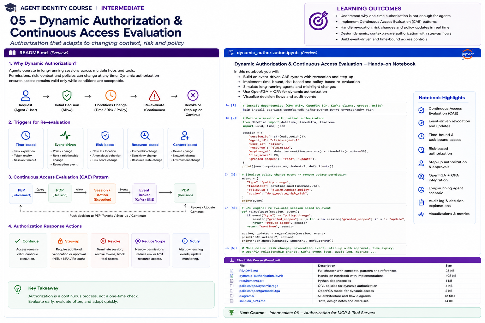

# Intermediate 05 — Dynamic Authorization & Continuous Access Evaluation



> **Goal:** design authorization for long-running agents where permission can change *after* the initial token or policy decision.

A one-time authorization decision assumes the world stays unchanged:

```text
t0: ALLOW
         |
         |  agent runs for 40 minutes
         |
         v
t40: still allowed?
```

For autonomous agents, that assumption is dangerous. During execution:

```text
task expires
user is disabled
agent is quarantined
risk increases
approval is revoked
resource classification changes
policy changes
delegation is cancelled
workload posture changes
```

Dynamic authorization therefore treats access as a **continuously maintained security state**, not a permanent consequence of an earlier `allow`.

---

## Learning outcomes

You will learn to:

- distinguish token validity from current authorization;
- identify stale-authorization windows;
- design re-evaluation triggers;
- implement time-, event-, risk-, resource- and context-driven authorization;
- understand OpenID Shared Signals Framework (SSF);
- understand the final OpenID Continuous Access Evaluation Profile (CAEP) 1.0;
- model CAEP session-revoked, token-claims-change, credential-change, assurance-level-change and device-compliance-change events;
- distinguish CAEP standards from vendor-specific CAE;
- handle claims challenges and step-up;
- revoke or attenuate active agent authority;
- propagate policy and relationship changes;
- secure long-running and asynchronous agents;
- design authorization caches safely;
- use event brokers without treating delivery as magically reliable;
- prevent race conditions and TOCTOU authorization failures;
- produce evidence for dynamic decisions.

---

# 1. Why one-time authorization fails for agents

Traditional API request:

```text
request -> authorize -> execute -> response
```

may last milliseconds.

Agent execution:

```text
request
 -> plan
 -> retrieve
 -> call agent B
 -> wait
 -> call tool
 -> request approval
 -> resume
 -> update record
 -> send message
```

may last minutes, hours or days.

Authorization state can change between any two steps.

---

# 2. Token validity != authorization validity

Suppose an access token says:

```text
exp = 16:00
scope = claim:update
```

At 15:20:

```text
Alice's role changes
```

At 15:21 the token may still be cryptographically valid.

This creates a **stale authorization window**:

```text
policy change ---------------- token expiry
       |<--- stale window --->|
```

Short token TTLs reduce the window but do not eliminate the architectural problem.

---

# 3. Dynamic authorization model

Think:

```text
ALLOW while conditions remain true
```

rather than:

```text
ALLOW forever because conditions were true at t0
```

Conceptually:

```text
effective_access(t) =
identity(t)
∩ delegation(t)
∩ task(t)
∩ resource_policy(t)
∩ risk(t)
∩ approval(t)
∩ environment(t)
```

---

# 4. Re-evaluation triggers

## Time-based

```text
task expiry
token expiry
approval expiry
maximum autonomous execution interval
```

## Event-driven

```text
user disabled
role changed
agent quarantined
delegation revoked
policy deployed
approval withdrawn
credential rotated
```

## Risk-driven

```text
impossible travel
new IP/network
abnormal tool sequence
prompt-injection detector
high transaction amount
behavior anomaly
```

## Resource-driven

```text
classification changed
owner changed
legal hold applied
fraud hold applied
case closed
```

## Context-driven

```text
device posture changed
workload identity changed
environment changed
network zone changed
```

---

# 5. Continuous Access Evaluation

Continuous Access Evaluation (CAE) is the general architectural idea that access can be reconsidered when relevant security conditions change.

The standards-based cross-provider mechanism is **OpenID Continuous Access Evaluation Profile (CAEP)**, built on the **OpenID Shared Signals Framework (SSF)**.

CAEP 1.0 became an OpenID Final Specification in August 2025.

It is explicitly designed so cooperating transmitters can send continuous updates that receivers use to attenuate access for human **or robotic** users, devices, sessions and applications.

---

# 6. Shared Signals Framework

SSF defines infrastructure for exchanging security signals.

```text
Signal source / Transmitter
           |
           | Security Event Token
           v
       Event Stream
           |
           v
Receiver / Relying Service
           |
           v
security response
```

Examples of signal sources:

```text
identity provider
endpoint security
risk engine
agent registry
authorization service
SOC platform
```

Examples of receivers:

```text
API gateway
agent runtime
token broker
MCP server
session service
authorization PDP
```

---

# 7. Security Event Tokens

SSF uses Security Event Tokens (SETs), based on RFC 8417.

A SET represents a security event, not an access token.

Conceptually:

```json
{
  "iss":"https://id.example",
  "aud":"https://agent-platform.example",
  "iat":1770000000,
  "jti":"event-123",
  "events":{
    "...event-type...":{
      "...":"..."
    }
  }
}
```

Do not use security event payloads as authorization credentials.

They are inputs that can cause authorization state to change.

---

# 8. CAEP event types

CAEP 1.0 defines security events including:

```text
Session Revoked
Token Claims Change
Credential Change
Assurance Level Change
Device Compliance Change
```

These events let a receiver respond before simply waiting for a token/session to expire.

---

# 9. Session revoked

Agent analogy:

```text
user session revoked
delegation session revoked
agent session revoked
```

Receiver action might be:

```text
mark session inactive
reject next action
cancel queued privileged operations
invalidate authorization cache
terminate tool session
```

A revocation event should change enforcement state.

Logging it without enforcement is not continuous authorization.

---

# 10. Token claims change

Suppose an agent's authority was derived from:

```text
department = claims
role = senior-adjuster
```

Then the source claims change.

Possible response:

```text
invalidate cached decisions
force token refresh
recompute task authority
reduce active permissions
```

---

# 11. Credential change

A credential event can indicate that authentication material changed.

For agent systems, also consider equivalent platform events:

```text
workload key rotated
SPIFFE identity changed
service account disabled
certificate revoked
agent registration suspended
```

Not every agent-specific event is a standardized CAEP event. Build an enterprise event taxonomy while keeping standards and custom events clearly distinguished.

---

# 12. Assurance-level change

An operation may require:

```text
AAL / authentication assurance
workload assurance
human approval assurance
```

If assurance drops, the runtime can:

```text
continue read-only
reduce scope
require step-up
pause
terminate
```

Dynamic authorization need not be binary.

---

# 13. Device compliance change

CAEP includes device compliance change.

For human+agent systems this can influence delegated authority:

```text
Alice's managed device becomes noncompliant
      |
      v
delegated session risk changes
      |
      v
agent loses sensitive action authority
```

For machine actors, analogous workload posture may come from other security systems.

---

# 14. CAEP vs Microsoft Entra CAE

Do not conflate:

```text
OpenID CAEP
```

with:

```text
Microsoft Entra Continuous Access Evaluation
```

Microsoft Entra CAE is a concrete vendor implementation for supported applications/resources. It can react to events such as user disablement, password reset, explicit refresh-token revocation and elevated user risk; CAE-enabled resources can also enforce location-based Conditional Access.

Microsoft's developer flow uses claims challenges: a CAE-aware resource can reject a token and return a `401` plus `WWW-Authenticate` claims challenge, which the client uses to obtain a token satisfying the new conditions.

That is an important production pattern, but not the entirety of the CAEP standard.

---

# 15. Claims challenge

Flow:

```text
Agent client
    |
    | token
    v
Resource API
    |
    | conditions no longer sufficient
    v
401 + claims challenge
    |
    v
Identity / authorization service
    |
    | re-evaluate / step-up
    v
new token or deny
```

Never blindly retry the same rejected token forever.

---

# 16. Step-up authorization

Dynamic response can be:

```text
ALLOW
DENY
STEP_UP
REDUCE
PAUSE
REVOKE
```

Example:

```text
payment <= $100
  -> autonomous

$100 < payment <= $1000
  -> human approval

payment > $1000
  -> deny agent
```

Risk may dynamically change these thresholds.

---

# 17. Agent step-up

Step-up need not always mean MFA.

For agents it can mean:

```text
human approval
stronger user authentication
fresh delegated token
fresh workload attestation
manager approval
second agent verification
policy exception approval
more constrained tool
```

---

# 18. Long-running task lease

Instead of authorizing a 4-hour workflow once, issue a short task lease:

```text
task = claim:483
lease = 5 minutes
```

Before a privileged step:

```text
lease valid?
task active?
delegation active?
policy unchanged?
risk acceptable?
```

If not, re-evaluate.

---

# 19. Checkpoints

Not every token of model generation requires a PDP call.

Define security checkpoints:

```text
before tool selection
before privileged tool
before resource read
before side effect
after human approval
after long wait
before external delegation
before commit
```

The higher the impact, the fresher the decision should be.

---

# 20. Time-of-check/time-of-use

Classic TOCTOU:

```text
10:00 authorize transfer
10:01 approval revoked
10:02 execute transfer
```

The authorization was valid when checked, but stale at execution.

Mitigations:

```text
check close to side effect
short decision leases
transaction-bound approvals
atomic policy/resource operations
version assertions
idempotency
```

---

# 21. Resource version binding

Suppose authorization was evaluated against:

```text
invoice version = 17
amount = 300
```

Before execution the invoice changes:

```text
version = 18
amount = 3000
```

Bind high-impact authorization to:

```text
resource version
parameters
approval
```

Then require the execution target to still match.

---

# 22. Approval version binding

Bad:

```text
approval = true
```

Better:

```json
{
  "approval_id":"apr:82",
  "action":"payment.create",
  "resource":"invoice:927",
  "amount":300,
  "version":17,
  "expires_at":"..."
}
```

If parameters change, approval is no longer valid.

---

# 23. Dynamic relationship changes

With ReBAC:

```text
agent A viewer document 42
```

can disappear while a task is running.

Your architecture must define how quickly:

```text
relationship mutation
```

becomes:

```text
enforcement change
```

Caching is part of the security model.

---

# 24. Policy deployment events

Policy version:

```text
payments-v17
```

changes to:

```text
payments-v18
```

A running agent may hold a cached allow from v17.

Options:

```text
invalidate all affected cache entries
re-evaluate on next sensitive action
push policy-change event
version-check decisions
```

---

# 25. Decision leases

Instead of caching:

```text
ALLOW
```

cache:

```json
{
  "allow":true,
  "valid_until":"14:05:00Z",
  "policy_version":"payments-v18",
  "resource_version":17,
  "risk_bucket":"low"
}
```

The decision is a lease with assumptions.

---

# 26. Cache key design

Unsafe:

```text
cache[action] = allow
```

Safer key includes relevant dimensions:

```text
subject
actor
task
action
resource
resource version
policy version
risk state
approval
delegation family
```

If a dimension can change the decision, omitting it can create authorization bugs.

---

# 27. Cache invalidation

Invalidate when:

```text
policy changes
relationship changes
task ends
delegation revoked
approval revoked
resource changes
risk crosses threshold
agent quarantined
user disabled
```

Event-driven invalidation plus short leases is a practical combination.

---

# 28. Event ordering

Distributed events may arrive:

```text
late
duplicated
out of order
```

Example:

```text
E1 risk high
E2 risk low
```

Receiver sees:

```text
E2
E1
```

and incorrectly moves backward.

Track:

```text
event timestamp
event ID
source
subject
sequence/version where available
```

and design monotonic security state where possible.

---

# 29. Duplicate events

Event handlers should be idempotent.

```text
session-revoked event received twice
```

must not cause corruption.

Keep processed event IDs or use state transitions that are naturally idempotent.

---

# 30. Event delivery failure

Do not assume:

```text
event bus exists -> revocation guaranteed
```

Plan for:

```text
receiver offline
network partition
stream misconfiguration
expired subscription
invalid signature
queue backlog
```

Defense in depth:

```text
events
+
short leases
+
fresh checks at critical boundaries
```

---

# 31. Fail-safe behavior

If authorization freshness cannot be established:

```text
read public FAQ -> maybe degraded mode
wire transfer -> deny/pause
delete account -> deny
send regulated data -> deny
```

Define per-action freshness requirements.

---

# 32. Risk-based authorization

Risk is not just a dashboard score.

Example:

```text
risk < 30 -> allow
30-60 -> reduce authority
60-80 -> human approval
>80 -> revoke/pause
```

Risk signals might include:

```text
identity risk
workload risk
tool-call anomaly
prompt-injection signal
data sensitivity
transaction value
network posture
behavior deviation
```

---

# 33. Prompt injection as a dynamic signal

Suppose a detector changes:

```text
prompt_injection_risk:
0.1 -> 0.91
```

Do not merely append:

```text
"be careful"
```

Policy response can be:

```text
remove write tools
block external communication
restrict retrieval
require human review
```

This converts AI security telemetry into enforceable authorization state.

---

# 34. Agent quarantine

Agent registry:

```text
agent:claims
status = active
```

Security system detects compromise:

```text
status = quarantined
```

Consequences:

```text
deny new token exchange
revoke active task leases
invalidate PDP cache
terminate MCP sessions
stop redelegation
pause queued actions
```

---

# 35. Kill switch vs graceful attenuation

A kill switch is important but coarse.

Prefer a response ladder:

```text
continue
reduce scope
read-only
disable one tool
require approval
pause
revoke
terminate
```

This preserves availability without ignoring risk.

---

# 36. Asynchronous agents

A queued task may resume hours later.

Never assume the authorization state captured at queue time is still valid.

Queue durable **intent**, not durable authority:

```text
task ID
requested action
resource
parameters
```

On resume:

```text
re-authenticate workload
reload task
re-evaluate authorization
obtain fresh credential
execute
```

---

# 37. Multi-agent revocation

Chain:

```text
Alice -> Supervisor -> Specialist -> Tool
```

If Alice revokes delegation:

```text
Supervisor authority -> invalid
Specialist child authority -> invalid
active tool session -> invalid
```

Track delegation families/lineage so cancellation propagates across descendants.

---

# 38. Dynamic authorization control plane

```text
 Identity / Workload / Risk / Policy / Resource / Approval
             \       |       |       |       /
                     v
               Signal Layer
             SSF / CAEP / Events
                     |
                     v
             Authorization State
                     |
        +------------+-------------+
        |                          |
        v                          v
   Token Broker                   PDP
        |                          |
        +------------+-------------+
                     |
                     v
                    PEP
                     |
                     v
             Agent / Tool / API
```

---

# 39. Event-driven architecture

Enterprise implementation might use:

```text
Kafka
Kinesis
SNS/SQS
EventBridge
Pub/Sub
Azure Event Grid
```

for internal authorization events.

SSF/CAEP provides standardized security signal semantics/interoperability; your internal event platform provides transport and operational infrastructure.

Do not confuse the two layers.

---

# 40. CAEP interoperability direction

The OpenID Shared Signals working group now has final SSF and CAEP 1.0 specifications. In July 2026 it also published a CAEP Interoperability Profile 1.0 draft defining tighter interoperability requirements such as endpoint attributes and OAuth use for SSF endpoints.

For a state-of-the-art course, learners should understand both:

```text
stable final CAEP semantics
```

and:

```text
emerging interoperability profiles
```

without treating a draft as final.

---

# 41. Microsoft Entra CAE production lesson

Microsoft's CAE architecture demonstrates an important trade-off:

```text
do not solve revocation only by making every token extremely short
```

Instead:

```text
longer-lived token
+
critical event awareness
+
resource enforcement
+
claims challenge
+
fresh policy evaluation
```

This improves resilience while allowing important changes to be enforced before normal expiry.

The general lesson applies beyond Microsoft, even though the concrete protocol behavior is provider-specific.

---

# 42. Observability

Track:

```text
active agent sessions
active delegation families
decision lease age
revocation propagation latency
event delivery latency
step-up frequency
denial reason
cache hit rate
stale decision prevented
quarantined agents
```

Security latency is measurable.

---

# 43. Revocation SLO

Define:

```text
user disabled -> sensitive agent access blocked
```

within an explicit target, for example:

```text
P95 < 60 seconds
```

Different operations may require different targets.

Measure end-to-end:

```text
signal created
 -> transmitted
 -> received
 -> state updated
 -> cache invalidated
 -> PEP enforcement
```

---

# 44. Practical notebook

The notebook builds a local dynamic authorization control plane for a long-running Claims Agent.

It covers:

1. initial authorization;
2. decision leases;
3. time expiry;
4. risk changes;
5. policy version changes;
6. resource version changes;
7. approval revocation;
8. agent quarantine;
9. CAEP-style events;
10. session revocation;
11. token claims changes;
12. step-up;
13. scope attenuation;
14. event deduplication;
15. out-of-order event protection;
16. cache invalidation;
17. TOCTOU protection;
18. asynchronous resume;
19. delegation-family revocation;
20. dynamic RAG/tool authorization;
21. audit evidence;
22. revocation latency metrics.

---

# 45. Production checklist

## Re-evaluation

- What events invalidate an allow?
- Which actions require a fresh check?
- What is the maximum decision age?
- Are long waits checkpoints?

## Signals

- Which sources are authoritative?
- Are events authenticated?
- Are duplicates handled?
- Is ordering handled?
- What happens if delivery fails?

## Response

- Can authority be reduced?
- Can step-up be requested?
- Can sessions be paused?
- Can active credentials be revoked?
- Can descendants be revoked?

## Cache

- What is the cache key?
- What is the lease duration?
- Which events invalidate it?
- Is policy version included?
- Is resource version included?

## Long-running agents

- Is authority refreshed after resume?
- Are queued operations re-authorized?
- Are side effects checked immediately before commit?
- Is delegation lineage tracked?

## Evidence

- signal ID;
- signal source;
- subject;
- actor;
- old state;
- new state;
- policy version;
- action taken;
- propagation latency.

---

# 46. Key takeaways

1. Authorization is state that can become stale.
2. A cryptographically valid token can represent outdated authority.
3. Long-running agents require explicit re-evaluation checkpoints.
4. CAEP 1.0 is now a final OpenID specification for continuous security signals.
5. SSF transports standardized security events between cooperating systems.
6. Microsoft Entra CAE is a vendor implementation/pattern and should not be confused with the entire CAEP standard.
7. Dynamic response can attenuate, step-up, pause or revoke—not only allow/deny.
8. Decision caches are security mechanisms and need leases plus invalidation.
9. Event delivery needs defense against delay, duplication, ordering problems and failure.
10. High-impact side effects need fresh authorization close to execution.
11. Asynchronous agents should persist intent, then reacquire authority on resume.
12. Revocation should propagate across multi-agent delegation descendants.
13. AI risk signals become much more useful when connected to deterministic authorization controls.
14. Revocation propagation latency should be measured as an SLO.

---

# References

- OpenID Continuous Access Evaluation Profile 1.0 — Final  
  https://openid.net/specs/openid-caep-1_0-final.html
- OpenID Shared Signals Working Group  
  https://openid.net/wg/sharedsignals/
- OpenID Shared Signals Specifications  
  https://openid.net/wg/sharedsignals/specifications/
- CAEP Interoperability Profile 1.0 — Draft  
  https://openid.net/specs/openid-caep-interoperability-profile-1_0.html
- RFC 8417 — Security Event Token  
  https://www.rfc-editor.org/rfc/rfc8417
- Microsoft — Secure applications with Continuous Access Evaluation  
  https://learn.microsoft.com/en-us/security/zero-trust/develop/secure-with-cae
- Microsoft — Using CAE-enabled APIs  
  https://learn.microsoft.com/en-us/entra/identity-platform/app-resilience-continuous-access-evaluation
- NIST SP 800-207 — Zero Trust Architecture  
  https://csrc.nist.gov/publications/detail/sp/800-207/final

---

# Next course

## Intermediate 06 — Authorization for MCP & Tool Servers

Next we apply the identity and authorization stack directly to agent tools:

```text
MCP server identity
tool discovery authorization
per-tool permission
target-resource permission
delegated user authority
agent authority
OAuth-protected MCP
step-up
confused deputy prevention
dynamic revocation
audit
```
