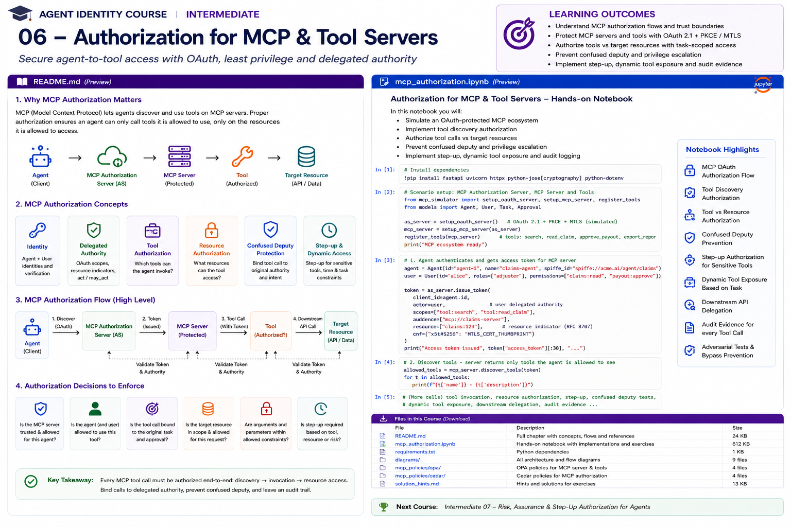

# Intermediate 06 — Authorization for MCP & Tool Servers



> **Goal:** secure the full agent-to-tool authorization path: discovery, OAuth acquisition, MCP resource access, tool invocation, target-resource access, downstream delegation, step-up and audit.

MCP has evolved quickly. This course targets the **2026-07-28 MCP specification generation**, whose authorization hardening includes OAuth issuer validation, authorization-server credential isolation, scope step-up clarifications, and a move toward Client ID Metadata Documents (CIMD). It also covers the stable **Enterprise-Managed Authorization (EMA)** extension for centrally provisioned enterprise MCP access.

---

## Learning outcomes

You will learn to:

- distinguish MCP client, protected MCP resource, authorization server and downstream API identities;
- understand OAuth Protected Resource Metadata;
- validate access-token issuer, audience/resource, expiry and scopes;
- understand Resource Indicators and why audience restriction matters;
- avoid token passthrough;
- prevent confused-deputy attacks;
- separate server authorization, tool authorization and target-resource authorization;
- model per-server and per-tool authorization;
- authorize tool discovery as well as tool invocation;
- preserve user and agent identities;
- implement task-bound agent permissions;
- perform step-up for sensitive tools;
- understand scope accumulation during MCP step-up;
- understand Client ID Metadata Documents vs legacy Dynamic Client Registration;
- understand authorization-server issuer validation;
- isolate client credentials by authorization-server issuer;
- understand Enterprise-Managed Authorization;
- secure downstream OAuth without leaking credentials through the MCP client;
- use URL-mode elicitation for server-managed third-party authorization;
- apply dynamic revocation to MCP sessions/actions;
- generate audit evidence for every sensitive tool call.

---

# 1. MCP authorization is an end-to-end problem

A simplistic model is:

```text
Agent -> MCP Server -> Tool
```

A production trust model is closer to:

```text
Human/User
    |
    v
Agent / MCP Client
    |
    | OAuth access token
    v
Protected MCP Resource
    |
    +--> Tool authorization
    |
    +--> Target resource authorization
    |
    +--> Downstream API
              |
              +--> separate delegated credential
```

There are multiple security questions:

```text
Is the client authorized to access this MCP server?
May this agent invoke this tool?
May the represented user perform the action?
May the tool access this target object?
Does the task permit it?
Does the downstream API accept this authority?
```

One bearer token check does not answer all of them.

---

# 2. Current MCP authorization architecture

For HTTP-based protected MCP servers, OAuth authorization is built around the protected-resource model.

```text
MCP Client
    |
    | discover resource metadata
    v
MCP Server / Protected Resource
    |
    | authorization_servers
    v
Authorization Server
    |
    | access token for MCP resource
    v
MCP Client
    |
    | Authorization: Bearer ...
    v
MCP Server
```

The MCP server is an OAuth **resource server**.

Do not make it accept arbitrary tokens merely because they came from a trusted identity provider.

---

# 3. Protected Resource Metadata

MCP uses OAuth 2.0 Protected Resource Metadata, standardized by RFC 9728.

A resource exposes metadata such as:

```json
{
  "resource":"https://claims-mcp.example",
  "authorization_servers":[
    "https://id.example"
  ],
  "scopes_supported":[
    "claims:read",
    "claims:update"
  ]
}
```

The current MCP Python SDK includes an RFC 9728 `ProtectedResourceMetadata` model with fields for authorization servers, scopes, JWKS, DPoP support and other protected-resource capabilities.

---

# 4. WWW-Authenticate

When authorization is required, the resource should return an HTTP authentication challenge.

Conceptually:

```http
HTTP/1.1 401 Unauthorized
WWW-Authenticate: Bearer resource_metadata="..."
```

The client discovers how to authorize from the resource metadata.

For protected MCP access, do not hide OAuth failures inside a successful MCP tool result.

---

# 5. Access-token validation

At minimum validate:

```text
signature
issuer
audience/resource
expiry
not-before where applicable
required scope
token profile
revocation/current state where applicable
```

Never:

```python
decode_without_verification(token)
```

and never authorize based only on a `scope` string from an unverified JWT.

---

# 6. Resource Indicators

OAuth Resource Indicators (RFC 8707) let a client indicate the target protected resource during authorization/token requests.

For MCP:

```text
resource = https://claims-mcp.example
```

The resulting access token should be usable for the intended MCP resource, not every service in the enterprise.

This reduces token misuse across services.

---

# 7. Audience confusion

Suppose:

```text
token aud = calendar-api
```

An MCP server must not accept it merely because:

```text
issuer is trusted
scope looks useful
```

Require the token to be intended for the MCP resource.

```text
trusted issuer
AND correct resource/audience
AND valid scope
```

---

# 8. Token passthrough is dangerous

Unsafe architecture:

```text
User token
   |
   v
MCP Client
   |
   v
MCP Server
   |
   +------ same token ------> downstream API
```

This can:

- expose downstream credentials to intermediaries;
- violate audience boundaries;
- create confused deputies;
- hide which service actually exercised authority;
- broaden credential replay impact.

The MCP security guidance has long emphasized that MCP servers must not simply accept and forward tokens not intended for them.

---

# 9. Downstream authorization

Safer:

```text
Client token
aud = claims-mcp
       |
       v
Claims MCP
       |
       | token exchange / OBO /
       | server-managed OAuth
       v
Downstream token
aud = claims-api
```

The downstream credential should be separately scoped and audience-bound.

---

# 10. Confused deputy

A classic MCP risk:

```text
attacker
  |
  | causes trusted MCP server
  | to exercise stronger authority
  v
downstream system
```

Example:

```text
Agent may call:
send_email

MCP server itself has:
mailbox.admin
```

If the MCP server uses its own broad credential without checking represented-user/task authority, the agent can turn it into a deputy.

---

# 11. Confused-deputy invariant

For delegated actions:

```text
effective authority =
user authority
∩ agent authority
∩ task authority
∩ tool policy
∩ target-resource policy
∩ downstream authority
```

Never:

```text
MCP service account can do it
therefore agent can do it
```

---

# 12. Three authorization layers

## Layer 1 — MCP resource

```text
May this client access claims-mcp?
```

## Layer 2 — tool

```text
May claims-agent call payment.create?
```

## Layer 3 — target resource

```text
May Alice + claims-agent create
a payment for claim:483?
```

These checks answer different questions.

---

# 13. Per-server authorization

If every operation is sensitive:

```text
/mcp requires OAuth
```

for all requests.

This is operationally simple.

Use when:

```text
all tools require identity
all resources are protected
anonymous discovery has no value
```

---

# 14. Per-tool authorization

Some MCP applications mix public and protected capabilities.

Example:

```text
public:
  weather.search
  docs.public_search

protected:
  calendar.read
  claims.update
  payment.create
```

The MCP Apps authorization guidance documents both per-server and per-tool approaches.

Protected operations should trigger OAuth at the HTTP authorization boundary, with defense-in-depth inside the tool handler.

---

# 15. Discovery is part of authorization

Even if invocation is protected, exposing tool names can reveal:

```text
internal capabilities
admin operations
customer systems
high-value workflows
```

Instead of:

```text
tools/list -> every tool
```

prefer context-aware discovery where appropriate:

```text
tools/list -> tools caller may reasonably use
```

Do not rely on hiding tools as the *only* enforcement. Invocation must still be authorized.

---

# 16. Tool annotations are not authorization

MCP tool annotations can describe behavior/risk hints.

Treat them as:

```text
metadata
```

not:

```text
security enforcement
```

A model or client must not decide:

```text
readOnlyHint=true -> automatically safe
```

Authorization remains server-side.

---

# 17. User identity vs agent identity

An MCP request may involve:

```text
user = Alice
agent = claims-agent
client application = desktop-agent-host
workload = spiffe://corp/prod/claims-agent
```

These identities should not be silently collapsed.

Policy may require:

```text
Alice may update claim
AND
claims-agent may update claim
AND
workload is approved for claims-agent
```

---

# 18. Agent-specific authority

Bad:

```text
Agent receives everything Alice can do.
```

Better:

```text
Alice:
claims:read
claims:update
payments:create

Claims Agent:
claims:read
claims:update

Task:
claims:read
```

Effective:

```text
claims:read
```

---

# 19. Tool-to-task binding

Tool call:

```json
{
  "tool":"claim.update",
  "arguments":{"claim_id":"483"}
}
```

Policy should verify:

```text
task = claim:483
target = claim:483
```

A prompt must not change:

```text
claim_id = 999
```

and inherit the original task authority.

---

# 20. Argument authorization

Tool authorization is not only about the tool name.

Example:

```text
payment.create
```

Arguments matter:

```text
amount
currency
account
beneficiary
claim
region
data classification
```

Policy:

```text
tool allowed
AND
amount <= approved amount
AND
beneficiary == approved beneficiary
AND
claim == task claim
```

---

# 21. Step-up authorization

Suppose the current token has:

```text
claims:read
```

The agent attempts:

```text
claims:update
```

The resource may require additional authorization.

The 2026-07-28 MCP generation clarified scope accumulation during step-up. Clients should preserve previously granted scopes when requesting additional ones rather than accidentally replacing required authority.

---

# 22. Step-up for agents

Sensitive tool:

```text
payment.create
```

may require:

```text
fresh user authentication
human approval
additional OAuth scope
fresh delegated token
higher assurance
```

Flow:

```text
tools/call
   |
   v
insufficient authority
   |
   v
authorization challenge
   |
   v
step-up
   |
   v
retry with sufficient authority
```

---

# 23. Authorization-server mix-up

MCP clients may connect to many servers backed by different authorization servers.

This increases OAuth mix-up risk.

The 2026-07-28 MCP specification hardens this by requiring clients to validate the authorization response `iss` parameter according to RFC 9207 before redeeming the authorization code.

Conceptually:

```text
expected AS = https://id.corp
returned iss = https://evil.example

-> reject
```

---

# 24. Credential isolation by issuer

Client credentials registered with:

```text
https://id-a.example
```

must not be blindly reused with:

```text
https://id-b.example
```

The 2026-07-28 MCP authorization hardening binds stored client credentials to the authorization-server issuer.

This matters greatly for:

```text
one agent host
+
hundreds of MCP servers
+
many authorization servers
```

---

# 25. Client ID Metadata Documents

MCP is moving away from Dynamic Client Registration (DCR) toward **Client ID Metadata Documents (CIMD)**.

With CIMD, the client identifier is a URL whose document describes the client.

This reduces dependence on every authorization server dynamically registering every MCP client.

The 2026-07-28 specification formally deprecates DCR in favor of CIMD, while retaining backward compatibility for now.

---

# 26. Why CIMD matters for enterprise agent hosts

A desktop/CLI/agent platform may connect to many independently operated MCP servers.

DCR can create:

```text
registration sprawl
client-secret storage
issuer-specific credentials
lifecycle complexity
```

CIMD moves toward web-hosted client metadata and a more scalable client identity model.

Enterprise governance still needs:

```text
approved clients
trusted metadata origins
redirect URI controls
software provenance
```

---

# 27. Enterprise-Managed Authorization

In June 2026, MCP's **Enterprise-Managed Authorization (EMA)** extension became stable.

EMA addresses enterprise environments where repeatedly asking every user to authorize every MCP server is operationally painful.

Conceptually:

```text
Enterprise IdP / policy
        |
        | centrally managed authorization
        v
Approved MCP servers
        |
        v
User/agent gets organization-managed access
```

This supports centrally provisioned MCP connectivity and enterprise control.

---

# 28. EMA is not "skip authorization"

Central management does not mean:

```text
everyone gets every tool
```

You still need:

```text
user policy
agent policy
tool policy
resource policy
task policy
```

EMA solves an authorization-management/provisioning problem, not fine-grained application authorization by itself.

---

# 29. Third-party OAuth

An MCP server may need access to:

```text
Google Drive
GitHub
Salesforce
Microsoft Graph
banking API
```

Do not ask the MCP client/model to collect and forward user passwords/API keys.

Use an appropriate downstream OAuth flow.

---

# 30. URL-mode elicitation

MCP introduced URL-mode elicitation to support secure out-of-band interactions such as third-party OAuth.

Conceptually:

```text
MCP server needs downstream authorization
        |
        v
returns secure authorization URL
        |
        v
user completes flow in browser
        |
        v
downstream credential goes to server-side integration
```

The MCP client does not need to receive the user's downstream credential.

This avoids token passthrough and credential collection inside prompts/chat.

---

# 31. Token storage

If the MCP server stores downstream refresh/access tokens:

```text
encrypt at rest
isolate per tenant/user
least privilege
rotate keys
audit access
support revocation
never expose to LLM context
never return in tool output
```

Credentials are control-plane secrets.

---

# 32. Sender-constrained tokens

Where supported, strengthen bearer-token security with:

```text
DPoP
mTLS
```

The RFC 9728 protected-resource metadata model can advertise capabilities such as DPoP support.

Sender-constrained credentials reduce replay if a token leaks.

---

# 33. Dynamic authorization

From Intermediate 05:

```text
authorization can change after initial access
```

MCP example:

```text
agent starts task
tools/list shows:
  claim.read
  claim.update

risk increases
tools/list now shows:
  claim.read

claim.update invocation:
  deny / step-up
```

Discovery and invocation should reflect current policy.

---

# 34. Cached tool catalogs

The 2026-07-28 MCP specification adds cache hints to list results such as `tools/list`.

This improves efficiency but creates a security design question:

```text
What if authorization changes while a tool list is cached?
```

Rule:

```text
cached discovery != cached permission to execute
```

Always authorize invocation independently.

For sensitive environments, tool-catalog cache lifetime should reflect authorization volatility.

---

# 35. Header-based routing and enforcement

The 2026-07-28 MCP specification puts method and tool names into:

```text
Mcp-Method
Mcp-Name
```

HTTP headers.

This allows gateways to route, meter and apply coarse authorization controls without deep JSON parsing.

But gateway rules are still not a replacement for target-resource authorization inside the MCP service.

---

# 36. Stateless MCP core

The 2026-07-28 MCP core is stateless at the protocol level.

Security implication:

Do not depend on hidden connection-local state for authorization.

Every request should carry or resolve enough trusted context to establish:

```text
caller
authority
task
resource
policy
```

Application workflows may remain stateful, but protocol-level authorization must survive ordinary load balancing.

---

# 37. Long-running MCP tasks

Tasks are now an extension in the 2026-07-28 generation.

A task may outlive the authorization assumptions under which it was created.

Therefore:

```text
task created at t0
```

does not imply:

```text
every later task update/action is still authorized
```

Re-authorize sensitive continuation, update and completion actions.

---

# 38. Task cancellation

Security events may require:

```text
tasks/cancel
```

or equivalent application cancellation.

Examples:

```text
delegation revoked
user disabled
agent quarantined
approval withdrawn
resource placed on hold
```

Dynamic authorization should connect to task lifecycle.

---

# 39. MCP server identity

Clients should know which server they are connecting to.

Do not authorize merely because:

```text
server name == "Corporate Claims"
```

Names and self-reported metadata are not cryptographic identity.

Trust should derive from:

```text
TLS origin
approved endpoint
enterprise registry
authorization metadata
deployment/workload identity where applicable
```

---

# 40. MCP server supply-chain governance

Enterprise registry can track:

```text
server ID
owner
endpoint
publisher
approved version
allowed authorization server
data classification
tools
risk tier
deployment identity
review status
```

Agent policy can deny unregistered MCP endpoints even if technically reachable.

---

# 41. Tool supply-chain governance

Tool definition changes can alter authority.

Example:

```text
search_claims
```

changes implementation from:

```text
read-only search
```

to:

```text
search + external export
```

Authorization based only on a stable tool name may miss semantic changes.

Track:

```text
server version
tool schema/version
risk classification
approval
```

for high-impact tools.

---

# 42. Defense in depth

Sensitive tool handler:

```python
async def payment_create(args, auth):
    require_authenticated(auth)
    require_scope(auth, "payments:create")
    require_agent_permission(auth.actor, "payment.create")
    require_task_binding(auth.task, args.claim_id)
    require_resource_permission(auth.subject, args.claim_id)
    require_approval(args.amount)
    ...
```

Even if a gateway performed coarse authorization, the handler still validates its critical invariants.

---

# 43. Error semantics

Different failures should remain distinguishable:

```text
401 -> authentication/authorization acquisition required
403 -> authenticated but insufficient authority
step-up challenge -> more authority/assurance required
tool-level validation error -> bad business arguments
```

Do not convert everything into:

```text
"Tool failed"
```

The client needs enough structured information to react safely.

---

# 44. Audit evidence

For each sensitive invocation record:

```json
{
  "decision_id":"dec:83",
  "mcp_server":"claims-mcp",
  "subject":"user:alice",
  "actor":"agent:claims",
  "client":"enterprise-agent-host",
  "tool":"payment.create",
  "target":"claim:483",
  "task":"task:483",
  "scope":["payments:create"],
  "approval_id":"apr:92",
  "policy_version":"payments-v18",
  "decision":"allow"
}
```

Never log bearer/refresh tokens.

---

# 45. Practical notebook

The notebook builds a local MCP authorization simulator covering:

1. protected-resource metadata;
2. authorization-server discovery;
3. audience/resource validation;
4. scope validation;
5. MCP resource authorization;
6. per-tool authorization;
7. tool discovery filtering;
8. target-resource authorization;
9. task binding;
10. argument constraints;
11. confused-deputy attacks;
12. token passthrough rejection;
13. downstream token exchange;
14. step-up authorization;
15. scope accumulation;
16. issuer mix-up protection;
17. issuer-bound client credentials;
18. CIMD modeling;
19. EMA enterprise policy;
20. URL-mode downstream OAuth modeling;
21. dynamic tool exposure;
22. cached-discovery safety;
23. agent quarantine;
24. audit evidence;
25. adversarial regression tests.

---

# 46. Production checklist

## MCP resource

- Is Protected Resource Metadata published?
- Are authorization servers explicit?
- Is the token intended for this resource?
- Is issuer validated?
- Is expiry validated?
- Are scopes enforced?
- Are 401/403 semantics correct?

## Client

- Is authorization-server `iss` validated?
- Are client credentials isolated by issuer?
- Is CIMD supported/planned?
- Are redirects tightly controlled?
- Are tokens stored securely?

## Agent

- Is agent identity distinct from user?
- Is agent authority bounded?
- Is workload identity verified where needed?
- Is authority task-bound?
- Can agent authority be revoked independently?

## Tools

- Is discovery filtered appropriately?
- Is invocation independently authorized?
- Are tool arguments constrained?
- Is tool schema/version governed?
- Do sensitive tools require step-up?

## Resources

- Is target-resource authorization separate?
- Is tenant isolation enforced?
- Is resource version checked for high-impact actions?

## Downstream APIs

- Is token passthrough prohibited?
- Is downstream audience separate?
- Is OBO/token exchange/server-side OAuth used appropriately?
- Are downstream secrets excluded from model context?

## Dynamic controls

- Can tool access change during execution?
- Are cached catalogs treated only as discovery?
- Can active tasks be stopped after revocation?
- Are policy changes enforced quickly?

## Evidence

- user;
- agent;
- client;
- MCP server;
- tool;
- target;
- task;
- approval;
- policy version;
- decision;
- timestamp.

---

# 47. Key takeaways

1. MCP authorization is more than adding OAuth to `/mcp`.
2. The MCP server is a protected OAuth resource and must validate token intent.
3. Resource Indicators and audience restriction reduce cross-service token misuse.
4. Never treat a trusted issuer as sufficient authorization.
5. Token passthrough creates dangerous trust-boundary violations.
6. MCP-resource, tool and target-resource authorization are distinct layers.
7. Tool arguments are part of the authorization decision.
8. Preserve user, agent, client and workload identities separately.
9. Step-up should acquire only the additional authority needed.
10. The 2026-07-28 spec hardens issuer validation and issuer-bound client credentials.
11. MCP is moving from DCR toward Client ID Metadata Documents.
12. Enterprise-Managed Authorization is now stable for centrally managed enterprise MCP access.
13. URL-mode elicitation enables server-managed third-party OAuth without exposing credentials to the MCP client.
14. Cached tool discovery never replaces invocation authorization.
15. Stateless MCP makes explicit request-time authorization context even more important.
16. Long-running MCP tasks must be re-authorized as conditions change.
17. MCP and tool supply chains belong in the enterprise authorization model.
18. Every sensitive tool invocation should leave reconstructable authorization evidence.

---

# References

- MCP 2026-07-28 specification announcement  
  https://blog.modelcontextprotocol.io/posts/2026-07-28/
- MCP Authorization  
  https://modelcontextprotocol.io/specification/2026-07-28/basic/authorization
- MCP Security Best Practices  
  https://modelcontextprotocol.io/specification/2026-07-28/basic/security_best_practices
- MCP Enterprise-Managed Authorization  
  https://blog.modelcontextprotocol.io/posts/enterprise-managed-auth/
- MCP Apps Authorization  
  https://apps.extensions.modelcontextprotocol.io/api/documents/authorization.html
- MCP TypeScript SDK — 2026-07-28 migration  
  https://ts.sdk.modelcontextprotocol.io/v2/migration/support-2026-07-28
- MCP Python SDK — OAuth Protected Resource Metadata  
  https://py.sdk.modelcontextprotocol.io/v2/api/mcp/shared/auth/
- RFC 9728 — OAuth 2.0 Protected Resource Metadata  
  https://www.rfc-editor.org/rfc/rfc9728
- RFC 8707 — Resource Indicators for OAuth 2.0  
  https://www.rfc-editor.org/rfc/rfc8707
- RFC 9207 — OAuth Authorization Server Issuer Identification  
  https://www.rfc-editor.org/rfc/rfc9207
- RFC 8693 — OAuth 2.0 Token Exchange  
  https://www.rfc-editor.org/rfc/rfc8693
- RFC 9449 — DPoP  
  https://www.rfc-editor.org/rfc/rfc9449
- RFC 8705 — OAuth Mutual TLS  
  https://www.rfc-editor.org/rfc/rfc8705

---

# Next course

## Intermediate 07 — Risk, Assurance & Step-Up Authorization for Agents

Next we make authorization sensitive to operation risk:

```text
assurance levels
transaction risk
agent risk
human approval
fresh authentication
workload attestation
step-up
progressive autonomy
policy thresholds
```
