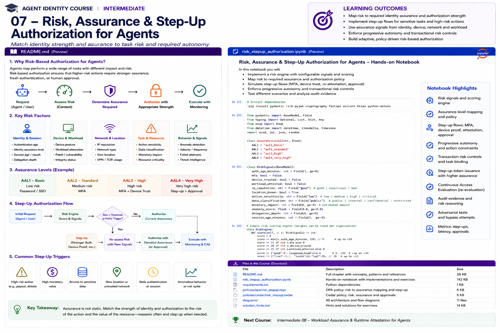

# Intermediate 07 — Risk, Assurance & Step-Up Authorization for Agents



> **Goal:** make agent authority proportional to the risk of the action and the current strength of the human, workload, task, and approval evidence.

Agent authorization should not be:

```text
authenticated -> everything allowed
```

A stronger model is:

```text
request
  -> evaluate action/resource risk
  -> inspect current assurance
  -> authorize, constrain, step-up, require approval, or deny
  -> re-evaluate as conditions change
```

This module connects **digital identity assurance**, **workload assurance**, **transaction risk**, **progressive autonomy**, and **OAuth step-up**.

---

## Learning outcomes

You will learn to:

- distinguish identity proofing, authentication assurance, federation assurance, workload assurance, and authorization risk;
- use NIST SP 800-63 Revision 4 correctly without pretending its human assurance levels are agent risk levels;
- understand AAL1/AAL2/AAL3;
- model agent/workload assurance separately from human AAL;
- use SPIFFE/SPIRE workload attestation as machine-identity evidence;
- understand RFC 9470 OAuth Step Up Authentication Challenge Protocol;
- use `acr_values`, `max_age`, `auth_time`, and `acr` correctly;
- design risk-adaptive authorization;
- implement progressive autonomy;
- bind approval to action, resource and parameters;
- distinguish step-up authentication from step-up authorization;
- prevent “MFA means safe” reasoning;
- design high-value transaction controls;
- combine identity, workload, device, task and behavioral signals;
- produce reasoned authorization evidence;
- test bypass and downgrade attacks.

---

# 1. Why agents need risk-sensitive authorization

An agent may perform:

```text
search FAQ
read claim
update claim note
send email
approve refund
change beneficiary
create payment
delete account
```

These actions do not have equal impact.

A policy such as:

```text
if authenticated:
    allow
```

ignores:

```text
action sensitivity
data sensitivity
monetary impact
irreversibility
delegation depth
current identity assurance
workload trust
behavioral anomalies
task context
```

---

# 2. Risk and assurance are different

**Risk** asks:

```text
How dangerous is it to perform this action now?
```

**Assurance** asks:

```text
How strongly do we trust the evidence supporting the identities/context?
```

Conceptually:

```text
authorization =
function(
  action risk,
  resource risk,
  human assurance,
  workload assurance,
  task assurance,
  approval assurance,
  environmental risk
)
```

---

# 3. NIST SP 800-63 Revision 4

NIST finalized **SP 800-63 Revision 4** in July 2025.

The suite includes:

```text
SP 800-63-4   Digital Identity Guidelines
SP 800-63A-4  Identity Proofing & Enrollment
SP 800-63B-4  Authentication & Authenticator Management
SP 800-63C-4  Federation & Assertions
```

Revision 4 updates the risk-management framing and includes continuous-evaluation considerations.

Important:

> NIST assurance levels primarily describe digital identity processes for people interacting with systems. Do not rename AALs into “agent assurance levels” and imply NIST standardized that mapping.

For agents, use separate workload/agent evidence and combine it with human assurance where the agent acts on behalf of a person.

---

# 4. IAL, AAL and FAL

## Identity Assurance Level — IAL

Confidence in the identity proofing process.

```text
Who is this person?
How strongly was that identity established?
```

## Authentication Assurance Level — AAL

Confidence in the authentication event/authenticators.

```text
How strongly did the subscriber authenticate?
```

## Federation Assurance Level — FAL

Requirements around federation/assertions.

```text
How is identity/authentication information securely conveyed?
```

These dimensions solve different problems.

---

# 5. Authentication Assurance Levels

NIST SP 800-63B-4 defines three authenticator assurance levels:

```text
AAL1
AAL2
AAL3
```

Do not invent:

```text
AAL4
```

as a NIST level.

For course-specific risk tiers, use names such as:

```text
R1 / R2 / R3 / R4
```

instead.

---

# 6. Agent/workload assurance

For an autonomous workload, relevant evidence can include:

```text
workload identity
deployment identity
node attestation
workload attestation
signed image provenance
approved version
runtime posture
environment
namespace/service account
agent registration status
```

This is not human AAL.

Represent it separately:

```text
human_aal = AAL2
workload_assurance = verified
agent_status = approved
```

---

# 7. SPIFFE and SPIRE

SPIFFE provides a workload identity framework built around:

```text
SPIFFE ID
SVID
Workload API
```

SPIRE is a production-ready SPIFFE implementation that performs **node and workload attestation** before issuing workload identities.

Example:

```text
spiffe://corp.example/prod/agents/claims
```

The identity says which workload is calling.

Attestation strengthens confidence that the expected workload is actually running in the expected environment.

---

# 8. Workload attestation

SPIRE workload attestation can use selectors such as:

```text
Unix UID/GID
executable path
Kubernetes namespace
Kubernetes service account
Docker properties
```

Conceptually:

```text
process
   |
   v
SPIRE Agent
   |
   | inspect workload/platform properties
   v
selectors
   |
   | match registration entry
   v
SPIFFE ID / SVID
```

---

# 9. Authentication strength is not authorization

Even perfect authentication does not imply:

```text
may transfer $100,000
```

Authentication establishes confidence about the subject.

Authorization decides whether the requested action is permitted.

Never:

```text
AAL3 -> automatically allow high-risk action
```

Instead:

```text
high-risk action
AND sufficient authentication
AND sufficient workload assurance
AND valid task
AND approval
AND resource policy
AND acceptable risk
```

---

# 10. Risk tiers

A useful enterprise taxonomy:

| Tier | Example | Default response |
|---|---|---|
| R1 | public search | autonomous |
| R2 | internal read | authenticated + authorized |
| R3 | record update | stronger context / fresh authorization |
| R4 | payment/delete/regulated release | step-up + approval or prohibit |

These are organizational risk tiers, not NIST assurance levels.

---

# 11. Risk signals

## Human identity/session

```text
AAL
authentication age
account risk
session age
device posture
location/network
```

## Agent/workload

```text
SPIFFE identity
attestation status
approved image/version
runtime environment
agent registration
quarantine status
```

## Task

```text
purpose
delegation depth
expiry
approved resources
approved actions
```

## Resource/action

```text
data classification
monetary value
irreversibility
external side effect
regulatory impact
```

## Behavior

```text
unusual tool sequence
velocity
new resource pattern
prompt-injection score
repeated denials
```

---

# 12. Risk scoring

A simple model:

```text
risk =
base_action_risk
+ resource_sensitivity
+ transaction_value
+ anomaly_score
+ stale_auth_penalty
+ untrusted_device_penalty
+ workload_penalty
+ delegation_penalty
```

Production systems may use:

```text
rules
statistical models
graph signals
threat intelligence
vendor risk engines
```

Do not hide high-impact authorization entirely inside an opaque ML score.

Use interpretable policy boundaries.

---

# 13. Policy-based response

Example:

```text
risk < 30:
    allow

30 <= risk < 60:
    constrain

60 <= risk < 80:
    step_up

risk >= 80:
    deny_or_pause
```

The exact thresholds are organization-specific.

---

# 14. Progressive autonomy

Instead of:

```text
agent autonomous = true/false
```

use levels:

```text
observe
recommend
act on low-risk operations
act with approval
act autonomously within bounded limits
```

Authority can change per task and per action.

---

# 15. Autonomy budget

An agent can have an autonomy budget:

```json
{
  "max_payment": 500,
  "max_external_messages": 3,
  "allowed_data_classification": "internal",
  "max_delegation_depth": 1,
  "expires_in_minutes": 30
}
```

Risk can reduce that budget dynamically.

---

# 16. Step-up authentication

RFC 9470 defines the **OAuth 2.0 Step Up Authentication Challenge Protocol**.

It addresses situations where a resource server determines that the authentication associated with the current access token is not strong enough or recent enough.

The resource can challenge the client with additional authentication requirements.

---

# 17. RFC 9470 concepts

The resource server can signal:

```text
insufficient_user_authentication
```

and indicate requirements such as:

```text
acr_values
max_age
```

The client can then initiate authorization requesting the required authentication properties.

---

# 18. Authentication Context Class Reference

`acr` communicates an authentication context/class.

Example conceptually:

```json
{
  "acr":"urn:example:high-assurance"
}
```

Do not assume that an arbitrary `acr` string means NIST AAL2/AAL3.

The meaning depends on the authorization server/trust framework.

---

# 19. `auth_time`

`auth_time` records when the user authentication occurred.

A sensitive operation might require:

```text
authentication age <= 5 minutes
```

A token may be unexpired but the authentication event may be too old for the operation.

---

# 20. `max_age`

During step-up, the client can request fresh authentication using `max_age`.

Conceptually:

```text
max_age=300
```

means the authorization server must ensure the user's authentication is recent enough for the requested flow.

---

# 21. Step-up flow

```text
Agent client
    |
    | token
    v
Resource
    |
    | current authentication insufficient
    v
OAuth step-up challenge
    |
    v
Authorization Server
    |
    | stronger/fresher authentication
    v
new token/assertion
    |
    v
Resource re-evaluates authorization
```

Step-up does not itself guarantee the action is authorized.

---

# 22. Step-up authentication vs authorization

These are distinct:

```text
Step-up authentication:
prove user identity more strongly/freshly

Step-up authorization:
obtain additional permission/approval
```

A high-risk action may need both:

```text
fresh strong user authentication
+
manager approval
+
additional OAuth scope
```

---

# 23. Step-up workload assurance

Agents may need machine-side step-up too.

Examples:

```text
fresh workload attestation
new SVID
verified deployment digest
trusted execution evidence
restarted clean workload
approved runtime
```

Do not call these NIST AAL.

They are workload-assurance controls.

---

# 24. Multi-dimensional assurance

A useful decision record:

```json
{
  "human": {
    "aal":"AAL2",
    "auth_age_seconds":120
  },
  "workload": {
    "spiffe_id":"spiffe://corp/prod/claims-agent",
    "attested":true,
    "image_approved":true
  },
  "task": {
    "approved":true,
    "expires_in":900
  },
  "approval": {
    "present":false
  }
}
```

Policy reasons over dimensions rather than collapsing everything into one “trust score.”

---

# 25. Transaction risk

A payment tool should consider:

```text
amount
currency
beneficiary
new beneficiary?
destination country
velocity
user history
claim/invoice amount
approval
```

Example:

```text
$20 refund -> autonomous
$500 refund -> approval
$50,000 transfer -> agent prohibited
```

---

# 26. Parameter-bound authorization

Approval:

```text
approve payment.create
```

is too broad.

Better:

```json
{
  "tool":"payment.create",
  "claim":"claim:483",
  "amount":300,
  "beneficiary":"vendor:17",
  "expires_at":"..."
}
```

If parameters change, step-up/approval must be reconsidered.

---

# 27. New beneficiary

Risk can change without the tool changing.

```text
payment.create
amount = $300
existing beneficiary -> R2/R3

payment.create
amount = $300
new beneficiary -> R4
```

Authorization needs transaction context.

---

# 28. Authentication age

Example policy:

```text
read claim:
  auth age <= 8 hours

update bank details:
  auth age <= 10 minutes

large payment:
  auth age <= 5 minutes
```

Again, these are organizational policies.

---

# 29. Device posture

For a human-delegated agent session:

```text
managed compliant device -> lower risk
unknown device -> higher risk
compromised device -> deny
```

Device posture is one input, not proof of business authorization.

---

# 30. Network/location

Signals might include:

```text
known corporate network
new ASN
unexpected country
TOR/VPN
impossible travel
```

Use carefully. Location signals can be noisy and should not automatically override stronger evidence without policy justification.

---

# 31. Agent behavioral risk

Agent-specific anomalies:

```text
sudden increase in tool calls
accessing unrelated resources
repeated forbidden tool attempts
unexpected delegation
attempting credential retrieval
retrieving excessive sensitive context
prompt-injection indicators
```

Policy can reduce autonomy immediately.

---

# 32. Prompt-injection response

If injection risk rises:

```text
do not merely tell the model to ignore it
```

Enforcement can:

```text
remove write tools
restrict retrieval
disable external messaging
require human approval
terminate task
```

This turns detection into authorization.

---

# 33. Delegation risk

Authority becomes harder to reason about with depth:

```text
Alice
  -> Agent A
      -> Agent B
          -> Agent C
```

Risk controls may impose:

```text
max delegation depth
no redelegation for high-risk actions
fresh approval at boundary
attenuated scopes
```

---

# 34. Human approval

Human-in-the-loop is meaningful only if the human sees enough context.

Approval UI should show:

```text
agent
action
target
parameters
reason
risk
source task
data affected
irreversibility
```

A button saying:

```text
Approve?
```

without context is weak control.

---

# 35. Approval fatigue

Do not require approval for every trivial action.

That creates:

```text
rubber stamping
slow workflows
poor security signal
```

Use risk-based approval and progressive autonomy.

---

# 36. Separation of duties

High-risk actions may require:

```text
requester != approver
```

or:

```text
agent cannot both create and approve payment
```

Agent workflows must preserve enterprise SoD rules rather than automating around them.

---

# 37. Deny ceiling

Some actions should remain prohibited for agents regardless of assurance.

Example:

```text
change enterprise root keys
approve own exception
disable audit logging
modify own identity policy
```

More authentication does not make every action acceptable.

---

# 38. Assurance downgrade

If workload assurance changes:

```text
approved -> unknown
```

or human session assurance drops:

```text
fresh -> stale
```

the agent should not retain high-risk authority indefinitely.

Combine this module with Continuous Access Evaluation from Intermediate 05.

---

# 39. Freshness

Different evidence has different freshness:

```text
human authentication
device posture
workload attestation
risk score
approval
task lease
resource state
```

Authorization should define acceptable age per evidence type.

---

# 40. Policy matrix

Example:

| Action | Risk | Human | Workload | Approval |
|---|---:|---|---|---|
| FAQ search | R1 | optional | identified | no |
| claim read | R2 | AAL1/2 policy-dependent | verified | no |
| claim update | R3 | fresh AAL2 | attested | maybe |
| payment | R4 | strong/fresh auth policy | attested+approved runtime | yes |
| root policy change | prohibited | — | — | agent denied |

This is an example architecture, not a NIST-prescribed mapping.

---

# 41. Reason codes

A decision should explain:

```text
STEP_UP
reason:
  action_risk=R4
  auth_age=47m
  required_auth_age<=5m
  approval_missing=true
```

Explainability matters for:

```text
user experience
operations
audit
policy debugging
incident response
```

---

# 42. Risk engine architecture

```text
Identity Signals -----\
Workload Signals ------\
Task Signals -----------\
Resource Signals --------> Risk + Policy Engine
Behavior Signals -------/          |
Threat Signals --------/           v
                           allow / constrain
                           step-up / approve
                           deny / revoke
```

Keep deterministic policy around high-impact boundaries.

---

# 43. OAuth step-up + agent approval

A robust flow can be:

```text
agent requests payment
       |
       v
risk engine -> R4
       |
       +--> require fresh user auth
       |
       +--> require approval
       |
       +--> require payment scope
       |
       v
issue bounded authorization
       |
       v
execute exact approved transaction
```

---

# 44. Step-up token

A post-step-up credential should not become a permanent super-token.

Prefer:

```text
short TTL
narrow audience
narrow scope
task binding
transaction binding where possible
```

---

# 45. Replay resistance

For high-value actions consider sender-constrained credentials:

```text
DPoP
mTLS
```

and one-time/transaction-bound approval artifacts.

If a high-assurance token is stolen, broad replay can undermine the entire step-up process.

---

# 46. Audit evidence

Record:

```json
{
  "decision_id":"dec:1007",
  "user":"alice",
  "agent":"claims-agent",
  "action":"payment.create",
  "resource":"claim:483",
  "risk_tier":"R4",
  "risk_score":72,
  "human_aal":"AAL2",
  "auth_age_seconds":95,
  "workload_attested":true,
  "approval":"apr:92",
  "response":"allow_after_step_up",
  "policy_version":"risk-v7"
}
```

Never log authenticators or bearer tokens.

---

# 47. Practical notebook

The notebook implements:

1. risk signals;
2. risk scoring;
3. R1-R4 classification;
4. human assurance;
5. workload assurance;
6. authentication age;
7. action sensitivity;
8. transaction value;
9. new-beneficiary risk;
10. delegation risk;
11. anomaly risk;
12. progressive autonomy;
13. RFC 9470-style challenges;
14. `acr_values`;
15. `max_age`;
16. fresh authentication;
17. step-up authorization;
18. human approval;
19. workload re-attestation;
20. parameter-bound approvals;
21. dynamic authority reduction;
22. deny ceilings;
23. decision reasons;
24. audit evidence;
25. bypass tests.

---

# 48. Production checklist

## Human assurance

- What AAL is actually established?
- How old is authentication?
- What `acr` semantics are trusted?
- Does the operation require fresh authentication?
- Is the authenticator phishing-resistant where required?

## Workload

- Is workload identity verified?
- Was workload attested?
- Is the deployment approved?
- Is runtime posture current?
- Is the agent quarantined?

## Risk

- Is the action classified?
- Is the resource classified?
- Is monetary impact included?
- Are anomaly signals included?
- Is delegation depth included?

## Step-up

- Is RFC 9470 supported where appropriate?
- Are `acr_values` understood by the IdP?
- Is `max_age` enforced?
- Is additional authorization scoped narrowly?
- Does step-up expire quickly?

## Approval

- Is approval bound to exact parameters?
- Does the approver see sufficient context?
- Is separation of duties preserved?
- Does approval expire?
- Can approval be revoked?

## Autonomy

- What can the agent do without approval?
- What changes at higher risk?
- Are there absolute deny ceilings?
- Can authority be reduced dynamically?

## Evidence

- risk inputs;
- assurance inputs;
- reason codes;
- policy version;
- approval;
- step-up event;
- final decision.

---

# 49. Key takeaways

1. Risk and assurance are different dimensions.
2. NIST SP 800-63 Rev. 4 defines human digital identity assurance concepts; do not invent NIST agent AALs.
3. NIST authentication assurance has AAL1, AAL2 and AAL3—not AAL4.
4. Workload assurance should be modeled separately from human AAL.
5. SPIFFE/SPIRE provides useful workload identity and attestation evidence.
6. Strong authentication does not imply authorization.
7. RFC 9470 standardizes an OAuth step-up authentication challenge.
8. `auth_time` and `max_age` make authentication freshness enforceable.
9. Step-up authentication and step-up authorization are distinct.
10. High-risk actions may need fresh authentication, approval and narrow additional authority.
11. Tool arguments and transaction properties change risk.
12. Progressive autonomy is safer than a global autonomous/non-autonomous flag.
13. Human approval must be contextual and parameter-bound.
14. Some actions should remain prohibited regardless of assurance.
15. Risk signals should drive deterministic enforcement, not only dashboards.
16. High-assurance credentials should be short-lived and narrowly scoped.
17. Assurance freshness must be continuously reconsidered.

---

# References

- NIST SP 800-63-4 — Digital Identity Guidelines  
  https://csrc.nist.gov/pubs/sp/800/63/4/final
- NIST SP 800-63A-4 — Identity Proofing and Enrollment  
  https://csrc.nist.gov/pubs/sp/800/63/A/4/final
- NIST SP 800-63B-4 — Authentication and Authenticator Management  
  https://csrc.nist.gov/pubs/sp/800/63/B/4/final
- NIST SP 800-63C-4 — Federation and Assertions  
  https://csrc.nist.gov/pubs/sp/800/63/C/4/final
- RFC 9470 — OAuth 2.0 Step Up Authentication Challenge Protocol  
  https://www.rfc-editor.org/rfc/rfc9470
- RFC 9449 — OAuth DPoP  
  https://www.rfc-editor.org/rfc/rfc9449
- RFC 8705 — OAuth Mutual TLS  
  https://www.rfc-editor.org/rfc/rfc8705
- SPIFFE Specifications  
  https://spiffe.io/docs/latest/spiffe-specs/spiffe/
- SPIRE Concepts  
  https://spiffe.io/docs/latest/spire-about/spire-concepts/
- SPIRE Workload Attestation  
  https://spiffe.io/docs/latest/deploying/configuring/

---

# Next course

## Intermediate 08 — Workload Assurance & Runtime Attestation for Agents

Next we move deeper into machine identity:

```text
SPIFFE/SPIRE
node attestation
workload attestation
SVIDs
Kubernetes workload identity
runtime provenance
image identity
attestation freshness
agent-to-workload binding
credential rotation
runtime policy
```
