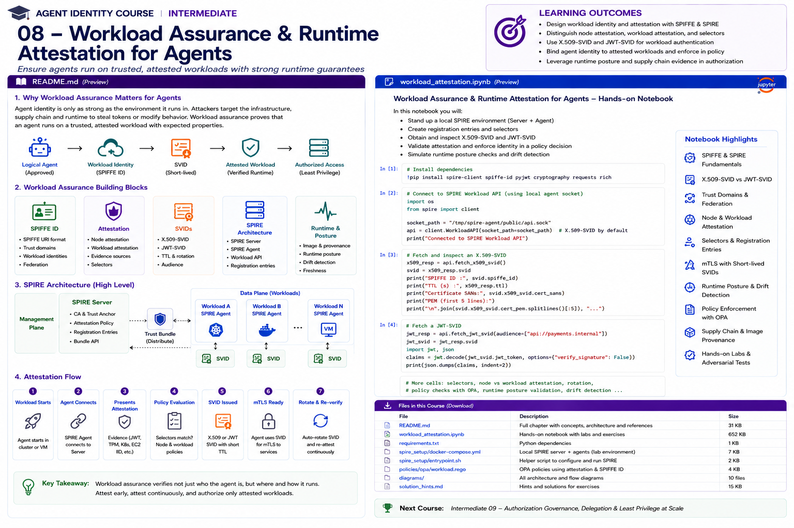

# Intermediate 08 — Workload Assurance & Runtime Attestation for Agents



> **Goal:** bind logical agent identity to a cryptographically identifiable, attested workload and make runtime/supply-chain evidence part of authorization.

An agent can have a perfectly designed logical identity and still be unsafe if its runtime has been replaced, moved to an untrusted environment, or launched from an unapproved artifact.

The core idea is:

```text
logical agent identity
        +
workload identity
        +
attestation
        +
artifact provenance
        +
runtime posture
        ↓
authorization decision
```

This course uses **SPIFFE/SPIRE** as the primary workload-identity model and connects it to **SLSA 1.2**, Sigstore/Cosign, Kubernetes identity, policy engines, and agent authorization.

---

## Learning outcomes

You will learn to:

- distinguish logical agent identity from workload/process identity;
- design SPIFFE IDs and trust domains;
- understand SPIFFE SVIDs and the Workload API;
- compare X.509-SVID, JWT-SVID and emerging WIT-SVID concepts;
- understand SPIRE Server, SPIRE Agent and registration entries;
- distinguish node attestation from workload attestation;
- reason about selectors and workload identity issuance;
- use short-lived credentials and automatic rotation;
- use X.509-SVIDs for mTLS;
- understand JWT-SVID audience binding and replay risk;
- design trust-domain federation;
- bind an approved agent definition to a workload identity;
- incorporate image digest and build provenance into runtime policy;
- understand SLSA 1.2 Build and Source tracks;
- use Sigstore/Cosign concepts for artifact verification;
- detect runtime drift;
- model attestation freshness;
- avoid treating workload authentication as authorization;
- produce evidence for workload-aware agent decisions.

---

# 1. Agent identity is not enough

Suppose the control plane says:

```text
agent = claims-agent
status = approved
tools = claims.read, claims.update
```

But the running process is:

```text
unknown container
unapproved image
unexpected namespace
compromised node
stolen token
```

The logical identity alone is insufficient.

A production system needs to answer:

```text
What code is actually running?
Where is it running?
Which workload received this identity?
How was the workload attested?
Is the identity still fresh?
Is this artifact approved?
Has runtime posture changed?
```

---

# 2. Identity layers

A useful model:

```text
Human identity
      |
      | delegates
      v
Logical Agent Identity
      |
      | deployed as
      v
Workload / Runtime Identity
      |
      | executes
      v
Process / Container / Pod
```

Do not collapse these identities.

Example:

```text
human:alice
agent:claims-agent
spiffe://corp.example/prod/agents/claims-agent
k8s:prod/claims/claims-agent-sa
image:sha256:abc...
```

Each identifier answers a different question.

---

# 3. SPIFFE

SPIFFE is a set of standards for securely identifying software systems across dynamic and heterogeneous environments.

Its core concepts include:

```text
SPIFFE ID
SVID
Workload API
Trust Domain
Trust Bundle
Federation
```

SPIFFE itself is a standard. **SPIRE** is a production implementation of SPIFFE.

---

# 4. SPIFFE ID

A SPIFFE ID is a URI:

```text
spiffe://trust-domain/path
```

Example:

```text
spiffe://corp.example/prod/agents/claims-agent
```

The trust domain is an identity namespace backed by an issuing authority.

A path can encode organization-specific workload semantics, but avoid packing volatile attributes into the identity.

---

# 5. Trust domain

Example:

```text
spiffe://corp.example
```

A trust domain establishes:

```text
identity namespace
issuing authority
cryptographic trust anchor
administrative boundary
```

Possible designs:

```text
one trust domain per company
one per environment
one per business boundary
```

Trade-offs matter.

Too broad:

```text
prod and dev share trust unexpectedly
```

Too fragmented:

```text
federation and operations become complex
```

---

# 6. SPIFFE trust bundles

A trust bundle contains public key material used to validate SVIDs belonging to a trust domain.

Conceptually:

```text
trust domain
    |
    v
bundle
    |
    +-- current signing keys
    +-- rotation overlap keys
```

Bundles change over time as authorities rotate keys.

Validators must preserve the binding:

```text
trust domain -> correct bundle
```

---

# 7. SVID

An SVID — SPIFFE Verifiable Identity Document — lets a workload cryptographically prove a SPIFFE identity.

Current SPIFFE standards expose profiles for:

```text
X.509-SVID
JWT-SVID
WIT-SVID
```

The Workload API specification requires X.509-SVID and JWT-SVID profiles; WIT-SVID is optional in the current standard.

This course concentrates operationally on X.509-SVID and JWT-SVID, while introducing WIT-SVID as a newer specification surface.

---

# 8. X.509-SVID

An X.509-SVID encodes a SPIFFE identity in an X.509 certificate.

Typical use:

```text
workload A
    |
    | mTLS
    v
workload B
```

Benefits:

```text
mutual authentication
short-lived certificate
private key remains workload-local
strong channel binding
less bearer-token replay exposure
```

SPIFFE guidance generally prefers X.509-SVID where the architecture supports it.

---

# 9. JWT-SVID

JWT-SVID is useful where an X.509/mTLS path is impractical.

Example:

```text
agent
  |
  | JWT-SVID
  v
HTTP gateway
```

JWT-SVIDs are bearer credentials.

Therefore:

```text
stolen JWT-SVID -> possible replay until expiry
```

Use:

```text
short TTL
correct audience
secure transport
minimal exposure
```

---

# 10. Audience binding

A JWT-SVID should be requested for the intended audience.

Example:

```text
aud = payments-api
```

A resource must not accept:

```text
aud = claims-api
```

simply because the SPIFFE ID is trusted.

Identity authentication and token intent are both required.

---

# 11. X.509-SVID vs JWT-SVID

| Property | X.509-SVID | JWT-SVID |
|---|---|---|
| Typical use | mTLS | bearer authentication |
| Private key | used directly | signer-side issuance |
| Replay | lower when key/channel protected | bearer replay concern |
| Audience | peer identity/trust | explicit audience |
| Rotation | streamed/renewed | obtain new JWT |
| Proxy friendliness | architecture-dependent | often easier |
| Preferred | when mTLS fits | when token form is necessary |

---

# 12. SPIFFE Workload API

The Workload API is how workloads obtain SPIFFE identity material.

It is commonly exposed locally, for example over a Unix domain socket.

Important security property:

> The workload does not authenticate to the Workload API by presenting a long-lived bootstrap secret.

Instead, the implementation identifies the caller out-of-band.

SPIRE can inspect properties of the calling workload and match them against registration policy.

---

# 13. Streaming rotation

The Workload API can stream updated identity material.

This enables:

```text
short-lived SVID
automatic renewal
trust-bundle updates
root/intermediate rotation
```

Applications should consume updates rather than assume credentials are static.

---

# 14. SPIRE architecture

```text
                  SPIRE Server
                 /     |      \
        CA / signing   |    registration
                       |
                attested nodes
                       |
             +---------+---------+
             |                   |
        SPIRE Agent          SPIRE Agent
             |                   |
      Workload API          Workload API
         /     \                 |
      Agent A  Agent B         Agent C
```

SPIRE separates control-plane issuance policy from workload-local identity delivery.

---

# 15. Node attestation

Before a SPIRE Agent can participate, the SPIRE Server needs confidence in the node on which it runs.

Node attestation answers:

```text
Why should the server trust this node/agent?
```

Evidence can depend on platform:

```text
cloud instance identity
Kubernetes identity
TPM
platform-specific attestation
```

Exact plugins and evidence vary by deployment.

---

# 16. Workload attestation

After the node is trusted, the local SPIRE Agent identifies workloads requesting identity.

Workload attestation answers:

```text
Which process/workload is calling the Workload API?
```

Possible selectors include platform/runtime properties such as:

```text
Unix process attributes
Kubernetes namespace
Kubernetes service account
container properties
```

The selector set is matched against identity registration policy.

---

# 17. Registration entries

Conceptually:

```text
selectors:
  k8s:namespace:claims
  k8s:service-account:claims-agent

-> SPIFFE ID:
  spiffe://corp.example/prod/agents/claims-agent
```

The identity is not granted because the workload claims:

```text
"I am claims-agent"
```

It is granted because trusted observed properties match policy.

---

# 18. Selectors are security policy

Weak selector:

```text
namespace = default
```

may identify too many workloads.

Stronger combination:

```text
namespace = claims
service account = claims-agent
cluster = prod
```

The exact selector design should reflect the platform threat model.

---

# 19. Kubernetes service accounts

Kubernetes service accounts can be useful workload attributes, but:

```text
Kubernetes service account != globally portable workload identity
```

SPIFFE provides a common identity namespace across heterogeneous systems.

A deployment may map:

```text
Kubernetes workload properties
        ↓ attestation
SPIFFE identity
```

---

# 20. Agent-to-workload binding

An enterprise agent registry might contain:

```json
{
  "agent_id":"claims-agent",
  "approved_spiffe_ids":[
    "spiffe://corp.example/prod/agents/claims-agent"
  ]
}
```

Authorization can require:

```text
logical agent = claims-agent
AND
presented workload = approved SPIFFE ID
```

This prevents an arbitrary workload from simply asserting the logical agent name.

---

# 21. Workload identity is not authorization

SPIFFE proves:

```text
this is workload X
```

It does not prove:

```text
workload X may transfer money
```

Authorization still needs:

```text
principal
action
resource
task
delegation
risk
approval
```

---

# 22. Short-lived identity

Short-lived credentials reduce the useful lifetime of stolen identity material.

Desired model:

```text
attest
  ↓
short-lived SVID
  ↓
use
  ↓
rotate automatically
  ↓
re-evaluate continuously
```

Avoid converting SPIFFE into:

```text
issue certificate once
copy it into secret store
use for six months
```

---

# 23. Rotation

Applications need to handle rotation safely.

For X.509:

```text
new SVID arrives
new connections use new identity
existing connections age out appropriately
trust bundles update
```

For JWT:

```text
request a fresh JWT-SVID for the target audience
```

Do not hard-code leaf certificate fingerprints as workload identity.

---

# 24. Revocation reality

Short-lived credentials intentionally reduce dependence on conventional revocation mechanisms.

Operational response often includes:

```text
remove/change registration
quarantine workload
stop issuance
terminate sessions/connections where required
wait only a bounded credential lifetime
```

For high-risk agent systems, combine short TTL with active session/task controls.

---

# 25. Attestation freshness

An identity issued after valid attestation does not mean runtime conditions remain valid forever.

Model:

```text
identity_valid
AND attestation_age <= threshold
AND runtime_posture == acceptable
```

The threshold should depend on action risk.

---

# 26. Runtime drift

Examples:

```text
image changed
deployment moved namespace
service account changed
debug container attached
unexpected executable
configuration changed
node trust degraded
agent version no longer approved
```

Runtime drift can reduce or revoke authority.

---

# 27. Artifact identity

A container tag is mutable:

```text
claims-agent:latest
```

A digest is content-addressed:

```text
sha256:...
```

High-assurance deployment policy should prefer immutable artifact identity.

---

# 28. Supply-chain provenance

Runtime identity answers:

```text
what workload is running?
```

Provenance answers:

```text
where did this artifact come from?
how was it built?
what source/build process produced it?
```

These are complementary.

---

# 29. SLSA 1.2

The current approved SLSA specification is **v1.2**.

It contains separate tracks, including:

```text
Build Track
Source Track
```

The Build Track has:

```text
Build L0 — no guarantees
Build L1 — provenance exists
Build L2 — signed provenance from hosted build platform
Build L3 — hardened build platform
```

The Source Track adds controls around source history, provenance and change-management processes.

---

# 30. SLSA provenance

Provenance is verifiable information describing where, when and how an artifact was produced.

For agent runtimes it can support policy such as:

```text
artifact digest matches
builder is approved
source repository is approved
build type is expected
external parameters are acceptable
provenance signature verifies
```

---

# 31. Provenance must be verified

Having an attestation file next to an image is not enough.

Verification should establish:

```text
artifact digest matches subject
attestation signature is trusted
builder identity is expected
build parameters are expected
source is expected
```

Then policy decides whether the result is acceptable.

---

# 32. Sigstore and Cosign

Sigstore/Cosign provides tooling for signing and verifying artifacts such as container images and attestations.

A production gate may verify:

```text
signature
signer identity
transparency evidence where applicable
attestation
artifact digest
```

before allowing deployment.

---

# 33. Keyless signing

Sigstore supports keyless workflows based on short-lived certificates tied to an authenticated identity.

This reduces long-lived signing-key management, but policy must still validate:

```text
expected issuer
expected signer identity
artifact
signature
attestation
```

“Signature valid” alone is not sufficient.

---

# 34. Admission-time verification

One architecture:

```text
CI build
  ↓
artifact + provenance + signature
  ↓
registry
  ↓
admission policy
  ↓
verify artifact/provenance
  ↓
allow workload
```

Then runtime workload identity establishes which approved workload is actually communicating.

---

# 35. Runtime verification

Admission-time checks answer:

```text
was this workload allowed to start?
```

Runtime checks answer:

```text
is this still the expected workload now?
```

For sensitive agents, use both.

---

# 36. Agent version policy

Agent identity may be stable:

```text
claims-agent
```

while code versions change:

```text
v4.1
v4.2
v4.3
```

Registry policy can bind:

```text
agent identity
+
approved image digest
+
approved model/tool configuration version
```

---

# 37. Model/configuration provenance

Agent behavior is not only application code.

Important artifacts may include:

```text
system prompt
policy bundle
tool catalog
model identifier
MCP server allowlist
retrieval configuration
guardrail configuration
```

For high-impact agents, these should have versioned identity and provenance too.

---

# 38. Runtime posture object

Example:

```json
{
  "spiffe_id":"spiffe://corp.example/prod/agents/claims-agent",
  "image_digest":"sha256:...",
  "image_verified":true,
  "provenance_verified":true,
  "namespace":"claims",
  "service_account":"claims-agent",
  "node_attested":true,
  "workload_attested":true,
  "agent_version":"4.3.1",
  "policy_version":"19",
  "observed_at":"..."
}
```

This can become trusted authorization context after verification.

---

# 39. Policy example

```text
allow claim.update if:

logical_agent == claims-agent
AND
spiffe_id == approved workload
AND
workload_attested
AND
image_digest in approved_images
AND
provenance_verified
AND
runtime_posture_fresh
AND
task permits claim.update
AND
user may update claim
```

---

# 40. Cross-trust-domain federation

Suppose:

```text
spiffe://company.example
```

must communicate with:

```text
spiffe://partner.example
```

SPIFFE Federation exchanges trust bundles so workloads can authenticate SVIDs from foreign trust domains.

Federation does not mean:

```text
trust every identity in partner.example
```

It means:

```text
cryptographically authenticate identities from partner trust domain
```

Authorization still decides which foreign identities are allowed.

---

# 41. Bundle endpoints

SPIFFE Federation defines bundle endpoints for exchanging trust-domain bundles.

The current specification supports HTTPS profiles including:

```text
https_web
https_spiffe
```

Trust-domain/bundle binding must be preserved.

---

# 42. Federation lifecycle

Treat federation as a managed relationship:

```text
establish
maintain
rotate
monitor
terminate
```

Enterprise governance should know:

```text
who approved federation
which trust domains
which identities
which services
expiry/review date
```

---

# 43. Trust-domain isolation

Avoid reusing authoritative keys across unrelated trust domains.

For example:

```text
dev
prod
```

should not accidentally become cryptographically indistinguishable.

Isolation should survive:

```text
key rotation
bundle distribution
federation
incident response
```

---

# 44. X.509 identity verification

A verifier needs to check:

```text
certificate chain
trust bundle
validity period
SPIFFE ID SAN
expected trust domain
expected workload identity
```

Then authorization maps the identity to permitted actions.

---

# 45. JWT-SVID verification

Validate:

```text
signature
trust domain
subject SPIFFE ID
audience
expiry
required claims
```

Never:

```python
jwt.decode(token, options={"verify_signature": False})
```

for security decisions.

---

# 46. Workload API security

The local Workload API is highly sensitive because it can deliver identity material.

Protect:

```text
socket permissions
host isolation
container mounts
sidecar boundaries
debug access
privileged processes
```

Do not expose the Workload API broadly over an untrusted network.

---

# 47. Sidecar and proxy architectures

A workload may use SPIFFE directly or through infrastructure such as a proxy/service mesh.

Ask:

```text
Which component owns the private key?
Which component authenticates the peer?
How is authenticated identity conveyed to the application?
Can headers be spoofed?
Where does authorization occur?
```

Avoid trusting an identity header unless the application knows it came from a trusted authentication proxy.

---

# 48. Agent gateways

For agent systems:

```text
Agent Runtime
    |
    | X.509-SVID / JWT-SVID
    v
Agent Gateway
    |
    | verified workload identity
    v
Authorization Engine
    |
    v
MCP / API / Tool
```

The gateway can enrich policy input with verified workload context.

---

# 49. Identity propagation

Do not propagate:

```text
X-Agent-Identity: claims-agent
```

through arbitrary networks and trust it everywhere.

Instead:

```text
authenticate workload cryptographically
derive trusted identity
propagate only through protected trusted hops
or re-authenticate at each boundary
```

---

# 50. Attestation vs provenance

**Attestation** in SPIRE context:

```text
evidence used to identify/trust node or workload
```

**Software supply-chain attestation**:

```text
signed statement about artifact/build/source properties
```

They are related but not interchangeable.

A strong architecture combines them.

---

# 51. Trust chain for an enterprise agent

```text
Source controls
     ↓
Build provenance
     ↓
Artifact signature
     ↓
Admission verification
     ↓
Node attestation
     ↓
Workload attestation
     ↓
SPIFFE SVID
     ↓
Peer authentication
     ↓
Agent/workload binding
     ↓
Authorization
```

No single layer replaces the others.

---

# 52. Runtime compromise

If an already-attested workload is compromised, valid identity may still be available temporarily.

Therefore workload identity is not endpoint security.

Combine with:

```text
runtime detection
least privilege
short SVID lifetime
network policy
behavior monitoring
continuous authorization
rapid quarantine
```

---

# 53. Quarantine

If posture changes:

```text
agent_status = quarantined
```

Policy should immediately reduce authority even if an SVID remains cryptographically valid.

Example:

```text
valid SVID
+
quarantined agent
=
DENY
```

Authentication validity and operational trust are different.

---

# 54. Agent identity registry

Example record:

```json
{
  "agent_id":"claims-agent",
  "owner":"claims-platform",
  "environment":"prod",
  "allowed_spiffe_ids":[
    "spiffe://corp.example/prod/agents/claims-agent"
  ],
  "approved_images":[
    "sha256:..."
  ],
  "required_provenance":"SLSA_BUILD_L2+",
  "required_runtime_assurance":"attested"
}
```

This bridges governance identity and runtime identity.

---

# 55. Evidence freshness

Different evidence rotates at different speeds:

```text
SVID                minutes/hours
runtime posture     seconds/minutes
image approval      release lifecycle
provenance          artifact lifecycle
agent registration  governance lifecycle
task authority      task lifecycle
```

Policy should not treat all evidence as equally fresh.

---

# 56. Practical notebook

The notebook covers:

1. SPIFFE ID parsing;
2. trust domains;
3. workload registration;
4. node/workload attestation concepts;
5. selector matching;
6. simulated X.509-SVID issuance;
7. mTLS identity verification concepts;
8. JWT-SVID issuance and audience validation;
9. replay-risk demonstration;
10. Workload API-style rotation;
11. logical-agent/workload binding;
12. artifact digest verification;
13. SLSA provenance checks;
14. Sigstore/Cosign policy modeling;
15. runtime posture;
16. drift detection;
17. freshness;
18. federation;
19. workload-aware authorization;
20. quarantine;
21. adversarial tests;
22. real SPIRE deployment exercises.

---

# 57. Production checklist

## Identity

- Is every production agent workload uniquely identifiable?
- Is logical agent identity separate from workload identity?
- Are SPIFFE IDs stable and meaningful?
- Are trust domains intentional?

## Attestation

- How is the node attested?
- How is the workload attested?
- Are selectors sufficiently specific?
- Can an unrelated workload match the same registration?

## Credentials

- Are SVIDs short-lived?
- Is rotation automatic?
- Is X.509-SVID preferred where appropriate?
- Are JWT-SVID audiences validated?
- Is the Workload API protected locally?

## Supply chain

- Is the artifact digest immutable?
- Is provenance available?
- Is provenance verified?
- Is the builder trusted?
- Is the signer identity expected?
- Are unapproved images blocked?

## Runtime

- Is posture monitored?
- Is drift detected?
- Is evidence fresh enough?
- Can a workload be quarantined quickly?
- Are active sessions/tasks affected by quarantine?

## Authorization

- Is SPIFFE identity mapped to the logical agent?
- Does workload authentication remain separate from authorization?
- Are task/user/resource checks still performed?
- Are high-risk actions gated on stronger runtime evidence?

## Federation

- Are foreign trust domains explicit?
- Are bundles refreshed?
- Is federation reviewed?
- Are foreign identities still subject to authorization?

---

# 58. Key takeaways

1. Logical agent identity and runtime workload identity are different.
2. SPIFFE provides portable workload identity standards; SPIRE implements them.
3. SPIFFE IDs live inside trust domains.
4. SVIDs provide cryptographically verifiable workload identity.
5. X.509-SVID is generally preferable where mTLS architecture fits.
6. JWT-SVIDs require strict audience validation and have bearer replay concerns.
7. The Workload API enables short-lived identity and automatic rotation.
8. Node attestation and workload attestation solve different bootstrap problems.
9. Selector quality directly affects identity security.
10. Workload identity authenticates a workload; it does not authorize business actions.
11. Bind logical agent identity to approved workload identities.
12. Artifact digest and provenance strengthen confidence in what code is running.
13. SLSA 1.2 separates Build and Source security tracks.
14. Provenance must be verified against expectations to have security value.
15. Sigstore/Cosign can support artifact/signature/attestation verification.
16. Admission-time verification and runtime assurance are complementary.
17. Federation establishes cross-domain authentication, not blanket authorization.
18. Runtime drift and compromise require continuous authorization and quarantine.
19. SVID validity and operational trust are different.
20. High-assurance agent systems need a chain from source and build to runtime identity and authorization.

---

# References

- SPIFFE Standard  
  https://spiffe.io/docs/latest/spiffe-specs/spiffe/
- SPIFFE Identity and SVID  
  https://spiffe.io/docs/latest/spiffe-specs/spiffe-id/
- SPIFFE Workload API  
  https://spiffe.io/docs/latest/spiffe-specs/spiffe_workload_api/
- X.509-SVID  
  https://spiffe.io/docs/latest/spiffe-specs/x509-svid/
- SPIFFE Trust Domain and Bundle  
  https://spiffe.io/docs/latest/spiffe-specs/spiffe_trust_domain_and_bundle/
- SPIFFE Federation  
  https://spiffe.io/docs/latest/spiffe-specs/spiffe_federation/
- Working with SVIDs  
  https://spiffe.io/docs/latest/deploying/svids/
- SPIRE concepts and deployment  
  https://spiffe.io/docs/latest/
- SLSA v1.2  
  https://slsa.dev/spec/v1.2/
- SLSA v1.2 Provenance  
  https://slsa.dev/spec/v1.2/provenance
- SLSA v1.2 Verifying Artifacts  
  https://slsa.dev/spec/v1.2/verifying-artifacts
- Sigstore Cosign Verification  
  https://docs.sigstore.dev/cosign/verifying/verify/

---

# Next course

## Intermediate 09 — Authorization Governance, Delegation & Least Privilege at Scale

Next we move from individual authorization decisions to fleet-level governance:

```text
agent entitlement inventory
delegation graphs
least privilege
policy lifecycle
access reviews
permission drift
toxic combinations
SoD
recertification
exception handling
authorization analytics
governance evidence
```
