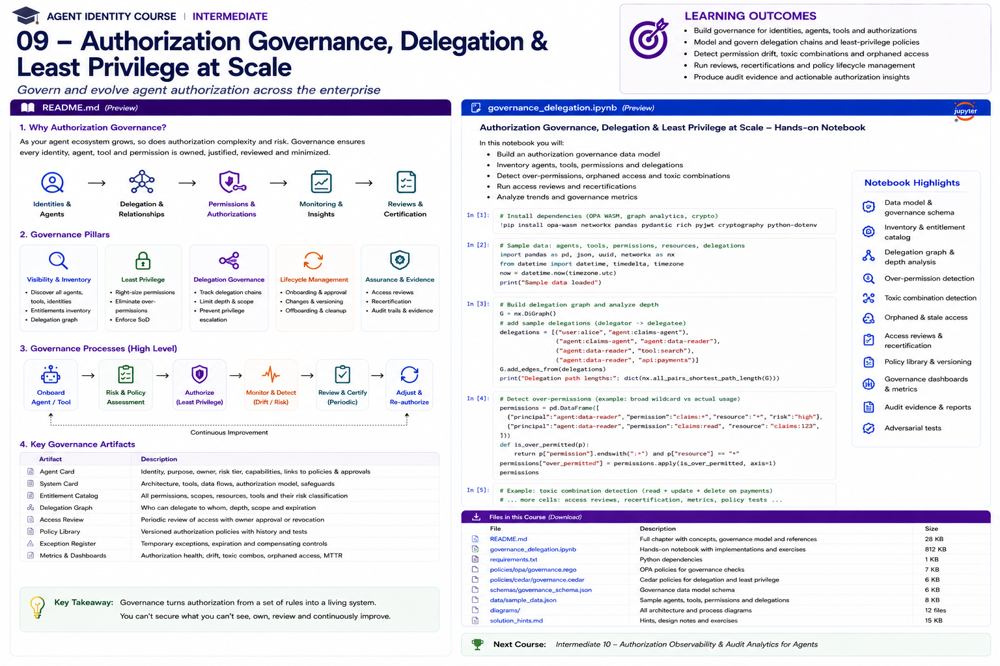

# Intermediate 09 — Authorization Governance, Delegation & Least Privilege at Scale



> **Goal:** govern authorization as a continuously managed enterprise system—not a collection of static roles and policies.

At scale, an enterprise must answer:

```text
Which agents exist?
Who owns them?
Who delegated authority to them?
What can they access?
Why do they still need it?
What authority have they actually used?
Which combinations are dangerous?
Which permissions are stale?
Which policies changed?
Who approved exceptions?
When must access be reviewed?
```

Agent authorization is especially challenging because authority can be inherited through users, service identities, groups, relationships, tasks, tools, OAuth grants and agent-to-agent delegation.

---

## Learning outcomes

You will learn to:

- build an agent authorization inventory;
- create an entitlement catalog;
- model delegation as a graph;
- distinguish direct, inherited and delegated authority;
- calculate effective permissions;
- detect delegation-depth and transitive-authority risks;
- identify permission drift and unused entitlements;
- design least-privilege recommendations;
- detect toxic permission combinations;
- enforce separation of duties;
- find orphaned and stale access;
- design access reviews and recertification;
- govern temporary exceptions;
- version authorization policy;
- test policy changes before deployment;
- use ReBAC for relationship-heavy authorization;
- understand OpenFGA's Zanzibar-inspired model;
- use Cedar for typed fine-grained authorization;
- use OPA/Rego for policy and governance checks;
- build authorization metrics and evidence;
- treat agent authorization governance as a continuous lifecycle.

---

# 1. Why authorization governance matters

A secure policy today can become unsafe tomorrow.

Reasons include:

```text
new tools
new agents
new delegation paths
team changes
resource ownership changes
temporary exceptions
policy updates
unused permissions
new data classifications
agent-to-agent delegation
shadow integrations
```

Authorization governance asks not only:

```text
Is this request allowed?
```

but:

```text
Should this permission exist?
Why does it exist?
Who owns it?
When was it reviewed?
What depends on it?
Is it broader than observed need?
```

---

# 2. Runtime authorization vs governance

Runtime authorization:

```text
principal + action + resource + context
              ↓
          allow / deny
```

Governance:

```text
inventory
   ↓
design
   ↓
approve
   ↓
deploy
   ↓
observe
   ↓
review
   ↓
reduce / revoke / renew
```

Both are required.

---

# 3. The authorization inventory

Build an inventory of:

```text
humans
agents
workloads
groups
roles
tools
APIs
MCP servers
resources
permissions
OAuth grants
delegations
policies
exceptions
approvals
```

If an authorization path cannot be discovered, it cannot be reliably governed.

---

# 4. Agent entitlement catalog

Example:

| Principal | Capability | Resource | Source | Risk | Owner |
|---|---|---|---|---|---|
| claims-agent | read | claims/* | policy | medium | Claims |
| claims-agent | update | claims/assigned | delegation | high | Claims |
| finance-agent | create | payment/* | role | critical | Finance |

Include:

```text
scope
conditions
source
owner
justification
created_at
expires_at
last_used
last_reviewed
risk
```

---

# 5. Effective permission

An agent's effective authority may be larger than its direct permissions.

```text
direct grants
+
group/role membership
+
resource hierarchy
+
relationship inheritance
+
delegated authority
+
temporary exceptions
+
task-scoped grants
=
effective authority
```

Governance must reason over effective authority.

---

# 6. Delegation as a graph

Example:

```text
Alice
  |
  | delegates claims.read
  v
Claims Agent
  |
  | delegates document.read
  v
Research Agent
  |
  | invokes
  v
Document API
```

Represent:

```text
nodes = identities/resources/capabilities
edges = delegation/ownership/membership/access
```

Graph analysis makes transitive authority visible.

---

# 7. Delegation metadata

Every delegation should answer:

```text
delegator
delegatee
authority
resource
purpose/task
constraints
issued_at
expires_at
redelegation_allowed
max_depth
approval
```

A graph edge without scope and lifecycle metadata is difficult to govern safely.

---

# 8. Delegation depth

Deep delegation increases reasoning complexity:

```text
User
 -> Agent A
   -> Agent B
     -> Agent C
       -> Tool
```

Policy can constrain:

```text
max_depth = 1
no redelegation
redelegation only for read
fresh approval after boundary
```

---

# 9. Authority attenuation

Delegated authority should normally become narrower:

```text
delegated_scope ⊆ delegator_scope
```

Bad:

```text
Alice: claim:483/read
      ↓
Agent: claims/*/read+update
```

Better:

```text
Alice: claim:483/read+update
      ↓
Agent: claim:483/read
```

---

# 10. Least privilege

Least privilege means giving only the authority necessary for the intended function, for the necessary duration and context.

For agents this includes:

```text
tools
tool operations
resources
data fields
OAuth scopes
delegation depth
transaction limits
time
environment
```

---

# 11. Static least privilege is insufficient

An agent may need broad permissions during development and narrower permissions in production.

Authority can also be reduced using observed use:

```text
granted
vs
used
```

Example:

```text
granted:
  claims.read
  claims.update
  claims.delete

90-day usage:
  claims.read
```

Candidate recommendation:

```text
remove update/delete
```

But usage alone is not proof that a permission is unnecessary. Business owners must validate expected but infrequent operations.

---

# 12. Permission drift

Permission drift occurs when authority expands or remains after need changes.

Examples:

```text
temporary scope never removed
agent changes team
tool removed but token still valid
old environment still authorized
new wildcard added
old role retained after migration
```

Track changes over time.

---

# 13. Stale access

Possible stale-access rules:

```text
permission unused for 90 days
agent inactive for 30 days
owner missing
review overdue
task expired
exception expired
resource retired
```

Different entitlements need different thresholds.

---

# 14. Orphaned agents

An orphaned agent may have:

```text
no active owner
no owning team
owner left organization
repository archived
service still running
permissions still active
```

A production agent without accountable ownership should trigger remediation.

---

# 15. Toxic combinations

Individual permissions may be acceptable while combinations are dangerous.

Example:

```text
vendor.create
+
payment.create
+
payment.approve
```

The combination can bypass financial controls.

This is a classic separation-of-duties problem.

---

# 16. Separation of duties

Example rule:

```text
requester != approver
```

For agents:

```text
agent that creates payment
must not approve payment
```

or:

```text
same delegation chain
must not control both sides
```

Agent-to-agent workflows can accidentally bypass human SoD unless the full authority graph is considered.

---

# 17. Toxic paths

A toxic combination can arise transitively.

```text
Agent A
  -> Agent B: vendor.create

Agent A
  -> Agent C: payment.approve
```

Even if Agent A does not directly hold both permissions, it may orchestrate both outcomes.

Governance should analyze reachable authority, not only direct entitlements.

---

# 18. ReBAC

Relationship-Based Access Control models authorization using relationships.

Example:

```text
user:alice member organization:claims
agent:claims-agent acts_for user:alice
claim:483 assigned_to user:alice
```

Then authorization asks whether the required relationship path exists.

ReBAC is especially useful when access depends on:

```text
ownership
membership
hierarchy
sharing
delegation
agent acting-for relationships
```

---

# 19. OpenFGA

OpenFGA is an open-source fine-grained authorization system inspired by Google's Zanzibar approach.

Its model focuses on:

```text
objects
relations
users/usersets
tuples
authorization models
checks
```

Example relationship tuple:

```text
agent:claims-agent#acts_for@user:alice
```

OpenFGA's current documentation explicitly uses agent/tool delegation as a ReBAC example.

---

# 20. OpenFGA and agents

A simplified model:

```text
type user

type agent
  relations
    define operator: [user]
    define delegate: [agent]

type tool
  relations
    define allowed_agent: [agent]
    define can_invoke: allowed_agent
```

A richer model can connect:

```text
user
agent
team
task
resource
tool
```

Use relationship models for durable graph relationships and contextual conditions for dynamic request facts.

---

# 21. ReBAC is not the whole answer

Relationship engines are strong at graph questions:

```text
Can Agent A reach permission P through relationship R?
```

Policy engines are strong at contextual rules:

```text
only if risk < 60
only if auth is fresh
only from prod
only if amount < $500
```

Enterprise architectures often combine them.

---

# 22. Cedar

Cedar models authorization requests as:

```text
principal
action
resource
context
```

Cedar supports:

```text
RBAC-style policies
ABAC
groups/hierarchies
typed schemas
permit/forbid
context
```

Cedar's default behavior is deny unless a permit applies, and a matching `forbid` overrides permits.

---

# 23. Cedar schemas

A Cedar schema defines:

```text
principal types
resource types
actions
attributes
context shapes
```

Schema validation catches policy/model mistakes before runtime.

For agent authorization, types can include:

```text
User
Agent
Workload
Tool
Claim
Payment
Task
```

---

# 24. OPA/Rego

OPA is a general-purpose policy engine.

For governance it can evaluate structured inventory data:

```text
agent
permissions
owner
risk
last_used
delegations
exceptions
```

and produce findings such as:

```text
orphaned
over-permissioned
toxic combination
expired exception
delegation too deep
```

Runtime policy and governance policy can share concepts while remaining separate policy packages.

---

# 25. Policy lifecycle

Treat policy as software:

```text
design
  ↓
schema validation
  ↓
lint
  ↓
unit tests
  ↓
impact analysis
  ↓
review
  ↓
version
  ↓
deploy
  ↓
observe
  ↓
rollback
```

---

# 26. Policy versioning

A decision record should include:

```text
policy_id
policy_version
model_version
data_version
decision
```

Without this, reproducing a historical authorization decision can be impossible.

---

# 27. Policy impact analysis

Before deploying:

```text
old policy -> decisions
new policy -> decisions
```

Calculate:

```text
newly allowed
newly denied
changed conditions
affected agents
affected high-risk resources
```

High-risk permission expansion should require explicit review.

---

# 28. Policy tests

Test:

```text
expected allows
expected denies
boundary cases
delegation cases
expired authority
cross-tenant access
toxic combinations
unknown principals
missing context
```

Also test adversarial scenarios.

---

# 29. Access reviews

A useful review asks:

```text
Does this agent still exist?
Is its owner correct?
Is this capability still required?
Is the scope appropriate?
Has it been used?
Is the risk classification correct?
Are delegation paths expected?
Are exceptions still justified?
```

Avoid presenting reviewers with hundreds of opaque permission names.

---

# 30. Risk-based review frequency

Example:

```text
R1: annual
R2: semiannual
R3: quarterly
R4: monthly/continuous
```

These are organizational examples, not universal standards.

Riskier authority should generally receive more scrutiny.

---

# 31. Recertification

Possible outcomes:

```text
renew
reduce
revoke
expire
escalate
```

A review that only supports:

```text
approve all
```

is weak governance.

---

# 32. Reviewer context

Show:

```text
agent purpose
owner
permission
resource
risk
last used
usage count
source
delegation path
exceptions
recommendation
```

This improves decision quality.

---

# 33. Temporary exceptions

Exception record:

```json
{
  "exception":"exc:42",
  "agent":"claims-agent",
  "permission":"claims.bulk_export",
  "reason":"regulatory remediation",
  "approved_by":"security",
  "expires_at":"...",
  "compensating_controls":[
    "human approval",
    "daily audit review"
  ]
}
```

Every exception should expire.

---

# 34. Break-glass authority

Break-glass access should be:

```text
rare
explicit
short-lived
strongly authenticated
highly visible
audited
reviewed after use
```

An agent should not silently invoke a break-glass path because normal authorization failed.

---

# 35. Entitlement ownership

Each entitlement should have an accountable owner.

Possible ownership:

```text
resource owner
application owner
data owner
security owner
business owner
```

Ownership is needed for reviews and exception decisions.

---

# 36. Entitlement risk

Risk can consider:

```text
data sensitivity
write capability
financial impact
external side effects
irreversibility
delegability
wildcards
cross-tenant reach
administrative power
```

---

# 37. Wildcards

Watch for:

```text
resource = *
action = *
scope = admin
all tenants
all tools
```

Wildcards are not automatically wrong, but they deserve explicit justification and stronger review.

---

# 38. Permission usage analytics

Collect:

```text
granted permission
actual decisions
successful use
denied attempts
last used
frequency
resources touched
delegation path
```

Then compare:

```text
granted vs observed
```

---

# 39. Least-privilege recommendation engine

A safe recommendation process:

```text
identify unused/broad authority
        ↓
estimate expected need
        ↓
simulate removal
        ↓
owner review
        ↓
stage change
        ↓
monitor
        ↓
remove
```

Do not automatically delete critical rare permissions solely because they were unused.

---

# 40. Permission creep metric

Example:

```text
permission_creep =
effective_permissions_now
-
approved_baseline
```

Track:

```text
count
risk-weighted count
wildcards
high-risk permissions
```

---

# 41. Delegation-risk metrics

Useful metrics:

```text
max delegation depth
average delegation depth
redelegable grants
expired delegations
cross-domain delegations
high-risk transitive paths
agents controlling multiple branches
```

---

# 42. Authorization denial analytics

Denials can reveal:

```text
misconfiguration
attacks
prompt injection
permission gaps
policy regressions
agent drift
```

But raw denial count is not enough. Add reason codes and context.

---

# 43. Policy-change metrics

Track:

```text
permission expansions
permission reductions
high-risk changes
emergency changes
rollback rate
test coverage
review latency
```

---

# 44. Review metrics

Examples:

```text
overdue reviews
revocation rate
reduction rate
rubber-stamp rate
time to remediate
owner response time
```

A 100% recertification approval rate may indicate ineffective review.

---

# 45. Governance evidence

For an entitlement:

```text
who approved
why
policy version
scope
risk
owner
last review
next review
usage
exceptions
delegation provenance
```

For a policy change:

```text
author
reviewer
tests
impact analysis
commit/version
deployment
rollback
```

---

# 46. Agent card integration

Agent cards/system cards should link to authorization governance.

Example:

```text
Agent: Claims Assistant
Owner: Claims Platform
Risk: R3
Workload identity: spiffe://...
Entitlement set: ent:claims-agent-v7
Policy bundle: authz:v19
Delegation policy: max-depth=1
Last review: ...
Next review: ...
```

---

# 47. Joiner / mover / leaver for agents

Agents have lifecycle events analogous to workforce IAM:

```text
onboard
change owner
change purpose
change environment
upgrade capabilities
deprecate
retire
```

Each should trigger authorization updates.

---

# 48. Agent offboarding

Retiring an agent should remove:

```text
OAuth grants
API keys
workload registrations
SPIFFE registration
tool access
MCP registrations
delegation edges
policy bindings
secrets
scheduled jobs
```

Then verify no active authority remains.

---

# 49. Shadow agents

Discovery should find agents that exist outside the formal registry.

Signals:

```text
service accounts
OAuth clients
MCP traffic
tool invocation logs
API tokens
cloud workloads
automation jobs
LLM gateway logs
```

Unknown active agents should trigger ownership and risk assessment.

---

# 50. Policy distribution

Central policy control can reduce drift, but distributed enforcement remains common.

Architecture:

```text
Policy source
   ↓
versioned bundle/model
   ↓
distribution
   ↓
PDP / relationship engine
   ↓
PEP
```

Govern:

```text
version
integrity
rollout
rollback
consistency
```

---

# 51. PDP and PEP

**Policy Decision Point (PDP)**:

```text
decides allow/deny
```

**Policy Enforcement Point (PEP)**:

```text
actually blocks/allows operation
```

A perfect PDP is useless if the agent can bypass the PEP.

Test bypass paths.

---

# 52. Fail-open vs fail-closed

When authorization infrastructure is unavailable:

```text
fail open
or
fail closed
```

For high-impact agent operations, fail-open can be catastrophic.

Design degraded modes explicitly:

```text
read-only
cached narrow decisions
pause task
human fallback
```

---

# 53. Decision caching

Caching can improve performance but risks stale authority.

Cache key may need:

```text
principal
action
resource
context-relevant dimensions
policy/model version
```

Invalidation matters when:

```text
permission revoked
agent quarantined
task expires
policy changes
```

---

# 54. Multi-tenant governance

Every entitlement and delegation should preserve tenant boundaries.

Test:

```text
tenant A agent
cannot inherit
tenant B relationship
```

Graph models make accidental cross-tenant paths particularly important to test.

---

# 55. Governance control plane

A mature architecture:

```text
          Agent Registry
               |
     Entitlement Catalog
               |
      Delegation Graph
               |
        Policy Library
               |
        Risk Metadata
               |
               v
     Authorization Governance
      /       |        \
 Reviews   Analytics   Exceptions
      \       |        /
        Policy Lifecycle
               |
               v
      Runtime Authorization
```

---

# 56. Practical notebook

The notebook implements:

1. governance inventory;
2. entitlement catalog;
3. delegation graph;
4. effective permission calculation;
5. delegation depth;
6. cycles;
7. authority attenuation;
8. orphan detection;
9. stale access;
10. wildcard detection;
11. usage analysis;
12. over-permission recommendations;
13. toxic combinations;
14. transitive toxic paths;
15. SoD;
16. temporary exceptions;
17. recertification;
18. risk-based review;
19. policy versions;
20. policy impact analysis;
21. governance metrics;
22. decision evidence;
23. offboarding;
24. shadow-agent discovery;
25. adversarial tests;
26. OpenFGA model exercise;
27. Cedar policy exercise;
28. OPA governance policy exercise.

---

# 57. Production checklist

## Inventory

- Are all agents discoverable?
- Are workloads linked to agents?
- Are tools and resources inventoried?
- Are OAuth/MCP/API entitlements included?
- Are shadow agents detected?

## Ownership

- Does every agent have an active owner?
- Does every entitlement have an owner?
- Are orphaned identities automatically flagged?

## Delegation

- Are delegation edges recorded?
- Is authority attenuated?
- Is redelegation controlled?
- Is maximum depth enforced?
- Are cycles detectable?

## Least privilege

- Are wildcards visible?
- Is granted-vs-used authority measured?
- Are high-risk unused permissions reviewed?
- Are temporary grants expiring?

## SoD

- Are toxic combinations defined?
- Are transitive paths analyzed?
- Can agents orchestrate both sides of a control?

## Reviews

- Is review frequency risk-based?
- Do reviewers get useful context?
- Can they reduce/revoke access?
- Are overdue reviews escalated?

## Policy lifecycle

- Are policies versioned?
- Are schemas validated?
- Are changes tested?
- Is impact analysis performed?
- Is rollback available?

## Evidence

- Can a historical entitlement be explained?
- Can a historical decision be reproduced?
- Are exceptions traceable?
- Are governance metrics actionable?

---

# 58. Key takeaways

1. Authorization governance is a lifecycle, not a one-time policy design.
2. Effective authority includes direct, inherited, relationship-based and delegated permissions.
3. Delegation should be modeled as a graph.
4. Delegated authority should normally attenuate.
5. Least privilege includes scope, resources, tools, time and delegation depth.
6. Usage data can identify candidates for reduction but should not blindly remove rare critical access.
7. Permission drift and orphaned agents require continuous discovery.
8. Toxic combinations must be analyzed across transitive agent paths.
9. Separation of duties applies to agent orchestration, not only human roles.
10. ReBAC is valuable for ownership, hierarchy and delegation relationships.
11. OpenFGA is useful for Zanzibar-style relationship authorization.
12. Cedar provides typed principal/action/resource/context policy modeling.
13. OPA/Rego is useful for flexible runtime and governance policy.
14. Policy should be versioned, tested and impact-analyzed like software.
15. Access reviews should be risk-based and contextual.
16. Exceptions should expire and include compensating controls.
17. Agent offboarding must revoke every authorization surface.
18. PDPs require non-bypassable enforcement points.
19. Decision caching must account for revocation and policy changes.
20. Governance evidence should explain why authority existed at any point in time.

---

# References

- OpenFGA — Authorization Concepts  
  https://openfga.dev/docs/learn
- OpenFGA — Modeling  
  https://openfga.dev/docs/modeling
- OpenFGA — ReBAC  
  https://openfga.dev/docs/learn/rebac
- Google Zanzibar paper  
  https://research.google/pubs/zanzibar-googles-consistent-global-authorization-system/
- Cedar Policy Language  
  https://docs.cedarpolicy.com/
- Cedar Authorization  
  https://docs.cedarpolicy.com/auth/authorization.html
- Cedar Schema  
  https://docs.cedarpolicy.com/schema/schema.html
- Cedar Security  
  https://docs.cedarpolicy.com/other/security.html
- Open Policy Agent  
  https://www.openpolicyagent.org/docs/
- NIST AI Risk Management Framework  
  https://www.nist.gov/itl/ai-risk-management-framework
- NIST AI RMF Generative AI Profile  
  https://www.nist.gov/publications/artificial-intelligence-risk-management-framework-generative-artificial-intelligence
- NIST SP 800-207 — Zero Trust Architecture  
  https://csrc.nist.gov/pubs/sp/800/207/final

---

# Next course

## Intermediate 10 — Authorization Observability & Audit Analytics for Agents

Next:

```text
decision logs
authorization traces
delegation provenance
policy explanations
audit schemas
tamper evidence
privacy-safe logging
anomaly analytics
authorization dashboards
incident reconstruction
evidence retention
continuous control monitoring
```
