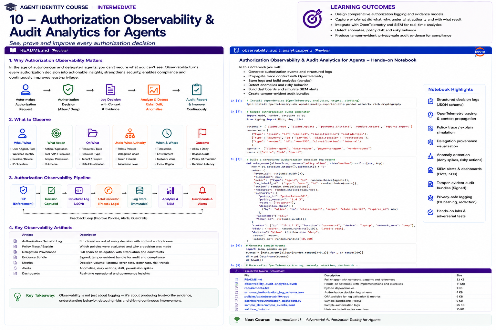

# Intermediate 10 — Authorization Observability & Audit Analytics for Agents



> **Goal:** make every important agent authorization decision explainable, traceable, privacy-aware, analyzable and reconstructable.

Authorization is not complete when a PDP returns:

```text
ALLOW
```

For an enterprise agent, we also need to know:

```text
who/what requested the action?
under whose authority?
which workload executed it?
which task and delegation chain applied?
which policy/model/data versions were evaluated?
which rules determined the result?
what risk and assurance evidence existed?
what tool/resource was targeted?
was the enforcement point actually used?
what happened afterward?
can we prove this later?
```

This course builds an authorization-observability layer spanning decision logs, distributed traces, delegation provenance, audit evidence, anomaly analytics, privacy controls and continuous governance.

---

## Learning outcomes

You will learn to:

- design a canonical authorization decision event;
- correlate identity, delegation, policy, workload and tool evidence;
- distinguish logs, traces, metrics and audit records;
- capture decision provenance and reason codes;
- understand OPA decision logs and masking;
- use Cedar authorization diagnostics correctly;
- correlate OpenFGA/ReBAC checks with agent traces;
- instrument authorization with OpenTelemetry;
- understand current OpenTelemetry GenAI semantic-convention direction;
- avoid leaking prompts, tokens, credentials and PII into telemetry;
- model tamper-evident evidence chains;
- detect deny spikes, policy drift and unusual privilege use;
- detect impossible/abnormal delegation paths;
- reconstruct an agent incident;
- define SIEM detections and dashboards;
- create continuous-control-monitoring metrics;
- build audit-ready evidence without logging everything.

---

# 1. Observability vs auditability

**Observability** helps operators understand current system behavior.

```text
What is happening?
Why is latency high?
Why are denials increasing?
Which agent is invoking this tool?
```

**Auditability** supports historical accountability.

```text
Who was authorized?
By which policy?
Under whose delegation?
What evidence existed at the time?
Can the decision be reproduced?
```

The same telemetry pipeline may support both, but retention, integrity, access and privacy requirements differ.

---

# 2. Four telemetry signals

A useful model:

```text
Logs    -> discrete records
Traces  -> causal request path
Metrics -> aggregate behavior
Evidence -> durable governance/audit artifact
```

Do not force every requirement into one signal.

---

# 3. Authorization observability pipeline

```text
Agent / User
     |
     v
PEP / Gateway
     |
     +------ trace context ------+
     |                           |
     v                           v
Authorization PDP          Tool / Resource
     |
     v
Decision event
     |
     v
OpenTelemetry Collector
     |
     +--> operational telemetry
     +--> SIEM
     +--> audit evidence store
     +--> governance analytics
```

The `decision_id`, trace ID and task/delegation IDs connect the layers.

---

# 4. Canonical decision event

A production event should usually contain normalized fields from several domains.

```json
{
  "event_type": "authorization.decision",
  "decision_id": "...",
  "timestamp": "...",
  "trace_id": "...",
  "principal": {},
  "agent": {},
  "workload": {},
  "delegation": {},
  "task": {},
  "action": {},
  "resource": {},
  "policy": {},
  "assurance": {},
  "risk": {},
  "decision": {},
  "enforcement": {}
}
```

Use a schema and version it.

---

# 5. Principal identity

Record enough to establish the requesting authority without copying unnecessary profile data.

Prefer:

```text
principal.id
principal.type
tenant
session pseudonym
authentication assurance
```

Avoid:

```text
full user profile
passwords
raw credentials
unnecessary email/address/phone
```

---

# 6. Logical agent identity

Capture:

```text
agent.id
agent.version
agent.owner
agent.risk_tier
agent.configuration_version
```

Logical identity should be distinguishable from runtime workload identity.

---

# 7. Workload evidence

Useful fields:

```text
SPIFFE ID
workload attestation status
image digest
runtime environment
posture status
posture observed_at
```

This lets an investigator distinguish:

```text
approved agent definition
```

from:

```text
the workload that actually executed it
```

---

# 8. Delegation provenance

For delegated agent actions capture the authority chain.

Example:

```text
user:alice
  -> agent:claims
  -> agent:research
```

Record:

```text
delegation_id
delegator
delegatee
scope
resource
issued_at
expires_at
depth
parent_delegation_id
```

Do not rely on a single string such as:

```text
acting_for = alice
```

when the real chain is multi-hop.

---

# 9. Task provenance

Authorization should be explainable in task context:

```text
task.id
task.type
task.owner
task.resource
task.allowed_actions
task.created_at
task.expires_at
```

This is especially important for agents whose authority is intentionally ephemeral.

---

# 10. Action and resource

Capture canonical authorization semantics rather than only HTTP details.

```text
action = claim.update
resource.type = Claim
resource.id = claim:483
resource.tenant = acme
resource.classification = confidential
```

HTTP method and URL may be useful secondary evidence.

---

# 11. Policy provenance

At minimum:

```text
policy engine
policy/model ID
policy version
bundle version
data snapshot/version
schema version
determining policy IDs
```

A historical `ALLOW` without the evaluated policy version is weak evidence.

---

# 12. Decision reason codes

Prefer stable machine-readable reason codes:

```text
ALLOW_TASK_SCOPE
DENY_EXPIRED_DELEGATION
DENY_WRONG_TENANT
DENY_LOW_ASSURANCE
DENY_UNAPPROVED_WORKLOAD
DENY_POLICY_DEFAULT
```

Then add human-readable explanation separately.

Do not make dashboards parse arbitrary prose.

---

# 13. Explanation is not chain-of-thought

An authorization explanation should expose policy evidence, not hidden model reasoning.

Good:

```text
Denied because delegation expired at 14:03Z.
Determining policy: delegation-validity-v7.
```

Not required:

```text
private internal reasoning from an LLM
```

Authorization explanations should be deterministic and evidence-based.

---

# 14. OPA decision logs

OPA can report decision-log events to:

```text
remote HTTP service
custom plugin
console
```

OPA decision events can include:

```text
decision_id
input
result
requested_by
timestamp
metrics
bundle metadata
request context
```

This makes them useful for audit and offline debugging.

---

# 15. OPA masking

Authorization input may contain sensitive data.

OPA supports a decision-log masking policy at:

```text
data.system.log.mask
```

Masking can remove or replace fields before decision logs leave OPA.

Example targets:

```text
/input/token
/input/user/email
/input/tool/arguments/customer_ssn
```

OPA records erased/masked paths in the resulting event.

---

# 16. OPA drop policy

Some decision events may need to be excluded entirely.

OPA also supports decision-log drop behavior.

Use carefully:

```text
privacy/noise reduction
```

must not become:

```text
erase evidence of sensitive high-risk actions
```

Audit policy should define what may be dropped.

---

# 17. Cedar diagnostics

Cedar evaluates:

```text
principal
action
resource
context
```

and returns:

```text
Allow / Deny
+
diagnostics
```

Diagnostics can identify determining policies and policy-evaluation errors.

For `Deny` caused by default-deny, there may be no determining policy because no permit matched.

This distinction matters for observability.

---

# 18. Cedar error observability

Policy evaluation errors should be surfaced separately from ordinary denies.

Example:

```text
decision = DENY
reason = DEFAULT_DENY
```

is different from:

```text
decision = DENY
evaluation_error = missing/invalid entity data
```

Operational dashboards should distinguish them.

---

# 19. OpenFGA / ReBAC observability

For relationship authorization, useful evidence includes:

```text
authorization model ID
store/tenant
user
relation
object
check result
request/trace ID
```

For agent systems, also preserve the business interpretation:

```text
agent acts_for user
agent assigned_to task
agent can_invoke tool
```

Raw tuple syntax alone is often insufficient for auditors.

---

# 20. Authorization trace

A distributed trace can connect:

```text
incoming request
  ↓
authentication
  ↓
delegation resolution
  ↓
workload verification
  ↓
authorization check
  ↓
tool invocation
  ↓
resource operation
```

This provides causal context that independent log lines cannot.

---

# 21. OpenTelemetry

OpenTelemetry provides vendor-neutral APIs, SDKs and protocols for telemetry.

Use it to propagate:

```text
trace_id
span_id
baggage/context where appropriate
```

and export:

```text
traces
metrics
logs
```

through an OpenTelemetry Collector.

---

# 22. OpenTelemetry and GenAI

OpenTelemetry's GenAI semantic conventions are actively evolving and have moved into a dedicated GenAI semantic-conventions repository.

Current conventions standardize GenAI concepts such as:

```text
operation
model
token usage
agent identity
messages/tool interactions when explicitly enabled
```

Do not freeze your own schema to experimental attribute names without a compatibility strategy.

---

# 23. Opt-in content

Prompt, completion and tool content can be extremely useful for debugging but can also contain:

```text
PII
secrets
credentials
proprietary data
regulated data
prompt-injection payloads
```

OpenTelemetry's GenAI guidance treats verbose/sensitive content as opt-in.

For authorization observability, prefer structured security facts over raw conversational content.

---

# 24. Trace correlation

Recommended correlation identifiers:

```text
trace_id
decision_id
task_id
delegation_id
agent_id
workload_id
policy_version
tool_call_id
```

Do not overload one identifier to mean all of these things.

---

# 25. Cardinality

Metrics should avoid uncontrolled high-cardinality labels.

Bad metric labels:

```text
user_id
resource_id
prompt
tool arguments
```

Better:

```text
decision
reason_code
risk_tier
action_class
agent_class
environment
```

Keep high-cardinality detail in logs/traces.

---

# 26. Metrics

Useful metrics include:

```text
authorization decision volume
allow/deny rate
deny reason distribution
PDP latency
authorization errors
high-risk allows
step-up rate
delegation depth
stale-evidence denials
policy version distribution
```

---

# 27. Denial-rate analytics

A denial spike can mean:

```text
attack
agent regression
policy deployment error
expired delegation
identity outage
new unauthorized tool
```

Correlate with:

```text
agent version
policy version
deployment
action
resource type
reason code
```

---

# 28. Allow analytics

Do not monitor only denials.

Suspicious allows can be more important:

```text
rare admin action
new resource type
high transaction value
new delegation path
unusual hour
new workload
sudden permission use
```

---

# 29. Baselines

Build baselines for:

```text
agent -> normal actions
agent -> normal tools
agent -> normal resources
agent -> normal delegation depth
agent -> normal decision rate
agent -> normal risk distribution
```

Anomaly detection should supplement explicit policy, not replace it.

---

# 30. Policy drift analytics

Compare decisions by policy version:

```text
v18 allow rate = 71%
v19 allow rate = 88%
```

Then ask:

```text
Was expansion intended?
Which actions changed?
Which agents changed?
Did high-risk allows increase?
```

---

# 31. Shadow authorization paths

Telemetry can reveal tool invocations with no corresponding authorization decision.

Detection:

```text
tool_call
AND NOT correlated authorization decision
```

This may indicate:

```text
PEP bypass
missing instrumentation
legacy integration
shadow agent
```

Treat it as high priority.

---

# 32. Enforcement evidence

A PDP decision does not prove enforcement.

Capture evidence such as:

```text
PEP decision_id
enforcement result
downstream request correlation
tool execution status
```

Then verify:

```text
DENY -> no protected operation
ALLOW -> only intended operation
```

---

# 33. Decision-to-action gap

Important sequence:

```text
authorize action X
        ↓
agent changes arguments
        ↓
execute action Y
```

For sensitive tools, bind authorization to:

```text
tool
operation
resource
critical parameters
transaction digest
```

and verify at enforcement time.

---

# 34. Tamper evidence

Audit records should resist silent modification.

One teaching technique is hash chaining:

```text
record[n].previous_hash = hash(record[n-1])
record[n].hash = hash(record[n] + previous_hash)
```

This provides tamper evidence, not complete tamper-proof storage.

Production designs may additionally use:

```text
append-only storage
WORM retention
signed checkpoints
external timestamping
restricted writer identities
separate security account/project
```

---

# 35. Signing evidence bundles

Periodic evidence bundles can include:

```text
decision records
policy manifests
model versions
review metadata
hash-chain root
time window
```

Then sign the bundle.

This helps prove that the evidence set corresponds to a particular collection period.

---

# 36. Privacy-safe logging

Apply data minimization:

```text
collect only needed fields
tokenize/pseudonymize identifiers
mask sensitive arguments
avoid raw credentials
control access
limit retention
separate operational/audit stores
```

Observability systems are themselves sensitive security systems.

---

# 37. Pseudonymization

For analytics, a stable keyed pseudonym may be sufficient:

```text
user:alice
      ↓ HMAC
usr:4f8...
```

This supports behavioral grouping without exposing the raw identity to every analyst.

The mapping/key must be governed separately.

---

# 38. Redaction

Redaction should happen as early as practical.

Possible layers:

```text
application
authorization engine
OpenTelemetry processor
collector
log pipeline
SIEM
```

Do not assume the final SIEM can safely clean secrets after they have already propagated through multiple systems.

---

# 39. Retention

Different telemetry may need different retention.

Example:

```text
debug traces          short
operational metrics   medium
security events       longer
regulated audit       policy/legal requirement
```

Do not retain raw prompts indefinitely merely because storage is cheap.

---

# 40. Access to audit data

Audit logs can reveal:

```text
customer IDs
resource names
security rules
internal topology
agent behavior
delegation relationships
```

Apply authorization to the observability system itself.

---

# 41. SIEM integration

Normalize high-value events into fields that security analytics can query.

Example:

```text
event.category = authorization
event.outcome = failure
agent.id = claims-agent
authz.reason = DENY_EXPIRED_DELEGATION
risk.level = high
```

Preserve the original structured event as needed.

---

# 42. Detection examples

Possible detections:

```text
deny spike after policy deployment
high-risk allow from new workload
new agent-tool pair
delegation depth exceeds baseline
expired delegation repeatedly attempted
cross-tenant deny burst
policy evaluation errors
tool execution without decision_id
quarantined agent receives allow
```

---

# 43. Incident reconstruction

An investigation should be able to reconstruct:

```text
1. user authentication
2. delegation issuance
3. agent task creation
4. workload identity
5. authorization decision
6. determining policy
7. tool invocation
8. resource change
9. downstream effects
```

A trace alone may not have the retention needed for an audit; durable evidence links the same IDs.

---

# 44. Timeline reconstruction

Normalize timestamps to UTC and preserve ordering identifiers.

Beware:

```text
clock skew
async queues
retries
duplicate delivery
batch uploads
```

Use IDs and causal relationships rather than timestamp order alone.

---

# 45. Retries

One logical action can generate multiple checks.

Record:

```text
request_id
attempt
decision_id
idempotency key
```

Otherwise retries can look like malicious bursts.

---

# 46. Sampling

Aggressive trace sampling can erase security evidence.

A good design separates:

```text
performance tracing sampling
```

from:

```text
required authorization audit events
```

High-risk authorization decisions may need unsampled durable logging even when ordinary traces are sampled.

---

# 47. Audit completeness

Define measurable completeness:

```text
protected operations with decision_id
-------------------------------------
all protected operations
```

Target should approach 100% for protected paths.

This is more meaningful than simply counting logs.

---

# 48. Continuous control monitoring

Examples:

```text
all R4 actions have authorization evidence
all delegated writes have active delegation
all production agents have workload identity
all deny decisions are enforced
all policy changes identify version
all sensitive fields are masked
```

Turn governance controls into continuously evaluated queries.

---

# 49. Evidence quality dimensions

Score evidence on:

```text
completeness
integrity
timeliness
correlation
provenance
privacy
reproducibility
```

A huge log archive can still have poor evidence quality.

---

# 50. Audit evidence packet

For a sampled high-risk transaction:

```text
decision event
trace references
delegation chain
task authority
workload identity
policy version
determining policies
risk/assurance evidence
enforcement confirmation
resource outcome
integrity proof
```

This is far more useful than screenshots of a dashboard.

---

# 51. Dashboards

Recommended views:

```text
Authorization Health
Agent Risk
Delegation
Policy Changes
PEP Coverage
Audit Completeness
Privacy/Redaction Health
```

Dashboards should lead to action, not become decorative compliance artifacts.

---

# 52. SLOs

Possible authorization-observability SLOs:

```text
99.99% decision-log delivery
99.9% trace correlation for R3/R4 actions
100% PEP coverage for critical tools
<5 min security-event ingestion
100% policy-version attribution
```

Choose targets based on enterprise risk and architecture.

---

# 53. Failure modes

Watch for:

```text
logging after enforcement only
unstructured reason text
missing policy versions
raw tokens in logs
raw prompts everywhere
decision logs without tool outcome
traces without durable audit
high-cardinality metrics
sampling critical evidence
analysts with unrestricted log access
mutable audit storage
```

---

# 54. OTel Collector architecture

A useful pattern:

```text
Apps / PDP / PEP
      |
     OTLP
      |
OpenTelemetry Collector
   /    |      \
filter redact   route
  |      |       |
metrics traces  security/audit
```

Collector processors can help normalize and redact telemetry, but sensitive fields should preferably never be emitted when they are not needed.

---

# 55. Governance feedback loop

Observability should improve authorization:

```text
observe
  ↓
detect drift/anomaly
  ↓
investigate
  ↓
change entitlement/policy
  ↓
test
  ↓
deploy
  ↓
measure impact
```

This connects this module directly to Intermediate 09.

---

# 56. NIST AI risk management connection

NIST AI RMF and the Generative AI Profile emphasize ongoing risk management across the AI lifecycle.

Authorization evidence contributes to:

```text
measurement
monitoring
accountability
incident investigation
governance
```

It is one component of broader AI risk management—not a substitute for it.

---

# 57. Practical notebook

The notebook implements:

1. canonical event schema;
2. synthetic authorization events;
3. trace/decision correlation;
4. delegation provenance;
5. reason-code analytics;
6. PDP latency analytics;
7. deny spikes;
8. suspicious allows;
9. policy-version drift;
10. new agent-tool pairs;
11. delegation-depth anomalies;
12. PEP bypass detection;
13. decision/action binding;
14. privacy classification;
15. redaction;
16. HMAC pseudonymization;
17. OPA-style masking;
18. Cedar-style diagnostics;
19. OTel span modeling;
20. metrics;
21. SIEM rules;
22. hash-chained evidence;
23. tamper detection;
24. signed evidence-bundle concepts;
25. audit completeness;
26. incident reconstruction;
27. continuous control monitoring;
28. adversarial tests.

---

# 58. Production checklist

## Decision evidence

- Does every protected action have a decision ID?
- Are principal, agent and workload identities distinct?
- Is delegation provenance captured?
- Is task authority captured?
- Are policy/model/data versions recorded?
- Are reason codes structured?
- Are evaluation errors distinguishable from normal denies?

## Tracing

- Is trace context propagated across agent, PDP, PEP and tool?
- Can authorization be correlated to the resulting side effect?
- Are retries identifiable?
- Is critical security evidence independent of trace sampling?

## Privacy

- Are credentials never logged?
- Are prompts/tool arguments opt-in?
- Are sensitive fields classified?
- Is redaction performed early?
- Are identifiers pseudonymized where possible?
- Is audit-data access restricted?

## Integrity

- Is audit storage append-oriented/controlled?
- Can modification be detected?
- Are evidence bundles signed/checkpointed where needed?
- Are clocks and causal IDs sufficient for reconstruction?

## Analytics

- Are deny spikes monitored?
- Are suspicious allows monitored?
- Are policy-version changes correlated?
- Are new agent-tool relationships detected?
- Is PEP bypass detectable?
- Are cross-tenant anomalies visible?

## Governance

- Is audit completeness measured?
- Are controls continuously monitored?
- Are evidence retention rules defined?
- Can historical decisions be reproduced?
- Does observability feed least-privilege improvement?

---

# 59. Key takeaways

1. An allow/deny result is not sufficient evidence.
2. Logs, traces, metrics and audit evidence serve different purposes.
3. Decision IDs should correlate authorization with enforcement and outcomes.
4. Capture principal, agent and workload identities separately.
5. Delegation and task provenance are first-class authorization evidence.
6. Historical decisions require policy/model/data version attribution.
7. Stable reason codes make analytics and investigations practical.
8. Cedar diagnostics distinguish determining policies and evaluation errors.
9. OPA decision logs provide rich audit/debug context.
10. OPA masking can remove or replace sensitive fields before export.
11. OpenTelemetry provides vendor-neutral correlation across agent workflows.
12. GenAI telemetry content should be opt-in because prompts/tools may contain sensitive data.
13. High-cardinality detail belongs in logs/traces, not metric labels.
14. Monitor suspicious allows as well as denies.
15. Tool execution without a correlated authorization decision can reveal PEP bypass.
16. Authorization should be bound to critical action parameters for sensitive operations.
17. Hash chains provide tamper evidence, not magical tamper-proof storage.
18. Audit evidence should survive performance-trace sampling.
19. Audit completeness should be measured as coverage of protected operations.
20. Observability should continuously feed authorization-governance improvement.

---

# References

- OpenTelemetry — Documentation  
  https://opentelemetry.io/docs/
- OpenTelemetry — Semantic Conventions  
  https://opentelemetry.io/docs/specs/semconv/
- OpenTelemetry — GenAI observability overview (2026)  
  https://opentelemetry.io/blog/2026/genai-observability/
- OpenTelemetry — AI Agent Observability  
  https://opentelemetry.io/blog/2025/ai-agent-observability/
- Open Policy Agent — Decision Logs  
  https://www.openpolicyagent.org/docs/management-decision-logs
- Open Policy Agent — Configuration  
  https://www.openpolicyagent.org/docs/configuration
- Cedar — Authorization  
  https://docs.cedarpolicy.com/auth/authorization.html
- Cedar — Security  
  https://docs.cedarpolicy.com/other/security.html
- OpenFGA — Documentation  
  https://openfga.dev/docs
- NIST AI Risk Management Framework  
  https://www.nist.gov/itl/ai-risk-management-framework
- NIST AI RMF Generative AI Profile  
  https://www.nist.gov/publications/artificial-intelligence-risk-management-framework-generative-artificial-intelligence

---

# Next course

## Intermediate 11 — Adversarial Authorization Testing for Agents

Next we attack the authorization architecture:

```text
confused deputy
delegation escalation
token substitution
identity spoofing
cross-tenant access
policy bypass
PEP bypass
TOCTOU
parameter swapping
replay
agent-to-agent laundering
authorization fuzzing
negative testing
security regression suites
```
