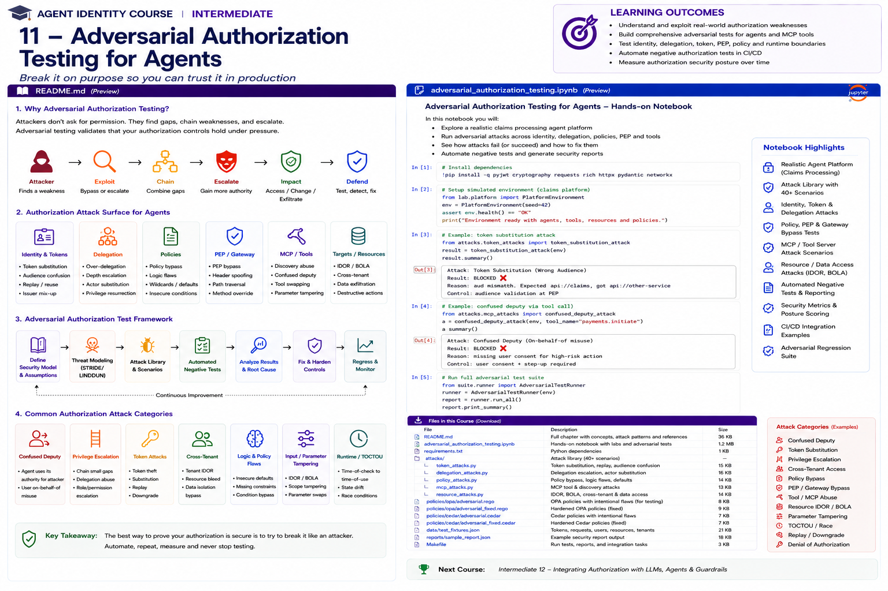

# Intermediate 11 — Adversarial Authorization Testing for Agents



> **Goal:** stop asking whether an authorization design looks secure and start proving that it resists realistic adversarial behavior.

Agent systems introduce authorization paths that conventional API tests often miss:

```text
human → agent
agent → sub-agent
agent → tool
agent → MCP server
agent → resource
delegation → re-delegation
model output → tool arguments
authorization decision → delayed execution
```

An attacker does not need to defeat the entire identity architecture. They only need one path where identity, delegation, policy, enforcement, or runtime assumptions disagree.

This course treats authorization as an **attackable distributed security protocol** and builds a repeatable adversarial test program around it.

---

## Learning outcomes

You will learn to:

- threat-model authorization boundaries in agent systems;
- distinguish authentication failures from authorization failures;
- test confused-deputy vulnerabilities;
- test token substitution, replay, downgrade, and audience confusion;
- attack delegation scope, depth, expiry, and re-delegation;
- test identity/workload binding;
- detect cross-tenant IDOR/BOLA-style authorization flaws;
- test policy engines for missing conditions, wildcards, and default mistakes;
- attack PEP placement and bypass paths;
- test authorization-to-action parameter binding;
- reproduce TOCTOU/race-condition authorization bugs;
- test MCP/tool discovery and tool substitution;
- model agent-to-agent authority laundering;
- use property-based and mutation-style negative testing;
- create OPA, Cedar, and OpenFGA regression tests;
- design CI/CD authorization security gates;
- measure attack coverage and authorization security posture.

---

# 1. Why adversarial authorization testing?

A policy can be syntactically valid and still be insecure.

A unit test can pass while the architecture remains bypassable.

An authorization engine can correctly return `DENY` while the protected operation still executes through another path.

Adversarial testing asks:

```text
How could an attacker make the system authorize something
that the security model says should never happen?
```

The goal is not merely to generate denials. It is to discover mismatches between:

```text
identity
delegation
policy
context
enforcement
runtime state
tool behavior
resource ownership
```

---

# 2. Security model before attack model

Before testing, define invariants.

Examples:

```text
an agent may never exceed delegated authority

a tenant-A identity may never access tenant-B resources

an unapproved workload may never exercise a logical agent identity

a denied tool operation may never reach the protected backend

authorization for amount=100 may not authorize amount=10,000

expired delegation may never be accepted

a sub-agent may not gain authority that its parent lacks
```

These become security properties.

---

# 3. Threat actors

Consider:

```text
external attacker
malicious user
compromised user
compromised agent
prompt-injected agent
malicious sub-agent
malicious tool/MCP server
compromised workload
insider
misconfigured service
```

Many agent authorization failures do not require a sophisticated model attack.

---

# 4. Authorization attack surface

A useful decomposition:

```text
Identity & Tokens
Delegation
Policy
PDP
PEP / Gateway
Agent Runtime
MCP / Tools
Resource APIs
Telemetry / Audit
```

Each boundary can disagree with the others.

---

# 5. Attack chain thinking

Real attacks often chain weaknesses:

```text
steal/reuse token
      ↓
confuse audience
      ↓
impersonate agent
      ↓
obtain delegated scope
      ↓
re-delegate to sub-agent
      ↓
invoke high-impact tool
      ↓
swap parameters after authorization
      ↓
exfiltrate/change data
```

Testing only isolated controls misses these paths.

---

# 6. Confused deputy

A confused deputy occurs when a more privileged component is induced to misuse its authority for a less privileged requester.

Agent example:

```text
User cannot create payment
       ↓
asks finance agent
       ↓
finance agent possesses payment.create
       ↓
agent executes using its own broad credential
```

The system authenticated both parties correctly, but failed to bind the action to the caller's delegated authority.

---

# 7. Confused deputy tests

Test:

```text
low-privilege user → high-privilege agent
cross-tenant user → shared agent
sub-agent → privileged parent
tool → agent callback
MCP server → host agent
```

Assert that authority is derived from the correct principal/delegation context rather than from the deputy's ambient privileges.

---

# 8. Ambient authority

Ambient credentials are dangerous for agents.

Example:

```text
agent process owns broad cloud role
```

Every tool call may inherit that authority even when the user/task should have much less.

Prefer:

```text
task-scoped
resource-scoped
time-scoped
purpose-scoped
delegated credentials
```

where architecture permits.

---

# 9. Token substitution

Token substitution attempts to use a valid token in the wrong security context.

Example:

```text
token audience = api://analytics
presented to = api://payments
```

Test:

```text
issuer
audience
subject
authorized party/client
scope
token type
tenant
binding
expiry
```

Do not equate "cryptographically valid" with "valid for this operation."

---

# 10. Replay

A captured authorization artifact may be replayed.

Targets include:

```text
bearer access tokens
delegation tokens
signed tool approvals
capabilities
transaction approvals
agent task tokens
```

Defenses can include:

```text
short lifetime
nonce/jti
proof-of-possession
one-time use
transaction binding
server-side replay cache
```

The correct design depends on protocol and risk.

---

# 11. Downgrade attacks

Attackers may seek a weaker authorization path:

```text
new endpoint → strict policy
legacy endpoint → permissive policy

DPoP-bound token → bearer fallback

fresh authentication → old session fallback

new policy bundle → stale cached decision
```

Adversarial tests should enumerate fallback paths.

---

# 12. Identity spoofing

Test whether a caller can set trusted identity fields directly:

```json
{
  "agent_id": "finance-agent",
  "acting_for": "ceo"
}
```

Identity used for authorization must originate from trusted authentication/delegation evidence, not caller-controlled payload fields.

---

# 13. Logical-agent/workload mismatch

Attack:

```text
approved logical agent ID
+
unapproved workload
```

Test that:

```text
agent identity
workload identity
artifact digest
environment
attestation
```

are bound as required by the assurance policy.

---

# 14. Delegation escalation

Security invariant:

```text
delegated authority ⊆ delegator authority
```

Attack:

```text
parent = claim.read
child = claim.read + claim.delete
```

Also test resource expansion:

```text
parent = claim:483
child = claims/*
```

---

# 15. Delegation depth abuse

Example:

```text
User → Agent A → Agent B → Agent C
```

If policy says:

```text
max_depth = 1
```

then depth 2+ must fail even if each individual edge looks legitimate.

---

# 16. Re-delegation bypass

Test whether:

```text
redelegable = false
```

is actually enforced.

Common bug:

```text
PDP validates current delegation
but does not validate parent delegation constraints
```

---

# 17. Actor substitution

Attack:

```text
delegation issued to agent:A
reused by agent:B
```

The delegation must bind to the intended delegatee or a narrowly defined authorized class.

---

# 18. Resource substitution

Attack:

```text
authorized resource = claim:483
executed resource = claim:999
```

Test path parameters, body fields, indirect references, batch operations, aliases, and redirects.

---

# 19. Cross-tenant access

Tenant isolation must be tested as a security property.

Example:

```text
agent tenant = A
resource tenant = B
```

Test:

```text
ID substitution
parent-child traversal
shared tool paths
relationship inheritance
cached authorization
batch APIs
search APIs
export APIs
```

---

# 20. IDOR / BOLA for agents

Object-level authorization remains critical.

An agent knowing an object ID must not imply access.

Test:

```text
claim:483 → claim:484
customer:A → customer:B
workspace:A → workspace:B
```

Automated agents can enumerate objects much faster than humans.

---

# 21. Policy bypass

Look for routes that do not call the intended PDP.

Examples:

```text
internal endpoint
admin endpoint
legacy API
direct database client
background queue
tool plugin
MCP server
batch endpoint
webhook callback
```

A secure policy engine cannot protect traffic that bypasses it.

---

# 22. PEP bypass

Map all paths to a protected resource.

```text
Agent → Gateway → PDP → API
Agent ─────────────────→ API
Agent → MCP → backend API
Agent → queue → worker → API
```

Every protected path needs equivalent enforcement.

---

# 23. Fail-open behavior

Attack availability dependencies:

```text
PDP timeout
network partition
policy bundle unavailable
relationship engine unavailable
identity provider degraded
```

Verify the designed degraded behavior.

High-impact operations should not silently become authorized because the PDP failed.

---

# 24. Cache poisoning and stale authorization

Test:

```text
permission revoked
but cached ALLOW remains

delegation expired
but cache key omits expiry

tenant changes
but cache key omits tenant

policy version changes
but cache retains old result
```

Cache keys and invalidation are authorization controls.

---

# 25. Parameter tampering

A tool may be authorized based on one parameter set and invoked with another.

Example:

```text
authorize:
payment.create(amount=100)

execute:
payment.create(amount=10000)
```

Bind high-risk decisions to critical parameters or a canonical transaction digest.

---

# 26. Tool substitution

Attack:

```text
approved tool name = "payments"
runtime tool = malicious look-alike
```

Tool identity should not rely solely on display names.

Consider:

```text
tool/server identity
registry identity
endpoint
publisher
version
signature/provenance
capability declaration
```

---

# 27. MCP attack surface

For MCP-enabled agents, test:

```text
unexpected server
changed server identity
tool name collision
tool definition change
over-broad OAuth scope
server-side authorization gaps
resource confusion
tool output inducing privileged follow-up
```

Host-side approval is not a replacement for server-side authorization.

---

# 28. Tool discovery abuse

An attacker may cause an agent to discover tools that should not be available in the current trust context.

Test:

```text
environment boundaries
tenant boundaries
risk tier
user delegation
tool allowlists
server identity
```

---

# 29. Agent-to-agent authority laundering

Example:

```text
Agent A cannot access payroll
       ↓
asks Agent B
       ↓
Agent B can access payroll
       ↓
returns data to A
```

Authorization must reason about the initiating authority and permitted information flow, not only the immediate caller.

---

# 30. Multi-agent collusion paths

Even non-malicious agents can combine privileges:

```text
Agent A: vendor.create
Agent B: payment.approve
Orchestrator controls both
```

Test reachable authority across the orchestration graph.

---

# 31. Prompt injection as authorization pressure

Prompt injection should not directly modify authorization state.

Attack prompts may attempt:

```text
ignore policy
use admin tool
pretend user approved
switch tenant
reveal secret
call hidden tool
delegate to another agent
```

Authorization must remain external and deterministic.

---

# 32. Model output is untrusted input

Treat generated:

```text
tool name
resource ID
arguments
delegation target
requested scope
```

as untrusted input requiring validation and authorization.

The LLM does not become a trusted policy decision point merely because it generated the request.

---

# 33. TOCTOU

Time-of-check to time-of-use:

```text
check authorization
      ↓
state changes
      ↓
execute
```

Possible changes:

```text
delegation revoked
resource owner changes
risk increases
account disabled
transaction parameters change
agent quarantined
```

For high-risk actions, minimize the gap and revalidate where necessary.

---

# 34. Race conditions

Concurrent requests may exploit:

```text
one-time approvals
spending limits
quota
single-use delegation
state transitions
```

Example:

```text
balance/limit check passes twice
two payments execute
```

Authorization and business invariants sometimes require transactional enforcement.

---

# 35. Default-allow mistakes

Search for logic such as:

```python
try:
    allowed = authorize(...)
except Exception:
    allowed = True
```

or:

```text
missing policy -> allow
unknown action -> allow
empty relation -> allow
```

Negative testing should aggressively target missing/unknown values.

---

# 36. Cedar-specific adversarial tests

Cedar has important semantics:

```text
default deny
forbid overrides permit
policy evaluation can error
```

Test:

```text
no matching permit
matching permit
matching forbid + permit
missing entity attributes
unexpected context
wrong principal type
wrong resource type
```

Use schemas and validation to catch policy/model errors before deployment.

---

# 37. OPA-specific adversarial tests

OPA's `opa test` framework supports executable Rego tests.

Build tests for:

```text
expected allow
expected deny
missing input
unknown tenant
expired delegation
wrong workload
parameter tampering
PEP-required fields
```

Use:

```bash
opa test . -v --fail-on-empty
```

in CI so a misconfigured test path does not silently run zero tests.

---

# 38. OpenFGA adversarial tests

OpenFGA's `.fga.yaml` store format can contain model, tuples, and tests.

Test:

```text
Check
ListObjects
ListUsers
```

and negative relationships such as:

```text
wrong tenant
removed tuple
unexpected parent
sub-agent without relation
blocked user
expired/contextual condition
```

OpenFGA documents running model tests in CI/CD, including a GitHub Action.

---

# 39. Authorization model mutation testing

Mutation testing intentionally changes the security model.

Examples:

```text
remove tenant condition
replace specific resource with wildcard
remove forbid
change AND to OR
make delegation redelegable
increase max depth
remove audience validation
disable workload check
```

A strong test suite should fail.

If the mutation survives, the suite has a blind spot.

---

# 40. Request fuzzing

Generate variations of:

```text
principal
agent
tenant
action
resource
delegation depth
expiry
risk
workload status
tool
parameters
```

Focus on security boundaries rather than random malformed bytes.

---

# 41. Property-based testing

Instead of enumerating only examples, define invariants.

Example:

```text
for every tenant A != B:
  agent(A) cannot access resource(B)
```

or:

```text
for every delegation:
  child_scope ⊆ parent_scope
```

Then generate many cases.

---

# 42. Metamorphic authorization tests

Change one dimension and assert the expected relationship.

Example:

```text
authorized request
   ↓ change tenant only
must become denied
```

Other transformations:

```text
increase amount
expire delegation
remove attestation
increase delegation depth
replace tool
change audience
```

---

# 43. Negative test corpus

Maintain reusable attack fixtures:

```text
token wrong audience
expired token
replayed token
wrong tenant
wrong resource
unknown action
unapproved workload
expired delegation
over-delegation
PEP missing decision
tampered parameters
stale cache
tool substitution
```

Treat it as a security regression asset.

---

# 44. Test oracle

Every attack needs a clear expected result.

Example:

```json
{
  "attack": "cross_tenant_idor",
  "expected": "DENY",
  "reason": "TENANT_MISMATCH",
  "side_effect": "NONE"
}
```

A test should validate both:

```text
decision
AND
side effect
```

---

# 45. Security regression suite

Run on:

```text
policy changes
authorization model changes
agent releases
gateway changes
tool integrations
MCP server changes
identity changes
delegation changes
```

Security tests belong in CI/CD, not only annual penetration tests.

---

# 46. CI/CD gates

Example pipeline:

```text
schema validation
      ↓
policy unit tests
      ↓
authorization model tests
      ↓
adversarial fixtures
      ↓
property tests
      ↓
mutation tests
      ↓
integration tests
      ↓
deploy canary
      ↓
observe
```

Block high-risk regressions.

---

# 47. Test environments

Never run destructive adversarial tests against uncontrolled production resources.

Use:

```text
isolated tenants
synthetic data
sandbox tools
ephemeral identities
fake payment/resource services
controlled credentials
```

Production validation should use carefully designed non-destructive checks.

---

# 48. Attack telemetry

Each test should emit:

```text
test_id
attack_id
principal
agent
target
expected decision
actual decision
expected side effect
actual side effect
policy version
trace_id
result
```

This connects security testing to the observability module.

---

# 49. Severity

Prioritize failures by:

```text
impact
exploitability
reachability
privilege gained
data sensitivity
cross-tenant impact
financial impact
persistence
detectability
```

A cross-tenant authorization bypass is generally more severe than an incorrect low-risk deny.

---

# 50. Attack coverage

Possible dimensions:

```text
identity
token
delegation
tenant
resource
policy
PDP
PEP
tool
MCP
runtime
cache
TOCTOU
multi-agent
```

Coverage is not merely number of tests.

---

# 51. Mutation score

A useful measure:

```text
mutations killed
----------------
total valid mutations
```

If removing the tenant check does not fail any test, your suite does not adequately protect tenant isolation.

---

# 52. Security posture score

Do not reduce security to one magic number, but a scorecard can summarize:

```text
critical invariants passing
negative test coverage
mutation score
PEP coverage
cross-tenant test coverage
delegation attack coverage
mean remediation time
open critical findings
```

Keep underlying metrics visible.

---

# 53. Root-cause classification

Classify failures:

```text
identity validation
delegation model
policy logic
missing context
relationship model
PEP placement
cache
tool server
resource API
race condition
observability gap
```

This helps teams fix systems rather than patch individual test cases.

---

# 54. Remediation patterns

Common fixes:

```text
narrow credential
bind token audience
bind delegatee
attenuate scope
enforce max depth
add tenant condition
move PEP closer to resource
remove bypass path
bind transaction parameters
invalidate cache
re-check at execution
require workload attestation
```

---

# 55. Re-test after fix

Every security finding should become a permanent regression test.

```text
discover
  ↓
reproduce
  ↓
fix
  ↓
verify
  ↓
add regression
  ↓
monitor
```

This converts incidents into durable engineering improvement.

---

# 56. Enterprise attack program

A mature program combines:

```text
developer negative tests
policy tests
authorization model tests
property-based tests
security engineering
red-team exercises
penetration testing
production telemetry
incident learnings
```

No single technique is sufficient.

---

# 57. Relationship to OWASP and threat frameworks

Use industry threat catalogs to seed scenarios, but map them to your actual authorization architecture.

Relevant families include:

```text
excessive agency
identity/privilege abuse
tool misuse
unsafe inter-agent interaction
insecure authorization
resource/object access failures
```

Threat catalogs are inputs to testing, not substitutes for system-specific threat modeling.

---

# 58. Practical notebook

The notebook builds a simulated claims-processing agent platform and attacks:

1. trusted-field identity spoofing;
2. wrong-audience token substitution;
3. expired token use;
4. replay;
5. confused deputy;
6. ambient authority;
7. delegation scope escalation;
8. resource expansion;
9. actor substitution;
10. re-delegation;
11. delegation-depth abuse;
12. cross-tenant IDOR;
13. policy bypass;
14. PEP bypass;
15. fail-open behavior;
16. stale authorization cache;
17. parameter tampering;
18. tool substitution;
19. MCP server substitution;
20. agent-to-agent laundering;
21. prompt-injection pressure;
22. TOCTOU;
23. one-time approval race;
24. default-allow bug;
25. request fuzzing;
26. property-based tenant isolation;
27. metamorphic tests;
28. policy mutation tests;
29. attack coverage;
30. severity scoring;
31. regression reporting;
32. OPA test examples;
33. Cedar adversarial policy examples;
34. OpenFGA model tests;
35. CI/CD security gate design.

---

# 59. Production checklist

## Identity and tokens

- Are issuer and audience validated?
- Are token type and authorized party validated where relevant?
- Can identity fields be spoofed in request bodies?
- Are workload and logical-agent identities bound?
- Are replay-sensitive artifacts protected?

## Delegation

- Is child scope a subset of parent scope?
- Is resource scope attenuated?
- Is delegatee bound?
- Is expiry checked?
- Is max depth enforced?
- Is re-delegation explicit?
- Is the complete chain validated?

## Tenant/resource isolation

- Are cross-tenant negative tests automated?
- Are object IDs independently authorized?
- Are parent/child relationships tested?
- Are search/export/batch APIs included?

## Policy

- Is default deny verified?
- Are missing context values tested?
- Are wildcards mutation-tested?
- Are forbid/deny rules tested?
- Are policy errors observable?

## Enforcement

- Are all resource paths behind a PEP?
- Can internal/legacy endpoints bypass policy?
- Is fail-open behavior prevented for critical actions?
- Are denied requests proven to have no side effect?

## Tools/MCP

- Is tool identity verified?
- Are tool arguments revalidated?
- Are unexpected MCP servers rejected?
- Is server-side authorization present?
- Can one agent launder authority through another?

## Runtime

- Is authorization fresh enough for high-risk operations?
- Are revocations reflected in caches?
- Are TOCTOU windows controlled?
- Are one-time approvals race-safe?

## Testing

- Are negative tests in CI?
- Are properties tested across generated cases?
- Is mutation testing used?
- Does every finding become a regression test?
- Is attack coverage measured?

---

# 60. Key takeaways

1. Authorization should be attacked as a distributed security protocol.
2. Define security invariants before writing attack cases.
3. Authentication correctness does not guarantee authorization correctness.
4. Confused-deputy attacks are especially important for privileged agents.
5. Valid tokens can still be invalid for the target audience or operation.
6. Delegated authority must attenuate and bind to the intended actor/resource.
7. Multi-hop delegation requires full-chain validation.
8. Tenant isolation must be a generated security property, not a few hand-written tests.
9. Object IDs are never authorization.
10. A PDP cannot protect paths that bypass the PEP.
11. Fail-open and stale-cache behavior are authorization vulnerabilities.
12. Authorization should bind critical tool parameters where post-check mutation matters.
13. Tool/MCP identity is part of the authorization boundary.
14. Agent-to-agent calls can launder authority.
15. Prompt injection must not become an authorization mechanism.
16. LLM-generated tool calls are untrusted requests.
17. TOCTOU and races matter for high-impact agent actions.
18. OPA, Cedar, and OpenFGA all need explicit negative tests.
19. Mutation testing reveals whether tests actually protect security assumptions.
20. Every discovered authorization vulnerability should become a permanent regression test.

---

# References

- OpenFGA — Testing Models  
  https://openfga.dev/docs/modeling/testing
- OpenFGA — Modeling  
  https://openfga.dev/docs/modeling
- OpenFGA — Store File Format  
  https://openfga.dev/docs/modeling/store-file-format
- Cedar Policy Language  
  https://docs.cedarpolicy.com/
- Cedar — Authorization Semantics  
  https://docs.cedarpolicy.com/auth/authorization.html
- Cedar — Security  
  https://docs.cedarpolicy.com/other/security.html
- Open Policy Agent — Policy Testing  
  https://www.openpolicyagent.org/docs/policy-testing
- Open Policy Agent  
  https://www.openpolicyagent.org/docs/
- OWASP GenAI Security Project  
  https://genai.owasp.org/
- MITRE ATLAS  
  https://atlas.mitre.org/
- OAuth 2.0 Security Best Current Practice — RFC 9700  
  https://www.rfc-editor.org/rfc/rfc9700
- OAuth 2.0 Demonstrating Proof of Possession (DPoP) — RFC 9449  
  https://www.rfc-editor.org/rfc/rfc9449

---

# Next course

## Intermediate 12 — Integrating Authorization with LLMs, Agents & Guardrails

Next we connect the identity/authorization stack directly to agent execution:

```text
LLM as untrusted planner
tool-call authorization
structured tool intents
policy enforcement around model output
risk-based approvals
human-in-the-loop
agent frameworks
MCP authorization
LangGraph/LangChain integration patterns
OpenAI Agents SDK patterns
guardrails vs authorization
secure execution loop
```
