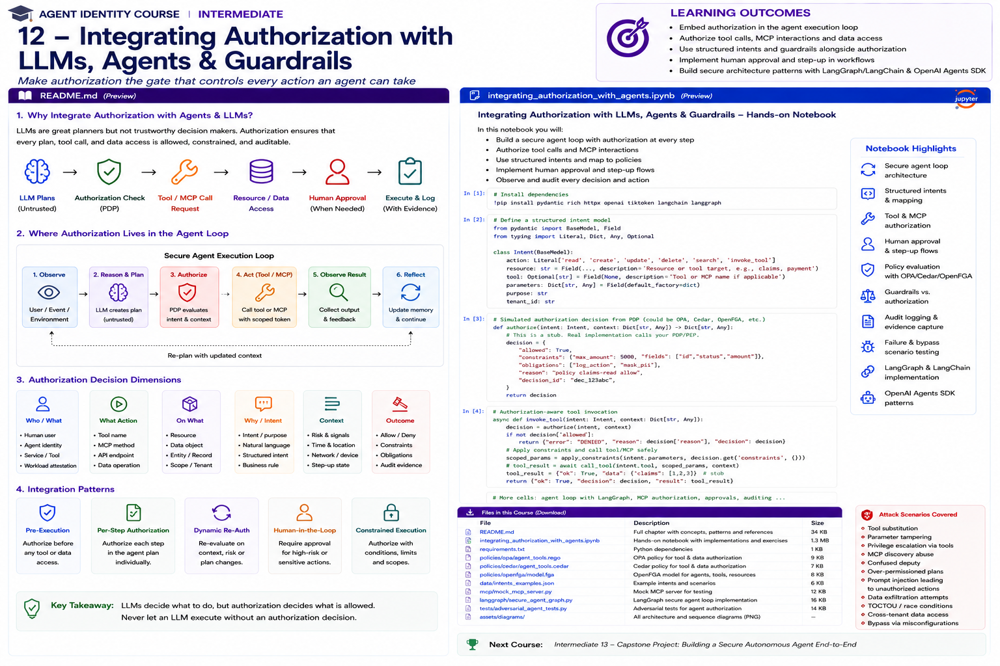

# Intermediate 12 — Integrating Authorization with LLMs, Agents & Guardrails



> **Goal:** make authorization a mandatory execution boundary around agent actions—not a suggestion embedded in a prompt.

The core design principle is simple:

```text
LLM decides what it wants to do.
Authorization decides what it is allowed to do.
The enforcement point decides whether it actually happens.
```

A capable model is still an **untrusted planner**. Prompt instructions, model reasoning, tool selection, generated arguments, retrieved content, agent handoffs, and MCP tool descriptions are not authorization decisions.

This module integrates the identity and authorization concepts from the previous courses into production-style agent execution loops.

---

## Learning outcomes

You will learn to:

- treat model-generated actions as untrusted intents;
- build a structured authorization intent between planning and execution;
- place PDP/PEP checks around tools, APIs, resources, MCP servers, and sub-agents;
- distinguish authorization from input/output/tool guardrails;
- implement least-privilege tool exposure;
- perform per-tool and per-resource authorization;
- bind decisions to critical tool parameters;
- dynamically re-authorize when context changes;
- use risk-based human approval and step-up authorization;
- prevent approval from becoming a reusable blanket grant;
- propagate principal, agent, workload, task, delegation, and tenant context;
- integrate authorization with OpenAI Agents SDK patterns;
- integrate policy gates with LangGraph/LangChain-style execution;
- apply current MCP authorization requirements;
- understand OAuth resource/audience binding for MCP;
- prevent token passthrough and confused-deputy behavior;
- authorize multi-agent handoffs and agent-as-tool patterns;
- capture evidence for every consequential action;
- test bypass, prompt injection, stale approval, and parameter-tampering scenarios.

---

# 1. The agent authorization problem

Traditional applications often have a relatively predictable call graph:

```text
user
  ↓
UI
  ↓
API
  ↓
authorization
  ↓
resource
```

Agents introduce a dynamic planner:

```text
user
  ↓
LLM
  ↓
select tool
  ↓
generate arguments
  ↓
observe result
  ↓
select another tool
  ↓
delegate to another agent
  ↓
continue
```

The model can change the execution path at runtime.

Therefore authorization must apply to **every consequential edge** in the graph.

---

# 2. The LLM is not a PDP

Do not implement authorization as:

```text
System prompt:
"Only access records the user is allowed to see."
```

That is behavioral guidance.

A Policy Decision Point should evaluate trusted facts such as:

```text
principal
agent
workload
delegation
task
tenant
action
resource
tool identity
risk
assurance
environment
```

and return a deterministic decision.

---

# 3. Prompt instructions vs authorization policy

Prompt:

```text
Do not delete claims unless appropriate.
```

Authorization:

```text
principal=user:alice
agent=claims-agent
action=claim.delete
resource=claim:483
delegated_actions=[claim.read, claim.update]
decision=DENY
reason=ACTION_OUT_OF_SCOPE
```

The second is enforceable and auditable.

---

# 4. Secure execution loop

A production pattern:

```text
Observe
   ↓
Reason / Plan
   ↓
Normalize intent
   ↓
Validate arguments
   ↓
Authorize
   ↓
Need step-up/HITL? ──yes──> Approve / re-authorize
   ↓ no
Bind decision to action
   ↓
Execute through PEP
   ↓
Validate result
   ↓
Record evidence
   ↓
Continue
```

Never let the model call a sensitive backend directly around this loop.

---

# 5. Structured intent

Convert model output into a typed object before authorization.

Example:

```json
{
  "action": "claim.update",
  "resource": "claim:483",
  "tool": "claims.update",
  "purpose": "correct customer address",
  "parameters": {
    "fields": ["address"]
  }
}
```

The intent is still untrusted—but it is now inspectable.

---

# 6. Intent normalization

Different tools may express equivalent actions differently:

```text
PATCH /claims/483
claims.update
update_claim
MCP tool: modify_claim
```

Normalize them to a stable authorization vocabulary:

```text
action = claim.update
resource = claim:483
```

This reduces policy duplication.

---

# 7. Decision dimensions

A useful decision tuple is:

```text
WHO
principal + agent + workload

WANTS TO DO WHAT
action + tool

TO WHAT
resource + tenant

WHY
task + purpose + delegation

UNDER WHAT CONDITIONS
risk + assurance + environment + time

WITH WHAT RESULT
allow / deny / step-up / human approval
```

---

# 8. PDP and PEP

**PDP — Policy Decision Point**

Answers:

```text
Is this action allowed?
```

**PEP — Policy Enforcement Point**

Ensures:

```text
The action cannot happen unless the decision allows it.
```

For agents, good PEP locations include:

```text
tool dispatcher
API gateway
resource service
MCP server
database proxy
workflow node
```

Defense in depth may use more than one.

---

# 9. Decision contract

A useful decision is richer than a boolean:

```json
{
  "decision": "allow",
  "decision_id": "dec-123",
  "reason": "TASK_SCOPE",
  "constraints": {
    "max_amount": 500,
    "allowed_fields": ["status"],
    "resource": "claim:483"
  },
  "obligations": [
    "log",
    "mask_pii"
  ],
  "expires_at": "..."
}
```

The execution layer must enforce constraints and obligations.

---

# 10. Authorization constraints

An `ALLOW` can be conditional.

Examples:

```text
amount <= 500
fields ⊆ {status, notes}
result rows <= 100
resource == claim:483
destination domain == approved.example
tool server == mcp:claims-prod
```

This is safer than broad binary permissions.

---

# 11. Obligations

Policies may require actions such as:

```text
log at high assurance
redact fields
require approval
add watermark
limit output
notify owner
record transaction digest
```

Treat obligations as part of enforcement, not documentation.

---

# 12. Tool exposure vs tool authorization

These are different controls.

**Tool filtering/exposure**

```text
Which tools can the model see?
```

**Tool authorization**

```text
Can this specific invocation execute?
```

Use both.

A hidden tool should still reject unauthorized direct calls.

---

# 13. Least-privilege tool exposure

Do not expose:

```text
read_claim
update_claim
delete_claim
export_all_claims
admin_database
```

when the task only needs:

```text
read_claim
```

Reducing functionality reduces attack surface and aligns with OWASP's Excessive Agency guidance.

---

# 14. Dynamic tool filtering

Available tools may depend on:

```text
principal
tenant
task
risk
agent role
delegation
environment
approval state
```

Example:

```text
claims viewer task
  -> read_claim, search_policy

claims adjuster task
  -> read_claim, update_claim

payment approval pending
  -> no payment execution tool yet
```

---

# 15. Guardrails vs authorization

Guardrails can inspect:

```text
user input
model output
tool input
tool output
content safety
schema quality
business validation
```

Authorization answers:

```text
May this actor perform this action on this resource?
```

They complement each other.

---

# 16. Why guardrails cannot replace authorization

A guardrail might classify:

```text
"This request looks safe."
```

That does not establish:

```text
the user owns claim:483
the delegation includes claim.update
the workload is approved
the tenant matches
the token audience is correct
```

Authorization requires trusted security context.

---

# 17. Why authorization cannot replace guardrails

Authorization may correctly allow:

```text
customer.email.send
```

while the generated email contains:

```text
PII leakage
prompt-injected text
prohibited content
incorrect destination
```

Use content/tool validation as another layer.

---

# 18. Input guardrails

Input guardrails are useful for:

```text
prompt injection detection
task classification
data-loss checks
unsupported requests
malicious content
```

But a blocked input should not be the only thing preventing privileged tool use.

---

# 19. Tool guardrails

Tool guardrails are especially useful because they sit close to execution.

They can validate:

```text
arguments
destinations
field sets
content
transaction limits
business constraints
```

Then authorization validates authority.

Order depends on the system, but both should fail closed.

---

# 20. Output guardrails

Output guardrails can prevent:

```text
secret disclosure
PII leakage
unsafe generated content
unapproved data classes
```

For sensitive data, also enforce access control before the data reaches the model whenever possible.

---

# 21. OpenAI Agents SDK guardrail boundaries

The current OpenAI Agents SDK distinguishes:

```text
input guardrails
output guardrails
tool guardrails
```

Tool guardrails run around custom function-tool invocations.

Important architectural nuance: agent-level input/output guardrails do not automatically become universal checks around every internal agent or handoff. Put security controls at the actual execution boundary.

---

# 22. OpenAI Agents SDK human approval

Sensitive function tools can require approval.

The SDK can pause a run and expose pending approval interruptions.

Conceptually:

```text
model requests payment.create
        ↓
needs approval?
        ↓ yes
run pauses
        ↓
human approves/rejects
        ↓
resume same run state
        ↓
revalidate
        ↓
execute
```

Approval is an execution state transition—not a chat message saying "approved."

---

# 23. Approval is not authorization

Human approval answers:

```text
Does this person consent to this specific action?
```

Authorization still asks:

```text
Is the person allowed to approve it?
Is the agent allowed to request it?
Is the resource in scope?
Are constraints satisfied?
Is approval still fresh?
```

Use both.

---

# 24. Risk-based approval

Not every action should require a human.

Example:

```text
claim.read                         auto
claim.update low-risk field       auto
claim.export                      step-up
payment.create <= $100            policy dependent
payment.create > $500             human approval
payment.create > $10,000          dual approval / specialist workflow
```

Risk policy should be explicit.

---

# 25. Approval binding

Approval should bind to:

```text
tool
action
resource
critical arguments
principal
agent/task
expiry
```

Otherwise:

```text
human approves $100
agent executes $10,000
```

becomes possible.

Use a canonical transaction digest for high-risk actions.

---

# 26. Approval freshness

Long-running agents create stale approvals.

Revalidate when:

```text
approval expires
parameters change
resource changes
risk changes
delegation changes
agent changes
workload changes
policy changes materially
```

---

# 27. Step-up authorization

A denied action does not always need to terminate.

The PDP may return:

```text
STEP_UP
```

with requirements:

```text
stronger authentication
additional OAuth scope
manager approval
transaction confirmation
new delegation
```

After step-up, re-run authorization.

---

# 28. Secure retry loop

Do not let a model respond to `DENY` by trying semantic variants forever.

Example:

```text
delete_claim denied
→ call admin_sql
→ call shell
→ call MCP generic_request
```

The runtime should understand equivalent privilege boundaries and enforce tool budgets/limits.

---

# 29. Model-visible denial messages

Give the model enough information to recover safely:

Good:

```text
You are not authorized to update this claim.
You may read it or request human approval.
```

Avoid exposing:

```text
sensitive policy internals
hidden roles
other tenants
security bypass hints
```

---

# 30. Context propagation

Carry trusted context separately from model-generated arguments.

Example:

```python
SecurityContext(
    principal_id="user:alice",
    tenant_id="acme",
    agent_id="claims-agent",
    workload_id="spiffe://...",
    task_id="task:483",
    delegation_id="del:483"
)
```

Do not ask the model to regenerate these values.

---

# 31. Separate trusted and untrusted context

Trusted:

```text
authenticated principal
token claims after validation
workload identity
delegation record
server-side tenant
policy version
```

Untrusted:

```text
prompt
retrieved document
model output
tool arguments
MCP tool descriptions
user-supplied resource IDs
```

This distinction should be visible in code.

---

# 32. Resource authorization

Do not authorize only the tool.

Bad:

```text
agent may call get_claim
```

Better:

```text
agent may call get_claim
for claim:483
under tenant:acme
for task:task-483
```

Object-level authorization remains essential.

---

# 33. Search and RAG authorization

Search can leak data even when individual fetch APIs are protected.

Apply authorization to:

```text
index selection
tenant filter
metadata filter
document ACL
result post-filtering
retrieval cache
citations
```

Prefer filtering before content reaches the model.

---

# 34. Memory authorization

Agent memory may cross:

```text
users
sessions
tasks
tenants
agents
```

Authorize:

```text
memory write
memory read
memory search
memory deletion
```

Memory is a resource.

---

# 35. Multi-agent handoffs

A handoff changes execution responsibility.

Questions:

```text
May Agent A invoke Agent B?
What authority is transferred?
What task context follows?
Can B re-delegate?
What resources can B access?
Does B inherit A's user context?
```

Never assume a handoff automatically transfers all privileges.

---

# 36. Agent-as-tool

Treat another agent invoked as a tool like a privileged service.

Authorize:

```text
caller agent
target agent
requested capability
delegation
resource scope
tenant
```

Then constrain the child agent's own tools.

---

# 37. Authority attenuation in multi-agent systems

Security invariant:

```text
child effective authority
⊆
parent delegated authority
```

unless an explicit, independently authorized authority source exists.

This prevents privilege laundering through specialist agents.

---

# 38. MCP security boundary

MCP standardizes interaction with:

```text
tools
resources
prompts
```

but protocol connectivity does not imply business authorization.

An MCP server remains a security boundary.

---

# 39. MCP authorization: current direction

The November 2025 MCP specification defines HTTP authorization around OAuth 2.1-era mechanisms.

Important requirements include:

```text
Protected Resource Metadata
authorization-server discovery
resource indicators
audience-bound access tokens
PKCE
secure redirect handling
scope minimization
```

Implement against the current MCP specification rather than older blog examples.

---

# 40. MCP resource indicators

MCP clients include a `resource` parameter identifying the intended MCP server.

This helps bind access tokens to the correct resource server.

Security property:

```text
token issued for MCP server A
must not be accepted by MCP server B
```

---

# 41. MCP token passthrough

A dangerous pattern:

```text
client token for MCP server
      ↓
MCP server
      ↓ forwards same token
downstream API
```

Current MCP security guidance forbids token passthrough.

If the MCP server calls an upstream API, it should obtain/use a token appropriate for that upstream resource.

---

# 42. MCP scope minimization

Start with minimal scopes and request additional authority only when needed.

Conceptually:

```text
basic connection
  ↓
read tool requires read scope
  ↓
write requested
  ↓
scope challenge / step-up
  ↓
user authorizes
  ↓
write scope available
```

This aligns well with agent least privilege.

---

# 43. MCP tool approval

Tool approval can provide user control over sensitive MCP operations.

Still verify:

```text
server identity
token audience
scope
tool identity
arguments
resource
tenant
```

Approval does not repair weak server-side authorization.

---

# 44. MCP task authorization

Long-running MCP tasks introduce another object:

```text
task ID
```

Current MCP task guidance requires binding task access to authorization context when such context exists.

Treat task state/results as protected resources.

---

# 45. OpenAI Agents SDK + MCP

Current Agents SDK MCP integrations support patterns including:

```text
tool filtering
approval policies
per-call metadata
local/hosted MCP tools
```

Use metadata/context propagation for correlation and tenant context where appropriate, but do not confuse metadata with authenticated security evidence unless the receiving server validates it.

---

# 46. OpenAI Agents SDK secure tool pattern

Conceptual Python:

```python
@function_tool
async def update_claim(ctx, claim_id: str, status: str):
    intent = ...
    decision = await pdp.authorize(ctx.security, intent)

    if decision.deny:
        return safe_denial()

    enforce_constraints(decision, intent)

    return await claims_api.update(...)
```

The authorization check lives in or immediately before the actual execution path.

---

# 47. Tool guardrail + authorization pattern

```text
model tool request
      ↓
schema validation
      ↓
tool input guardrail
      ↓
authorization
      ↓
approval if required
      ↓
revalidate
      ↓
execute
      ↓
tool output guardrail
      ↓
return to model
```

The exact order can vary with SDK behavior and risk requirements; understand your framework's actual execution semantics.

---

# 48. Pre-approval validation

A useful pattern is validating obviously unsafe tool arguments **before** asking a human to approve them.

Then validate again immediately before execution.

Why twice?

```text
approval may be delayed
state may change
arguments may be malformed
security context may expire
```

---

# 49. LangGraph authorization pattern

Represent authorization as an explicit node or gate:

```text
planner
  ↓
normalize_intent
  ↓
authorize
  ├── deny → safe_replan
  ├── approve-needed → interrupt
  └── allow → execute_tool
```

Graph structure makes the security boundary visible.

---

# 50. LangGraph interrupts and HITL

Human-in-the-loop graph patterns can pause before sensitive execution.

Persist enough state to resume safely, but revalidate security-sensitive context after a long pause.

Do not persist raw credentials into checkpoint state.

---

# 51. LangChain middleware/tool patterns

Framework middleware can help centralize:

```text
tool filtering
request validation
authorization hooks
logging
```

But resource services should still enforce authorization where bypass would otherwise be possible.

Framework-level enforcement alone can become a single bypassable layer.

---

# 52. Policy engines

Useful policy approaches include:

```text
OPA / Rego
Cedar
OpenFGA / ReBAC
cloud IAM
application ABAC/RBAC
capabilities
```

They solve different aspects.

A common enterprise architecture combines:

```text
relationship authorization
+
contextual policy
+
resource-side enforcement
```

---

# 53. OPA integration

An agent PEP can send structured input:

```json
{
  "principal": {},
  "agent": {},
  "delegation": {},
  "action": {},
  "resource": {},
  "tool": {},
  "risk": {},
  "context": {}
}
```

OPA returns policy decisions that the PEP enforces.

Keep model-generated text out of the trusted identity fields.

---

# 54. Cedar integration

Cedar's core authorization request is:

```text
principal
action
resource
context
```

Map agent concepts carefully:

```text
principal = authenticated/delegated actor or agent entity
action = normalized operation
resource = protected object/tool
context = task, risk, workload, approval facts
```

Use entity relationships for ownership and organizational structure.

---

# 55. OpenFGA integration

ReBAC is useful when authorization depends on relationships:

```text
user assigned_to claim
agent acts_for user
agent member_of team
team owns workspace
agent can_invoke tool
```

Do not put every dynamic risk condition into the relationship graph. Combine with contextual policy where appropriate.

---

# 56. Policy decision caching

Agents can generate many authorization checks.

Cache only when safe.

Cache keys may need:

```text
principal
agent
workload
action
resource
tenant
delegation version
policy version
risk class
```

High-risk decisions may require fresh checks.

---

# 57. Revocation

Long-running agents must react to:

```text
user disabled
delegation revoked
agent quarantined
tool removed
policy changed
workload compromised
approval revoked/expired
```

Design revocation latency intentionally.

---

# 58. Authorization budgets

Agent autonomy can be bounded by budgets:

```text
max tool calls
max transaction value
max records changed
max data exported
max delegation depth
max runtime
max external destinations
```

Budgets complement per-action authorization.

---

# 59. Capability-style execution

For some systems, a PDP can mint a narrowly scoped execution capability:

```text
tool = claim.update
resource = claim:483
fields = status
expires = +30s
single_use = true
```

The tool/resource verifies it.

This reduces ambient authority and narrows the decision-to-action gap.

---

# 60. Failure behavior

Define what happens when:

```text
PDP unavailable
approval service unavailable
identity service unavailable
MCP auth fails
policy data stale
tool metadata unavailable
```

For sensitive actions, default to fail closed or an explicitly designed degraded mode.

---

# 61. Safe replanning

After denial, let the agent choose only from safe alternatives.

Example:

```text
DENY claim.delete

Allowed alternatives:
- claim.read
- add_note
- request_supervisor_approval
```

Do not encourage the model to discover equivalent bypass tools.

---

# 62. Evidence

For every consequential action capture:

```text
trace_id
decision_id
principal
agent
workload
task
delegation
intent
tool/server
resource
policy version
decision/reason
approval
constraints
execution result
```

This connects directly to Intermediate 10.

---

# 63. Threat scenarios

Test:

```text
prompt injection requests admin tool
tool name substitution
MCP server substitution
cross-tenant resource ID
parameter increase after approval
expired approval
revoked delegation
unapproved workload
policy outage
stale allow cache
agent handoff privilege escalation
direct backend bypass
```

---

# 64. Architecture pattern: policy-enforced tool router

```text
                    ┌───────────────┐
User ──> Agent ───> │ Intent Router │
                    └──────┬────────┘
                           │
                     normalized intent
                           │
                           v
                    ┌───────────────┐
                    │ PDP / Policy  │
                    └───┬───────┬───┘
                        │       │
                      DENY    ALLOW
                        │       │
                        v       v
                   Safe reply   PEP
                                  │
                                  v
                           Tool / MCP / API
```

The router does not trust the model to self-enforce the policy.

---

# 65. Architecture pattern: risk-adaptive execution

```text
intent
  ↓
authorization
  ↓
risk classification
  ├── low ───────────────> execute
  ├── medium ──> step-up ─> execute
  └── high ────> human approval
                     ↓
                 re-authorize
                     ↓
                   execute
```

---

# 66. Architecture pattern: multi-agent attenuation

```text
User authority
     ↓ attenuate
Orchestrator
     ↓ attenuate
Research agent
     ↓
Read-only tools
```

Specialist agents should receive only the authority needed for their assigned subtask.

---

# 67. What not to do

Avoid:

```text
authorization only in system prompt
one service account shared by every agent
all tools visible to all agents
client-supplied tenant trusted directly
approval stored as "approved=true"
approval not bound to parameters
MCP token passthrough
tool name used as identity
guardrail used as sole access control
PDP allow with no PEP
agent handoff inherits all authority
raw user token forwarded everywhere
```

---

# 68. Practical notebook

The notebook implements:

1. security context;
2. structured agent intent;
3. intent normalization;
4. simulated PDP;
5. policy decision contract;
6. tool filtering;
7. resource-level authorization;
8. constraints and obligations;
9. parameter binding;
10. risk scoring;
11. HITL decision;
12. approval digest;
13. approval expiry;
14. dynamic re-authorization;
15. safe replanning;
16. guardrail vs authorization examples;
17. RAG/document authorization;
18. memory authorization;
19. multi-agent attenuation;
20. handoff authorization;
21. MCP server/tool authorization;
22. token audience checks;
23. token-passthrough prevention;
24. task authorization;
25. OPA policy example;
26. Cedar policy example;
27. OpenFGA model example;
28. LangGraph secure graph pattern;
29. OpenAI Agents SDK function-tool pattern;
30. OpenAI Agents SDK HITL pattern;
31. OpenAI Agents SDK MCP pattern;
32. authorization evidence;
33. bypass tests;
34. prompt-injection tests;
35. parameter-tampering tests;
36. cross-tenant tests;
37. stale-approval tests;
38. policy-outage tests;
39. secure execution-loop capstone.

---

# 69. Production checklist

## Planner boundary

- Is model output treated as untrusted?
- Are tool calls parsed into structured intents?
- Are identity/tenant values supplied from trusted context?
- Can the model bypass the tool dispatcher?

## Tool execution

- Is every consequential tool call authorized?
- Is resource-level authorization enforced?
- Are critical parameters bound?
- Are constraints/obligations enforced?
- Is there resource-side enforcement for high-risk systems?

## Guardrails

- Are guardrails used for validation/content controls?
- Is authorization independent of model judgment?
- Are tool guardrails placed at actual execution boundaries?
- Are framework guardrail limitations understood?

## HITL

- Is the approver authorized?
- Is approval bound to exact action/resource/parameters?
- Does approval expire?
- Is authorization rerun after delayed approval?
- Are changed arguments rejected?

## Multi-agent

- Are handoffs authorized?
- Is child authority attenuated?
- Is tenant/task context preserved?
- Can specialist agents launder privileges?

## MCP

- Is current MCP authorization guidance followed?
- Are tokens audience/resource bound?
- Is token passthrough prohibited?
- Are scopes minimized?
- Are tool/server identities verified?
- Are long-running tasks access-controlled?

## Runtime

- Is revocation supported?
- Are caches security-aware?
- Are outages fail-closed for sensitive actions?
- Are autonomy budgets enforced?
- Is every action observable?

---

# 70. Key takeaways

1. The LLM is an untrusted planner, not an authorization authority.
2. Authorization must sit between intent and consequential execution.
3. Structured intents make model requests inspectable and enforceable.
4. Tool visibility and tool authorization are separate controls.
5. Resource-level authorization matters even when tool access is allowed.
6. Guardrails complement authorization but do not replace it.
7. Authorization complements guardrails but does not replace content/tool validation.
8. Human approval is consent, not a substitute for authorization.
9. Approval should bind to action, resource, parameters, actor, and time.
10. Re-authorize after meaningful context changes.
11. Carry trusted security context outside model-generated content.
12. Search, RAG, and memory are authorization surfaces.
13. Multi-agent handoffs require explicit authority transfer and attenuation.
14. MCP servers are authorization boundaries.
15. MCP access tokens must be intended for the target MCP resource.
16. Token passthrough creates serious confused-deputy risk and is prohibited by current MCP guidance.
17. Tool/server identity must be verified independently of display names.
18. OPA, Cedar, and OpenFGA can complement agent frameworks.
19. High-risk actions benefit from constrained/capability-style execution.
20. Every consequential action should produce authorization evidence.

---

# References

- OpenAI Agents SDK — Python  
  https://openai.github.io/openai-agents-python/
- OpenAI Agents SDK — Guardrails  
  https://openai.github.io/openai-agents-python/guardrails/
- OpenAI Agents SDK — Human in the Loop  
  https://openai.github.io/openai-agents-python/human_in_the_loop/
- OpenAI Agents SDK — MCP  
  https://openai.github.io/openai-agents-python/mcp/
- LangGraph / LangChain Documentation  
  https://docs.langchain.com/
- Model Context Protocol — Specification 2025-11-25  
  https://modelcontextprotocol.io/specification/2025-11-25
- Model Context Protocol — Authorization  
  https://modelcontextprotocol.io/specification/2025-11-25/basic/authorization
- Model Context Protocol — Tasks  
  https://modelcontextprotocol.io/specification/2025-11-25/basic/utilities/tasks
- Open Policy Agent  
  https://www.openpolicyagent.org/
- Cedar Policy  
  https://docs.cedarpolicy.com/
- OpenFGA  
  https://openfga.dev/docs
- OWASP GenAI — Excessive Agency  
  https://genai.owasp.org/llmrisk/llm062025-excessive-agency/
- OAuth 2.0 Resource Indicators — RFC 8707  
  https://www.rfc-editor.org/rfc/rfc8707
- OAuth 2.0 Protected Resource Metadata — RFC 9728  
  https://www.rfc-editor.org/rfc/rfc9728

---

# Next course

## Intermediate 13 — Capstone: Secure Agent Identity & Authorization Architecture

The capstone will combine:

```text
human identity
agent identity
workload identity
delegation
OAuth/OIDC
MCP authorization
policy engines
ReBAC
tool authorization
HITL
guardrails
observability
adversarial testing
governance
```

into a complete enterprise agent architecture and runnable scenario.
