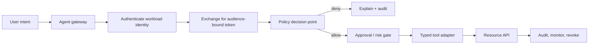

# Agent identity and authorization

Agent identity answers **who or what is acting**; authorization answers **what that actor may do, on which resource, under which conditions**. A prompt is not an identity proof and model output is not a policy decision.

## Mental model

Separate authentication, authorization, delegation, approval, and accountability. Keep human, workload, and delegated identities distinct in every audit record.



## Identity primitives

A useful context contains issuer, stable subject, tenant, audience, scopes, issue/expiry times, authentication method, and correlation ID. Do not use an email as a durable workload identity. SPIFFE defines workload identities and SVID credentials; SPIRE issues and rotates them ([SPIFFE overview](https://spiffe.io/docs/latest/spiffe-about/overview/)). OAuth access tokens should be audience-bound and short-lived ([RFC 6749](https://datatracker.ietf.org/doc/html/rfc6749), [OAuth Security BCP](https://datatracker.ietf.org/doc/html/rfc9700)).

## Authorization models

| Model | Inputs | Strength | Risk |
| --- | --- | --- | --- |
| RBAC | role + action | Simple | role explosion |
| ABAC | attributes, time, risk, tenant | Contextual | complex attributes |
| ReBAC | graph relationship | Sharing/team semantics | graph mistakes |
| Capability | narrow unforgeable grant | Safe delegation | revocation/discovery |
| Policy-as-code | versioned rules | Reviewable/testable | drift/fail-open |

Use deny-by-default, explicit actions, resource audiences, and separate approval for irreversible work. OpenFGA is a maintained relationship-based authorization system ([docs](https://openfga.dev/docs)).

## OAuth, exchange, and proof of possession

OAuth is a delegation protocol, not a complete identity database. Validate issuer, signature, expiry, audience, and scopes. Use token exchange to turn a broad incoming grant into a narrower token for one downstream audience ([RFC 8693](https://datatracker.ietf.org/doc/html/rfc8693)). A child token must never gain a scope absent from its parent. Use DPoP or mTLS sender constraints when bearer replay is unacceptable; rotate keys with a JWKS overlap window and maintain emergency revocation.

## Delegation and multi-agent boundaries

Every agent-to-agent hop is a trust boundary. Pass a typed, signed envelope instead of forwarding a user bearer token. Intersect actions, bind audience, limit lifetime and depth, and preserve the complete chain. MCP guidance covers confused-deputy and token-passthrough risks ([security best practices](https://modelcontextprotocol.io/docs/tutorials/security/security_best_practices)).

```json
{"delegator":"agent://orchestrator","delegate":"agent://specialist","subject":"user:42","audience":"tickets-api","actions":["ticket:read"],"max_depth":0}
```

## Threats and defenses

- Confused deputy: caller-bound delegation and audience validation.
- Prompt injection: treat retrieved content as data; validate tool arguments outside the model ([paper](https://arxiv.org/abs/2302.12173)).
- Token theft: short expiry, sender constraint, rotation, and revocation.
- Cross-tenant access: enforce tenant/resource checks at the API boundary.
- Over-broad tools: typed operations, not arbitrary shell/HTTP.
- Delegation laundering: scope intersection, depth limits, full-chain audit.

## Production checklist

Inventory agents and resources; give deployments unique workload identities; exchange for least-privileged audience-bound tokens; evaluate policy outside the LLM and fail closed; require human approval for financial/destructive/privilege-changing actions; emit tamper-evident events; test replay, injection, escalation, and revocation; provide a kill switch; review grants periodically.

## Current tools and research

- [NIST AI Agent Standards Initiative](https://www.nist.gov/artificial-intelligence/ai-agent-standards-initiative) and [NIST identity/authorization concept paper](https://www.nccoe.nist.gov/sites/default/files/2026-02/accelerating-the-adoption-of-software-and-ai-agent-identity-and-authorization-concept-paper.pdf)
- [OWASP Agent Security Cheat Sheet](https://cheatsheetseries.owasp.org/cheatsheets/AI_Agent_Security_Cheat_Sheet.html) and [Agentic Security Initiative](https://genai.owasp.org/initiatives/agentic-security-initiative/)
- [Google Secure AI Framework](https://cloud.google.com/use-cases/secure-ai-framework)
- [ToolEmu](https://arxiv.org/abs/2309.15817), [AgentDojo](https://arxiv.org/abs/2406.13352), [garak](https://arxiv.org/abs/2406.11036), and [PyRIT](https://arxiv.org/abs/2410.02828) for evaluation and red teaming.
